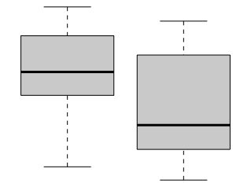

This page, and all pages of this notebook, are meant to be customized to become a useful *Guide to Statistical Analysis* in R for your *current* and *future* self. 


<script type="text/javascript">
 function showhide(id) {
    var e = document.getElementById(id);
    e.style.display = (e.style.display == 'block') ? 'none' : 'block';
 }
 
 function openTab(evt, tabName) {
    var i, tabcontent, tablinks;
    tabcontent = document.getElementsByClassName("tabcontent");
    for (i = 0; i < tabcontent.length; i++) {
        tabcontent[i].style.display = "none";
    }
    tablinks = document.getElementsByClassName("tablinks");
    for (i = 0; i < tablinks.length; i++) {
        tablinks[i].className = tablinks[i].className.replace(" active", "");
    }
    document.getElementById(tabName).style.display = "block";
    evt.currentTarget.className += " active";
}
 
</script>

---

## Sections

* **Paige's Notes** : Notes taken throughout different statistic based classes.

* **R Help** : R Studio commands, structuring tips, and tricks. 

* **Describing Data** : R Studio commands for graphically and numerically describing data.

* **Making Inference** : Deep dives into the different statistical tests.

* **Analyses** : Statistical analyses that utilizes the tools of collecting, analyzing, and interpreting data to result in informed decision-making.

<script type="text/javascript">
 function showhide(id) {
    var e = document.getElementById(id);
    e.style.display = (e.style.display == 'block') ? 'none' : 'block';
 }
 
 function openTab(evt, tabName) {
    var i, tabcontent, tablinks;
    tabcontent = document.getElementsByClassName("tabcontent");
    for (i = 0; i < tabcontent.length; i++) {
        tabcontent[i].style.display = "none";
    }
    tablinks = document.getElementsByClassName("tablinks");
    for (i = 0; i < tablinks.length; i++) {
        tablinks[i].className = tablinks[i].className.replace(" active", "");
    }
    document.getElementById(tabName).style.display = "block";
    evt.currentTarget.className += " active";
 }
</script>

---

## Search Bar

<style>
.search-highlight {
  background-color: #ffff00;
  padding: 2px 4px;
  border-radius: 3px;
  font-weight: bold;
}

.search-result-page {
  color: #0066cc;
  font-weight: bold;
  font-size: 12px;
  text-transform: uppercase;
  letter-spacing: 0.5px;
}

.search-result-section {
  color: #666;
  font-style: italic;
  font-size: 12px;
}

.search-result-preview {
  background: #f8f9fa;
  border-left: 3px solid #0066cc;
  padding: 8px 12px;
  margin: 6px 0;
  border-radius: 0 4px 4px 0;
  font-style: italic;
  line-height: 1.4;
}
</style>

<div id="search-ui">
  <form id="search-form" onsubmit="return false;">
    <input id="q" type="text" placeholder="Search pages, sections, and content…"
           style="width:100%;padding:12px;border:2px solid #ddd;border-radius:8px;font-size:16px;box-shadow:0 2px 4px rgba(0,0,0,0.1);" />
  </form>
  <p id="status" style="margin-top:8px;color:#777;font-size:14px;">Loading advanced search...</p>
  <ul id="results" style="list-style:none;padding:0;margin-top:10px;"></ul>
</div>

<script>
// Highlight search terms in text
function highlightText(text, searchTerms) {
  if (!text || !searchTerms.length) return text;
  
  let highlightedText = text;
  searchTerms.forEach(term => {
    if (term.length > 2) {  // Only highlight terms longer than 2 characters
      const regex = new RegExp(`(${term.replace(/[.*+?^${}()|[\]\\]/g, '\\$&')})`, 'gi');
      highlightedText = highlightedText.replace(regex, '<span class="search-highlight">$1</span>');
    }
  });
  
  return highlightedText;
}

// Find the best sentence match for search terms
function findBestSentence(sentences, searchTerms) {
  if (!sentences || sentences.length === 0) return '';
  
  let bestSentence = '';
  let bestScore = 0;
  
  sentences.forEach(sentence => {
    let score = 0;
    searchTerms.forEach(term => {
      if (sentence.toLowerCase().includes(term.toLowerCase())) {
        score += term.length;
      }
    });
    
    if (score > bestScore) {
      bestScore = score;
      bestSentence = sentence;
    }
  });
  
  // If no exact match, return first substantial sentence
  if (!bestSentence && sentences.length > 0) {
    bestSentence = sentences.find(s => s.length > 50) || sentences[0];
  }
  
  return bestSentence;
}

// Add highlighting script for target pages
function addHighlightingScript(url, searchTerms) {
  if (!searchTerms.length) return url;
  
  const terms = searchTerms.filter(term => term.length > 2);
  if (terms.length === 0) return url;
  
  // Add search terms as URL parameters
  const urlObj = new URL(url, window.location.origin + window.location.pathname.replace(/[^/]*$/, ''));
  urlObj.searchParams.set('highlight', terms.join(','));
  
  return urlObj.href;
}

function loadMiniSearch() {
  return new Promise((resolve, reject) => {
    const script = document.createElement('script');
    script.src = 'https://cdn.jsdelivr.net/npm/minisearch@6.3.0/dist/umd/index.min.js';
    script.onload = () => {
      if (typeof MiniSearch !== 'undefined') {
        resolve();
      } else {
        reject(new Error('MiniSearch not loaded'));
      }
    };
    script.onerror = () => reject(new Error('Script failed to load'));
    document.head.appendChild(script);
  });
}

function simpleSearch(docs, query) {
  if (!query) return [];
  const searchTerms = query.toLowerCase().split(/\s+/).filter(term => term.length > 1);
  
  return docs.filter(doc => {
    const title = (doc.title || '').toLowerCase();
    const content = (doc.content || '').toLowerCase();
    
    return searchTerms.some(term => 
      title.includes(term) || content.includes(term)
    );
  }).map((doc, index) => ({ ...doc, id: index }));
}

document.addEventListener('DOMContentLoaded', async function () {
  const statusEl = document.getElementById('status');
  const qEl = document.getElementById('q');
  const resultsEl = document.getElementById('results');
  
  let searchDocs = [];
  let miniSearch = null;
  let useMiniSearch = false;
  
  // Try to load MiniSearch
  try {
    await loadMiniSearch();
    useMiniSearch = true;
  } catch (e) {
    console.warn('MiniSearch failed to load, using simple search');
    useMiniSearch = false;
  }
  
  // Load search index
  try {
    statusEl.textContent = 'Loading search index...';
    
    const possibleUrls = [
      'search-index.json',
      './search-index.json',
      '../search-index.json'
    ];
    
    let response = null;
    for (const url of possibleUrls) {
      try {
        response = await fetch(url);
        if (response.ok) break;
      } catch (e) {
        continue;
      }
    }
    
    if (!response || !response.ok) {
      throw new Error('Search index not found');
    }
    
    searchDocs = await response.json();
    
    const pageCount = searchDocs.filter(doc => doc.type === 'page').length;
    const sectionCount = searchDocs.filter(doc => doc.type === 'section').length;
    
    console.log(`Loaded ${pageCount} pages and ${sectionCount} sections`);
    
    // Initialize MiniSearch if available
    if (useMiniSearch && typeof MiniSearch !== 'undefined') {
      miniSearch = new MiniSearch({
        fields: ['title', 'content'],
        storeFields: ['title', 'url', 'type', 'page_title', 'section_title', 'sentences'],
        searchOptions: {
          boost: { title: 3 },
          prefix: true,
          fuzzy: 0.2,
          combineWith: 'OR'
        }
      });
      
      miniSearch.addAll(searchDocs.map((doc, i) => ({
        id: i,
        title: doc.title || '',
        url: doc.url,
        content: doc.content || '',
        type: doc.type || 'page',
        page_title: doc.page_title || '',
        section_title: doc.section_title || '',
        sentences: doc.sentences || []
      })));
    }
    
    statusEl.textContent = `Ready to search ${pageCount} pages and ${sectionCount} sections with sentence-level previews`;
    
  } catch (e) {
    statusEl.textContent = `Error loading search: ${e.message}`;
    console.error('Search setup error:', e);
    return;
  }
  
  // Enhanced render function with sentence previews
  function render(results, searchTerms = []) {
    if (!results || results.length === 0) {
      resultsEl.innerHTML = '';
      const pageCount = searchDocs.filter(doc => doc.type === 'page').length;
      const sectionCount = searchDocs.filter(doc => doc.type === 'section').length;
      statusEl.textContent = qEl.value.trim() ? 'No matches found' : `Ready to search ${pageCount} pages and ${sectionCount} sections`;
      return;
    }
    
    resultsEl.innerHTML = results.slice(0, 8).map(r => {
      const doc = searchDocs.find(d => d.url === r.url || d.id === r.id);
      if (!doc) return '';
      
      const isSection = doc.type === 'section';
      const pageTitle = doc.page_title || 'Unknown Page';
      const sectionTitle = doc.section_title || '';
      
      // Create enhanced URL with highlighting
      const enhancedUrl = addHighlightingScript(doc.url, searchTerms);
      
      // Find best matching sentence
      const bestSentence = findBestSentence(doc.sentences || [], searchTerms);
      const highlightedSentence = highlightText(bestSentence, searchTerms);
      
      // Style based on type
      const titleStyle = isSection ? 
        'font-weight:bold;color:#0066cc;text-decoration:none;font-size:15px;' :
        'font-weight:bold;color:#0066cc;text-decoration:none;font-size:16px;';
      
      const bgColor = isSection ? '#f0f8ff' : '#f9f9f9';
      const borderColor = isSection ? '#b3d9ff' : '#ddd';
      
      // Build result HTML
      let resultHtml = `
        <li style="margin:10px 0;padding:15px;border:1px solid ${borderColor};border-radius:6px;background:${bgColor};box-shadow:0 1px 3px rgba(0,0,0,0.1);">
          <div class="search-result-page">📄 ${pageTitle}</div>`;
      
      if (isSection) {
        resultHtml += `<div class="search-result-section">📍 Section: ${sectionTitle}</div>`;
      }
      
      resultHtml += `
          <a href="${enhancedUrl}" style="${titleStyle}">${highlightText(doc.title, searchTerms)}</a>`;
      
      if (highlightedSentence) {
        resultHtml += `<div class="search-result-preview">"${highlightedSentence}"</div>`;
      }
      
      resultHtml += `
          <small style="color:#999;font-family:monospace;font-size:11px;">${doc.url}</small>
        </li>`;
      
      return resultHtml;
    }).join('');
    
    const pageResults = results.filter(r => {
      const doc = searchDocs.find(d => d.url === r.url || d.id === r.id);
      return !doc || doc.type !== 'section';
    }).length;
    
    const sectionResults = results.length - pageResults;
    
    let statusText = `${results.length} result(s) found`;
    if (sectionResults > 0) {
      statusText += ` (${pageResults} pages, ${sectionResults} sections)`;
    }
    statusEl.textContent = statusText;
  }
  
  // Search function
  function doSearch() {
    const query = qEl.value.trim();
    if (!query) {
      render([]);
      return;
    }
    
    const searchTerms = query.split(/\s+/).filter(term => term.length > 1);
    let results = [];
    
    if (useMiniSearch && miniSearch) {
      results = miniSearch.search(query, { 
        prefix: true, 
        fuzzy: 0.2,
        combineWith: 'OR'
      });
    } else {
      results = simpleSearch(searchDocs, query);
    }
    
    render(results, searchTerms);
  }
  
  // Event listeners
  qEl.addEventListener('input', doSearch);
  qEl.form.addEventListener('submit', (e) => { 
    e.preventDefault(); 
    doSearch(); 
  });
});

// Add highlighting to pages when they load with highlight parameter
(function() {
  const urlParams = new URLSearchParams(window.location.search);
  const highlightTerms = urlParams.get('highlight');
  
  if (highlightTerms) {
    const terms = highlightTerms.split(',').filter(term => term.length > 2);
    
    // Wait for page to load
    window.addEventListener('load', function() {
      setTimeout(() => {
        terms.forEach(term => {
          highlightTextInPage(term);
        });
        
        // Scroll to first highlight
        const firstHighlight = document.querySelector('.search-highlight');
        if (firstHighlight) {
          firstHighlight.scrollIntoView({ behavior: 'smooth', block: 'center' });
        }
      }, 100);
    });
  }
  
  function highlightTextInPage(searchTerm) {
    if (!searchTerm || searchTerm.length < 3) return;
    
    const walker = document.createTreeWalker(
      document.body,
      NodeFilter.SHOW_TEXT,
      {
        acceptNode: function(node) {
          // Skip script, style, and already highlighted elements
          const parent = node.parentElement;
          if (parent && (parent.tagName === 'SCRIPT' || parent.tagName === 'STYLE' || 
                        parent.classList.contains('search-highlight'))) {
            return NodeFilter.FILTER_REJECT;
          }
          return NodeFilter.FILTER_ACCEPT;
        }
      }
    );
    
    const textNodes = [];
    let node;
    while (node = walker.nextNode()) {
      textNodes.push(node);
    }
    
    textNodes.forEach(textNode => {
      const text = textNode.textContent;
      const regex = new RegExp(`(${searchTerm.replace(/[.*+?^${}()|[\]\\]/g, '\\$&')})`, 'gi');
      
      if (regex.test(text)) {
        const highlightedHTML = text.replace(regex, '<span class="search-highlight">$1</span>');
        const wrapper = document.createElement('span');
        wrapper.innerHTML = highlightedHTML;
        textNode.parentNode.replaceChild(wrapper, textNode);
      }
    });
  }
})();
</script>


---

## Table of Contents

These are the statistical tools used to explore and interpret different data types. 

## {.tabset .tabset-pills}


```{r message=FALSE, warning=FALSE, include=FALSE}

library(datasets)
library(carData)
library(mosaic)
library(tidyverse)
library(pander)
library(DT)
library(ggrepel)
library(plotly)
library(dplyr)
library(ggplot2)
library(maps)
library(tmap)
library(leaflet)
library(htmltools)
library(car)
library(mosaicData)
library(ResourceSelection)
library(reshape2)
library(RColorBrewer)
library(scatterplot3d)
library(readr)
library(GSODR)


```


---


### One Quantitative Response Variable Y {.tabset .tabset-fade}

#### Graphics

<div style="float:left;width:125px;" align=center class="tooltipimage">

  <span class="tooltipimagetext">Y is a single quantitative variable of interest. This would be like "heights" of BYU-Idaho students.</span>
</div>

<div style="padding-left:125px;color:black;">
<!-- Add your customizations in the area below: -->
**Test(s) used for this category:**

- One Sample T-test

- Paired Sample T-test

- Wilcoxon Signed- Rank Test


<br>

**Used for one quantitative variable. Pretty simple tbh.**

- Questions that this answers: 

    - How long are 4th grader's feet?

    - What is the average length of feet in the KidsFeet dataset?
    
---


These are the best graphics to use: 

<a href="GraphicalSummaries.html#histogram">
  
</a>
<a href="GraphicalSummaries.html#dot-plots">
  
</a>
<a href="GraphicalSummaries.html#boxplots">
  
</a>

<br>

*Examples :* 

- What is the mean temperature at Airport? (**One Sample**)
    - can be done with histogram or dot plot! 
       

```{r }
plot_ly(airquality, x=~Temp,
        type="histogram",
        marker=list(color="skyblue",
                    line=list(color="darkgray", width=10))) %>%
  layout(title="La Guardia Airport Daily Mean Temperatures", xaxis=list(title="Temperature in Degrees F"))
```


```{r }
stripchart(airquality$Temp, method="stack", xlab= "Temperature (F)", main="La Guardia Airport Daily Mean Temperature")
```

* You can change the method to "overplot", "jitter", or "stack"

<br>

---


- What is the median temperature of La Guardia Airport? (**One Sample**)
    
```{r}
boxplot (airquality$Temp, ylab="Temperature (F)", main="La Guardia Airport Temperature Median")
```

<br>

---

<!--- End your notes before here.  ------------------>

</div>

#### Tests
<div style="padding-left:125px;color:black;">


#####  One Sample t Test {.tabset .tabset-fade .tabset-pills}


<div style="float:left;width:125px;" align=center>
<a href="index.html#one-quantitative-response-variable-y"></a>
</div>

A one sample t test is **used when there is a hypothesized value for the population mean $\mu$ of a single quantitative variable.** 

###### Overview 

<div style="padding-left:125px;">

**Questions**

The one sample t test can be used to answer questions like:

* How long does it take to drive from Rexburg, ID to Salt Lake City, UT <span style="background-color:yellow;">on average</span>?
* Is human body temperature really 98.6\&deg; F <span style="background-color:yellow;">on average</span>?
* Do I spend less than $3 a day,<span style="background-color:yellow;">on average</span>, purchasing snacks?

**Requirements**

This test is only appropriate when both of the following are satisfied.

(1) The sample is **representative** of the population. (Having a simple random sample is the best way to do this.)

(2) The sampling distribution of the sample mean $\bar{x}$ *can be assumed to be normal*. This is a safe assumption when either:

  (a) the population data can be assumed to be **normally distributed** using a Q-Q Plot 
    
    

<div style="text-align: center;">
**OR**
</div>


  (b) the **size of the sample (n) that was taken from the population is large** (at least n > 30, but "large" really depends on how badly the data is skewed).

<br>

- If the requirements listed above **are satisfied**, then the results of the test can be trusted to give meaningful inference about the population. 
- If the requirements **are not** met, then that doesn't mean the results of the test are necessarily bad, but there is **no guarantee that they are good.**

**Hypotheses** 

<div style="padding-left:15px;">

<div style="float:right;font-size:.8em;background-color:lightgray;padding:5px;border-radius:4px;"><a style="color:darkgray;" href="javascript:showhide('onesampletlatex')">Math Code</a></div>


<div id="onesampletlatex" style="display:none;">
```{}
$$
  H_0: \mu = 5.2
$$

$$
  H_a: \mu \neq 5.2
$$
```
</div>

$H_0: \mu = \text{some number}$

$H_a: \mu \ \left\{\underset{<}{\stackrel{>}{\neq}}\right\} \ \text{some number}$
</div>

**Examples**: [analysis resubmits](./Analyses/t Tests/Examples/Math325AnalysisResubmits.html)

</div>


---


###### R Instructions

<div style="padding-left:125px;">

**Console** Help Command: `?t.test()`

`t.test(NameOfYourData$Y, mu = YourNull, alternative = YourAlternative, conf.level = 0.95)`

* `NameOfYourData` is the name of your data set, like `mtcars` or `KidsFeet`.
* `Y` must be a "numeric" vector of quantitative data.
* `YourNull` is the numeric value from your null hypothesis for $\mu$.
* `YourAlternative` is one of the three options: `"two.sided"`, `"greater"`, `"less"` and should correspond to your alternative hypothesis.
* The value for `conf.level = 0.95` can be changed to any desired confidence level, like 0.90 or 0.99. It should correspond to $1-\alpha$.

Testing Assumptions

`library(car)`

`qqPlot(NameOfYourData$Y)`

<br>

**Example Code** 

Hover your mouse over the example codes to learn more.

<a href="javascript:showhide('tTest')">
<div class="hoverchunk">
<span class="tooltipr">
t.test(
  <span class="tooltiprtext">'t.test' is an R function that performs one and two sample t-tests.</span>
</span><span class="tooltipr">
mtcars
  <span class="tooltiprtext">'mtcars' is a dataset. Type 'View(mtcars)' in R to view the dataset.</span>
</span><span class="tooltipr">
$
  <span class="tooltiprtext">The $ allows us to access any variable from the mtcars dataset.</span>
</span><span class="tooltipr">
mpg,&nbsp;
  <span class="tooltiprtext">'mpg' is Y, a quantitative variable (numeric vector) from the mtcars dataset.</span>
</span><span class="tooltipr">
mu = 20,&nbsp; 
  <span class="tooltiprtext"> The numeric value from the null hypothesis is 20 meaning $\mu=20$. </span>
</span><span class="tooltipr">
alternative = "two.sided",&nbsp; 
  <span class="tooltiprtext"> The alternative hypothesis is "two.sided" meaning the alternative hypothesis is $\mu\neq20$.</span>
  </span><span class="tooltipr">
conf.level = 0.95)
  <span class="tooltiprtext">This test has a 0.95 confidence level which corresponds to 1−α. </span>
</span><span class="tooltipr">
&nbsp;&nbsp;&nbsp;&nbsp;  
  <span class="tooltiprtext">Press Enter to run the code if you have typed it in yourself. You can also click here to view the output.</span>
</span><span class="tooltipr" style="float:right;font-size:.8em;">
&nbsp;Click to Show Output&nbsp; 
  <span class="tooltiprtext">Click to View Output.</span>
</span>
</div>
</a>

<div id="tTest" style="display:none;">
<table class="rconsole">
<tr>
<td>
<span class="tooltiprout">
 One Sample t-test
    <span class="tooltiprouttext">EXPLANATION.</span>
</span>
</td>
</tr>
</table>
<br/>

<table class="rconsole">
<tr>
<td>
  <span class="tooltiprout">
    data:  mtcars$mpg
      <span class="tooltiprouttext">EXPLANATION.</span>
</td>
</tr><tr>
<td>
  <span class="tooltiprout">
    t = 0.08506,
      <span class="tooltiprouttext">EXPLANATION.</span>
</td><td>
  <span class="tooltiprout">
    &nbsp;df = 31,
      <span class="tooltiprouttext">EXPLANATION.</span>
</td><td>
  <span class="tooltiprout">
    &nbsp;p-value = 0.9328
      <span class="tooltiprouttext">EXPLANATION.</span>
</td>
</tr><tr>
<td>
  <span class="tooltiprout">
    alternative hypothesis: true mean is not equal to 20
      <span class="tooltiprouttext">EXPLANATION.</span>
</td>
</tr><tr>
<td>
  <span class="tooltiprout">
    95 percent confidence interval:
      <span class="tooltiprouttext">EXPLANATION.</span>
</td>
</tr><tr>
<td>
  <span class="tooltiprout">
    &nbsp;17.91768
      <span class="tooltiprouttext">EXPLANATION.</span>
</td><td align="left">
  <span class="tooltiprout">
    &nbsp;22.26357
      <span class="tooltiprouttext">EXPLANATION.</span>
</td>
</tr><tr>
<td>
  <span class="tooltiprout">
    sample estimates:
      <span class="tooltiprouttext">EXPLANATION.</span>
</td>
</tr><tr>
<td>
  <span class="tooltiprout">
    mean of x
      <span class="tooltiprouttext">EXPLANATION.</span>
</td>
</tr><tr>
<td>
  <span class="tooltiprout">
    &nbsp;20.09062
      <span class="tooltiprouttext">EXPLANATION.</span>
</td>
</tr>
</table>

</div>


<a href="javascript:showhide('onesampleQQplot')">
<div class="hoverchunk">
<span class="tooltipr">
qqPlot(
<span class="tooltiprtext">'qqPlot' is a R function from library(car) that creates a qqPlot.</span>
</span><span class="tooltipr">
mtcars
  <span class="tooltiprtext">'mtcars' is a dataset. Type 'View(mtcars)' in R to view the dataset.</span>
</span><span class="tooltipr">
$
  <span class="tooltiprtext">The $ allows us to access any variable from the mtcars dataset.</span>
</span><span class="tooltipr">
mpg)
  <span class="tooltiprtext">'mpg' is a quantitative variable (numeric vector) from the mtcars dataset.</span>
  </span><span class="tooltipr" style="float:right;font-size:.8em;">
&nbsp;Click to Show Output&nbsp; 
  <span class="tooltiprtext">Click to View Output.</span>
</span>
</div>
</a>
<div id="onesampleQQplot" style="display:none;">
```{r, echo=FALSE}
qqPlot(mtcars$mpg)
```


</div>


</div>


----


###### Explanation
<div style="padding-left:125px;">


When we want to check if a claim about the average of a group(population mean $\mu$) is true, we often use a test called the "one sample t test". This test works well when we can assume that **the data follows a normal pattern and that we've picked our sample randomly** from the bigger group we're interested in.

---


In the figure below, the null hypothesis $H_0: \mu = \mu_0$ is represented by the normal distribution (gray) centered at $\mu_0$. 
- Note that $\mu_0$ is just some specified number. 
    - This shows how the null hypothesis represents **the assumption** about the center of the distribution of the data. 

```{r echo=FALSE}
library(car)

x <- seq(9,21, length.out=500)
sig <- 1.2
mu <- 13
y <- dnorm(x, mu, sig)
set.seed(15)
s <- rnorm(10, mu+5, sig)
plot(x, y, type='l', lty=1, lwd=2, col='darkgray', yaxt='n', xaxt='n',
     ylab=' ', xlab='', ylim=c(-.05,max(y)+.03))
abline(h=0, col='gray')
lines(c(mu,mu),c(0,dnorm(mu,mu,sig)), lty=1, col='darkgray')
points(s, rep(0,length(s)), pch=16, col='skyblue3')
text(mu,-0.025, expression(mu[0]), col='darkgray')
sbar <- mean(s)
lines(c(sbar,sbar), c(-0.01,0.01), col='skyblue3', lwd=2)
text(sbar, -0.025, expression(bar(x)), col='skyblue3')
x2 <- seq(14,22, length.out=100)
lines(x2,dnorm(x2,sbar,sig), lty=2, col='skyblue')
```

After a hypothesis (null) is established and an alternative hypothesis similarly declared, **a simple random sample of data of size $n$ is obtained from the population of interest.**
- In the plot above, this is depicted by the points (blue dots) which are centered around their sample mean $\bar{x}$.

Above the points (blue dots) is another bell-shaped curve (blue dashed line). This curve shows that **the alternative hypothesis might fit the data better than the null hypothesis.** 

The role of the one sample t test is to **measure the probability of a sample mean being as extreme or more extreme from the hypothesized value of $\mu_0$ than the one observed** assuming the null hypothesis is true. 
- This probability is of course the p-value of the test. 
    - This works because **the sampling distribution of the sample mean has been assumed to be normal**. 

---
    
    
In this case, the distribution of the test statistic t, 
$$
  t = \frac{\bar{x}-\mu}{s/\sqrt{n}}
$$  
is known to follow a t distribution with $n-1$ degrees of freedom.

*The mathematics that provide this result are phenominal! You can consult any advanced statistical textbook for the details.

---

The p-value of the one sample t test represents **the probability that the test statistic $t$ is as extreme or more extreme than the one observed** according to a t-distribution with $n-1$ degrees of freedom.

- If the probability (the p-value) is close enough to zero (smaller than $\alpha$), then it is determined that the most *plausible* hypothesis is the alternative hypothesis, and thus the null is "rejected" in favor of the alternative. 

</div>


---


##### Paired Samples t Test {.tabset .tabset-fade .tabset-pills}

<div style="float:left;width:125px;" align=center>
<a href="index.html#one-quantitative-response-variable-y"></a>
</div>

The paired samples t test is used when a value is hypothesized for the popluation mean of the differences, $\mu_d$, obtained from paired observations. 

###### Overview

<div style="padding-left:125px;">

**Questions**

The Paired Samples t Test can be used to answer questions like:

* From pre-test to post-test is there an improvement on average in the subjects?
* How much taller are husbands than their wives, on average?
* Do hospital patients that are *carefully matched* together according to reason for being in the hospital, age, gender, ethnicity, height, and weight show increased stay times in the hospital when infected with a nosocomial infection compared to those who were not infected?

**Requirements**

The test is only appropriate when both of the following are satisfied.

(1) The sample of differences is representative of the population differences.

(2) The sampling distribution of the sample mean of the differences $\bar{d}$ ($\bar{x}$ of the differences) can be assumed to be normal. (This second requirement can be assumed to be satisfied when (a) the differences themselves can be assumed to be normal from a Q-Q Plot, or (b) when the sample size $n$ of the differences is large.)


**Hypotheses**

<div style="padding-left:15px;">

<div style="float:right;font-size:.8em;background-color:lightgray;padding:5px;border-radius:4px;"><a style="color:darkgray;" href="javascript:showhide('pairedsampletlatex')">Math Code</a></div>


<div id="pairedsampletlatex" style="display:none;">
```{}
$$
  H_0: \mu_d = 0
$$

$$
  H_a: \mu_d \neq 0
$$
```
</div>

$H_0: \mu_d = \text{some number, but typically 0}$  
$H_a: \mu_d \ \left\{\underset{<}{\stackrel{>}{\neq}}\right\} \ \text{some number, but typically 0}$
</div>

**Examples**: [sleepPaired](./Analyses/t Tests/Examples/SleepPairedt.html) [studentPaired](./Analyses/t Tests/Examples/Student1Paired.html)

</div>

----

###### R Instructions

<div style="padding-left:125px;">
**Console** Help Command: `?t.test()`

**Option 1:**

`t.test(NameOfYourData$Y1, NameOfYourData$Y2, paired = TRUE, mu = YourNull, alternative = YourAlternative, conf.level = 0.95)`

* `NameOfYourData` is the name of your data set like `sleep` or `mtcars` or `KidsFeet`.
* `Y1` must be a "numeric" vector that represents the quantitative data from the first sample of data.
* `Y2` must be a "numeric" vector that represents the quantitative data from the second sample of data. This vector must be in the same order as the first sample so that the pairing can take place.
* `YourNull` is the numeric value from your null hypothesis for $\mu_d$.
* `YourAlternative` is one of the three options: `"two.sided"`, `"greater"`, `"less"` and should correspond to your alternative hypothesis.
* The value for `conf.level = 0.95` can be changed to any desired confidence level, like 0.90 or 0.99. It should correspond to $1-\alpha$.

Testing Assumptions

`library(car)`

`qqPlot(Y1 - Y2)`


**Example Code** 

Hover your mouse over the example codes to learn more.

<a href="javascript:showhide('tTestPaired')">
<div class="hoverchunk">
<span class="tooltipr">
sleep1 <- filter(sleep, group==1)
  <span class="tooltiprtext">This splits out the "group1" data from the sleep data set.</span>
</span><br/><span class="tooltipr">
sleep2 <- filter(sleep, group==2)
  <span class="tooltiprtext">This splits out the "group2" data from the sleep data set</span>
</span><br/><span class="tooltipr">
t.test(
  <span class="tooltiprtext">'t.test' is an R function that performs one and two sample t-tests.</span>
</span><span class="tooltipr">
sleep2\$extra,&nbsp;
  <span class="tooltiprtext">A numeric vector that represents the hours of extra sleep that the group had with drug 2.</span>
</span><span class="tooltipr">
 sleep1\$extra,&nbsp;
  <span class="tooltiprtext">A numeric vector that represents the hours of extra sleep that the same group had with drug 1.</span>
  </span><br><span class="tooltipr">
paired=TRUE,&nbsp;
  <span class="tooltiprtext">Indicates that this is a paired t-Test. This will cause the subtraction of sleep2\$extra - sleep1\$extra to be performed to obtain the paired differences. To cause the subtraction to occur in the other order, reverse the order sleep1\$extra, sleep2\$extra occur in the t.test(...) function.</span>
</span><span class="tooltipr">
mu = 0,&nbsp; 
  <span class="tooltiprtext">The numeric value from the null hypothesis 0 meaning the null hypothesis is $\mu_d=0$.</span>
</span><span class="tooltipr">
alternative = "two.sided",&nbsp; 
  <span class="tooltiprtext">The alternative hypothesis is "two.sided" meaning the alternative hypothesis is $\mu_d\neq0$.</span>
  </span><span class="tooltipr">
conf.level = 0.95)
  <span class="tooltiprtext">This test has a 0.95 confidence level which corresponds to 1 - $\alpha$.</span>
</span><span class="tooltipr">
&nbsp;&nbsp;&nbsp;&nbsp;  
  <span class="tooltiprtext">Press Enter to run the code if you have typed it in yourself. You can also click here to view the output.</span>
</span><span class="tooltipr" style="float:right;font-size:.8em;">
&nbsp;Click to Show Output&nbsp; 
  <span class="tooltiprtext">Click to View Output.</span>
</span>
</div>
</a>
<div id="tTestPaired" style="display:none;">
```{r, echo=FALSE}
sleep1 <- filter(sleep, group==1)
sleep2 <- filter(sleep, group==2)
```

<table class="rconsole">
<tr>
<td>
<span class="tooltiprout">
 Paired t-test
    <span class="tooltiprouttext">EXPLANATION.</span>
</span>
</td>
</tr>
</table>
<br/>

<table class="rconsole">
<tr>
<td>
  <span class="tooltiprout">
    data:  sleep2\$extra and sleep1\$extra
      <span class="tooltiprouttext">EXPLANATION.</span>
</td>
</tr><tr>
<td>
  <span class="tooltiprout">
    t = 4.0621,
      <span class="tooltiprouttext">EXPLANATION.</span>
</td><td>
  <span class="tooltiprout">
    &nbsp;df = 9,
      <span class="tooltiprouttext">EXPLANATION.</span>
</td><td>
  <span class="tooltiprout">
    &nbsp;p-value = 0.002833
      <span class="tooltiprouttext">EXPLANATION.</span>
</td>
</tr><tr>
<td>
  <span class="tooltiprout">
    alternative hypothesis: true mean is not equal to 0
      <span class="tooltiprouttext">EXPLANATION.</span>
</td>
</tr><tr>
<td>
  <span class="tooltiprout">
    95 percent confidence interval:
      <span class="tooltiprouttext">EXPLANATION.</span>
</td>
</tr><tr>
<td>
  <span class="tooltiprout">
    &nbsp;0.7001142
      <span class="tooltiprouttext">EXPLANATION.</span>
</td><td align="left">
  <span class="tooltiprout">
    &nbsp;2.4598858
      <span class="tooltiprouttext">EXPLANATION.</span>
</td>
</tr><tr>
<td>
  <span class="tooltiprout">
    sample estimates:
      <span class="tooltiprouttext">EXPLANATION.</span>
</td>
</tr><tr>
<td>
  <span class="tooltiprout">
    mean of the differences
      <span class="tooltiprouttext">EXPLANATION.</span>
</td>
</tr><tr>
<td align="right">
  <span class="tooltiprout">
    &nbsp; 1.58
      <span class="tooltiprouttext">EXPLANATION.</span>
</td>
</tr>
</table>

</div>

<a href="javascript:showhide('pairedQQplot')">
<div class="hoverchunk">
<span class="tooltipr">
qqPlot(
<span class="tooltiprtext">'qqPlot' is a R function from library(car) that creates a qqPlot.</span>
</span><span class="tooltipr">
sleep2\$extra
  <span class="tooltiprtext">The hours of extra sleep that the group had with drug 2.</span>
  </span><span class="tooltipr">
&nbsp;-&nbsp;
  <span class="tooltiprtext">Subtract the hours of extra sleep with drug 1 from the hours of extra sleep with drug 2 to get the difference.</span>
  </span><span class="tooltipr">
 sleep1\$extra
  <span class="tooltiprtext">The hours of extra sleep that the same group had with drug 1.</span>
  </span><span class="tooltipr">
 )
  <span class="tooltiprtext">Closing parenthesis for qqPlot(...) function.</span>
  </span><span class="tooltipr" style="float:right;font-size:.8em;">
&nbsp;Click to Show Output&nbsp; 
  <span class="tooltiprtext">Click to View Output.</span>
</span>
</div>
</a>
<div id="pairedQQplot" style="display:none;">
```{r, echo=FALSE}
qqPlot(sleep2$extra - sleep1$extra)
```


</div>

<br />

<br>

**Option 2:**

Compute the differences yourself instead of using `paired=TRUE`.

`differences = NameOfYourData$Y1 - NameOfYourData$Y2`

`t.test(differences, mu = YourNull, alternative = YourAlternative, conf.level = 0.95)`

* `NameOfYourData` is the name of your data set.
* `Y1` must be a "numeric" vector that represents the quantitative data from the first sample of data.
* `Y2` must be a "numeric" vector that represents the quantitative data from the second sample of data. This vector must be in the same order as the first sample so that the pairing can take place.
* `differences` are the resulting differences obtained from subtracting `Y1 - Y2`.
* `YourNull` is the numeric value from your null hypothesis for $\mu_d$.
* `YourAlternative` is one of the three options: `"two.sided"`, `"greater"`, `"less"` and should correspond to your alternative hypothesis.
* The value for `conf.level = 0.95` can be changed to any desired confidence level, like 0.90 or 0.99. It should correspond to $1-\alpha$.


Testing Assumptions

`library(car)`

`qqPlot(differences)`


**Example Code** 

Hover your mouse over the example codes to learn more.

<a href="javascript:showhide('tTestPaired2')">
<div class="hoverchunk">
<span class="tooltipr">
sleep1 <- filter(sleep, group==1)
  <span class="tooltiprtext">This splits out the "group1" data from the sleep data set.</span>
</span><br/><span class="tooltipr">
sleep2 <- filter(sleep, group==2)
  <span class="tooltiprtext">This splits out the "group2" data from the sleep data set</span>
</span><br/><span class="tooltipr">
differences&nbsp;<-&nbsp;
  <span class="tooltiprtext"> Saved the computed differences to an object called 'differences'.</span>
  </span><span class="tooltipr">
sleep2\$extra
  <span class="tooltiprtext">The hours of extra sleep that the group had with drug 2.</span>
  </span><span class="tooltipr">
&nbsp;-&nbsp;
  <span class="tooltiprtext">Subtract the hours of extra sleep with drug 1 from the hours of extra sleep with drug 2 to get the difference.</span>
  </span><span class="tooltipr">
 sleep1\$extra
  <span class="tooltiprtext">The hours of extra sleep that the same group had with drug 1.</span>
  </span><br><span class="tooltipr">
t.test(
  <span class="tooltiprtext">'t.test' is an R function that performs one and two sample t-tests.</span>
</span><span class="tooltipr">
differences,&nbsp;
  <span class="tooltiprtext">'differences' are the resulting differences of the hours of extra sleep with drug 1 and the hours of extra sleep with drug 2.</span>
</span><span class="tooltipr">
mu = 0,&nbsp; 
  <span class="tooltiprtext">The numeric value from the null hypothesis 0 meaning the null hypothesis is $\mu_d=0$.</span>
</span><span class="tooltipr">
alternative = "two.sided",&nbsp; 
  <span class="tooltiprtext">The alternative hypothesis is "two.sided" meaning the alternative hypothesis is $\mu_d\neq0$.</span>
  </span><span class="tooltipr">
conf.level = 0.95)
  <span class="tooltiprtext">This test has a 0.95 confidence level which corresponds to 1 - $\alpha$.</span>
</span><span class="tooltipr">
&nbsp;&nbsp;&nbsp;&nbsp;  
  <span class="tooltiprtext">Press Enter to run the code if you have typed it in yourself. You can also click here to view the output.</span>
</span><span class="tooltipr" style="float:right;font-size:.8em;">
&nbsp;Click to Show Output&nbsp; 
  <span class="tooltiprtext">Click to View Output.</span>
</span>
</div>
</a>
<div id="tTestPaired2" style="display:none;">
```{r, echo=FALSE}
differences <- sleep$extra[sleep$group==2] - sleep$extra[sleep$group==1]
```

<table class="rconsole">
<tr>
<td>
<span class="tooltiprout">
 One Sample t-test
    <span class="tooltiprouttext">EXPLANATION.</span>
</span>
</td>
</tr>
</table>
<br/>

<table class="rconsole">
<tr>
<td>
  <span class="tooltiprout">
    data:  differences
      <span class="tooltiprouttext">EXPLANATION.</span>
</td>
</tr><tr>
<td>
  <span class="tooltiprout">
    t = 4.0621,
      <span class="tooltiprouttext">EXPLANATION.</span>
</td><td>
  <span class="tooltiprout">
    &nbsp;df = 9,
      <span class="tooltiprouttext">EXPLANATION.</span>
</td><td>
  <span class="tooltiprout">
    &nbsp;p-value = 0.002833
      <span class="tooltiprouttext">EXPLANATION.</span>
</td>
</tr><tr>
<td>
  <span class="tooltiprout">
    alternative hypothesis: true mean is not equal to 0
      <span class="tooltiprouttext">EXPLANATION.</span>
</td>
</tr><tr>
<td>
  <span class="tooltiprout">
    95 percent confidence interval:
      <span class="tooltiprouttext">EXPLANATION.</span>
</td>
</tr><tr>
<td>
  <span class="tooltiprout">
    &nbsp;0.7001142
      <span class="tooltiprouttext">EXPLANATION.</span>
</td><td align="left">
  <span class="tooltiprout">
    &nbsp;2.4598858
      <span class="tooltiprouttext">EXPLANATION.</span>
</td>
</tr><tr>
<td>
  <span class="tooltiprout">
    sample estimates:
      <span class="tooltiprouttext">EXPLANATION.</span>
</td>
</tr><tr>
<td>
  <span class="tooltiprout">
    mean of x
      <span class="tooltiprouttext">EXPLANATION.</span>
</td>
</tr><tr>
<td align="right">
  <span class="tooltiprout">
    &nbsp; 1.58
      <span class="tooltiprouttext">EXPLANATION.</span>
</td>
</tr>
</table>

</div>

<a href="javascript:showhide('pairedQQplot2')">
<div class="hoverchunk">
<span class="tooltipr">
qqPlot(
<span class="tooltiprtext">'qqPlot' is a R function from library(car) that creates a qqPlot.</span>
</span><span class="tooltipr">
differences)
  <span class="tooltiprtext">'differences' are the resulting differences of the hours of extra sleep with drug 1 and the hours of extra sleep with drug 2.</span>
  </span><span class="tooltipr" style="float:right;font-size:.8em;">
&nbsp;Click to Show Output&nbsp; 
  <span class="tooltiprtext">Click to View Output.</span>
</span>
</div>
</a>
<div id="pairedQQplot2" style="display:none;">
```{r, echo=FALSE}
qqPlot(differences)
```


</div>


</div>

---- 

###### Explanation

<div style="padding-left:125px;">

The paired samples t test considers the single mean of all the differences from the paired values. Thus, the paired samples t test essentially becomes a one sample t test on the differences between paired observations. Hence the requirement is that the sampling distribution of the sample mean of the differences, $\bar{d}$, can be assumed to be normally distributed. (It is also required that the obtained differences represent a simple random sample of the full population of possible differences.) 

The paired samples t test is similar to the independent samples t test scenario, except that there is extra information that allows values from one sample to be paired with a value from the other sample. This pairing of values allows for a more direct analysis of the change or difference individuals experience between the two samples. 

The points in the plot below demonstrate how points are paired together, and the only thing of interest are the differences between the paired points.

```{r, echo=FALSE}
x <- seq(9,21, length.out=500)
sig <- .8
mu1 <- 13
mu2 <- 14.25
y1 <- dnorm(x, mu1, sig)
plot(x, y1, type='l', lty=2, lwd=1, col='darkgray', yaxt='n', xaxt='n',
     ylab=' ', xlab='', ylim=c(-.05,max(y1)+.03))
abline(h=0, col='gray')
lines(c(mu1,mu1),c(-0.015,dnorm(mu1,mu1,sig)), lty=2, col='darkgray')
y2 <- dnorm(x, mu2, sig) 
lines(x, y2, lty=2, lwd=1, col='darkgray', yaxt='n', xaxt='n',
     ylab=' ', xlab='')
lines(c(mu2,mu2),c(-0.015,dnorm(mu2,mu2,sig)), lty=2, col='darkgray')

set.seed(123)
s1 <- rnorm(5, mu1, sig)
s2 <- rnorm(5, mu2, sig)
plot(rep(0,length(s1)), s1, pch=16, col='skyblue3', xlim=c(-1,2), ylim=c(min(s1),max(s2)), xaxt='n', yaxt='n', xlab="", ylab="")
points(rep(1,length(s2)), s2, pch=16, col='skyblue')
text(mu1,-0.04, expression(mu[1]), col='darkgray')
text(mu2,-0.04, expression(mu[2]), col='darkgray')
for (i in 1:length(s1)){
  lines(c(0,1), c(s1[i],s2[i]), col='skyblue3')
  text(1,s2[i], paste("differece = ",round(s2[i]-s1[i],2)), pos=4, col=rgb(.41,.41,.41))
}

```

</div>

----


##### Wilcoxon Signed-Rank Test {.tabset .tabset-fade .tabset-pills}

<div style="float:left;width:125px;" align=center>

</div>

For testing hypotheses about **the value of the median** of:

(1) one sample of **quantitative data** or 

(2) one **set of differences** from paired data.

- Box plots + Dot plots are great to show off this kind of data (because it shows the median!)
    - Median line closer to the **bottom** of the box plot = **Right Skewed**
    - Median line is closer to the **top** of the box plot = **Left Skewed**

###### Overview 

<div style="padding-left:125px;">

The **nonparametric equivalent** of the paired-samples t test as well as the one-sample t test. 

- **Best for smaller sample sizes** where the distribution of **the data is not normal**
    - The t test is more appropriate when the data is normal or when the **sample size is large.**

While the test will work in most scenarios it suffers slightly when ties (repeated values) are present in the data. If *many* ties are present in the data, the test is not appropriate. If only a few ties are present, the test is still appropriate.

This test is similar to the paired-samples t test and the one-sample t test, but it doesn't assume the data follows a normal distribution (**nonparametric equivalent**)

<u>It works best when:</u>
- You have a small number of samples
- Your data doesn't follow a normal distribution

** The t test is better when your data is normal or when you have a lot of samples.This test usually works fine, but it can have problems if you have **many repeated values in your data**. If there are just a few repeated values, it's still okay to use.

**Hypotheses**

Originally created to test hypotheses about **the value of the median**

- works as well for the mean when the distribution of the data is symmetrical.

<div style="padding-left:15px;">

**One Sample of Data**

<div style="float:right;font-size:.8em;background-color:lightgray;padding:5px;border-radius:4px;"><a style="color:darkgray;" href="javascript:showhide('wilcoxonsignedranklatex')">Math Code</a></div>

<div id="wilcoxonsignedranklatex" style="display:none;">

```{}
$$
  H_0: \text{Median} = \text{(Some Number)}
$$

$$
  H_a: \text{Median} \neq \text{(Same Number)}
$$
```

</div>

$H_0: \text{Median} = \text{(Some Number)}$

$H_a: \text{Median} \ \left\{\underset{<}{\stackrel{>}{\neq}}\right\} \ \text{(Some Number)}$

<br/>

**Paired Samples of Data**

<div style="float:right;font-size:.8em;background-color:lightgray;padding:5px;border-radius:4px;"><a style="color:darkgray;" href="javascript:showhide('wilcoxonsignedranklatexpaired')">Math Code</a></div>

<div id="wilcoxonsignedranklatexpaired" style="display:none;">

```{}
$$
  H_0: \text{median of differences} = 0
$$

$$
  H_a: \text{median of differences} \neq 0
$$
```

</div>

$H_0: \text{median of differences} = 0$

$H_a: \text{median of differences} \ \left\{\underset{<}{\stackrel{>}{\neq}}\right\} \ 0$


</div>

**Examples**: [sleep](./Analyses/Wilcoxon Tests/Examples/SleepPairedWilcoxon.html), [CornHeights](./Analyses/Wilcoxon Tests/Examples/CornHeightsPairedWilcoxon.html)

</div>


----

###### R Instructions

<div style="padding-left:125px;">

**Console** Help Command: `?wilcox.test()`

***Paired Data***


`wilcox.test(Y1, Y2, mu = YourNull, alternative = YourAlternative, paired = TRUE, conf.level = 0.95)`

* `Y1` must be a "numeric" vector. One set of measurements from the pair.
* `Y2` also a "numeric" vector. Other set of measurements from the pair.
* `YourNull` is the numeric value from your null hypothesis for the median of differences from the paired data. Usually zero.
* `YourAlternative` is one of the three options: `"two.sided"`, `"greater"`, `"less"` and should correspond to your alternative hypothesis.
* The value for `conf.level = 0.95` can be changed to any desired confidence level, like 0.90 or 0.99. It should correspond to $1-\alpha$.


**Example Code** 

Hover your mouse over the example codes to learn more.

<a href="javascript:showhide('wilcoxonSignedRank')">
<div class="hoverchunk">
<span class="tooltipr">
wilcox.test(
  <span class="tooltiprtext">'wilcox.test' is a function for non-parametric one and two sample tests.</span>
</span><span class="tooltipr">
sleep\$extra[sleep\$group==1],&nbsp;
  <span class="tooltiprtext">The hours of extra sleep that the group had with drug 2.</span>
  </span><span class="tooltipr">
 sleep\$extra[sleep\$group==2],&nbsp;
  <span class="tooltiprtext">The hours of extra sleep that the same group had with drug 1.</span>
  </span><span class="tooltipr">
mu = 0,&nbsp; 
  <span class="tooltiprtext">The numeric value from the null hypothesis for the median of differences from the paired data is 0 meaning the null hypothesis is $\text{median of differences} = 0$.</span>
</span><span class="tooltipr">
paired=TRUE,&nbsp; 
  <span class="tooltiprtext">This command forces a "paired" samples test to be performed.</span>
</span><span class="tooltipr">
alternative = "two.sided",&nbsp; 
  <span class="tooltiprtext">The alternative hypothesis is "two.sided" meaning the alternative hypothesis is $\text{median of differences} \neq0$.</span>
  </span><span class="tooltipr">
conf.level = 0.95)
  <span class="tooltiprtext">This test has a 0.95 confidence level which corresponds to 1 - $\alpha$.</span>
</span><span class="tooltipr">
&nbsp;&nbsp;&nbsp;&nbsp;  
  <span class="tooltiprtext">Press Enter to run the code if you have typed it in yourself. You can also click here to view the output.</span>
</span><span class="tooltipr" style="float:right;">
&nbsp;...&nbsp; 
  <span class="tooltiprtext">Click to View Output.</span>
</span>
</div>
</a>

<div id="wilcoxonSignedRank" style="display:none;">
<table class="rconsole">
<tr>
<td>
<span class="tooltiprout">
 Wilcoxon signed rank test with continuity correction
    <span class="tooltiprouttext">The phrase "with continuity correction" implies that instead of using the "exact" distribution of the test statistic a "normal approximation" was used instead to compute the p-value. Further, a small correction was made to allow for the change from the "discrete" exact distribution to the "continuous normal distribution" when calculating the p-value.</span>
</span>
</td>
</tr>
</table>
<br/>

<table class="rconsole">
<tr>
<td>
  <span class="tooltiprout">
    data: sleep\$extra[sleep\$group == 1] and sleep\$extra[sleep\$group == 2]
      <span class="tooltiprouttext">This statement of the output just reminds you of the code you used to perform the test. The important thing is recognizing that the first group listed is "Group 1" and the second group listed is "Group 2." This is especially important when using alternative hypotheses of "less" or "greater" as the order is always "Group 1" is "less" than "Group 2" or "Group 1" is "greater" than "Group 2."</span>
</td><td>
  <span class="tooltiprout">
   V = 0,
      <span class="tooltiprouttext">This is the test statistic of the test, i.e., the sum of the ranks from the positive group minus the minimum sum of ranks possible.</span>
</td><td>
  <span class="tooltiprout">
    &nbsp;p-value = 0.009091
      <span class="tooltiprouttext">This is the p-value of the test. If no warning is displayed when the test is run, then this is the "exact" p-value from the non-parametric Wilcoxon Test Statistic distribution. Sometimes a message will appear stating "Cannot compute exact p-value with ties" or other similar messages. In those cases, the p-value is still considered valid even though it is obtained through a normal approximation to the exact distribution.</span>
</td>
</tr><tr>
<td>
  <span class="tooltiprout">
    alternative hypothesis: true location shift is not equal to 0
      <span class="tooltiprouttext">This reports that the alternative hypothesis was "two-sided." If the alternative had been "less" or "greater" the wording would change accordingly.</span>
</td>
</tr>
</table>

</div>

<br>


---

***One Sample***

`wilcox.test(object, mu = YourNull, alternative = YourAlternative, conf.level = 0.95)`

* `object` must be a "numeric" vector.
* `YourNull` is the numeric value from your null hypothesis for the median (even though it says "mu").
* `YourAlternative` is one of the three options: `"two.sided"`, `"greater"`, `"less"` and should correspond to your alternative hypothesis.
* The value for `conf.level = 0.95` can be changed to any desired confidence level, like 0.90 or 0.99. It should correspond to $1-\alpha$.


**Example Code** 

Hover your mouse over the example codes to learn more.

<a href="javascript:showhide('wilcoxOneSample')">
<div class="hoverchunk">
<span class="tooltipr">
wilcox.test(
  <span class="tooltiprtext">'wilcox.test' is a function for non-parametric one and two sample tests.</span>
</span><span class="tooltipr">
mtcars
  <span class="tooltiprtext">'mtcars' is a dataset. Type 'View(mtcars)' in R to view the dataset.</span>
</span><span class="tooltipr">
$
  <span class="tooltiprtext">The $ allows us to access any variable from the mtcars dataset.</span>
</span><span class="tooltipr">
mpg,&nbsp;
  <span class="tooltiprtext">'mpg' is a quantitative variable (numeric vector) from the mtcars dataset.</span>
</span><span class="tooltipr">
mu = 20,&nbsp; 
  <span class="tooltiprtext"> The numeric value from the null hypothesis is 20 meaning $\mu = 20$. </span>
</span><span class="tooltipr">
alternative = "two.sided",&nbsp; 
  <span class="tooltiprtext"> The alternative is "two.sided" meaning the alternative hypothesis is $\mu\neq20$.</span>
</span><span class="tooltipr">
conf.level = 0.95)
  <span class="tooltiprtext">This test has a 0.95 confidence level which corresponds to 1−α. </span>
</span><span class="tooltipr">
&nbsp;&nbsp;&nbsp;&nbsp;  
  <span class="tooltiprtext">Press Enter to run the code if you have typed it in yourself. You can also click here to view the output.</span>
</span><span class="tooltipr" style="float:right;">
&nbsp;...&nbsp; 
  <span class="tooltiprtext">Click to View Output.</span>
</span>
</div>
</a>

<div id="wilcoxOneSample" style="display:none;">
<table class="rconsole">
<tr>
<td>
<span class="tooltiprout">
 Wilcoxon signed rank test with continuity correction
    <span class="tooltiprouttext">This reports on the type of test performed. The phrase "with continuity correction" implies the normal approximation was used when calculating the p-value of the test.</span>
</span>
</td>
</tr>
</table>
<br/>

<table class="rconsole">
<tr>
<td>
  <span class="tooltiprout">
    data: mtcars\$mpg
      <span class="tooltiprouttext">This print-out reminds us that the mpg column of the mtcars data was used as "Y" in the test.</span>
</td><td>
  <span class="tooltiprout">
   V = 249,
      <span class="tooltiprouttext">The test statistic of the test.</span>
</td><td>
  <span class="tooltiprout">
    &nbsp;p-value = 0.7863
      <span class="tooltiprouttext">The p-value of the test.</span>
</td>
</tr><tr>
<td>
  <span class="tooltiprout">
    alternative hypothesis: true location is not equal to 20
      <span class="tooltiprouttext">The words "not equal" tell us this was a two-sided test. Had it been a one-sided test, either the word "less" or the word "greater" would have appeared instead of "not equal."</span>
</td>
</tr>
</table>

</div>

</div>

----

###### Explanation

<div style="padding-left:125px;">

In many cases it is of interest to perform a hypothesis test about **the location of the center of a distribution of data**. The Wilcoxon Signed Rank Test allows a nonparametric approach to doing this. 

<u>The Wilcoxon Signed-Rank Test covers two important scenarios:</u>

1. **One sample** of data from a population. (Not very common.)
2. The differences obtained from **paired data**. (Very common.)

<br>

The Wilcoxon methods are most easily explained through examples, beginning with the paired data for which the method was originally created. 


** Scroll down for the [One Sample Example](#one) if that is what you are really interested in. However, it is still recommended that you read the paired data example first.

---

***Paired Data Example***

<div style="padding-left:15px;">


<div style="color:#a8a8a8;">
  
Note: the data for this example comes from the original 1945 paper [Individual Comparison by Ranking Methods](http://sci2s.ugr.es/keel/pdf/algorithm/articulo/wilcoxon1945.pdf) by Frank Wilcoxon. 

</div>
  
---


***Background***
  
Height differences "between cross- and self- fertilized corn plants of the same pair" were collected. The experiment hypothesized that the center of the distribution of the height differences would be zero, with the alternative being that the center was not zero. The result of the data collection was 15 height differences: 
  
<div style="padding-left:15px;">
    
**Differences**: 14, 56, 60, 16, 6, 8, -48, 49, 24, 28, 29, 41, -67, 23, 75 
  
</div>


---
    
***Step 1***
    
The first step of the Wilcoxon Signed Rank Test is to order the differences from smallest *magnitude* to largest *magnitude*. Negative signs are essentially ignored at this point and only magnitudes of the numbers matter. 
  
<div style="padding-left:15px;">
    
**Sorted Differences**: 6, 8, 14, 16, 23, 24, 28, 29, 41, -48, 49, 56, 60, -67, 75 
</div>


---
    
***Step 2***
    
The next step is to rank the ordered values. Negative signs are attached to the ranks corresponding to negative numbers.
  
<div style="padding-left:15px;">
    
|&nbsp;           |  |  |  |    |   |   |   |   |   |    |   |   |   |    |   |
|-----------------|--|--|--|----|---|---|---|---|---|----|---|---|---|----|---|
|**Differences**: | 6| 8| 14| 16| 23| 24| 28| 29| 41| -48| 49| 56| 60| -67| 75 | 
|**Ranks**:       | 1 | 2 | 3 | 4 | 5 | 6 | 7 | 8 | 9| -10| 11 | 12 | 13 | -14 | 15 |
    
</div>
    
Note that the ranks will always be of the form $1, 2, \ldots, n$. In this case, $n=15$.
    
---
    
***Step 3***
    
The ranks are then put into two groups.
    
| Negative Ranks | Positive Ranks |
|----------------|----------------|
| -10, -14       | 1, 2, 3, 4, 5, 6, 7, 8, 9, 11, 12, 13, 15 |
      
---

***Step 4***
      
One of the groups is summed, usually the group with the fewest observations. Only the absolute values of the ranks are summed.
    
<div style="padding-left:15px;">
      
**Sum of Negative Ranks**: $\left|-10\right| + \left|-14\right| = 24$
      
The sum of the ranks becomes the *test statistic* of the Wilcoxon Test. The test statistic is sometimes called $W$ or $V$ or $U$. 
    
</div>


---


***Step 5***
      
The $p$-value of the test is then obtained by computing the probability of the test statistic being as extreme or more extreme than the one obtained. This is done by first computing the probability of all possible values the test statistic could have obtained using mathematical counting techniques. This is a very tedious process that only a mathematician would enjoy pursuing. However, the end result is fairly easily understood. If you are interested, read the details.
    
<div style="padding-left:30px; padding-right:15px;">
      
      
<a href="javascript:showhide('uniquename')">**Details**</a>
      
<div id="uniquename" style="display:none;">
      
When there are $n=15$ ranks, the possible sums of ranks range from 0 to 120 and hit every integer in between, i.e., $1, 2, 3, \ldots, 120$. (Note, if summing the negative ranks these sums would technically all be negative.) 
    
To verify that $120$ is the largest sum possible for $n=15$ ranks, note that: 
      
* $1+15 = 16$, 
    
* $2 + 14 = 16$, 
    
* $3+13 = 16$, 
    
* $4+12=16$, 
    
* $5+11=16$, 
    
* $6+10=16$,  
    
* $7+9=16$,
    
* and finally that $8 = \frac{16}{2}$.
    
Thus, there are 7 sums of 16 and one sum of $\frac{16}{2}$. This could be said in a mathematically equivalent way by stating there are $\frac{14}{2}$ sums of 16 and one sum of $\frac{16}{2}$. By multiplication this gives 
$$
      \frac{14}{2}\cdot\frac{16}{1} + \frac{1}{1}\cdot\frac{16}{2} = \frac{14\cdot16 + 1\cdot16}{2} = \frac{15\cdot16}{2} = \frac{n(n+1)}{2} = 120
$$
      
The probability of each sum occurring is computed by counting all of the ways a certain sum can occur (combinations) and dividing by the total number of sums possible. (There are 32,768 total different groups of ranks possible when there are $n=15$ ranks.) 
    
For example, a sum of 1 can happen only one way, only the rank of 1 is in the group. A sum of 2 can also only happen 1 way. The sum of 3 however, can happen two ways: we could have the ranks of 1 and 2 in the group, or just the rank of 3 in the group. A similar counting technique is then implemented for each possible sum. After all the calculations are performed, the distribution of possible sums looks like what is shown in the following plot, where the red bars show those sums that are as extreme or more extreme than a sum of $24$ (or its opposite of $120-24=96$).
    
</div>
      

</div>
      
      
      
```{r, echo=FALSE}
tmp <- cbind(rep(c(0,1), each=32768/2),
                 rep(c(0,1), each=32768/4, times=2),
                 rep(c(0,1), each=32768/8, times=4),
                 rep(c(0,1), each=32768/16, times=8),
                 rep(c(0,1), each=32768/32, times=16),
                 rep(c(0,1), each=32768/64, times=32),
                 rep(c(0,1), each=32768/128, times=64),
                 rep(c(0,1), each=32768/256, times=128),
                 rep(c(0,1), each=32768/512, times=256),
                 rep(c(0,1), each=32768/1024, times=512),
                 rep(c(0,1), each=32768/2048, times=1024),
                 rep(c(0,1), each=32768/4096, times=2048),
                 rep(c(0,1), each=32768/8192, times=4096),
                 rep(c(0,1), each=32768/16384, times=8192),
                 rep(c(0,1), each=1, times=16384))
tmp2 <- tmp%*%1:15
tmp3 <- sapply(0:120, function(s) sum(tmp2 == s))
plot(0:120, tmp3/sum(tmp3), col='skyblue2', type='h', ylab="Probability", xlab="Sum of Ranks", main="Probability Distribution of Possible Sums")
points(c(0:24,96:120), tmp3[c(1:25,97:121)]/sum(tmp3), col='firebrick', type='h')
text(11,.01, "Observed Sum")
lines(c(24,24),c(0.009,0.003))
```
    
Computing the probabilities of all possible sums creates a distribution of the test statistic (shown in the plot above). Note that the test statistic is obtained in Step 4 (above) by taking the sum of the ranks. Once the distribution of the test statistic is established, the $p$-value of the test can be calculated as the combined probability of possible sums that are as extreme or more extreme than the one observed. 
    
For this example, it turns out that the probability of getting a sum of (the absolute value of) negative ranks as extreme or more extreme than $24$ is $p=0.04126$ (the sum of the probabilities of the red bars in the plot above). Thus, at the $\alpha=0.05$ level we would reject the null hypothesis that the center of the distribution of differences is zero. We conclude that the center of the distribution is greater than zero because the sum of negative ranks is much smaller than we expected under the zero center hypothesis (the null). Thus, there is sufficient evidence to conclude that the centers of the distributions of "cross- and self-fertilized corn plants" heights are not equal. One is greater than the other. Notice how the following dot plot shows that the differences are in favor of the cross-fertilized plants (the first group in the subtraction) being taller. This is true even though two self-fertilized plants were much taller than their cross-fertilized counterpart (the two negative differences).
    
```{r, echo=FALSE, fig.height = 4}
stripchart(c(14,56, 60, 16, 6, 8, -48, 49, 24, 28, 29, 41, -67, 23, 75), method="stack", pch=16, xlab="Differences", main="Cross- vs. Self-Fertilized Corn Plant Height Differences")
```
 
 
 
    
---    
    
***Comment***
    
If the distribution of differences is symmetric, then the hypotheses can be written as 
$$
  H_0: \mu = 0
$$
$$
  H_a: \mu \neq 0
$$
      
If the distribution is skewed, then the hypotheses technically refer to the median instead of the mean and should be written as
    
$$
      H_0: \text{median} = 0
$$
$$
      H_a: \text{median} \neq 0
$$
      

</div>


---

***One Sample Example {#one}***

<div style="padding-left:15px;">


The idea behind the one sample Wilcoxon Signed Rank test is nearly identical to the paired data. The only change is that the median must be subtracted from all observed values to obtain the *differences*. Note that the mean is equal to the median when data is symmetric.


---

***Background***

Suppose we are interested in testing to see if the median hourly wage of BYU-Idaho students during their off-track employment is equal to the minimum wage in Idaho, $7.25 an hour as of January 1st, 2015. Five randomly sampled hourly wages from BYU-Idaho Math 221B students provides the following data.

<div style="padding-left:15px;">

**Wages**: $6.00, $9.00, $8.10, $18.00, $10.45 

</div>

```{r, include=FALSE}
wages <- c(6.00, 9.00, 8.10, 18.00, 10.45)
```

The differences are then obtained by subtracting the hypothesized value for the median (or mean if the data is symmetric) from all observations.

<div style="padding-left:15px;">

```{r, include=FALSE}
diff <- wages - 7.25
```

**Differences**: -1.25, 1.75, 0.85, 10.75, 3.20  

<div style="color:#a8a8a8;">
Note: from this point down, the wording of this example is identical to the paired data example (above) with the numbers changed to match $n=5$. It is useful to continue reading to reinforce the idea of the Wilcoxon Signed Rank Test, but no new knowledge will be presented.
</div>

</div>


---

***Step 1***

The first step of the Wilcoxon Signed Rank Test is to order the differences from smallest *magnitude* to largest *magnitude*. Negative signs are essentially ignored at this point and only magnitudes of the numbers matter. 

<div style="padding-left:15px;">

**Sorted Differences**: 0.85, -1.25, 1.75, 3.20, 10.75

</div>


---

***Step 2***

The next step is to rank the ordered values. Negative signs are attached to the ranks corresponding to negative numbers.

<div style="padding-left:15px;">

**Ranks**: 1, -2, 3, 4, 5

</div>

Note that the ranks will always be of the form $1, 2, \ldots, n$. In this case, $n=5$.


---

***Step 3***

The ranks are then put into two groups.

| Negative Ranks | Positive Ranks |
|----------------|----------------|
| -2      | 1, 3, 4, 5 |


---

***Step 4***

One of the groups is summed, usually the group with the fewest observations.

<div style="padding-left:15px;">

**Sum of Negative Ranks**: $\left|-2\right| = 2$

</div>


---

***Step 5***

The $p$-value of the test is then obtained by computing the probabilities of all possible sums using mathematical counting techniques. This is a very tedious process that only a mathematician would enjoy pursuing. However, the end result is fairly easily understood. If you are interested, read the details.

<div style="padding-left:30px; padding-right:15px;">

**Details**

When there are $n=5$ ranks, the possible sums of ranks range from 0 to 15 and hit every integer in between, i.e., $1, 2, 3, \ldots, 15$. (Note, if summing the negative ranks these sums would technically all be negative.) 

To verify that $15$ is the largest sum possible for $n=5$ ranks, note that: 

* $1+5 = 6$, 

* $2 + 4 = 6$, 

* and finally $3 = \frac{6}{2}$.

Thus, there are 2 sums of 6 and one sum of $\frac{6}{2}$. This could be said in a mathematically equivalent way by stating there are $\frac{4}{2}$ sums of 6 and one sum of $\frac{6}{2}$. By multiplication this gives 
$$
  \frac{4}{2}\cdot\frac{6}{1} + \frac{1}{1}\cdot\frac{6}{2} = \frac{4\cdot6 + 1\cdot6}{2} = \frac{5\cdot6}{2} = \frac{n(n+1)}{2} = 15
$$

The probability of each sum occurring is computed by counting all of the ways a certain sum can occur (combinations) and dividing by the total number of sums possible. (There are 32 total different groups of ranks possible when there are $n=5$ ranks.) 

For example, a sum of 1 can happen only one way, only the rank of 1 is in the group. A sum of 2 can also only happen 1 way. The sum of 3 however, can happen two ways: we could have the ranks of 1 and 2 in the group, or just the rank of 3 in the group. A similar counting technique is then implemented for each possible sum. After all the calculations are performed, the distribution of possible sums looks like what is shown in the following plot, where the red bars show those sums that are as extreme or more extreme than a sum of $2$ (or its opposite of $15-2=13$).

```{r, echo=FALSE}
tmp <- cbind(rep(c(0,1), each=32/2),
             rep(c(0,1), each=32/4, times=2),
             rep(c(0,1), each=32/8, times=4),
             rep(c(0,1), each=32/16, times=8),
             rep(c(0,1), each=32/32, times=16))
tmp2 <- tmp%*%1:5
tmp3 <- sapply(0:15, function(s) sum(tmp2 == s))
plot(0:15, tmp3/sum(tmp3), col='skyblue2', type='h', ylab="Probability", xlab="Sum of Ranks", main="Probability Distribution of Possible Sums", ylim=c(0,.1), xlim=c(-1,16))
points(c(0:2,13:15), tmp3[c(1:3,14:16)]/sum(tmp3), col='firebrick', type='h')
text(1,.08, "Observed Sum = 2")
lines(c(2,2),c(0.035,0.075))
arrows(2,0.075,2,0.035, angle=30, length=.05)
```

Computing the probabilities of all possible sums creates a distribution of the test statistic (shown in the plot above). Note that the test statistic is obtained in Step 4 (above) by taking the sum of the ranks. Once the distribution of the test statistic is established, the $p$-value of the test can be calculated as the combined probability of possible sums that are as extreme or more extreme than the one observed. 

</div>

For this example, it turns out that the probability of getting a sum of negative ranks as extreme or more extreme than $-2$ is $p=0.1875$ (the sum of the probabilities of the red bars in the plot above). Thus, at the $\alpha=0.05$ level we would fail to reject the null hypothesis that the center of the distribution of differences is zero. We will continue to assume the null hypothesis was true, that the median off-track hourly wage of BYU-Idaho students is the same as the Idaho minimum wage.


---

***Final Comment***

Notice that when the sample size is large the distribution of the test statistic can be approximated by a normal distribution. Most software applications use this approximation when the sample size is over $50$, i.e., for $n\geq50$ because computing all the possible sums of ranks becomes incredibly time consuming. Thus, for large sample sizes the results will be almost identical whether the Wilcoxon Tests or a t Test is used.


</div>


<!-- Content Ends here! -->


----


### Quantitative Y | Categorical X (2 Groups) {.tabset .tabset-fade}

#### Graphics

<div style="float:left;width:125px;" align=center class="tooltipimage">

  <span class="tooltipimagetext">Y is a single quantitative variable of interest. This would be like "heights" of BYU-Idaho students. X is a qualitative (categorical) variable of interest like "gender" that has just two groups "A" and "B". So this logo represents situtations where we would want to compare heights of male (group A) and female (group B) students.</span>
</div>

<div style="padding-left:125px;color:black
;">

**Test(s) used for this category:**

- Independent Samples T-test

  - Analysis : [High School Seniors t Test](file:///C:/Users/paige/OneDrive/Documents/Fall%20Semester%202024/MATH%20325/Statistics-Notebook-master/Analyses/t%20Tests/HighSchoolSeniors.html)

- Wilcoxon Rank Sum (Mann- Whitney Test)

  - Analysis : [The Benefits of Word Recall Strategies](file:///C:/Users/paige/OneDrive/Documents/Fall%20Semester%202024/MATH%20325/Statistics-Notebook-master/Analyses/Wilcoxon%20Tests/RecallingWords.html)

<br>

**Used for the comparison of two groups, Quantitative Y (ex. height, weight, money, distance) and Categorical X (ex. gender, birth month, phone number)**

- Questions that this answers:

    - How long are boys feet and how long are girls feet?
    
    - Do boys (B) or girls (G) have longer feet, on average, in the KidsFeet dataset?

---


These are the best graphics to use: 

<a href="GraphicalSummaries.html#boxplots">
  
</a>
<a href="GraphicalSummaries.html#dot-plots">
  
</a>


<br>


*Examples:* 

- How long are boys feet and how long are girls feet? (**Independent Sample**)

    - Can use box or dot plot! 

```{r}
plot_ly(KidsFeet, y=~length, x=~as.factor(sex),type="box",color=~sex, colors=c("lightblue","pink")) %>%
  layout( title="4th Grader's Average Foot Size",
          xaxis=list(title="Gender"),yaxis=list(title="Length (cm)"))

```


```{r}
ggplot(KidsFeet, aes(x=factor(sex),y=length, fill=sex)) +
  coord_flip() +
  geom_dotplot(binaxis="y",
               stackdir="up",
               position="dodge",
               dotsize=0.45,
               binwidth=0.5) +
  scale_fill_manual(values=c("B"="lightblue","G"="pink")) +
  labs(title= "Kennedy 4th Grader's Foot Size", x="Length (cm)", y="Gender")
```

<br>

---


- Does the Meshed or Before approach have any positive benefits on memory recall when it comes to remembering content? (**Wilcoxon Rank Sum Test**)

    - Dot plot over box plot shows the distribution and the individuals within each distribution

```{r echo=FALSE, message=FALSE, warning=FALSE}
StanBeef <- filter(Friendly, condition == "Before, SFR")

StanMeesh <- filter(Friendly, condition == "Meshed, SFR")


Friendly$condition <- factor(Friendly$condition, levels=c("SFR","Before","Meshed"))

ggplot(data = Friendly, aes(x = as.factor(condition), y = correct, fill=as.factor(condition))) +
geom_boxplot()  +
stat_summary(fun.y = median, geom = "errorbar", aes(ymax = ..y.., ymin = ..y..),
   width = .75, linetype = "solid", color="orangered1") +
theme_light() +
theme(panel.grid.major=element_blank()) +
scale_fill_manual(values = c("seashell1", "lightgoldenrod1","darkgoldenrod1")) +
geom_jitter(width=0.1, height=0) +
labs(title = "The Effects of Memory Techniques",
   x="Recall Methods",
   fill="condition",
   y="Number of words correctly recalled")

```


<!--- End of Add content area.  ------------------>
</div>

#### Tests
<div style="padding-left:125px;color:black;">
<!-- Add your customizations in the area below: -->


##### Independent Samples t Test {.tabset .tabset-fade .tabset-pills}

<div style="float:left;width:125px;" align=center>
<a href="index.html#quantitative-y-categorical-x-2-groups"></a>
</div>

The independent samples t test is used **when a value is hypothesized for the difference between two (possibly) different population means, $\mu_1 - \mu_2$.**

- finds the mean of each data set, then subtracts those means for their difference
    - two groups don't depend on each other's results


###### Overview 

<div style="padding-left:125px;">

**Questions**

The Independent Samples t Test can be used to answer questions like:

* Are <span style="background-color:yellow;">boys taller than girls</span> on average?
* Do students who <span style="background-color:yellow;">show up to class everyday</span> get higher scores on average than <span style="background-color:yellow;">those who don't</span>?
* Do you take more steps on average <span style="background-color:yellow;">on weekdays or on weekends</span>?

**Requirements**

The test is only appropriate when both of the following are satisfied.

(1) Both samples are **representative** of the population. (Simple random samples are the best way to do this.) 

(2) The sampling distribution of the difference of the sample means $(\bar{x}_1 - \bar{x}_2)$ *can be assumed to be normal*.
- This is a safe assumption when the sample size of each group is $30$ or greater or when the population data from each group can be assumed to be normal with a Q-Q Plot.

**Hypotheses**

<div style="padding-left:15px;">


<div style="float:right;font-size:.8em;background-color:lightgray;padding:5px;border-radius:4px;"><a style="color:darkgray;" href="javascript:showhide('independentsampletlatex')">Math Code</a></div>


<div id="independentsampletlatex" style="display:none;">
```{}
$$
  H_0: \mu_\text{label 1} - \mu_\text{label 2} = 13.2
$$

$$
  H_a: \mu_\text{label 1} - \mu_\text{label 2} \neq 13.2
$$
```
</div>

$H_0: \mu_1 - \mu_2 = \text{some number, but typically 0}$

$H_a: \mu_1 - \mu_2 \ \left\{\underset{<}{\stackrel{>}{\neq}}\right\} \ \text{some number, but typically 0}$

</div>

**Examples**: [sleepInd](./Analyses/t Tests/Examples/SleepIndependentt.html) [student1](./Analyses/t Tests/Examples/Student1Independent.html) [student2](./Analyses/t Tests/Examples/Student2Independent.html)


</div>

----

###### R Instructions

<div style="padding-left:125px;">

**Console** Help Command: `?t.test()`

There are two ways to perform the test.

**Option 1:**

`t.test(Y ~ X, data = YourData, mu = YourNull, alternative = YourAlternative, conf.level = 0.95)`

* `Y` must be a "numeric" vector from `YourData` that represents the data for both samples.
* `X` must be a "factor" or "character" vector from `YourData` that represents the group assignment for each observation. There can only be two groups specified in this column of data.
* `YourNull` is the numeric value from your null hypothesis for $\mu_1-\mu_2$.
* `YourAlternative` is one of the three options: `"two.sided"`, `"greater"`, `"less"` and should correspond to your alternative hypothesis.
* The value for `conf.level = 0.95` can be changed to any desired confidence level, like 0.90 or 0.99. It should correspond to $1-\alpha$.

Testing Assumptions

`library(car)`

`qqPlot(Y ~ X, data=YourData)`


**Example Code** 

Hover your mouse over the example codes to learn more.

<a href="javascript:showhide('indptTest1')">
<div class="hoverchunk">
<span class="tooltipr">
t.test(
  <span class="tooltiprtext">'t.test' is an R function that performs one and two sample t-tests.</span>
</span><span class="tooltipr">
length&nbsp;
  <span class="tooltiprtext">'length' is a quantitative variable (numeric vector).</span>
</span><span class="tooltipr">
~&nbsp;
  <span class="tooltiprtext">'~' is the tilde symbol.</span>
</span><span class="tooltipr">
sex,&nbsp;
  <span class="tooltiprtext">'sex' is a 'factor' or 'character' vector that represents the group assignment for each observation. There are two groups.</span>
</span><span class="tooltipr">
data=KidsFeet,&nbsp; 
  <span class="tooltiprtext">'KidsFeet' is a dataset in library(mosaic). Type View(KidsFeet) to view it.</span>
</span><span class="tooltipr">
mu = 0,&nbsp; 
  <span class="tooltiprtext">The numeric value from the null hypothesis for μ1-μ2 is 0 meaning the null hypothesis is $\mu1-\mu2 = 0$</span>
</span><span class="tooltipr">
alternative = "two.sided",&nbsp; 
  <span class="tooltiprtext"> The alternative is "two-sided" meaning the alternative hypothesis is $\mu1-\mu2 \neq 0$.</span>
  </span><span class="tooltipr">
conf.level = 0.95)
  <span class="tooltiprtext">This test has a 0.95 confidence level which corresponds to $1-\alpha$</span>
</span><span class="tooltipr">
&nbsp;&nbsp;&nbsp;&nbsp;  
  <span class="tooltiprtext">Press Enter to run the code if you have typed it in yourself. You can also click here to view the output.</span>
</span><span class="tooltipr" style="float:right;font-size:.8em;">
&nbsp;Click to Show Output&nbsp; 
  <span class="tooltiprtext">Click to View Output.</span>
</span>
</div>
</a>

<div id="indptTest1" style="display:none;">
<table class="rconsole">
<tr>
<td>
<span class="tooltiprout">
 Welch Two Sample t-test
    <span class="tooltiprouttext">EXPLANATION.</span>
</span>
</td>
</tr>
</table>
<br/>

<table class="rconsole">
<tr>
<td>
  <span class="tooltiprout">
    data:  length by sex
      <span class="tooltiprouttext">EXPLANATION.</span>
</td>
</tr><tr>
<td>
  <span class="tooltiprout">
    t = 1.9174,
      <span class="tooltiprouttext">EXPLANATION.</span>
</td><td>
  <span class="tooltiprout">
    &nbsp;df = 36.275,
      <span class="tooltiprouttext">EXPLANATION.</span>
</td><td>
  <span class="tooltiprout">
    &nbsp;p-value = 0.06308
      <span class="tooltiprouttext">EXPLANATION.</span>
</td>
</tr><tr>
<td>
  <span class="tooltiprout">
    alternative hypothesis: true difference in means is not equal to 0
      <span class="tooltiprouttext">EXPLANATION.</span>
</td>
</tr><tr>
<td>
  <span class="tooltiprout">
    95 percent confidence interval:
      <span class="tooltiprouttext">EXPLANATION.</span>
</td>
</tr><tr>
<td>
  <span class="tooltiprout">
    &nbsp;-0.04502067
      <span class="tooltiprouttext">EXPLANATION.</span>
</td><td align="left">
  <span class="tooltiprout">
    &nbsp;1.61291541
      <span class="tooltiprouttext">EXPLANATION.</span>
</td>
</tr><tr>
<td>
  <span class="tooltiprout">
    sample estimates:
      <span class="tooltiprouttext">EXPLANATION.</span>
</td>
</tr><tr>
<td>
  <span class="tooltiprout">
    mean in group B mean in group G
      <span class="tooltiprouttext">EXPLANATION.</span>
</td>
</tr><tr>
<td align="left">
  <span class="tooltiprout">
    &nbsp; 25.10500
      <span class="tooltiprouttext">EXPLANATION.</span>
</td><td align="left">
  <span class="tooltiprout">
    &nbsp;  24.32105
      <span class="tooltiprouttext">EXPLANATION.</span>
</td>
</tr>
</table>

</div>

<a href="javascript:showhide('indptTest1qqPlot')">
<div class="hoverchunk">
<span class="tooltipr">
qqPlot(
<span class="tooltiprtext">'qqPlot' is a R function from library(car) that creates a qqPlot.</span>
</span><span class="tooltipr">
length&nbsp;
  <span class="tooltiprtext">'length' is a quantitative variable (numeric vector).</span>
</span><span class="tooltipr">
~&nbsp;
  <span class="tooltiprtext">'~' is the tilde symbol.</span>
</span><span class="tooltipr">
sex,&nbsp;
  <span class="tooltiprtext">'sex' is a “factor” or “character” vector that represents the group assignment for each observation. There are two groups.</span>
</span><span class="tooltipr">
data=KidsFeet) 
  <span class="tooltiprtext">'KidsFeet' is a dataset in library(mosaic). Type View(KidsFeet) to view it.</span>
</span><span class="tooltipr" style="float:right;font-size:.8em;">
&nbsp;Click to Show Output&nbsp; 
  <span class="tooltiprtext">Click to View Output.</span>
</span>
</div>
</a>
<div id="indptTest1qqPlot" style="display:none;">
```{r, echo=FALSE}
qqPlot(length ~ sex, data=KidsFeet)
```


</div>

<br />


**Option 2:**

`t.test(NameOfYourData$Y1, NameOfYourData$Y2, mu = YourNull, alternative = YourAlternative, conf.level = 0.95)`

* `NameOfYourData` is the name of your data set.
* `Y1` must be a "numeric" vector that represents the quantitative data from the first sample.
* `Y2` must be a "numeric" vector that represents the quantitative data from the second sample.
* `YourNull` is the numeric value from your null hypothesis for the difference of $\mu_1-\mu_2$. This is typically zero.
* `YourAlternative` is one of the three options: `"two.sided"`, `"greater"`, `"less"` and should correspond to your alternative hypothesis.
* The value for `conf.level = 0.95` can be changed to any desired confidence level, like 0.90 or 0.99. It should correspond to $1-\alpha$.

Testing Assumptions

`library(car)`

`par(mfrow=c(1,2))`

`qqPlot(NameOfYourData$Y1)`

`qqPlot(NameOfYourData$Y2)`


**Example Code** 

Hover your mouse over the example codes to learn more.

<a href="javascript:showhide('indptTest2')">
<div class="hoverchunk">
<span class="tooltipr">
t.test(
  <span class="tooltiprtext">'t.test' is an R function that performs one and two sample t-tests.</span>
</span><span class="tooltipr">
KidsFeet\$length[KidsFeet\$sex&nbsp;==&nbsp;"B"],&nbsp;
  <span class="tooltiprtext">A numeric vector that represents the quantitative data or the foot length for the first sample of data which in this case is the boys.</span>
</span><span class="tooltipr">
KidsFeet\$length[KidsFeet\$sex&nbsp;==&nbsp;"G"],&nbsp;
  <span class="tooltiprtext">A numeric vector that represents the quantitative data or the foot length for the second sample of data which in this case is the girls.</span>
</span><span class="tooltipr">
mu = 0,&nbsp; 
  <span class="tooltiprtext">The numeric value from the null hypothesis for μ1-μ2 is 0 meaning the null hypothesis is $\mu1-\mu2 = 0$</span>
</span><span class="tooltipr">
alternative = "two.sided",&nbsp; 
  <span class="tooltiprtext"> The alternative is "two-sided" meaning the alternative hypothesis is $\mu1-\mu2 \neq 0$.</span>
  </span><span class="tooltipr">
conf.level = 0.95)
  <span class="tooltiprtext">This test has a 0.95 confidence level which corresponds to $1-\alpha$</span>
</span><span class="tooltipr">
&nbsp;&nbsp;&nbsp;&nbsp;  
  <span class="tooltiprtext">Press Enter to run the code if you have typed it in yourself. You can also click here to view the output.</span>
</span><span class="tooltipr" style="float:right;">
&nbsp;...&nbsp; 
  <span class="tooltiprtext">Click to View Output.</span>
</span>
</div>
</a>

<div id="indptTest2" style="display:none;">
<table class="rconsole">
<tr>
<td>
<span class="tooltiprout">
 Welch Two Sample t-test
    <span class="tooltiprouttext">EXPLANATION.</span>
</span>
</td>
</tr>
</table>
<br/>

<table class="rconsole">
<tr>
<td>
  <span class="tooltiprout">
    data:  KidsFeet\$length[KidsFeet\$sex == "B"] and KidsFeet\$length[KidsFeet\$sex == "G"]
      <span class="tooltiprouttext">EXPLANATION.</span>
</td>
</tr><tr>
<td>
  <span class="tooltiprout">
    t = 1.9174,
      <span class="tooltiprouttext">EXPLANATION.</span>
</td><td>
  <span class="tooltiprout">
    &nbsp;df = 36.275,
      <span class="tooltiprouttext">EXPLANATION.</span>
</td><td>
  <span class="tooltiprout">
    &nbsp;p-value = 0.06308
      <span class="tooltiprouttext">EXPLANATION.</span>
</td>
</tr><tr>
<td>
  <span class="tooltiprout">
    alternative hypothesis: true difference in means is not equal to 0
      <span class="tooltiprouttext">EXPLANATION.</span>
</td>
</tr><tr>
<td>
  <span class="tooltiprout">
    95 percent confidence interval:
      <span class="tooltiprouttext">EXPLANATION.</span>
</td>
</tr><tr>
<td>
  <span class="tooltiprout">
    &nbsp;-0.04502067
      <span class="tooltiprouttext">EXPLANATION.</span>
</td><td align="left">
  <span class="tooltiprout">
    &nbsp;1.61291541
      <span class="tooltiprouttext">EXPLANATION.</span>
</td>
</tr><tr>
<td>
  <span class="tooltiprout">
    sample estimates:
      <span class="tooltiprouttext">EXPLANATION.</span>
</td>
</tr><tr>
<td>
  <span class="tooltiprout">
    mean of x mean of y
      <span class="tooltiprouttext">EXPLANATION.</span>
</td>
</tr><tr>
<td align="left">
  <span class="tooltiprout">
    &nbsp; 25.10500
      <span class="tooltiprouttext">EXPLANATION.</span>
</td><td align="left">
  <span class="tooltiprout">
    &nbsp; 24.32105
      <span class="tooltiprouttext">EXPLANATION.</span>
</td>
</tr>
</table>

</div>

<a href="javascript:showhide('indptTest2qqPlot')">
<div class="hoverchunk">
<span class="tooltipr">
par(
<span class="tooltiprtext">'par' is a R function that can be used to set or query graphical parameters.</span>
</span><span class="tooltipr">
mfrow=c(1,2))
<span class="tooltiprtext">Parameter is being set. The first item inside the combine function c() is the number of rows and the second is the number of columns. </span>
</span><br><span class="tooltipr">
qqPlot(
<span class="tooltiprtext">'qqPlot' is a R function from library(car) that creates a qqPlot.</span>
</span><span class="tooltipr">
KidsFeet\$length[KidsFeet\$sex&nbsp;==&nbsp;"B"])
  <span class="tooltiprtext">A numeric vector that represents the quantitative data or the foot length for the first sample of data which in this case is the boys.</span>
</span><br><span class="tooltipr">
qqPlot(
<span class="tooltiprtext">'qqPlot' is a R function from library(car) that creates a qqPlot.</span>
</span><span class="tooltipr">
KidsFeet\$length[KidsFeet\$sex&nbsp;==&nbsp;"G"])
  <span class="tooltiprtext">A numeric vector that represents the quantitative data or the foot length for the second sample of data which in this case is the girls.</span>
</span><span class="tooltipr" style="float:right;">
&nbsp;...&nbsp; 
  <span class="tooltiprtext">Click to View Output.</span>
</span>
</div>
</a>
<div id="indptTest2qqPlot" style="display:none;">
```{r, echo=FALSE}
par(mfrow=c(1,2))
qqPlot(KidsFeet$length[KidsFeet$sex=="B"])
qqPlot(KidsFeet$length[KidsFeet$sex=="G"])
```


</div>

</div>

----

###### Explanation

<div style="padding-left:125px;">

The first figure below depicts the scenario where the difference in means of two separate normal distributions is non-zero. 
- In other words, the two distributions have different means, $\mu_1$ and $\mu_2$, respectively.     - It is worth emphasizing that the values of $\mu_1$ and $\mu_2$ are unknown to the researcher. 

The only thing observed are two separate samples of data (blue dots) of sizes $n_1$ and $n_2$, respectively. 

For the scenario depicted, the null hypothesis that $H_0: \mu_1 - \mu_2 = 0$ (i.e., that $\mu_1=\mu_2$) is rejected in favor of the alternative that $H_a: \mu_1 - \mu_2 \neq 0$ based on the sample data observed.
- This dicision would be correct as the true difference in means, $\mu_1-\mu_2$ is non-zero in this case.

```{r, echo=FALSE}
x <- seq(9,21, length.out=500)
sig <- .8
mu1 <- 13
mu2 <- 17.25
y1 <- dnorm(x, mu1, sig)
plot(x, y1, type='l', lty=2, lwd=1, col='darkgray', yaxt='n', xaxt='n',
     ylab=' ', xlab='', ylim=c(-.05,max(y1)+.03))
abline(h=0, col='gray')
lines(c(mu1,mu1),c(-0.015,dnorm(mu1,mu1,sig)), lty=2, col='darkgray')
y2 <- dnorm(x, mu2, sig) 
lines(x, y2, lty=2, lwd=1, col='darkgray', yaxt='n', xaxt='n',
     ylab=' ', xlab='')
lines(c(mu2,mu2),c(-0.015,dnorm(mu2,mu2,sig)), lty=2, col='darkgray')

set.seed(123)
s1 <- rnorm(10, mu1, sig)
points(s1, rep(0,length(s1)), pch=16, col='skyblue3')
s2 <- rnorm(10, mu2, sig)
points(s2, rep(0,length(s2)), pch=16, col='skyblue')
text(mu1,-0.04, expression(mu[1]), col='darkgray')
text(mu2,-0.04, expression(mu[2]), col='darkgray')
sbar1 <- mean(s1)
sbar2 <- mean(s2)
lines(c(sbar1,sbar1), c(-0.01,0.02), col='skyblue3', lwd=2)
lines(c(sbar2,sbar2), c(-0.01,0.02), col='skyblue', lwd=2)
text(sbar1+.25, 0.04, expression(bar(x)[1]), col='skyblue3')
text(sbar2+.25, 0.04, expression(bar(x)[2]), col='skyblue')
```

---

When the **null hypothesis is true**, that $H_0: \mu_1 - \mu_2 = 0$ : 
- the test statistic $t$ that is obtained by measuring the distance between the two sample means, $\bar{x}_1-\bar{x}_2$
- appropriately standardizing the result follows a $t$ distribution with degrees of freedom less than or equal to $n_1+n_2-2$.
    - Thus, the $p$-value of the independent samples $t$ test is obtained by using this $t$ distribution to calculate the probability of a test statistic $t$ being as extreme or more extreme than the one observed assuming the null hypothesis is true. 
$$
  t = \frac{(\bar{x}_1 - \bar{x}_2) - (\mu_1 - \mu_2)}{\sqrt{s_1/n_1+s_2/n_2 }}
$$


</div>


---


##### Wilcoxon Rank Sum (Mann-Whitney) Test {.tabset .tabset-fade .tabset-pills}


<div style="float:left;width:125px;" align=center>

</div>

For testing the equality of the medians of two (possibly different) distributions of a quantitative variable. 

- Box plots + Dot plots are great to show off this kind of data (because it shows the median!)
    - Median line closer to the **bottom** of the box plot = **Right Skewed**
    - Median line is closer to the **top** of the box plot = **Left Skewed**


###### Overview 

<div style="padding-left:125px;">

The **nonparametric equivalent** of the Independent Samples t Test. 
Can also be used when data is ordered (ordinal) but does not have an exact measurement. For example, first place, second place, and so on. 

The Independent Samples t Test is more appropriate when the distributions are normal, or when the sample size for each sample is large. 

The test is negatively affected when there are ties (repeated values) present in the data, but the results are still useful if there are relatively few ties. 


**Hypotheses**

Originally designed to test for the equality of medians from two identically shaped distributions. 

<div style="padding-left:15px;">


<div style="float:right;font-size:.8em;background-color:lightgray;padding:5px;border-radius:4px;"><a style="color:darkgray;" href="javascript:showhide('wilcoxonranksumlatex')">Math Code</a></div>


<div id="wilcoxonranksumlatex" style="display:none;">
```{}
$$
  H_0: \text{difference in medians} = 0
$$

$$
  H_a: \text{difference in medians} \neq 0
$$
```
</div>

$H_0: \text{difference in medians} = 0$

$H_a: \text{difference in medians} \neq 0$

</div>

However, the test also allows for the more general hypotheses that one distribution is *stochastically greater* than the other. 

<div style="padding-left:15px;">

$H_0: \text{the distributions are stochastically equal}$

$H_a: \text{one distribution is stochastically greater than the other}$

</div>

If these hypotheses are used, then the distributions do not have to be identically distributed.

(Note: Men's heights are *stochastically greater* than women's heights because men are generally taller than women, but not all men are taller than all women.) 


**Examples**: [BugSpray](./Analyses/Wilcoxon Tests/Examples/BugSprayWilcoxonRankSum.html), [MoralIntegration](./Analyses/Wilcoxon Tests/Examples/MoralIntegration.html)

</div>

----


###### R Instructions

<div style="padding-left:125px;">
**Console** Help Command: `?wilcox.test()`

There are two ways to perform the test.

**Option 1:**

`wilcox.test(Y ~ X, data = YourData, mu = YourNull, alternative = YourAlternative, conf.level = 0.95)`

* `Y` must be a "numeric" vector from `YourData` that represents the data for both samples.
* `X` must be a "factor" or "character" vector from `YourData` that represents the group assignment for each observation. There can only be two groups specified in this column of data.
* `YourNull` is the numeric value from your null hypothesis for the difference in medians from the two groups.
* `YourAlternative` is one of the three options: `"two.sided"`, `"greater"`, `"less"` and should correspond to your alternative hypothesis.
* The value for `conf.level = 0.95` can be changed to any desired confidence level, like 0.90 or 0.99. It should correspond to $1-\alpha$.


**Example Code** 

Hover your mouse over the example codes to learn more.

<a href="javascript:showhide('wilcoxonRankSum')">
<div class="hoverchunk">
<span class="tooltipr">
wilcox.test(
  <span class="tooltiprtext">'wilcox.test' is a function for non-parametric one and two sample tests.</span>
</span><span class="tooltipr">
length&nbsp;
  <span class="tooltiprtext">'length' is a quantitative variable (numeric vector).</span>
</span><span class="tooltipr">
~&nbsp;
  <span class="tooltiprtext">'~' is the tilde symbol.</span>
</span><span class="tooltipr">
sex,&nbsp;
  <span class="tooltiprtext">'sex' is a 'factor' or 'character' vector that represents the group assignment for each observation. There are two groups.</span>
</span><span class="tooltipr">
data=KidsFeet,&nbsp; 
  <span class="tooltiprtext">'KidsFeet' is a dataset in library(mosaic). Type View(KidsFeet) to view it.</span>
</span><span class="tooltipr">
mu = 0,&nbsp; 
  <span class="tooltiprtext">The numeric value from the null hypothesis for the difference in medians from the two groups is 0 meaning the null hypothesis is $\text{difference in medians} = 0$</span>
</span><span class="tooltipr">
alternative = "two.sided",&nbsp; 
  <span class="tooltiprtext"> The alternative is "two-sided" meaning the alternative hypothesis is $\text{difference in medians} \neq 0$.</span>
  </span><span class="tooltipr">
conf.level = 0.95)
  <span class="tooltiprtext">This test has a 0.95 confidence level which corresponds to $1-\alpha$</span>
</span><span class="tooltipr">
&nbsp;&nbsp;&nbsp;&nbsp;  
  <span class="tooltiprtext">Press Enter to run the code if you have typed it in yourself. You can also click here to view the output.</span>
</span><span class="tooltipr" style="float:right;">
&nbsp;...&nbsp; 
  <span class="tooltiprtext">Click to View Output.</span>
</span>
</div>
</a>

<div id="wilcoxonRankSum" style="display:none;">
<table class="rconsole">
<tr>
<td>
<span class="tooltiprout">
  Wilcoxon rank sum test with continuity correction
    <span class="tooltiprouttext">This states the test that was performed and that a normal approximation to the test statistic was used instead of the exact distribution.</span>
</span>
</td>
</tr>
</table>
<br/>

<table class="rconsole">
<tr>
<td>
  <span class="tooltiprout">
    data: length by sex
      <span class="tooltiprouttext">This states that the length column was split into the two groups found in the "sex" column. Unfortunately, it forgets to remind us that the test used the KidsFeet data set.</span>
</td><td>
  <span class="tooltiprout">
   V = 252,
      <span class="tooltiprouttext">The test statistic of the test. In this case, the sum of the ranks from the alphabetically first group minus the minimum sum of ranks possible.</span>
</td><td>
  <span class="tooltiprout">
    &nbsp;p-value = 0.0836
      <span class="tooltiprouttext">The p-value of the test.</span>
</td>
</tr><tr>
<td>
  <span class="tooltiprout">
    alternative hypothesis: true location shift is not equal to 0
      <span class="tooltiprouttext">This reports that the test used an alternative hypothesis of "not equal" (a two-sided test). Further, the phrase "true location shift" emphasizes that the Wilcoxon Rank Sum Test is testing to see if one distribution is shifted higher or lower than the other.</span>
</td>
</tr>
</table>

</div>

<br>

**Option 2:**

`wilcox.test(object1, object2, mu = YourNull, alternative = YourAlternative, conf.level = 0.95)`

* `object1` must be a "numeric" vector that represents the first sample of data.
* `obejct2` must be a "numeric" vector that represents the second sample of data.
* `YourNull` is the numeric value from your null hypothesis for the difference in medians from the two groups.
* `YourAlternative` is one of the three options: `"two.sided"`, `"greater"`, `"less"` and should correspond to your alternative hypothesis.
* The value for `conf.level = 0.95` can be changed to any desired confidence level, like 0.90 or 0.99. It should correspond to $1-\alpha$.


**Example Code**

<a href="javascript:showhide('wilcoxonRankSum2')">
<div class="hoverchunk">
<span class="tooltipr">
wilcox.test(
  <span class="tooltiprtext">'wilcox.test' is a function for non-parametric one and two sample tests.</span>
</span><span class="tooltipr">
KidsFeet\$length[KidsFeet\$sex&nbsp;==&nbsp;"B"],&nbsp;
  <span class="tooltiprtext">A numeric vector of foot length for the first sample of data or for the group of boys.</span>
</span><span class="tooltipr">
KidsFeet\$length[KidsFeet$sex&nbsp;==&nbsp;"G"],&nbsp;
  <span class="tooltiprtext">A numeric vector of foot length for the second sample of data or for the group of girls.</span>
</span><span class="tooltipr">
mu = 0,&nbsp; 
  <span class="tooltiprtext">The numeric value from the null hypothesis for the difference in medians from the two groups is 0 meaning the null hypothesis is $\text{difference in medians} = 0$</span>
</span><span class="tooltipr">
alternative = "two.sided",&nbsp; 
  <span class="tooltiprtext"> The alternative is "two-sided" meaning the alternative hypothesis is $\text{difference in medians} \neq 0$.</span>
  </span><span class="tooltipr">
conf.level = 0.95)
  <span class="tooltiprtext">This test has a 0.95 confidence level which corresponds to $1-\alpha$</span>
</span><span class="tooltipr">
&nbsp;&nbsp;&nbsp;&nbsp;  
  <span class="tooltiprtext">Press Enter to run the code if you have typed it in yourself. You can also click here to view the output.</span>
</span><span class="tooltipr" style="float:right;">
&nbsp;...&nbsp; 
  <span class="tooltiprtext">Click to View Output.</span>
</span>
</div>
</a>

<div id="wilcoxonRankSum2" style="display:none;">
<table class="rconsole">
<tr>
<td>
<span class="tooltiprout">
  Wilcoxon rank sum test with continuity correction
    <span class="tooltiprouttext">This states the type of test performed.</span>
</span>
</td>
</tr>
</table>
<br/>

<table class="rconsole">
<tr>
<td>
  <span class="tooltiprout">
    data: KidsFeet\$length[KidsFeet\$sex == "B"] and KidsFeet\$length[KidsFeet\$sex == "G"]
      <span class="tooltiprouttext">Reminds you what data was used for the test and points out that the first set of data listed is "Group 1" and the second set of data listed is "Group 2."</span>
</td><td>
  <span class="tooltiprout">
   V = 252,
      <span class="tooltiprouttext">The test statistic of the test.</span>
</td><td>
  <span class="tooltiprout">
    &nbsp;p-value = 0.0836
      <span class="tooltiprouttext">The p-value of the test.</span>
</td>
</tr><tr>
<td>
  <span class="tooltiprout">
    alternative hypothesis: true location shift is not equal to 0
      <span class="tooltiprouttext">The alternative hypothesis of the test. The phrase "not equal" implies a "two-sided" alternative was used.</span>
</td>
</tr>
</table>

</div>


```{r echo=FALSE, message=FALSE, warning=FALSE}
StanBeef <- filter(Friendly, condition == "Before, SFR")

StanMeesh <- filter(Friendly, condition == "Meshed, SFR")


Friendly$condition <- factor(Friendly$condition, levels=c("SFR","Before","Meshed"))

ggplot(data = Friendly, aes(x = as.factor(condition), y = correct, fill=as.factor(condition))) +
geom_boxplot()  +
stat_summary(fun.y = median, geom = "errorbar", aes(ymax = ..y.., ymin = ..y..),
   width = .75, linetype = "solid", color="orangered1") +
theme_light() +
theme(panel.grid.major=element_blank()) +
scale_fill_manual(values = c("seashell1", "lightgoldenrod1","darkgoldenrod1")) +
geom_jitter(width=0.1, height=0) +
labs(title = "The Effects of Memory Techniques",
   x="Recall Methods",
   fill="condition",
   y="Number of words correctly recalled")

```


</div>

----


###### Explanation

<div style="padding-left:125px;">


In many cases it is of interest to perform a hypothesis test concerning the equality of the centers of two (possibly different) distributions. In other words, an independent samples test. The Wilcoxon Rank Sum Test allows a nonparametric approach to doing this. It is often considered the nonparametric equivalent of the independent samples t test.

The method is most easily explained through an example. The theory behind it is very similar to the theory behind the Wilcoxon Signed-Rank Test.

<br />

***Independent Samples Data Example***

<div style="padding-left:15px;">

<div style="color:#a8a8a8;">

Note: the data for this example comes from the original 1945 paper [Individual Comparison by Ranking Methods](http://sci2s.ugr.es/keel/pdf/algorithm/articulo/wilcoxon1945.pdf) by Frank Wilcoxon. 

</div>

---


***Background***

The percent of flies (bugs) killed from two different concentrations of a certain spray were recorded from 16 different trials, 8 trials per treatment concentration. The experiment hypothesized that the center of the distributions of the percent killed by either concentration were the same. In other words, that both treatments were equally effective. The alternative hypothesis was that the treatments differed in their effectiveness.

<div style="padding-left:15px;">

| Spray Concentration | Percent Killed |
|---------------------|----------------|
| A | 68, 68, 59, 72, 64, 67, 70, 74 |
| B | 60, 67, 61, 62, 67, 63, 56, 58 |


```{r, echo=FALSE, render='asis'}
kill <- cbind(PercentKillA = c(68,68,59,72,64,67,70,74),
              PercentKillB = c(60,67,61,62,67,63,56,58))
```


</div>

---


***Step 1***

The first step of the Wilcoxon Rank Sum Test is to order all the data from smallest *magnitude* to largest *magnitude*, while keeping track of the group. 

<div style="padding-left:15px;">

| Sorted Data | | | | | | | | | | | | | | | | | 
|-------------|-|-|-|-|-|-|-|-|-|-|-|-|-|-|-|-|
| Percent Killed | 56| 58| 59| 60| 61| 62| 63| 64| 67| 67| 67| 68| 68| 70| 72| 74|
| Concentration | B| B| A| B| B| B| B| A| A| B| B| A| A| A| A| A| 


</div>

---


***Step 2***

The next step is to rank the ordered values. 

<div style="padding-left:15px;">

| Sorted Data | | | | | | | | | | | | | | | | | 
|-------------|-|-|-|-|-|-|-|-|-|-|-|-|-|-|-|-|
| Percent Killed | 56| 58| 59| 60| 61| 62| 63| 64| 67| 67| 67| 68| 68| 70| 72| 74|
| Concentration | B| B| A| B| B| B| B| A| A| B| B| A| A| A| A| A| 
| Rank          | 1| 2| 3| 4| 5| 6| 7| 8| 9|10|11|12|13|14|15|16|

</div>

Note that the ranks will always be of the form $1, 2, \ldots, n$. In this case, $n=16$.

Any ranks that are tied need to have the average rank assigned to each of those that are tied.

| Sorted Data | | | | | | | | | | | | | | | | | 
|-------------|-|-|-|-|-|-|-|-|-|-|-|-|-|-|-|-|
| Percent Killed | 56| 58| 59| 60| 61| 62| 63| 64| <span style="color:#B22222;">67</span>| <span style="color:#B22222;">67</span>| <span style="color:#B22222;">67</span>| <span style="color:#7EC0EE;">68</span>| <span style="color:#7EC0EE;">68</span>| 70| 72| 74|
| Concentration | B| B| A| B| B| B| B| A| A| B| B| A| A| A| A| A| 
| Rank          | 1| 2| 3| 4| 5| 6| 7| 8| <span style="color:#B22222;">10</span>|<span style="color:#B22222;">10</span>|<span style="color:#B22222;">10</span>|<span style="color:#7EC0EE;">12.5</span>|<span style="color:#7EC0EE;">12.5</span>|14|15|16|

---


***Step 3***

The ranks are then returned to their original groups.

| Ranks of Spray A | Ranks of Spray B |
|----------------|----------------|
| 3, 8, 10, 12.5, 12.5, 14, 15, 16 | 1, 2, 4, 5, 6, 7, 10, 10 |

---


***Step 4***

The ranks are summed for one of the groups. (It does not matter which group.)

<div style="padding-left:15px;">

**Sum of Ranks for Spray A**: 
$$
 3+8+10+12.5+12.5+14+15+16 = 91
$$

</div>

---


***Step 5***

The $p$-value of the test is then obtained by computing the probabilities of all possible sums that one group can achieve using mathematical counting techniques. This is a very tedious process that only a mathematician would enjoy pursuing. However, the end result is fairly easily understood. If you are interested, read the details.

<div style="padding-left:30px; padding-right:15px;">

<hr />

**Details**

When there are $n=16$ ranks, with just $8$ of the ranks assigned to one group, the possible sums of ranks range from $36$ to $100$ and include every integer in between, i.e., $36, 37, 38, \ldots, 100$.

Note that the smallest sum would be obtained if the ranks 1-8 were in the group. The largest sum would be obtained if the ranks 9-16 were in the group. 

The probability of each possible sum occurring is computed by counting all of the ways a certain sum can occur (combinations) and dividing by the total number of sums possible. (There are 12,870 total different sets of ranks possible when there are $n=16$ ranks and $8$ are assigned to one group.) 

The distribution of possible sums looks like what is shown in the following plot, where the red bars show those sums that are as extreme or more extreme than a sum of $91$ (or its opposite of $136-91=45$).

```{r, echo=FALSE}
tmp <- cbind(rep(c(0,1), each=65536/2),
             rep(c(0,1), each=65536/4, times=2),
             rep(c(0,1), each=65536/8, times=4),
             rep(c(0,1), each=65536/16, times=8),
             rep(c(0,1), each=65536/32, times=16),
             rep(c(0,1), each=65536/64, times=32),
             rep(c(0,1), each=65536/128, times=64),
             rep(c(0,1), each=65536/256, times=128),
             rep(c(0,1), each=65536/512, times=256),
             rep(c(0,1), each=65536/1024, times=512),
             rep(c(0,1), each=65536/2048, times=1024),
             rep(c(0,1), each=65536/4096, times=2048),
             rep(c(0,1), each=65536/8192, times=4096),
             rep(c(0,1), each=65536/16384, times=8192),
             rep(c(0,1), each=65536/32768, times=16384),
             rep(c(0,1), each=1, times=32768))
tmp1 <- apply(tmp,1,sum) == 8
tmp1 <- tmp[tmp1,]
tmp2 <- tmp1%*%1:16
tmp3 <- sapply(36:100, function(s) sum(tmp2 == s))
plot(36:100, tmp3/sum(tmp3), col='skyblue2', type='h', ylab="Probability", xlab="Sum of Ranks", main="Probability Distribution of Possible Sums")
points(c(36:45,91:100), tmp3[c(1:10,56:65)]/sum(tmp3), col='firebrick', type='h')
text(93,.017, "Observed Sum")
arrows(91,0.016,91,0.003, length=0.1, angle=20)
```

Computing the probabilities of all possible sums creates a distribution of the test statistic (shown in the plot above). Note that the test statistic is obtained in Step 4 (above) by taking the sum of the ranks. Once the distribution of the test statistic is established, the $p$-value of the test can be calculated as the combined probability of possible sums that are as extreme or more extreme than the one observed. 

<hr />

</div>

For this example, it turns out that the probability of getting a sum of negative ranks as extreme or more extreme than $91$ is $p=0.01476$ (the sum of the probabilities of the red bars in the plot above). Thus, at the $\alpha=0.05$ level we would reject the null hypothesis that the difference in the center of the distributions is zero. We conclude that the Spray Concentration A is more effective at killing flies (bugs).

---


***Comment***

The hypotheses for the Wilcoxon Rank Sum Test are difficult to write out in simple mathematical statements. The test is often referred to as a test of medians, but goes deeper than this. Technically, it allows us to determine if one distribution is stochastically larger than another. In other words, if one distribution typically gives larger values than does another distribution. If the distributions are identically shaped and have the same spread, then this implies the medians (and means) are different. 

Thus, the hypotheses for the test can be written mathematically as
$$
  H_0: \text{difference in medians} = 0
$$
$$
  H_a: \text{difference in medians} \neq 0
$$
or even as
$$
  H_0: \mu_1-\mu_2 = 0
$$
$$
  H_a: \mu_1-\mu_2 \neq 0
$$

However, it is important to remember that the estimated difference in location parameters that results from the test does not provide a measurement on either of these things. However, the $p$-value can lead us to determine whether to reject, or fail to reject the null, whichever of the above hypotheses is used.

As stated in the R help file for this test `?wilcox.test()` "the estimator for the difference in location parameters does not estimate the difference in medians (a common misconception) but rather the median of the difference between a sample from [the first population] and a sample from [the second population]." These are technical details that most people ignore without encountering too much difficulty. However, it does remind us that the t test is more easily interpreted whenever it is appropriate to use that test.

</div>

<br />


---


***Final Comment***

Notice that when the sample size is large the distribution of the test statistic can be approximated by a normal distribution. Most software applications use this approximation when the sample size is over $50$, i.e., for $n\geq50$ because computing all the possible sums of ranks becomes incredibly time consuming. Thus, for large sample sizes the results will be almost identical whether the Wilcoxon Tests or a t Test is used.

</div>


<!--- End of Add content area.  ------------------>
</div>


##
<div style="clear:both;"></div>


### Quantitative Y | Categorical X (3+ Groups) {.tabset .tabset-fade}

#### Graphics

<div style="float:left;width:125px;" align=center class="tooltipimage">

  <span class="tooltipimagetext">Y is a single quantitative variable of interest, like "heights" of BYU-Idaho students. X is a categorical (qualitative) variable like which Math 221 you took, 221A, 221B, or 221C. In other words, X has three or more groups. So "Classrank" could be X, with groups "Freshman", "Sophomore", "Junior", and "Senior".</span>
</div>

<div style="padding-left:125px;color:black;">
<!-- Add your customizations in the area below: -->

**Test(s) used for this category:**

- One-Way ANOVA (means)

- Block Design

- Kruskal-Wallis Rank Sum Test (distributions)

  - Analysis : [College Student's Food Perception](file:///C:/Users/paige/OneDrive/Documents/Fall%20Semester%202024/MATH%20325/Statistics-Notebook-master/Analyses/Kruskal-Wallis%20Test/Food.html)

<br>

**Used comparing several groups based on means or distributions:**

- How long are their feet based of width and gender?


- Are there certain months of the year that are associated with children having longer feet, on average, than others?


---


<a href="GraphicalSummaries.html#boxplots">
  
</a>
<a href="GraphicalSummaries.html#dot-plots">
  
</a>

<br>


- Does a college student's perception of food result in a change in their weight? (**Kruskal-Wallis Rank Sum Test**)

```{r message=FALSE, warning=FALSE}
# Read data
food <- read_csv("C:/Users/paige/OneDrive/Documents/Fall Semester 2024/MATH 325/Statistics-Notebook-master/Data/food.csv")

# Data transformation and cleaning
food_cleaned <- food %>%
  # Convert weight to numeric right away
  mutate(weight = as.numeric(weight)) %>%
  # Remove rows with NA weight or missing drink values
  filter(!is.na(weight) & !is.na(drink)) %>%
  # Create a new column `Food Perception Score`
  mutate(`Food Perception Score` = 
           ifelse(breakfast == "Cereal", 0, 
           ifelse(breakfast == "Donut", 1, 0)) +
           ifelse(fries == "1", 1, ifelse(fries == "2", 0, 0)) + 
           ifelse(drink == "orange juice", 0, ifelse(drink == "soda", 1, 0)) +
           ifelse(soup == "1", 0, ifelse(soup == "2", 1, 0)))

# Create plots
boxplot(weight ~ `Food Perception Score`, data=food_cleaned, 
        col="lightgreen", xlab="Food Perception Score", main="Weight of College Students", ylab="Weight (lbs)")
stripchart(weight ~ `Food Perception Score`, data=food_cleaned, pch=16, vertical=TRUE, add=TRUE, col="palegreen4")
```

<!--- End of Add content area.  ------------------>
</div>

#### Tests
<div style="padding-left:125px;color:black;">
<!-- Add your customizations in the area below: -->

##### One-way ANOVA {.tabset .tabset-fade .tabset-pills}

<div style="float:left;width:125px;" align=center>

</div>

Each experimental unit is assigned to exactly one factor-level combination. Another way to say this is "one measurement per individual" (no repeated measures) and "equal numbers of individuals per group".

###### Overview

<div style="padding-left:125px;">
An ANOVA is only appropriate when all of the following are satisfied.

1. The sample(s) of data can be considered to be representative of their population(s).

2. The data is normally distributed in each group. (This can safely be assumed to be satisfied when the *residuals* from the ANOVA can be assumed to be normally distributed when seen in a Q-Q Plot.)

3. The population variance of each group can be assumed to be the same. (This can be safely assumed to be satisfied when the *residuals* from the ANOVA show constant variance, i.e., are similarly vertically spread out in a Residuals versus fitted-values plot.)

- comparing ***means***

<br>

**Hypotheses**

For a One-way ANOVA

$$
  H_0: \mu_1 = \mu_2 = \ldots = \mu
$$
$$
  H_a: \mu_i \neq \mu \ \text{for at least one} \ i
$$


**Mathematical Model**

A typical model for a one-way ANOVA is of the form
$$
  Y_{ij} = \mu_i + \epsilon_{ij}
$$
where $\mu_i$ is the mean for level (group) $i$, and $\epsilon_{ij} \sim N(0,\sigma^2)$ is the error term for each point $j$ within level (group) $i$. 


----

</div>


###### R Instructions

<div style="padding-left:125px;">

**Console** Help Command: `?aov()`

* `myaov` is some name you come up with to store the results of the `aov()` test.
* `Y` must be a "numeric" vector of the quantitative response variable.
* `X` is a qualitative variable (should have `class(X)` equal to `factor` or `character`. If it does not, use `as.factor(X)` inside the `aov(Y ~ as.factor(X),...)` command.
* `YourDataSet` is the name of your data set.


**Perform the ANOVA**

`myaov <- aov(Y ~ X, data=YourDataSet)` 

`summary(myaov)` 


**Diagnose ANOVA Assumptions**  

`par(mfrow=c(1,2))`

`plot(myaov, which=1:2)` 


<br/>


**Example Code** 

Hover your mouse over the example codes to learn more.


*Perform the ANOVA*

<a href="javascript:showhide('oneWayAnova')">
<div class="hoverchunk">
<span class="tooltipr">
chick.aov&nbsp;<-&nbsp; 
  <span class="tooltiprtext"> Saves the results of the ANOVA test as an object named 'chick.aov'.</span>
</span><span class="tooltipr">
aov(
  <span class="tooltiprtext">'aov()' is a function in R used to perform the ANOVA.</span>
</span><span class="tooltipr">
weight
  <span class="tooltiprtext">Y is 'weight', which is a numeric variable from the chickwts dataset.</span>
</span><span class="tooltipr">
&nbsp;~&nbsp;
  <span class="tooltiprtext">'~' is the tilde symbol used to separate the Y and X in a model formula.</span>
</span><span class="tooltipr">
feed, 
  <span class="tooltiprtext">X is 'feed', which is a qualitative variable in the chickwts dataset, or more specifically, a factor with six levels: "casein", "horsebean", and so on... Use str(chickwts) to see this. </span>
</span><span class="tooltipr">
&nbsp;data&nbsp;=&nbsp;chickwts)
  <span class="tooltiprtext"> 'chickwts' is a dataset in R.</span>
  </span><br><span class="tooltipr">
summary(
  <span class="tooltiprtext"> 'summary()' shows the results of the ANOVA.</span>
  </span><span class="tooltipr">
chick.aov)
  <span class="tooltiprtext"> 'chick.aov' is the name of the ANOVA.</span>
  </span><span class="tooltipr">
&nbsp;&nbsp;&nbsp;&nbsp;  
  <span class="tooltiprtext">Press Enter to run the code if you have typed it in yourself. You can also click here to view the output.</span>
</span><span class="tooltipr" style="float:right;font-size:.8em;">
&nbsp;Click to View Output&nbsp; 
  <span class="tooltiprtext">Click to View Output.</span>
</span>
</div>
</a>
<div id="oneWayAnova" style="display:none;">
```{r, echo=FALSE}
chick.aov <- aov(weight ~ feed, data=chickwts)
summary(chick.aov)
```

</div>
<br/>


*Diagnose the ANOVA*

<a href="javascript:showhide('oneWayAnovaCheck')">
<div class="hoverchunk">
<span class="tooltipr">
par(
<span class="tooltiprtext">'par' is a R function that can be used to set or query graphical parameters.</span>
</span><span class="tooltipr">
mfrow&nbsp;=&nbsp;c(1,2))
<span class="tooltiprtext">The `mfrow` parameter controls "multiple frames on a row". In this case, the c(1,2) specifies 1 row of 2 plots. This will cause the two diagnostic plots to be placed side-by-side. </span>
</span><br><span class="tooltipr">
plot(
<span class="tooltiprtext">'plot' is a R function for the plotting of R objects.</span>
</span><span class="tooltipr">
chick.aov,
  <span class="tooltiprtext">'chick.aov' is the name of the ANOVA.</span>
</span><span class="tooltipr">
&nbsp;which&nbsp;=&nbsp;1:2)
  <span class="tooltiprtext">The `which=1:2` selects "which" of 6 available plots we want to have graphed. In this case, 1 shows the Residuals vs Fitted, and 2 shows the Normal QQ-plot. Both are needed to check the ANOVA assumptions.</span>
  </span><span class="tooltipr" style="float:right;font-size:.8em;">
&nbsp;Click to View Output&nbsp; 
  <span class="tooltiprtext">Click to View Output.</span>
</span>
</div>
</a>
<div id="oneWayAnovaCheck" style="display:none;">
```{r, echo=FALSE}
par(mfrow=c(1,2))
plot(chick.aov, which=1:2)
```

</div>


----

</div>


###### Explanation

<div style="padding-left:125px;">


Analysis of variance (ANOVA) is often applied to the scenario of testing for the equality of three or more means from (possibly) separate normal distributions of data. The normality assumption is required. No matter the sample size. If the distributions are skewed then a nonparametric test should be applied instead of ANOVA.

<br />

***One-Way ANOVA***

One-way ANOVA is when a completely randomized design is used with a single factor of interest. A typical mathematical model for a one-way ANOVA is of the form
$$
  Y_{ik} = \mu_i + \epsilon_{ik} \quad (\text{sometimes written}\ Y_{ik} = \mu + \alpha_i + \epsilon_{ik})
$$
where $\mu_i$ is the mean of each group (or level) $i$ of a factor, and $\epsilon_{ik}\sim N(0,\sigma^2)$ is the error term. The plot below demonstrates what these symbols represent. Note that the notation $\epsilon_{ik}\sim N(0,\sigma^2)$ states that we are assuming the error term $\epsilon_{ik}$ is normally distributed with a mean of 0 and a standard deviation of $\sigma$.


```{r, include=FALSE}
library(mosaic)
```

```{r, echo=FALSE}
set.seed(15)
y <- data.frame(yi = rnorm(30,rep(c(12,14,18),each=10),2), g = rep(1:3,each=10)) 

plot(yi~g, data=y, pch=16, xaxt='n', xlim=c(0.25,3.75), ylab=expression(y[ik]), xlab="", cex=.8, main="Visualizing the Mathematical Model", yaxt='n')
axis(1, at=c(1,2,3), labels=paste("Group",1:3))

mu <- mean(c(12,14,18))
myi <- mean(y$yi)
mai <- mean(yi ~ g, data=y)
ai <- c(12,14,18)
yval <- seq(7,23, length.out=100)

dy1 <- dnorm(yval, 12, 2)
dy2 <- dnorm(yval, 14, 2)
dy3 <- dnorm(yval, 18, 2)
lines(dy1+1, yval, col='darkgray')
lines(rep(1,100), yval, col='darkgray')

lines(dy2+2, yval, col='darkgray')
lines(rep(2,100), yval, col='darkgray')

lines(dy3+3, yval, col='darkgray')
lines(rep(3,100), yval, col='darkgray')

#lines(c(.75,3.5), rep(mu, 2), lty=2)
#text(.65,mu, expression(mu))

#lines(rep(1+.21,2), c(ai[1],mu), lty=2, col='firebrick')
lines(c(1-.2,1+.21), rep(ai[1],2), lty=2)
text(1-.4,ai[1], expression(mu[1]))
#text(1+.21, (ai[1]+mu)/2, expression(alpha[1]), pos=4, cex=0.8)

#lines(rep(2+.21,2), c(ai[2],mu), lty=2, col='firebrick')
lines(c(2-.2,2+.21), rep(ai[2],2), lty=2)
text(2-.4,ai[2], expression(mu[2]))
#text(2+.21, (ai[2]+mu)/2, expression(alpha[2]), pos=4, cex=0.8)

#lines(rep(3+.21,2), c(ai[3],mu), lty=2, col='firebrick')
lines(c(3-.2,3+.21), rep(ai[3],2), lty=2)
text(3-.4,ai[3], expression(mu[3]))
#text(3+.21, (ai[3]+mu)/2, expression(alpha[3]), pos=4, cex=0.8)

lines(rep(3-.1,2), c(ai[3],y$yi[25]), lty=2, col='firebrick')
lines(c(3-.2,3), rep(y$yi[25],2), lty=2)
text(3-.21,y$yi[25], expression(y[3][","][5] == mu[3]+epsilon[3][","][5]), pos=2, cex=0.8)
text(3-.1, (y$yi[25]+ai[3])/2, expression(epsilon[3][","][5]), pos=2, cex=0.8)

```

```{r, include=FALSE, eval=FALSE}
set.seed(15)
y <- data.frame(yi = rnorm(30,rep(c(12,14,18),each=10),2), g = rep(1:3,each=10)) 

plot(yi~g, data=y, pch=16, xaxt='n', xlim=c(0.25,3.75), ylab=expression(y[ik]), xlab="", cex=.8, main="Visualizing the Mathematical Model", yaxt='n')
axis(1, at=c(1,2,3), labels=paste("Group",1:3))

mu <- mean(c(12,14,18))
myi <- mean(y$yi)
mai <- mean(yi ~ g, data=y)
ai <- c(12,14,18)
yval <- seq(7,23, length.out=100)

dy1 <- dnorm(yval, 12, 2)
dy2 <- dnorm(yval, 14, 2)
dy3 <- dnorm(yval, 18, 2)
lines(dy1+1, yval, col='darkgray')
lines(rep(1,100), yval, col='darkgray')

lines(dy2+2, yval, col='darkgray')
lines(rep(2,100), yval, col='darkgray')

lines(dy3+3, yval, col='darkgray')
lines(rep(3,100), yval, col='darkgray')

lines(c(.75,3.5), rep(mu, 2), lty=2)
text(.65,mu, expression(mu))

lines(rep(1+.21,2), c(ai[1],mu), lty=2, col='firebrick')
lines(c(1-.2,1+.21), rep(ai[1],2), lty=2)
text(1-.4,ai[1], expression(mu+alpha[1]))
text(1+.21, (ai[1]+mu)/2, expression(alpha[1]), pos=4, cex=0.8)

lines(rep(2+.21,2), c(ai[2],mu), lty=2, col='firebrick')
lines(c(2-.2,2+.21), rep(ai[2],2), lty=2)
text(2-.4,ai[2], expression(mu+alpha[2]))
text(2+.21, (ai[2]+mu)/2, expression(alpha[2]), pos=4, cex=0.8)

lines(rep(3+.21,2), c(ai[3],mu), lty=2, col='firebrick')
lines(c(3-.2,3+.21), rep(ai[3],2), lty=2)
text(3-.4,ai[3], expression(mu+alpha[3]))
text(3+.21, (ai[3]+mu)/2, expression(alpha[3]), pos=4, cex=0.8)

lines(rep(3-.1,2), c(ai[3],y$yi[25]), lty=2, col='firebrick')
lines(c(3-.2,3), rep(y$yi[25],2), lty=2)
text(3-.21,y$yi[25], expression(y[3][","][5] == mu+alpha[3]+epsilon[3][","][5]), pos=2, cex=0.8)
text(3-.1, (y$yi[25]+ai[3])/2, expression(epsilon[3][","][5]), pos=2, cex=0.8)

```

**Hypotheses**

The aim of ANOVA is to determine which hypothesis is more plausible, that the means of the different distributions are all equal (the null), or that at least one group mean differs (the alternative). Mathematically,
$$
  H_0: \mu_1 = \mu_2 = \ldots = \mu_m = \mu 
$$
$$
  H_a: \mu_i \neq \mu \quad \text{for at least one}\ i\in\{1,\ldots,m\}.
$$
In other words, the goal is to determine if it is more plausible that each of the $m$ different samples (where each sample is of size $n$) came from the same normal distribution (this is what the null hypothesis claims) or that at least one of the samples (and possibly several or all) come from different normal distributions (this is what the alternative hypothesis claims). 

**Visualizing the Hypotheses**

The first figure below demonstrates what a given scenario might look like when all $m=3$ samples of data are from the same normal distribution. In this case, the null hypothesis $H_0$ is true. Notice that the variability of the sample means is smaller than the variability of the points.

```{r, echo=FALSE}
x <- seq(9,21, length.out=500)
sig <- 2.1
mu1 <- 15
mu2 <- 15
mu3 <- 15
y1 <- dnorm(x, mu1, sig)
plot(x, y1, type='l', lty=2, lwd=1, col='darkgray', yaxt='n', xaxt='n',
     ylab=' ', xlab='', ylim=c(-.05,max(y1)+.03), main="Three Samples from the Same Distribution")
abline(h=0, col='gray')
lines(c(mu1,mu1),c(-0.015,dnorm(mu1,mu1,sig)), lty=2, col='darkgray')


set.seed(23)
s1 <- rnorm(10, mu1, sig)
points(s1, rep(0.0025,length(s1)), pch=16, col='skyblue', cex=0.8)
s2 <- rnorm(10, mu2, sig)
points(s2, rep(-0.0025,length(s2)), pch=16, col='coral2', cex=0.8)
s3 <- rnorm(10, mu3, sig)
points(s3, rep(0,length(s3)), pch=16, col='lemonchiffon4', cex=0.8)

text(mu1,-0.04, expression(paste(mu[1] == mu[2], .== mu[3])), col='darkgray')
sbar1 <- mean(s1)
sbar2 <- mean(s2)
sbar3 <- mean(s3)
lines(c(sbar1,sbar1), c(-0.01,0.015), col='skyblue', lwd=2)
lines(c(sbar2,sbar2), c(-0.01,0.015), col='coral2', lwd=2)
lines(c(sbar3,sbar3), c(-0.01,0.015), col='lemonchiffon4', lwd=2)
text(sbar1, 0.028, expression(bar(x)[1]), col='skyblue')
text(sbar2-.05, 0.028, expression(bar(x)[2]), col='coral2')
text(sbar3+.15, 0.028, expression(bar(x)[3]), col='lemonchiffon4')
```

The figure below shows what a given scenario might look like for $m=3$ samples of data from three different normal distributions. In this case, the alternative hypothesis $H_a$ is true. Notice that the variability of the sample means, i.e., $(\bar{x}_1,\bar{x}_2,\bar{x}_3)$, is greater than the variability of the points. 

```{r, echo=FALSE}
x.1 <- seq(9,21, length.out=500)
sig.1 <- .8
mu1.1 <- 12
mu2.1 <- 15
mu3.1 <- 18
y1.1 <- dnorm(x.1, mu1.1, sig.1)
plot(x.1, y1.1, type='l', lty=2, lwd=1, col='skyblue', yaxt='n', xaxt='n',
     ylab=' ', xlab='', ylim=c(-.05,max(y1.1)+.03),
     main="Three Samples from Three Different Distributions")
abline(h=0, col='gray')
lines(c(mu1.1,mu1.1),c(-0.015,dnorm(mu1.1,mu1.1,sig.1)), lty=2, col='skyblue')

y2.1 <- dnorm(x.1, mu2.1, sig.1)
lines(x.1, y2.1, type='l', lty=2, lwd=1, col='coral2', yaxt='n', xaxt='n', ylab=' ', xlab='', ylim=c(-.05,max(y2.1)+.03))
lines(c(mu2.1,mu2.1),c(-0.015,dnorm(mu2.1,mu2.1,sig.1)), lty=2, col='coral2')

y3.1 <- dnorm(x.1, mu3.1, sig.1)
lines(x.1, y3.1, type='l', lty=2, lwd=1, col='lemonchiffon4', yaxt='n', xaxt='n',
     ylab=' ', xlab='', ylim=c(-.05,max(y3.1)+.03))
lines(c(mu3.1,mu3.1),c(-0.015,dnorm(mu3.1,mu3.1,sig.1)), lty=2, col='lemonchiffon4')


set.seed(23)
s1.1 <- rnorm(10, mu1.1, sig.1)
points(s1.1, rep(0.0025,length(s1.1)), pch=16, col='skyblue', cex=0.8)
s2.1 <- rnorm(10, mu2.1, sig.1)
points(s2.1, rep(-0.0025,length(s2.1)), pch=16, col='coral2', cex=0.8)
s3.1 <- rnorm(10, mu3.1, sig.1)
points(s3.1, rep(0,length(s3.1)), pch=16, col='lemonchiffon4', cex=0.8)

text(mu1.1,-0.04, expression(mu[1]), col='darkgray')
text(mu2.1,-0.04, expression(mu[2]), col='darkgray')
text(mu3.1,-0.04, expression(mu[3]), col='darkgray')

sbar1.1 <- mean(s1.1)
sbar2.1 <- mean(s2.1)
sbar3.1 <- mean(s3.1)
lines(c(sbar1.1,sbar1.1), c(-0.01,0.015), col='skyblue', lwd=2)
lines(c(sbar2.1,sbar2.1), c(-0.01,0.015), col='coral2', lwd=2)
lines(c(sbar3.1,sbar3.1), c(-0.01,0.015), col='lemonchiffon4', lwd=2)
text(sbar1.1, 0.04, expression(bar(x)[1]), col='skyblue')
text(sbar2.1-.05, 0.04, expression(bar(x)[2]), col='coral2')
text(sbar3.1+.15, 0.04, expression(bar(x)[3]), col='lemonchiffon4')
```


**Explaining the Name**

The above plots are useful in understanding the mathematical details behind ANOVA and why it is called *analysis of variance*. Recall that variance is a measure of the spread of data. When data is very spread out, the variance is large. When the data is close together, the variance is small. ANOVA utilizes two important variances, the between groups variance and the within groups variance.

* **Between groups variance**--a measure of the variability in the sample means, the $\bar{x}$'s.

* **Within groups variance**--a combined measure of the variability of the points within each sample. 

The plot below combines the information from the previous plots for ease of reference. It emphasizes the fact that when the null hypothesis is true, the points should have a large variance (be really spread out) while the sample means are relatively close together. On the other hand, when the points are relative close together *within* each sample and the sample means have a large variance (are really spread out) then the alternative hypothesis is true. This is the theory behind analysis of variance, or ANOVA.

```{r, echo=FALSE}
#par(mfrow=c(1,2), mai=c(.25,.5,.75,.25))
#stripchart(c(s1,s2,s3) ~ rep(c(1,2,3), each=length(s1)), 
#           col=c('skyblue', 'coral2', 'lemonchiffon4'), 
#           pch=16, 
#           vertical=TRUE, 
#           xlim=c(0,4),
#           xaxt='n',
#           yaxt='n')
#mtext("Three Samples",3,line=.25)
#mtext("One Distribution",3,line=1.25)
#stripchart(c(s1.1,s2.1,s3.1) ~ rep(c(1,2,3), each=length(s1)), 
#           col=c('skyblue', 'coral2', 'lemonchiffon4'), 
#           pch=16, 
#           vertical=TRUE, 
#           xlim=c(0,4), 
#           xaxt='n',
#           yaxt='n')
#mtext("Three Samples",3,line=.25)
#mtext("Three Distributions",3,line=1.25)

plot(x, 0*y1, type='l', lwd=1, col='darkgray', yaxt='n', xaxt='n', ylab=' ', xlab='', ylim=c(-.1,.4), main="Combined Plots of Three Samples from...")
abline(h=0, col='darkgray')

text(x[20],.33, "...Three Separate Distributions", pos=4)
text(x[50],.29, expression(paste("Points close together.  Sample means far apart.  ", H[a], " true.")), col='darkgray', cex=0.8, pos=4)
points(s1, rep(0.0025,length(s1)), pch=16, col='skyblue', cex=0.8)
points(s2, rep(-0.0025,length(s2)), pch=16, col='coral2', cex=0.8)
points(s3, rep(0,length(s3)), pch=16, col='lemonchiffon4', cex=0.8)
lines(c(sbar1,sbar1), c(-0.01,0.015), col='skyblue', lwd=2)
lines(c(sbar2,sbar2), c(-0.01,0.015), col='coral2', lwd=2)
lines(c(sbar3,sbar3), c(-0.01,0.015), col='lemonchiffon4', lwd=2)
text(sbar1, 0.028, expression(bar(x)[1]), col='skyblue')
text(sbar2-.05, 0.028, expression(bar(x)[2]), col='coral2')
text(sbar3+.15, 0.028, expression(bar(x)[3]), col='lemonchiffon4')

text(x[20],.12, "...One Distribution", pos=4)
text(x[50],.08, expression(paste("Points far apart.  Sample means close together.  ", H[0], " true.")), col='darkgray', cex=0.8, pos=4)
abline(h=0.2, col='darkgray')
points(s1.1, rep(0.2,length(s1.1)), pch=16, col='skyblue', cex=0.8)
points(s2.1, rep(0.2,length(s2.1)), pch=16, col='coral2', cex=0.8)
points(s3.1, rep(0.2,length(s3.1)), pch=16, col='lemonchiffon4', cex=0.8)

lines(c(sbar1.1,sbar1.1), 0.2+c(-0.01,0.015), col='skyblue', lwd=2)
lines(c(sbar2.1,sbar2.1), 0.2+c(-0.01,0.015), col='coral2', lwd=2)
lines(c(sbar3.1,sbar3.1), 0.2+c(-0.01,0.015), col='lemonchiffon4', lwd=2)
text(sbar1.1, 0.2+0.04, expression(bar(x)[1]), col='skyblue')
text(sbar2.1-.05, 0.2+0.04, expression(bar(x)[2]), col='coral2')
text(sbar3.1+.15, 0.2+0.04, expression(bar(x)[3]), col='lemonchiffon4')
```


**Calculating the Test Statistic, $F$**

The ratio of the "between groups variation" to the "within groups variation" provides the test statistic for ANOVA. Note that the test statistic of ANOVA is an $F$ statistic. 

$$
  F = \frac{\text{Between groups variation}}{\text{Within groups variation}}
$$

It would be good to take a minute and [review the $F$ distribution](MakingInference.html#fdist). The $p$-value for ANOVA thus comes from an $F$ distribution with parameters $p_1 = m-1$ and $p_2 = n-m$ where $m$ is the number of samples and $n$ is the total number of data points.


<br />

**A Deeper Look at Variance**

It is useful to take a few minutes and explain the word *variance* as well as mathematically define the terms "*within group variance*" and "*between groups variance*."

Variance is a statistical measure of the *variability* in data. The square root of the variance is called the *standard deviation* and is by far the more typical measure of spread. This is because standard deviation is easier to interpret. However, mathematically speaking, the variance is the more important measurement. 

As mentioned previously, the variance turns out to be the key to determining which hypothesis is the most plausible, $H_0$ or $H_a$, when several means are under consideration. There are two variances that are important for ANOVA, the "within groups variance" and the "between groups variance." 

Recall that the formula for computing a [sample variance](NumericalSummaries.html#variance) is given by
$$
  s^2 = \frac{\sum_{i=1}^n(x_i - \bar{x})^2}{n-1} \quad\leftarrow \frac{\text{sum of squares}}{\text{degrees of freedom}}
$$
This formula has a couple of important pieces that are so important they have been given special names. The $n-1$ in the denominator of the formula is called the "degrees of freedom." The other important part of this formula is the $\sum_{i=1}^n(x_i - \bar{x})^2$, which is called the "sum of squared errors" or sometimes just the "sum of squares" or "SS" for short. Thus, the sample variance is calculated by computing a "sum of squares" and dividing this by the "degrees of freedom." 

It turns out that this general approach works for many different contexts. Specifically, it allows us to compute the "within groups variance" and the "between groups variance." To introduce the mathematical definitions of these two variances, we need to introduce some new notation. 

<div style="padding-left:15px;">

Let $\bar{y}_{i\bullet}$ represent the sample mean of group $i$ for $i=1,\ldots,m$. 

Let $n_i$ denote the sample size in group $i$. 

Let $\bar{y}_{\bullet\bullet}$ represent the sample mean of all $n = n_1+n_2+\cdots+n_m$ data points. 

</div>

The mathematical calculations for each of these variances is given as follows.
$$
  \text{Between groups variance} = \frac{\sum_{i=1}^m (\bar{y}_{i\bullet}-\bar{y}_{\bullet\bullet})^2}{m-1} \leftarrow \frac{\text{Between groups sum of squares}}{\text{Between groups degrees of freedom}}
$$
$$
  \text{Within groups variance} = \frac{\sum_{i=1}^m\sum_{k=1}^{n_i}(y_{ik}-\bar{y}_{i\bullet})^2}{n-m} \leftarrow \frac{\text{Within groups sum of squares}}{\text{Within groups degrees of freedom}}
$$

<br />

**A Fabricated Example**

The following table provides three samples of data: **A**, **B**, and **C**. These samples were randomly generated from normal distributions using a computer. The true means $\mu_1, \mu_2$, and $\mu_3$ of the normal distributions are thus known, but withheld from you at this point of the example. 

```{r, echo=FALSE, results='asis'}
s1 <- c(13.15457, 12.65225, 13.73061, 14.43471, 13.79728, 
        13.88599, 12.77753, 13.81536, 13.03635, 14.26062)
s2 <- c(13.17463, 12.16277, 12.76905, 13.38524, 12.02690, 
        13.24651, 12.58386, 12.64615, 12.52055, 14.03566)
s3 <- c(16.66831, 15.54719, 16.63074, 15.06726, 15.57534, 
        15.99915, 15.58995, 16.99429, 15.47153, 16.13330)
Sample <- data.frame(A=s1,B=s2,C=s3)
knitr::kable(Sample)
```


An ANOVA will be performed with the sample data to determine which hypothesis is more plausible:
$$
  H_0: \mu_1 = \mu_2 = \mu_3 = \mu
$$
$$
  H_a: \mu_i \neq \mu \ \text{for at least one} \ i \in \{1,\ldots,m\}
$$


To perform an ANOVA, we must compute the between groups variance and the within groups variance. This requires the Between groups sums of squares, within groups sums of squares, between groups degrees of freedom, and the within groups degrees of freedom. Note that to get the sums of squares, we first had to calculate $\bar{y}_{1\bullet}$, $\bar{y}_{2\bullet}$, $\bar{y}_{3\bullet}$, and $\bar{y}_{\bullet\bullet}$ where the 1, 2, 3 corresponds to Samples A, B, and C, respectively. After some work, we find these values to be
$$
  \bar{y}_{1\bullet} = 13.55, \quad \bar{y}_{2\bullet} = 12.86 \quad \bar{y}_{3\bullet} = 15.97
$$
and
$$
  \bar{y}_{\bullet\bullet} = \frac{13.55+12.86+15.97}{3} = 14.13
$$
Using these values we can then compute the between groups sum of squares and the within groups sum of squares according to the formulas stated previously. This process is very tedious and will not be demonstrated. Only the results are shown in the following table which summarizes all the important information.

| &nbsp; | Degrees of Freedom | Sum of Squares | Variance | F-value | p-value |
|--------|--------------------|----------------|----------|---------|---------|
| Between groups | 2  | 53.3 | 26.67 | 70.2 | 2e-11 |
| Within groups  | 27 | 10.3 | 0.38  |      |       |


***ANOVA Table***

In general, the ANOVA table is created by

| &nbsp; | Degrees of Freedom | Sum of Squares | Variance | F-value | p-value |
|--------|--------------------|----------------|----------|---------|---------|
| Between groups | $m-1$  | $\sum_{i=1}^m n_i(\bar{y}_{i\bullet}-\bar{y}_{\bullet\bullet})^2$ | $\frac{\text{sum of squares}}{\text{degrees of freedom}}$ | $\frac{\text{Between groups variance}}{\text{Within groups variance}}$ | $F$-distribution tail probability |
| Within groups  | $n-m$ | $\sum_{i=1}^m\sum_{k=1}^{n_i}(y_{ik}-\bar{y}_{i\bullet})^2$ | $\frac{\text{sum of squares}}{\text{degrees of freedom}}$   |      |       |

<br />

***ANOVA Assumptions{#residuals}***

The requirements for an analysis of variance (the assumptions of the test) are two-fold and concern only the error terms, the $\epsilon_{ik}$. 

1. The errors are normally distributed.

2. The variance of the errors is constant.

Both of these assumptions were stated in the mathematical model where we assumed that $\epsilon_{ik}\sim N(0,\sigma^2)$.

**Checking ANOVA Assumptions**

To check that the ANOVA assumptions are satisfied, it is required to check the data in each group for normality using QQ-Plots. Also, the sample variance of each group must be relatively constant. The fastest way to check these two assumptions is by analyzing the *residuals*.

* An ANOVA **residual** is defined as the difference between the observed value of $y_{ik}$ and the mean $\bar{y}_{i\bullet}$. Mathematically,
$$
  r_{ik} = y_{ik} - \bar{y}_{i\bullet}
$$
One QQ-Plot of the residuals will provide the necessary evidence to decide if it is reasonable to assume that the error terms are normally distributed. Also, the constant variance can be checked visually by using what is known as a residuals versus fitted values plot. For the **Fabricated Example** above, the QQ-Plot and residuals versus fitted values plots show the two assumptions of ANOVA appear to be satisfied.

```{r, echo=FALSE}
Sample2 <- reshape(Sample,
                   v.names = "values",
                   varying = c("A","B","C"),
                   new.row.names = 1:30,
                   direction="long")
tmp <- aov(values ~ as.factor(time), data=Sample2)
par(mfrow=c(1,2))
plot(tmp, which=1:2, pch=16)
```

<br />


----

</div>


<div style="padding-left:125px;">

**Examples:** [chickwts](./Analyses/ANOVA/Examples/chickwtsOneWayANOVA.html) (One-way)
</div>

---

##### Block Design {.tabset .tabset-fade .tabset-pills}

<div style="float:left;width:125px;" align=center>

</div>

Repeated measures or other factors that group individuals into similar groups (blocks) are included in the study design.

###### Overview

<div style="padding-left:125px;">
A typical model for a block design is of the form
$$
  Y_{lijk} = \mu + B_l + \alpha_i + \beta_j + \alpha\beta_{ij} + \epsilon_{ijlk}
$$
where $\mu$ is the grand mean, $B_l$ is the blocking factor, $\alpha_i$ is one factor with at least two levels, $\beta_j$ is another factor with at least two levels, $\alpha\beta_{ij}$ is the interaction of the two factors, and $\epsilon_{ijlk} \sim N(0,\sigma^2)$ is the error term. 

Only one block and one factor is required. Multiple blocks and multiple factors are allowed. It is not required to include interaction terms. The error term is always required.

----

</div>


###### R Instructions

<div style="padding-left:125px;">

**Console** Help Command: `?aov()`

`myaov <- aov(Y ~ Block+X1+X2+X1:X2, data=YourDataSet)` **Perform the test**

`summary(myaov)` **View the ANOVA Results**

`plot(myaov, which=1:2)` **Check ANOVA assumptions**


* `myaov` is some name you come up with to store the results of the `aov()` test.
* `Y` must be a "numeric" vector of the quantitative response variable.
* `Block` is a qualitative variable that is not of direct interest, but is included in the model to account for variability in the data. It should have `class(Block)` equal to either factor or character. Use `as.factor()` if it does not.
* `X1` is a qualitative variable (should have `class(X1)` equal to `factor` or `character`. If it does not, use `as.factor(X1)` inside the `aov()` command.
* `X2` is a second qualitative variable that should also be either a `factor` or a `character` vector. If it does not, use `as.factor(X2)`.
* Note that factors `C`, `D`, and so on could also be added `+` to the model if desired.
* `X1:X2` denotes the interaction of the factors `X1` and `X2`. It is not required and should only be included if the interaction term is of interest.
* `YourDataSet` is the name of your data set.


----


<div style="padding-left:125px;">
**Examples**: [ChickWeight](./Analyses/ANOVA/Examples/ChickWeightANOVABlock.html)

</div>

</div>

---

##### Kruskal-Wallis Rank Sum Test {.tabset .tabset-fade .tabset-pills}

<div style="float:left;width:125px;" align=center>

</div>

Allows for deciding if several samples come from the same population or if at least one sample comes from a different population. 

###### Overview

<div style="padding-left:125px;">

It is assumed that the various populations are of approximately the same form, but are shifted or translated. 

Can also be used when data is ordered (ordinal) but does not have an exact measurement. 

**Best used when the distribution of the data is not normal. ANOVA is appropriate when the data is normal.**

- comparing ***distributions***

<br>

**Hypotheses**

Typically, the hypotheses of the Kruskal-Wallis test are:

$$
  H_0: \text{All samples are from the same distribution.}
$$ 
$$
  H_a: \text{At least one sample's distribution is stochastically different.}
$$

However, according to the original authors, what the alternative to the Kruskal-Wallis test really is, "is a tendency for observations in at least one of the populations to be larger (or smaller) than all the observations together, when paired randomly. In many cases, this is practically equivalent to the mean of at least one population differing from the others." Thus, it could also be appropriate to use the ANOVA style hypotheses

$$
  H_0: \mu_1 = \mu_2 = \ldots = \mu
$$
$$
  H_a: \mu_i \neq \mu \ \text{for at least one} \ i
$$


----

</div>

###### R Instructions

<div style="padding-left:125px;">
**Console** Help Command: `?kruskal.test()`

<div style="padding-left:15px;">

`kruskal.test(x ~ g, data=YourDataSet)` 

* `x` is a numeric vector of data values that represents the quantatitive response variable.
* `g` is a qualitative grouping variable defining which groups each value in `x` belongs to. It must either be a character vector or a factor vector.
* `YourDataSet` is the name of your data set.

**Example Code** 

Hover your mouse over the example codes to learn more.

<a href="javascript:showhide('kruskal')">
<div class="hoverchunk">
<span class="tooltipr">
kruskal.test(
  <span class="tooltiprtext">The function that performs a Kruskal-Wallis rank sum test.</span>
</span><span class="tooltipr">
weight
  <span class="tooltiprtext">'weight' is a numeric variable from the chickwts dataset that represents the quantatitive response variable.</span>
</span><span class="tooltipr">
&nbsp;~&nbsp;
  <span class="tooltiprtext">'~' is the tilde symbol used to separate the left- and right-hand side in a model formula.</span>
</span><span class="tooltipr">
feed, 
  <span class="tooltiprtext"> 'feed' is a qualitative grouping variable in the chickwts dataset. </span>
</span><span class="tooltipr">
&nbsp;data&nbsp;=&nbsp;chickwts)
  <span class="tooltiprtext"> 'chickwts' is a dataset in R.</span>
  </span><span class="tooltipr">
&nbsp;&nbsp;&nbsp;&nbsp;  
  <span class="tooltiprtext">Press Enter to run the code if you have typed it in yourself. You can also click here to view the output.</span>
</span><span class="tooltipr" style="float:right;font-size:.8em;">
&nbsp;Click to View Output&nbsp; 
  <span class="tooltiprtext">Click to View Output.</span>
</span>
</div>
</a>
<div id="kruskal" style="display:none;">
```{r, echo=FALSE}
kruskal.test(weight ~ feed, data=chickwts)
```

</div>
<br>

Alternatively, you could use the following approach as well.

`kruskal.test(list(x, y, z))` 

* `x` is a numeric vector of data values that represents the quantatitive response variable for the first group.
* `y` is a numeric vector of data values that represents the quantatitive response variable for the second group.
* `z` is a numeric vector of data values that represents the quantatitive response variable for the third group.
* Note that more than three vectors of data could be included inside of `list()`.

**Example Code** 

Hover your mouse over the example codes to learn more.

<a href="javascript:showhide('kruskal2')">
<div class="hoverchunk">
<span class="tooltipr">
feed1 <- filter(chickwts, feed == "horsebean")
  <span class="tooltiprtext"> This splits out the first group of feed (horsebean) from the chickwts dataset. </span>
</span><br><span class="tooltipr">
feed2 <- filter(chickwts, feed == "linseed")
<span class="tooltiprtext"> This splits out the second group of feed (linseed) from the chickwts dataset. </span>
</span><br><span class="tooltipr">
feed3 <- filter(chickwts, feed == "soybean")
  <span class="tooltiprtext"> This splits out the third group of feed (soybean) from the chickwts dataset. </span>
</span><br><span class="tooltipr">
feed4 <- filter(chickwts, feed == "sunflower")
  <span class="tooltiprtext"> This splits out the fourth group of feed (sunflower) from the chickwts dataset. </span>
</span><br><span class="tooltipr">
feed5 <- filter(chickwts, feed == "meatmeal")
  <span class="tooltiprtext"> This splits out the fifth group of feed (meatmeal) from the chickwts dataset. </span>
</span><br><span class="tooltipr">
feed6 <- filter(chickwts, feed == "casein")
  <span class="tooltiprtext"> This splits out the sixth group of feed (casein) from the chickwts dataset. </span>
</span><br><span class="tooltipr">
kruskal.test(
  <span class="tooltiprtext">The function that performs a Kruskal-Wallis rank sum test.</span>
</span><span class="tooltipr">
list(feed1\$weight,feed2\$weight,feed3\$weight,feed4\$weight,feed5\$weight,feed6\$weight))
  <span class="tooltiprtext">A list of numeric vecotrs that represent the quantitative response variable for each group.</span>
</span>
</span><span class="tooltipr" style="float:right;font-size:.8em;">
&nbsp;Click to View Output&nbsp; 
  <span class="tooltiprtext">Click to View Output. Load library(tidyverse) to run this code in R.</span>
</span>
</div>
</a>
<div id="kruskal2" style="display:none;">
```{r, echo=FALSE}
feed1 <- filter(chickwts, feed=="horsebean")
feed2 <- filter(chickwts, feed=="linseed")
feed3 <- filter(chickwts, feed=="soybean")
feed4 <- filter(chickwts, feed=="sunflower")
feed5 <- filter(chickwts, feed=="meatmeal")
feed6 <- filter(chickwts, feed=="casein")
kruskal.test(list(feed1$weight, feed2$weight, feed3$weight, feed4$weight, feed5$weight, feed6$weight))
```

</div>

----

</div>

###### Explanation

<div style="padding-left:125px;">


In many cases it is of interest to perform a hypothesis test about whether or not several samples come from the same population. 

The Kruskal-Wallis Rank Sum Test allows for this by extending the idea behind the Wilcoxon Rank Sum Test to allow for more than two samples. 

The following explanation of how the test works comes mainly from the original 1952 article, [Use of Ranks in One-Criterion Variance Analysis, 1952](http://www.jstor.org/stable/2280779?seq=1#page_scan_tab_contents), but is expanded here for increased clarity.

###### Calculating the Test Statistic

The following artificial data will be used to demonstrate how the Kruskal-Wallis Test statistic is calculated. (Taken from the original article.)

<div style="color:#a8a8a8;">

<center>

**Daily Bottle-Cap Production of Three Machines**

  (Artificial data.)

|Standard | Modification1 | Modification2 |
|-----|-----|-----|
| 340 | 339 | 347 |
| 345 | 333 | 343 |
| 330 | 344 | 349 |
| 342 |     | 355 |
| 338 | | |

</center>

</div>

**Step 1**: Obtain $C$ samples, each of size $n_i$. Note that the notation $n_i$ allows for each sample to be a different size. 

<div style="padding-left:30px; color:#a8a8a8;">

In the bottle-cap data, $C=3$ and $n_1 = 5$, $n_2 = 3$, and $n_3 = 4$.

</div>

**Step 2**: Order the $N=n_1 + \cdots + n_C$ values from all samples from smallest to largest. Rank the values from smallest to largest with the ranks $1,\ldots,N$. Award any tied values the average of the ranks of those values that are tied.

<div style="padding-left:30px; color:#a8a8a8;">

In the bottle-cap data we have the following.

| Rank    |   1 |   2 |   3 |   4 |   5 |   6 |   7 |  8 |   9 |   10 |   11 |   12 | |
|---------|----:|----:|----:|----:|----:|----:|----:|----:|----:|----:|----:|----:|--|
| Value   | 330 | 333 | 338 | 339 | 340 | 342 | 343 | 344 | 345 |      347 | 349 | 355 | |
| Machine |   S |  M1 |   S |  M1 |   S |   S | M2 | M1 | S | M2 | M2 | M2 | |

</div>

**Step 3**: Sum the ranks for each sample. Denote the sum of the ranks for sample $i$ by $R_i$.

<div style="padding-left:30px; color:#a8a8a8;">

In the bottle-cap data, 

$R_1 = 1 + 3 + 5 + 6 + 9 = 24$

$R_2 = 2 + 4 + 8 = 14$

$R_3 = 7 + 10 + 11 + 12 = 40$

</div>

**Step 4**: Compute the mean rank for each sample, $\bar{R_i} = \frac{R_i}{n_i}$.

<div style="padding-left:30px; color:#a8a8a8;">

In the bottle-cap data, 

$\bar{R}_1 = \frac{R_1}{n_1} = \frac{24}{5} = 4.8$

$\bar{R}_2 = \frac{R_2}{n_2} = \frac{14}{3} = 4.667$

$\bar{R}_3 = \frac{R_3}{n_3} = \frac{40}{4} = 10.0$

</div>

**Step 5**: If there are no ties, calculate the test statistic $H$ by the formula
$$
  H = \frac{N-1}{N}\sum_{i=1}^C \frac{n_i[\bar{R}_i-\frac{1}{2}(N+1)]^2}{\frac{1}{12}(N^2-1)}
$$

See the original article for the formula to use when there are ties present in the data.

<div style="padding-left:30px; color:#a8a8a8;">

In the bottle-cap data, $H = 5.656$.

</div>

To understand the logic behind the test statistic $H$, note that the null hypothesis assumes that each of the $C$ samples are taken from the same population. Under this assumption, the ranks assigned to each sample should represent a uniform sample of the ranks $1,\ldots,N$. If the null hypothesis were true, we would expect the average of the ranks from each group, the $\bar{R}_i$, to be roughly about the same. More precisely, using the properties of the *discrete uniform distribution* ([see wikipedia](https://en.wikipedia.org/wiki/Uniform_distribution_(discrete))), we expect each $\bar{R}_i$ to be close to $\frac{1}{2}(N+1)$, which is the mean of the discrete uniform distribution. That $\bar{R}_i$ should be close to this value comes from the fact that the mean of a distribution of means is equal to the population mean. Further, the variance of $\bar{R}_i$ is given by the population variance, $\frac{1}{12}(N^2-1)$ in this case, divided by the sample size $n_i$. Finally, the $\frac{N-1}{N}$ is a correction factor that will not be explained here. The full article explains the details about how a multivariate normal distribution is used to uncover the formula for $H$. Thus, understanding $H$ completely will require an advanced degree in statistical theory. However, the short story is that the distribution of the test statistic $H$ is approximately a chi squared distribution with $C-1$ degrees of freedom and has the form of a sum of values consisting of the (observed mean - expected mean)^2/(variance of the observed mean).

**Step 6**: Calculate the p-value of $H$ using a [chi squared distribution](MakingInference.html#chisquared) with $C-1$ degrees of freedom.
$$
  H = \frac{N-1}{N}\sum_{i=1}^C \frac{n_i[\bar{R}_i-\frac{1}{2}(N+1)]^2}{\frac{1}{12}(N^2-1)}
$$

<div style="padding-left:30px; color:#a8a8a8;">

In the bottle-cap data, $p = 0.059$, which represents the probability of $H$ being as extreme or more extreme than the observed value of 5.656, assuming the null hypothesis is true.

</div>

---

<div style="padding-left:125px;">
**Examples:** [wages](./Analyses/Kruskal-Wallis Test/Examples/wagesKruskal.html), [pigweights](./Analyses/Kruskal-Wallis Test/Examples/pigweightsKruskal.html)
</div>


----


### Quantitative Y | Multiple Categorical X {.tabset .tabset-fade}

#### Graphics

<div style="float:left;width:125px;" align=center class="tooltipimage">

  <span class="tooltipimagetext">Y is a single quantitative variable of interest, like "heights" of BYU-Idaho students. X1 is a categorical (qualitative) variable like gender, with levels "boy" and "girl." X2 is another categorical (qualitative) variable like "Classrank" with levels "Freshman", "Sophomore", and "Junior". Of course, both X1 and X2 can have as many levels as you want to work with, but must have at least two levels each.</span>
</div>

<div style="padding-left:125px;color:black;">

**Test(s) used for this category:**

- Two-Way ANOVA (means)

<br>

**Used to answer THREE questions:**

1. the effects of factor 1 on the quantitative variable

2. the effects of factor 2 on the quantitative variable

3. the interaction between the two factors 
    
  - best paired with numerical summary looking at ***mean***
    
  - Analysis : [Two-way ANOVA: Final Beginning Algebra Grades](file:///C:/Users/paige/OneDrive/Documents/Fall%20Semester%202024/MATH%20325/Statistics-Notebook-master/Analyses/ANOVA/MyTwoWayANOVA.html)

<br>

---


<a href="GraphicalSummaries.html#boxplots">
  
</a>
<a href="GraphicalSummaries.html#dot-plots">
  
</a>

<br>

Question Examples: 

 - Based on your p-values and these graphs, which of the following is a correct conclusion to reach?

<div style="display: flex; justify-content: space-around;">
<div>

```{r}
xyplot(length ~ domhand, data=KidsFeet, type=c("p","a"), main="4th Grade Students", col='dodgerblue', xlab="Child's Dominant Hand", ylab="Length of Child's Longest Foot") 
```

</div>
 <div>
 
```{r}
xyplot(length ~ sex, data=KidsFeet, type=c("p","a"), main="4th Grade Students", col='dodgerblue', xlab="Child's Gender", ylab="Length of Child's Longest Foot") 
```

 </div>
</div>

```{r}
xyplot(length ~ sex, data=KidsFeet, groups=domhand, type=c("p","a"), main="4th Grade Students", auto.key=list(corner=c(1,1)))
```


- **ANSWER : Among fourth graders, right handed boys have longer feet on average than left handed boys while the opposite is true for girls.**

<br>

---

(1) Does the amount a student **participates** in the course affect the average final Beginning Algebra grades?

(2) Does the **semester** in which a student takes Beginning Algebra affect their average final grade?

(3) Does a student's **participation** level vary depending on the **semester**? (Alternatively, does the **semester** influence a student's **participation**?)

<div style="display: flex; justify-content: space-around;">
<div>

```{r message=FALSE, warning=FALSE}
BAFinalGrades <- read_csv("C:/Users/paige/OneDrive/Documents/Fall Semester 2024/MATH 325/Statistics-Notebook-master/Data/BeginningAlgebraFinalGrades.csv")

BAFinalGrades$Semester <- factor(BAFinalGrades$Semester, levels = c("Fall","Winter","Spring"))

ggplot(BAFinalGrades, aes(x=Semester, y=FinalGrade, group=1)) +
  geom_point(color="firebrick1") +
  stat_summary(fun="mean", geom="line") +
  labs(title="Spring Semester Seems to Have Higher Final Grades", x="Semester", y="Beginning Algebra Final Grades") +
  theme_minimal()
```

</div>
  <div>
  
```{r message=FALSE, warning=FALSE}
BAFinalGrades$Participation <- factor(BAFinalGrades$Participation, levels = c("Low","Moderate","High"))

ggplot(BAFinalGrades, aes(x=Participation, y=FinalGrade, group=1)) +
  geom_point(color="darkred") +
  stat_summary(fun="mean", geom="line") +
  labs(title="Higher Participation Seems to Lead to Higher Grades", x="Participation", y="Beginning Algebra Final Grades") +
  theme_minimal()
```

  </div>
</div>

```{r message=FALSE, warning=FALSE}
ggplot(BAFinalGrades, aes(x=Semester, y=FinalGrade, group=Participation, color=Participation)) +
  geom_point() +
  stat_summary(fun="mean", geom="line") +
  labs(title="Beginning Algebra Seems Better during the Spring Semester", x="BYU-Idaho Semesters", y="Beginning Algebra Final Grades") +
  theme_minimal()
```


<!--- End of Add content area.  ------------------>
</div>

#### Tests
<div style="padding-left:125px;color:black;">
<!-- Add your customizations in the area below: -->


##### Two-way ANOVA {.tabset .tabset-fade .tabset-pills}

<div style="float:left;width:125px;" align=center>

</div>


###### Overview 

<div style="padding-left:125px;">

A two-way ANOVA is only appropriate when all of the following are satisfied.

1. The sample(s) of data can be considered to be representative of their population(s).

2. The data is normally distributed in each group. (This can safely be assumed to be satisfied when the *residuals* from the ANOVA are normally distributed.)

3. The population variance of each group can be assumed to be the same. (This can be safely assumed to be satisfied when the *residuals* from the ANOVA show constant variance, i.e., are similarly vertically spread out.)

**Hypotheses**

With a two-way ANOVA there are three sets of hypotheses. Writing out the hypotheses can be very involved depending on whether you use the official "effects model" notation (very mathematically correct) or a simplified "means model" notation (which isn't very mathematically correct, but gets the idea across in an acceptable way).


<div class="tab">
  <button class="tablinks" onclick="openTab(event, 'meansModel')">Means Model</button>
  <button class="tablinks" onclick="openTab(event, 'effectsModel')">Effects Model</button>
</div>

<div id="meansModel" class="tabcontent" style="display:block;">
  <p>

1. The first set of hypotheses are a "one-way" set of hypotheses for the first *factor* of the ANOVA. Factor: `X1` with say, levels $A$ and $B$.

$$
  H_0: \mu_A = \mu_B = \mu
$$
$$
  H_a: \mu_A \neq \mu_B 
$$

2. The second set of hypotheses are also a "one-way" set of hypotheses, but for the second *factor* of the ANOVA. Factor: `X2` with say, levels $C$, $D$, and $E$.
$$
  H_0: \mu_C = \mu_D = \mu_E = \mu
$$
$$
  H_a: \mu_i \neq \mu \ \text{for at least one}\ i\in\{1=C,2=D,3=E\}
$$

3. The third set of hypotheses are the most interesting hypotheses in a two-way ANOVA. These are called the *interaction hypotheses*. They test to see if the levels of one of the factors, say $X1$, impact $Y$ differently for the differing levels of the other factor, $X2$. The hypotheses read formally as

$$
  H_0: \text{The effect of the first factor on Y} \\ \text{is the same for all levels of the second factor.}
$$
$$
  H_a: \text{The effect of the first factor on Y is not the same} \\ \text{for all levels of the second factor.}
$$

</p>
</div>

<div id="effectsModel" class="tabcontent">
  <p>

A mathematically correct way to state the two-way ANOVA model is with the equation
$$
  Y_{ijk} = \mu + \alpha_i + \beta_j + \alpha\beta_{ij} + \epsilon_{ijk}
$$
In this model, $\mu$ is the grand mean (which is the average Y-value ignoring all information contained in the factors); $\alpha_i$ is the first factor $X1$ with levels $A$ and $B$ (though there could be more levels in $X1$ depending on your data); $\beta_j$ is the second factor with levels $C$, $D$, and $E$ (though there could be fewer or more levels to this factor depending on your data); $\alpha\beta_{ij}$ is the interaction of the two factors which has $2\times3=6$ (may differ for your data) levels; and $\epsilon_{ijk} \sim N(0,\sigma^2)$ is the normally distributed error term for each point $k$ found within level $i$ of $X1$ and level $j$ of $X2$. 

This model allows us to more formally state the hypotheses as

1. First factor $X1$ having say, levels $A$ and $B$.
$$
  H_0: \alpha_A = \alpha_B = 0
$$
$$
  H_a: \alpha_i \neq 0 \ \text{for at least one}\ i\in\{1=A,2=B\}
$$

2. Second factor $X2$ with say, levels $C$, $D$, and $E$.
$$
  H_0: \beta_C = \beta_D = \beta_E = 0
$$
$$
  H_a: \beta_j \neq 0 \ \text{for at least one}\ j\in\{1=C,2=D,3=E\}
$$

3. Does the effect of the first factor ($X1$) change for the different levels of the second factor ($X2$)? In other words, is there an interaction between the two factors $X1$ and $X2$?

$$
  H_0: \alpha\beta_{ij} = 0 \ \text{for all } i,j
$$
$$
  H_a: \alpha\beta_{ij} \neq 0 \ \text{for at least one } i,j
$$

</p>
</div>


----

</div>

###### R Instructions
<div style="padding-left:125px;">

**Console** Help Command: `?aov()`


`myaov <- aov(Y ~ X1+X2+X1:X2, data=YourDataSet)` **Perform the ANOVA**

`summary(myaov)` **View the ANOVA Results**

`plot(myaov, which=1:2)` **Check ANOVA assumptions**


* `myaov` is some name you come up with to store the results of the `aov()` test.
* `Y` must be a "numeric" vector of the quantitative response variable.
* `X1` is a qualitative variable (should have `class(X1)` equal to `factor` or `character`. If it does not, use `as.factor(X1)` inside the `aov()` command.
* `X2` is a second qualitative variable that should also be either a `factor` or a `character` vector.
* Note that factors `X3`, `X4`, and so on could also be added `+` to the model if desired, but this would create a three-way, or four-way ANOVA model, and so on.
* `X1:X2` denotes the interaction of the factors `X1` and `X2`. It is not required, but is usually included.
* `YourDataSet` is the name of your data set.


**Example Code** 

Hover your mouse over the example codes to learn more.

<a href="javascript:showhide('twoWayAnova')">
<div class="hoverchunk">
<span class="tooltipr">
warp.aov&nbsp;<-&nbsp; 
  <span class="tooltiprtext"> Saves the results of the ANOVA test as an object named 'warp.aov'.</span>
</span><span class="tooltipr">
aov(
  <span class="tooltiprtext">'aov()' is a function in R used to perform the ANOVA.</span>
</span><span class="tooltipr">
breaks
  <span class="tooltiprtext">$Y$ is 'breaks', which is a numeric variable from the warpbreaks dataset.</span>
</span><span class="tooltipr">
&nbsp;~&nbsp;
  <span class="tooltiprtext">'~' is the tilde symbol used to separate the left- and right-hand side in a model formula.</span>
</span><span class="tooltipr">
wool&nbsp; 
  <span class="tooltiprtext">The first factor $X1$ is 'wool', which is a qualitative variable in the warpbreaks dataset. In this case, `wool` is a factor with two levels. Use str(warpbreaks) to see this. </span>
</span><span class="tooltipr">
+&nbsp;tension&nbsp; 
  <span class="tooltiprtext">The second factor $X2$ is 'tension', which is another qualitative variable in the warpbreaks dataset. In this case, `tension` is a factor with three levels. Use str(warpbreaks) to see this.</span>
</span><span class="tooltipr">
+&nbsp;wool:tension, 
  <span class="tooltiprtext"> The interaction of the two factors: wool and tension. </span>
</span><span class="tooltipr">
&nbsp;data&nbsp;=&nbsp;warpbreaks)
  <span class="tooltiprtext"> 'warpbreaks' is a dataset in R.</span>
  </span><br><span class="tooltipr">
summary(
  <span class="tooltiprtext"> 'summary()' shows the results of the ANOVA.</span>
  </span><span class="tooltipr">
warp.aov)
  <span class="tooltiprtext"> 'warp.aov' is the name of the ANOVA.</span>
  </span><span class="tooltipr">
&nbsp;&nbsp;&nbsp;&nbsp;  
  <span class="tooltiprtext">Press Enter to run the code if you have typed it in yourself. You can also click here to view the output.</span>
</span><span class="tooltipr" style="float:right;font-size:.8em;">
&nbsp;Click to View Output&nbsp; 
  <span class="tooltiprtext">Click to View Output.</span>
</span>
</div>
</a>
<div id="twoWayAnova" style="display:none;">
```{r, echo=FALSE}
warp.aov <- aov(breaks ~ wool + tension + wool:tension, data=warpbreaks)
summary(warp.aov)
```

</div>


<a href="javascript:showhide('twoWayAnovaCheck')">
<div class="hoverchunk">
<span class="tooltipr">
par(
<span class="tooltiprtext">'par' is a R function that can be used to set or query graphical parameters.</span>
</span><span class="tooltipr">
mfrow&nbsp;=&nbsp;c(1,2))
<span class="tooltiprtext">Parameter is being set. The first item inside the combine function c() is the number of rows and the second is the number of columns. </span>
</span><br><span class="tooltipr">
plot(
<span class="tooltiprtext">'plot' is a R function for the plotting of R objects.</span>
</span><span class="tooltipr">
warp.aov,
  <span class="tooltiprtext">'warp.aov' is the name of the ANOVA.</span>
</span><span class="tooltipr">
&nbsp;which&nbsp;=&nbsp;1:2)
  <span class="tooltiprtext">Will show the Residuals vs Fitted and the Normal QQ-plot to check the ANOVA assumptions.</span>
  </span><span class="tooltipr" style="float:right;font-size:.8em;">
&nbsp;Click to View Output&nbsp; 
  <span class="tooltiprtext">Click to View Output.</span>
</span>
</div>
</a>
<div id="twoWayAnovaCheck" style="display:none;">
```{r, echo=FALSE}
par(mfrow=c(1,2))
plot(warp.aov, which=1:2)
```

</div>

----

</div>

###### Explanation

<div style="padding-left:125px;">

***Hypotheses in Two-way ANOVA***

The hypotheses that can be tested in a two-way ANOVA that includes an interaction term are three-fold. 

Hypotheses about $\alpha$ where $\alpha$ has $m$ levels.
$$
  H_0: \alpha_1 = \alpha_2 = \ldots = \alpha_m = 0
$$
$$
  H_a: \alpha_i \neq 0\ \text{for at least one}\ i\in\{1,\ldots,m\}
$$

Hypotheses about $\beta$ where $\beta$ has $q$ levels.
$$
  H_0: \beta_1 = \beta_2 = \ldots = \beta_q = 0
$$
$$
  H_a: \beta_j \neq 0\ \text{for at least one}\ i\in\{1,\ldots,q\}
$$

Hypotheses about the interaction term $\alpha\beta$.
$$
  H_0: \text{the effect of one factor is the same across all levels of the other factor}
$$
$$
  H_a: \text{the effect of one factor differs for at least one level of the other factor}
$$

---


***Expanding the ANOVA Model{#expanding}***

It turns out that more can be done with ANOVA than simply checking to see if the means of several groups differ. Reconsider the mathematical model of two-way ANOVA.
$$
  Y_{ijk} = \mu + \alpha_i + \beta_j + \alpha\beta_{ij} + \epsilon_{ijk}
$$
This model could be expanded to include any number of new terms in the model. The power of this approach is in the several questions (hypotheses) that can be posed to data simultaneously.


----

***What happens if your ANOVA fails both requirement tests?***

<u>Example:</u>

<center>

```{r}
BAFinalGrades <- read_csv("C:/Users/paige/OneDrive/Documents/Fall Semester 2024/MATH 325/Statistics-Notebook-master/Data/BeginningAlgebraFinalGrades.csv") 

BAanova <- aov(FinalGrade ~ Semester + Participation + Semester:Participation, data=BAFinalGrades)

par(mfrow=c(1,2))
plot(BAanova, which=1:2, pch=16)
```

</center>

<div style="display: flex; space-between: space-around;">
  <div style="padding, 10px;flex: 1;">


<center>

The **residual plot** shows that the *constant (equal) variance* assumption raises some concern as the points within each group have varying spread. The spread of each group seems to gets closer and closer as we go from left to right as well as some straying point from the more clustered groups. Thus, showing **the variance of the residuals are not constant and do not accurately show a relationship between each variable**. 

</center>

   </div>
   
<div style="border-left: 2px solid black; height: 100%; margin: 0 10px;"></div>

  
<div style="padding; 10px;flex: 1;">

<center>

For the **Q-Q plot**, it shows that the *residuals of the data* is not quite normally distributed. There are visible points at the lower and upper ends of the graph deviating away form the diagonal line, which represents a normal distribution. Thus, showing us that **the residuals of the data are not normal distributed**.

</center>

  </div>
</div>

<br> 

Although both graphs indicate that the data fails to meet both requirements, **this primarily means our findings may be less reliable due to the abnormalities in the data**. As a result, we should interpret the results cautiously as we proceed with our Two-Way ANOVA test!


</div>


<div style="padding-left:125px;">

**Examples:** [warpbreaks](./Analyses/ANOVA/Examples/warpbreaksTwoWayANOVA.html) (Two-way), [CO2](./Analyses/ANOVA/Examples/CO2ThreeWayANOVA.html)  (three-way)
</div>

----


<!--- End of Add content area.  ------------------>
</div>

#
<div style="clear:both;"></div>


---


### Quantitative Y | Quantitative X {.tabset .tabset-fade}

#### Graphics

<div style="float:left;width:125px;" align=center class="tooltipimage">

  <span class="tooltipimagetext">Y is a single quantitative variable of interest, like "height". X is another single quantitative variable of interest, like "shoe-size". This would imply we are using "shoe-size" (X) to explain "height" (Y).</span>
</div>

<div style="padding-left:125px;color:black;">

**Test(s) used for this category:**

- Simple Linear Regression

  - Analysis : [Simple Linear Regression: BYU-Idaho Math Tutoring](file:///C:/Users/paige/OneDrive/Documents/Fall%20Semester%202024/MATH%20325/Statistics-Notebook-master/Analyses/Linear%20Regression/MySimpleLinearRegression.html)

<br>

**Used to find the relationship between one independent variable (predictor) and one dependent variable(outcome):**


- Is there a relationship between the length of children's feet and the width of their foot?


<a href="GraphicalSummaries.html#scatterplots">
  
</a>

<br>

*Example:*

- Does the amount of tutoring a student receives correlate with their chapter exam scores? (**Simple Linear Regression**)

```{r message=FALSE, warning=FALSE}
ExamsTutor <- read_csv("C:/Users/paige/OneDrive/Documents/Fall Semester 2024/MATH 325/Statistics-Notebook-master/Data/ExamsTutor.csv")

TTExams <- ggplot(ExamsTutor, aes(x=`Tutoring Final Score`, y= `Exams Final Score`)) +
  geom_point(size=1.5, color = "darkolivegreen", alpha =0.5) +
  geom_smooth(method="lm", formula= y~x, se=FALSE, size= 0.5, color="darkgreen")+
  labs(title="BYU-Idaho's 100B Students Tutoring Effects on Chapter Tests") +
  theme_minimal()

ggplotly(TTExams)
```


<!--- End of Add content area.  ------------------>
</div>

#### Tests
<div style="padding-left:125px;color:black;">
<!-- Add your customizations in the area below: -->

----

##### Simple Linear Regression {.tabset .tabset-fade .tabset-pills}

<div style="float:left;width:125px;" align=center>

</div>

Simple linear regression is a good analysis technique when the data consists of a single quantitative response variable $Y$ and a single quantitative explanatory variable $X$. 

###### Overview {.tabset}

<div style="padding-left:125px;">

**Mathematical Model**

The true regression model assumed by a regression analysis is given by


<div style="float:right;font-size:.8em;background-color:lightgray;padding:5px;border-radius:4px;"><a style="color:darkgray;" href="javascript:showhide('simplelinearlatexrcode')">Math Code</a></div>


<div id="simplelinearlatexrcode" style="display:none;">
```{}
$$\underbrace{Y_i}_\text{Some Label} = \overbrace{\beta_0}^\text{y-int} + \overbrace{\beta_1}^\text{slope} \underbrace{X_i}_\text{Some Label} + \epsilon_i \quad \text{where} \ \epsilon_i \sim N(0, \sigma^2)$$
```
</div>

<center>
<span class="tooltipr">
$Y_i$
  <span class="tooltiprtext">The response variable. The "i" denotes that this is the y-value for individual "i", where "i" is 1, 2, 3,... and so on up to $n$, the sample size.</span>
</span><span class="tooltipr">
$=$
  <span class="tooltiprtext">This states that we are assuming $Y_i$ was created, or is "equal to" the formula that will follow on the right-hand-side of the equation.</span>
</span><span class="tooltipr">
$\underbrace{\overbrace{\beta_0}^\text{y-intercept} + \overbrace{\beta_1}^\text{slope} X_i \ }_\text{true regression relation}$
  <span class="tooltiprtext">The true regression relation is a line, a line that is typically unknown in real life. It can be likened to "God's Law" or "Natural Law". Something that governs the way the data behaves, but is unkown to us.</span>
</span><span class="tooltipr">
$+$
  <span class="tooltiprtext">This plus sign emphasizes that the actual data, the $Y_i$, is created by adding together the value from the true line $\beta_0 + \beta_1 X_i$ and an individual error term $\epsilon_i$, which allows each dot in the regression to be off of the line by a certain amount called $\epsilon_i$.</span>
</span><span class="tooltipr">
$\overbrace{\epsilon_i}^\text{error term}$
  <span class="tooltiprtext">Error term for each individual $i$. The error terms are "random" and unique for each individual. This provides the statistical relationship of the regression. It is what allows each dot to be different, while still coming from the same line, or underlying law.</span>
</span><span class="tooltipr">
$\quad \text{where}$
  <span class="tooltiprtext">Some extra comments are needed about $\epsilon_i$...</span>
</span><span class="tooltipr">
$\ \overbrace{\epsilon_i \sim N(0, \sigma^2)}^\text{error term normally distributed}$
  <span class="tooltiprtext">The error terms $\epsilon_i$ are assumed to be normally distributed with constant variance. Pay special note that the $\sigma$ does not have an $i$ in it, so it is the same for each individual. In other words, the variance is constant. The mean of the errors is zero, which causes the dots to be spread out symmetrically both above and below the line.</span>
</span>
</center>

<br/>

The estimated regression line obtained from a regression analysis, pronounced "y-hat", is written as 


<div style="float:right;font-size:.8em;background-color:lightgray;padding:5px;border-radius:4px;"><a style="color:darkgray;" href="javascript:showhide('simplelinearlatexrcodeyhat')">Math Code</a></div>


<div id="simplelinearlatexrcodeyhat" style="display:none;">
```{}
$$
  \underbrace{\hat{Y}_i}_\text{Some Label} = \overbrace{b_0}^\text{est. y-int} + \overbrace{b_1}^\text{est. slope} \underbrace{X_i}_\text{Some Label}
$$
```
</div>

<center>
<span class="tooltipr">
$\hat{Y}_i$
  <span class="tooltiprtext">The estimated average y-value for individual $i$ is denoted by $\hat{Y}_i$. It is important to recognize that $Y_i$ is the actual value for individual $i$, and $\hat{Y}_i$ is the average y-value for all individuals with the same $X_i$ value.</span>
</span><span class="tooltipr">
$=$
  <span class="tooltiprtext">The formula for the average y-value, $\hat{Y}_i$ is equal to what follows...</span>
</span><span class="tooltipr">
$\underbrace{\overbrace{\ b_0 \ }^\text{y-intercept} + \overbrace{b_1}^\text{slope} X_i \ }_\text{estimated regression relation}$
  <span class="tooltiprtext">Two things are important to notice about this equation. First, it uses $b_0$ and $b_1$ instead of $\beta_0$ and $\beta_1$. This is because $b_0$ and $b_1$ are the estimated y-intercept and slope, respectively, not the true y-intercept $\beta_0$ and true slope $\beta_1$. Second, this equation does not include $\epsilon_i$. In other words, it is the estimated regression line, so it only describes the average y-values, not the actual y-values.</span>
</span>
</center>

<br/>

<div style="font-size:0.8em;">
Note: see the **Explanation** tab **The Mathematical Model** for details about these equations.
</div>


**Hypotheses**

<div style="float:right;font-size:.8em;background-color:lightgray;padding:5px;border-radius:4px;"><a style="color:darkgray;" href="javascript:showhide('simplelinearhypecodeslope')">Math Code</a></div>


<div id="simplelinearhypecodeslope" style="display:none;">

```{}
$$
\left.\begin{array}{ll}
H_0: \beta_1 = 0 \\  
H_a: \beta_1 \neq 0
\end{array}
\right\} \ \text{Slope Hypotheses}
$$

$$
\left.\begin{array}{ll}
H_0: \beta_0 = 0 \\  
H_a: \beta_0 \neq 0
\end{array}
\right\} \ \text{Intercept Hypotheses}
$$
```

</div>

<div style="clear:right;"></div>


$$
\left.\begin{array}{ll}
H_0: \beta_1 = 0 \\  
H_a: \beta_1 \neq 0
\end{array}
\right\} \ \text{Slope Hypotheses}^{\quad \text{(most common)}}\quad\quad
$$


$$
\left.\begin{array}{ll}
H_0: \beta_0 = 0 \\  
H_a: \beta_0 \neq 0
\end{array}
\right\} \ \text{Intercept Hypotheses}^{\quad\text{(sometimes useful)}}
$$

<br/>

If $\beta_1 = 0$, then the model reduces to $Y_i = \beta_0 + \epsilon_i$, which is a flat line. This means $X$ does not improve our understanding of the mean of $Y$ if the null hypothesis is true.


If $\beta_0 = 0$, then the model reduces to $Y_i = \beta_1 X + \epsilon_i$, a line going through the origin. This means the average $Y$-value is $0$ when $X=0$ if the null hypothesis is true.

**Assumptions** 

This regression model is appropriate for the data when five assumptions can be made.

1. **Linear Relation**: the true regression relation between $Y$ and $X$ is linear.
    
2. **Normal Errors**: the error terms $\epsilon_i$ are normally distributed with a mean of zero.

3. **Constant Variance**: the variance $\sigma^2$ of the error terms is constant (the same) over all $X_i$ values.

4. **Fixed X**: the $X_i$ values can be considered fixed and measured without error.

5. **Independent Errors**: the error terms $\epsilon_i$ are independent.

<div style="font-size:0.8em;">
Note: see the **Explanation** tab **Residual Plots & Regression Assumptions** for details about checking the regression assumptions.
</div>

**Interpretation**

The slope is interpreted as, "the change in the average y-value for a one unit change in the x-value." It **is not** the average change in y. **It is** the change in the average y-value.

The y-intercept is interpreted as, "the average y-value when x is zero." It is often not meaningful, but is sometimes useful. It just depends if x being zero is meaningful or not within the context of your analysis. For example, knowing the average price of a car with zero miles is useful. However, pretending to know the average height of adult males that weigh zero pounds, is not useful.


----

</div>


###### R Instructions

<div style="padding-left:125px;">
**Console** Help Command: `?lm()`

**Perform the Regression**

<a href="javascript:showhide('simplelinearrcode')">
<div class="hoverchunk">
<span class="tooltipr">
mylm
  <span class="tooltiprtext">This is some name you come up with that will become the R object that stores the results of your linear regression `lm(...)` command.</span>
</span><span class="tooltipr">
&nbsp;<-&nbsp;
  <span class="tooltiprtext">This is the "left arrow" assignment operator that stores the results of your `lm()` code into `mylm` name.</span>
</span><span class="tooltipr">
lm(
  <span class="tooltiprtext">lm(...) is an R function that stands for "Linear Model". It performs a linear regression analysis for Y ~ X.</span>
</span><span class="tooltipr">
Y&nbsp;
  <span class="tooltiprtext">Y is your quantitative response variable. It is the name of one of the columns in your data set.</span>
</span><span class="tooltipr">
~&nbsp;
  <span class="tooltiprtext">The tilde symbol ~ is used to tell R that Y should be treated as the response variable that is being explained by the explanatory variable X.</span>
</span><span class="tooltipr">
X,
  <span class="tooltiprtext">X is the quantitative explanatory variable (at least it is typically quantitative but could be qualitative) that will be used to explain the average Y-value.</span>
</span><span class="tooltipr">
&nbsp;data = NameOfYourDataset 
  <span class="tooltiprtext">NameOfYourDataset is the name of the dataset that contains Y and X. In other words, one column of your dataset would be your response variable Y and another column would be your explanatory variable X.</span>
</span><span class="tooltipr">
)
  <span class="tooltiprtext">Closing parenthesis for the lm(...) function.</span>
</span><br/><span class="tooltipr">
summary(mylm)
  <span class="tooltiprtext">The `summary` command allows you to print the results of your linear regression that were previously saved in `mylm` name.</span>
</span><span class="tooltipr" style="float:right;font-size:.8em;">
&nbsp;Click to Show Output&nbsp; 
  <span class="tooltiprtext">Click to View Output.</span>
</span>
</div>
</a>

<div id="simplelinearrcode" style="display:none;">

Example output from a regression. Hover each piece to learn more.

<table class="rconsole">
<tr>
<td>
<span class="tooltiprout">
  Call:<br/>
  lm(formula = dist ~ speed, data = cars)
    <span class="tooltiprouttext">This is simply a statement of your original lm(...) "call" that you made when performing your regression. It allows you to verify that you ran what you thought you ran in the lm(...).</span>
</span>
</td>
</tr>
</table>
      

<br/>

<table class="rconsole">
<tr>
<td colspan="2">
  <span class="tooltiprout">
    Residuals:
      <span class="tooltiprouttext">Residuals are the vertical difference between each point and the line, $Y_i - \hat{Y}_i$. The residuals are supposed to be normally distributed, so a quick glance at their five-number summary can give us insight about any skew present in the residuals.
  </span>
</td>
</tr>
<tr>
<td align="right">
  <span class="tooltiprout">
    min<br/>
    &nbsp; -29.069
      <span class="tooltiprouttext">"min" gives the value of the residual that is furthest below the regression line. Ideally, the magnitude of this value would be about equal to the magnitude of the largest positive residual (the max) because the hope is that the residuals are normally distributed around the line.</span>
  </span>
</td><td align="right">   
  <span class="tooltiprout">
    1Q<br/>
    &nbsp; -9.525
      <span class="tooltiprouttext">"1Q" gives the first quartile of the residuals, which will always be negative, and ideally would be about equal in magnitude to the third quartile.</span>
  </span>
</td><td align="right"> 
  <span class="tooltiprout">
    Median<br/>
    &nbsp; -2.272
      <span class="tooltiprouttext">"Median" gives the median of the residuals, which would ideally would be about equal to zero. Note that because the regression line is the least squares line, the mean of the residuals will ALWAYS be zero, so it is never included in the output summary. This particular median value of -2.272 is a little smaller than zero than we would hope for and suggests a right skew in the data because the mean (0) is greater than the median (-2.272) witnessing the residuals are right skewed. This can also be seen in the maximum being much larger in magnitude than the minimum.</span>
  </span>
</td><td align="right">
  <span class="tooltiprout">
    3Q<br/>
    &nbsp; 9.215
      <span class="tooltiprouttext">"3Q" gives the third quartile of the residuals, which would ideally would be about equal in magnitude to the first quartile. In this case, it is pretty close, which helps us see that the first quartile of residuals on either side of the line is behaving fairly normally.</span>
  </span>
</td><td align="right">
  <span class="tooltiprout">
    Max</br>
    &nbsp; 43.201
      <span class="tooltiprouttext">"Max" gives the maximum positive residuals, which would ideally would be about equal in magnitude to the minimum residual. In this case, it is much larger than the minimum, which helps us see that the residuals are likely right skewed.</span>
  </span>
</td>
</tr>
</table>

<br/>


<table class="rconsole">
<tr>
<td colspan="2">
  <span class="tooltiprout">
    Coefficients:
      <span class="tooltiprouttext">Notice that in your lm(...) you used only $Y$ and $X$. You did type out any coefficients, i.e., the $\beta_0$ or $\beta_1$ of the regression model. These coefficients are estimated by the lm(...) function and displayed in this part of the output along with standard errors, t-values, and p-values.</span>
  </span>
</td>
</tr><tr>
<td align="left"></td>
<td align="right">
  <span class="tooltiprout">
    &nbsp; Estimate
      <span class="tooltiprouttext">To learn more about the "Estimates" of the "Coefficients" see the "Explanation" tab, "Estimating the Model Parameters" section for details.</span>
</td><td align="right">
  <span class="tooltiprout">
    &nbsp; Std. Error
      <span class="tooltiprouttext">To learn more about the "Standard Errors" of the "Coefficients" see the "Explanation" tab, "Inference for the Model Parameters" section.</span>
  </span>    
</td><td align="right">
  <span class="tooltiprout">
    &nbsp; t value 
      <span class="tooltiprouttext">To learn more about the "t value" of the "Coefficients" see the "Explanation" tab, "Inference for the Model Parameters" section.</span>
  </span>
</td><td align="right">
  <span class="tooltiprout">
    &nbsp; Pr(>|t|)
      <span class="tooltiprouttext">The "Pr" stands for "Probability" and the "(> |t|)" stands for "more extreme than the observed t-value". Thus, this is the p-value for the hypothesis test of each coefficient being zero.<br/> To learn more about the "p-value" of the "Coefficients" see the "Explanation" tab, "Inference for the Model Parameters" section. </span>
  </span>
</td>
</tr><tr>
<td align="left">
  <span class="tooltiprout">
    (Intercept)
      <span class="tooltiprouttext">This always says "Intercept" for any lm(...) you run in R. That is because R always assumes there is a y-intercept for your regression function.</span>
  </span>
</td><td align="right">
  <span class="tooltiprout">
    &nbsp; -17.5791
      <span class="tooltiprouttext">This is the estimate of the y-intercept, $\beta_0$. It is called $b_0$. It is the average y-value when X is zero.</span>
  </span>
</td><td align="right">
  <span class="tooltiprout">
    &nbsp; 6.7584
      <span class="tooltiprouttext">This is the standard error of $b_0$. It tells you how much $b_0$ varies from sample to sample. The closer to zero, the better.</span>
  </span>
</td><td align="right">
  <span class="tooltiprout">
    -2.601
      <span class="tooltiprouttext">This is the test statistic t for the test of $\beta_0 = 0$. It is calculated by dividing the "Estimate" of the intercept (-17.5791) by its standard error (6.7584). It gives the "number of standard errors" away from zero that the "estimate" has landed. In this case, the estimate of -17.5791 is -2.601 standard errors (6.7584) from zero, which is a fairly surprising distance as shown by the p-value.</span>
  </span>
</td><td align="right">
  <span class="tooltiprout">
    0.0123
      <span class="tooltiprouttext">This is the p-value of the test of the hypothesis that $\beta_0 = 0$. It measures the probability of observing a t-value as extreme as the one observed. To compute it yourself in R, use `pt(-abs(your t-value), df of your regression)*2`.</span>
  </span>
</td><td align="left">
  <span class="tooltiprout">
    *
      <span class="tooltiprouttext">This is called a "star". One star means significant at the 0.1 level of $\alpha$.</span>
  </span>
</td>
</tr><tr>
<td align="left">
  <span class="tooltiprout">
    speed
      <span class="tooltiprouttext">This is always the name of your X-variable in your lm(Y ~ X, ...).</span>
  </span>
</td><td align="right">
  <span class="tooltiprout">
    &nbsp; 3.9324
      <span class="tooltiprouttext">This is the estimate of the slope, $\beta_1$. It is called $b_1$. It is the change in the average y-value as X is increased by 1 unit.</span>
  </span>
</td><td align="right">
  <span class="tooltiprout">
    &nbsp; 0.4155
      <span class="tooltiprouttext">This is the standard error of $b_1$. It tells you how much $b_1$ varies from sample to sample. The closer to zero, the better.</span>
  </span>
</td><td align="right">
  <span class="tooltiprout">
    9.464
      <span class="tooltiprouttext">This is the test statistic t for the test of $\beta_1 = 0$. It is calculated by dividing the "Estimate" of the slope (3.9324) by its standard error (0.4155). It gives the "number of standard errors" away from zero that the "estimate" has landed. In this case, the estimate of 3.9324 is 9.464 standard errors (0.4155) from zero, which is a really surprising distance as shown by the smallness of the p-value.</span>
  </span>
</td><td align="right">
  <span class="tooltiprout">
    1.49e-12
      <span class="tooltiprouttext">This is the p-value of the test of the hypothesis that $\beta_1 = 0$. To compute it yourself in R, use `pt(-abs(your t-value), df of your regression)*2`</span>
  </span>
</td><td align="left">
<span class="tooltiprout">
    \*\*\*
      <span class="tooltiprouttext">This is called a "star". Three stars means significant at the 0.01 level of $\alpha$.</span>
  </span>
</td>
</tr>
</table>

<table class="rconsole">
<tr>
<td>
  <span>
  \-\-\-
  </span>
</td>
</tr>
</table>

<table class="rconsole">
<tr>
<td>
  <span class="tooltiprout">
    Signif. codes:  0 ‘\*\*\*’ 0.001 ‘\*\*’ 0.01 ‘*’ 0.05 ‘.’ 0.1 ‘ ’ 1
      <span class="tooltiprouttext">These "codes" explain what significance level the p-value is smaller than based on how many "stars" * the p-value is labeled with in the Coefficients table above.</span>
  </span>
</td>
</tr>
</table>

<br/>

<table class="rconsole">
<tr>
<td>
  <span class="tooltiprout">
    Residual standard error:
      <span class="tooltiprouttext">This is the estimate of $\sigma$ in the regression model $Y_i = \beta_0 + \beta_1 X_i + \epsilon_i$ where $\epsilon_i \sim N(0,\sigma^2)$. It is the square root of the MSE.</span>
  </span>
</td><td align="right">
  <span class="tooltiprout">
    &nbsp;15.38
      <span class="tooltiprouttext">For this particular regression, the estimate of $\sigma$ is 15.38. Squaring this number gives you the MSE, which is the estimate of $\sigma^2$.</span>
  </span>    
</td><td align="right">
  <span class="tooltiprout">
    &nbsp;on 48 degrees of freedom 
      <span class="tooltiprouttext">This is $n-p$ where $n$ is the sample size and $p$ is the number of parameters in the regression model. In this case, there is a sample size of 50 and two parameters, $\beta_0$ and $\beta_1$, so 50-2 = 48.</span>
  </span> 
</td> 
</tr>
</table>

<table class="rconsole">
<tr>
<td>
  <span class="tooltiprout">
    Multiple R-squared:
      <span class="tooltiprouttext">This is $R^2$, the percentage of variation in $Y$ that is explained by the regression model. It is equal to the SSR/SSTO or, equivalently, 1 - SSE/SSTO.</span>
  </span>
</td><td align="right">
  <span class="tooltiprout">
    &nbsp;0.6511,
      <span class="tooltiprouttext">In this particular regression, 65.11% of the variation in stopping distance `dist` is explained by the regression model using speed of the car.</span>
  </span>    
</td><td align="right">
  <span class="tooltiprout">
    &nbsp;Adjusted R-squared:
      <span class="tooltiprouttext">The adjusted R-squared will always be at least slightly smaller than $R^2$. The closer to R-squared that it is, the better. When it differs dramatically from $R^2$, it is a sign that the regression model is over-fitting the data.</span>
  </span> 
</td><td align="right">
  <span class="tooltiprout">
    &nbsp;0.6438
      <span class="tooltiprouttext">In this case, the value of 0.6438 is quite close to the original $R^2$ value, so there is no fear of over-fitting with this particular model. That is good.</span>
  </span>   
</td> 
</tr>
</table>

<table class="rconsole">
<tr>
<td>
  <span class="tooltiprout">
    F-statistic:
      <span class="tooltiprouttext">The F-statistic is found as the ratio of the MSR/MSE where MSR = SSR/(p-1) and MSE = SSE/(n-p) where n is the sample size and p is the number of parameters in the regression model.</span>
  </span>
</td><td align="right">
  <span class="tooltiprout">
    &nbsp;89.57
      <span class="tooltiprouttext">This is the value of the F-statistic for the lm(dist ~ speed, data=cars) regression. Note that SSE = sum( cars.lm\$res^2 ) = 11353.52 with n - p = 50 - 2 = 48 degrees of freedom for this data. Further, SSR = sum( (cars.lm\$fit - mean(cars$dist))^2 ) = 21185.46 with p - 1 = 1 degree of freedom. So MSR = 21185.46 and MSE = 11353.52 / 48 = 236.5317. So MSR / MSE = 21185.46 / 236.5317 = 89.56711.</span>
  </span>    
</td><td align="right">
  <span class="tooltiprout">
    &nbsp;on 1 and 48 DF, 
      <span class="tooltiprouttext">The 1 degree of freedom is the SSR degrees of freedom (p-1). The 48 is the SSE degrees of freedom (n-p).</span>
  </span> 
</td><td align="right">
  <span class="tooltiprout">
    &nbsp;p-value: 1.49e-12 
      <span class="tooltiprouttext">The p-value for an F-statistic is found by the code pf(89.56711, 1, 48, lower.tail=FALSE), which gives the probability of being more extreme than the observed F-statistic in an F distribution with 1 and 48 degrees of freedom.</span>
  </span>
</td>
</tr>
</table>


</div>

<br/>


**Check Assumptions 1, 2, 3, and 5**

<br>

* When making it in an r chunk make your height 3! 

  - { r, fig.height = 3 }
  
<br>

<a href="javascript:showhide('assumptionplots')">
<div class="hoverchunk"><span class="tooltipr">
par(
  <span class="tooltiprtext">The par(...) command stands for "Graphical PARameters". It allows you to control various aspects of graphics in Base R.</span>
</span><span class="tooltipr">
mfrow=
  <span class="tooltiprtext">This stands for "multiple frames filled by row", which means, put lots of plots on the same row, starting with the plot on the left, then working towards the right as more plots are created.</span>
</span><span class="tooltipr">
c(
  <span class="tooltiprtext">The combine function c(...) is used to specify how many rows and columns of graphics should be placed together.</span>
</span><span class="tooltipr">
1,
  <span class="tooltiprtext">This specifies that 1 row of graphics should be produced.</span>
</span><span class="tooltipr">
3
  <span class="tooltiprtext">This states that 3 columns of graphics should be produced.</span>
</span><span class="tooltipr">
)
  <span class="tooltiprtext">Closing parenthesis for c(...) function.</span>
</span><span class="tooltipr">
)
  <span class="tooltiprtext">Closing parenthesis for par(...) function.</span>
</span><br/><span class="tooltipr">
plot(
  <span class="tooltiprtext">This version of plot(...) will actually create several regression diagnostic plots by default.</span>
</span><span class="tooltipr">
mylm,
  <span class="tooltiprtext">This is the name of an lm object that you created previously.</span>
</span><span class="tooltipr">
which=
  <span class="tooltiprtext">This allows you to select "which" regression diagnostic plots should be drawn.</span>
</span><span class="tooltipr">
1
  <span class="tooltiprtext">Selecting 1, would give the residuals vs. fitted values plot only.</span>
</span><span class="tooltipr">
:
  <span class="tooltiprtext">The colon allows you to select more than just one plot.</span>
</span><span class="tooltipr">
2
  <span class="tooltiprtext">Selecting 2 also gives the Q-Q Plot of residuals. If you wanted to instead you could just use which=1 to get the residuals vs fitted values plot, then you could use qqPlot(mylm\$residuals) to create a fancier Q-Q Plot of the residuals.</span>
</span><span class="tooltipr">
)
  <span class="tooltiprtext">Closing parenthesis for plot(...) function.</span>
</span><br/><span class="tooltipr">
plot(
  <span class="tooltiprtext">This version of plot(...) will be used to create a time-ordered plot of the residuals. The order of the residuals is the original order of the x-values in the original data set. If the original data set doesn't have an order, then this plot is not interesting.</span>
</span><span class="tooltipr">
mylm
  <span class="tooltiprtext">The lm object that you created previously.</span>
</span><span class="tooltipr">
$
  <span class="tooltiprtext">This allows you to access various elements from the regression that was performed.</span>
</span><span class="tooltipr">
residuals
  <span class="tooltiprtext">This grabs the residuals for each observation in the regression.</span>
</span><span class="tooltipr">
)
  <span class="tooltiprtext">Closing parenthesis for plot(...) function.</span> 
</span><span class="tooltipr" style="float:right;font-size:.8em;">
&nbsp;Click to Show Output&nbsp; 
  <span class="tooltiprtext">Click to View Output.</span>
</span>
</div>
</a>

<div id="assumptionplots" style="display:none;">
```{r, echo=FALSE, fig.height=3}
mylm <- lm(dist ~ speed, data = cars)
par(mfrow=c(1,3))
plot(mylm, which=1:2)
plot(mylm$residuals, main="Residuals vs. Order")
```
</div>
1. Which regression assumption(s) does the **residuals versus fitted values plot** diagnose?

  - Linear Relation 
    
  - Constance Variance

2. Which regression assumption(s) does the **Q-Q Plot of the residuals** diagnose?

  - Normal Errors
  
3. Which regression assumption(s) does the **Residuals versus Order plot** diagnose? *(Remember, this plot can only be created when the data was collected in a specific order.)*

  - Independent Errors


<br/>

**Plotting the Regression Line**

<div class="tab">
  <button class="tablinks" onclick="openTab(event, 'BaseScatterplot')">Base R</button>
  <button class="tablinks" onclick="openTab(event, 'ggplotScatterplot')">ggplot2</button>
</div>

<div id="BaseScatterplot" class="tabcontent">
  <p>


To add the regression line to a scatterplot use the `abline(...)` command:

<a href="javascript:showhide('regressionline')">
<div class="hoverchunk"><span class="tooltipr">
plot(
  <span class="tooltiprtext">The plot(...) function is used to create a scatterplot with a y-axis (the vertical axis) and an x-axis (the horizontal axis).</span>
</span><span class="tooltipr">
Y&nbsp;
  <span class="tooltiprtext">This is the "response variable" of your regression. The thing you are interested in predicting. This is the name of a "numeric" column of data from the data set called YourDataSet.</span>
</span><span class="tooltipr">
~&nbsp;
  <span class="tooltiprtext">The tilde "~" is used to relate Y to X and can be found on the top-left key of your keyboard.</span>
</span><span class="tooltipr">
X,&nbsp;
  <span class="tooltiprtext">This is the explanatory variable of your regression. It is the name of a "numeric" column of data from YourDataSet. .</span>
</span><span class="tooltipr">
data=
  <span class="tooltiprtext">The data= statement is used to specify the name of the data set where the columns of "X" and "Y" are located.</span>
</span><span class="tooltipr">
YourDataSet
  <span class="tooltiprtext">This is the name of your data set, like KidsFeet or cars or airquality.</span>
</span><span class="tooltipr">
)
  <span class="tooltiprtext">Closing parenthesis for plot(...) function.</span>
</span><br/><span class="tooltipr">
abline(
  <span class="tooltiprtext">This stands for "a" (intercept) "b" (slope) line. It is a function that allows you to add a line to a plot by specifying just the intercept and slope of the line.</span>
</span><span class="tooltipr">
mylm
  <span class="tooltiprtext">This is the name of an lm(...) that you created previoiusly. Since mylm contains the slope and intercept of the estimated line, the abline(...) function will locate these two values from within mylm and use them to add a line to your current plot(...).</span>
</span><span class="tooltipr">
)
  <span class="tooltiprtext">Closing parenthesis for abline(...) function.</span>
</span><span class="tooltipr" style="float:right;font-size:.8em;">
&nbsp;Click to Show Output&nbsp; 
  <span class="tooltiprtext">Click to View Output.</span>
</span>
</div>
</a>

<div id="regressionline" style="display:none;">
```{}
mylm <- lm(dist ~ speed, data = cars)
plot(dist ~ speed, data = cars)
abline(mylm)
```

```{r, echo=FALSE}
mylm <- lm(dist ~ speed, data = cars)
plot(dist ~ speed, data = cars)
abline(mylm)
```
</div>


You can customize the look of the regression line with

<a href="javascript:showhide('regressionlinecolor')">
<div class="hoverchunk"><span class="tooltipr">
abline(
  <span class="tooltiprtext">This stands for "a" (intercept) "b" (slope) line. It is a function that allows you to add a line to a plot by specifying just the intercept and slope of the line.</span>
</span><span class="tooltipr">
mylm,
  <span class="tooltiprtext">This is the name of an lm(...) that you created previoiusly. Since mylm contains the slope and intercept of the estimated line, the abline(...) function will locate these two values from within mylm and use them to add a line to your current plot(...).</span>
</span><span class="tooltipr">
lty=
  <span class="tooltiprtext">The lty= stands for "line type" and allows you to select between 0=blank, 1=solid (default), 2=dashed, 3=dotted, 4=dotdash, 5=longdash, 6=twodash.</span>
</span><span class="tooltipr">
1,
  <span class="tooltiprtext">This creates a solid line. Remember, other options include: 0=blank, 1=solid (default), 2=dashed, 3=dotted, 4=dotdash, 5=longdash, 6=twodash.</span>
</span><span class="tooltipr">
lwd=
  <span class="tooltiprtext">The lwd= allows you to specify the width of the line. The default width is 1. Using lwd=2 would double the thickness, and so on. Any positive value is allowed.</span>
</span><span class="tooltipr">
1,
  <span class="tooltiprtext">Default line width. To make a thicker line, us 2 or 3... To make a thinner line, try 0.5, but 1 is already pretty thin.</span>
</span><span class="tooltipr">
col=
  <span class="tooltiprtext">This allows you to specify the color of the line using either a name of a color or rgb(.5,.2,.3,.2) where the format is rgb(percentage red, percentage green, percentage blue, percent opaque).</span>
</span><span class="tooltipr">
"someColor"
  <span class="tooltiprtext">Type colors() in R for options.</span>
</span><span class="tooltipr">
)
  <span class="tooltiprtext">Closing parenthesis for abline(...) function.</span>
</span><span class="tooltipr" style="float:right;font-size:.8em;">
&nbsp;Click to Show Output&nbsp; 
  <span class="tooltiprtext">Click to View Output.</span>
</span>
</div>
</a>

<div id="regressionlinecolor" style="display:none;">
```{}
mylm <- lm(dist ~ speed, data = cars)
plot(dist ~ speed, data = cars)
abline(mylm, lty=1, lwd=1, col="firebrick")
```
```{r, echo=FALSE}
mylm <- lm(dist ~ speed, data = cars)
plot(dist ~ speed, data = cars)
abline(mylm, lty=1, lwd=1, col="firebrick")
```
</div>


You can add points to the regression with...

<a href="javascript:showhide('regressionaddpoints')">
<div class="hoverchunk"><span class="tooltipr">
points(
  <span class="tooltiprtext">This is like plot(...) but adds points to the current plot(...) instead of creating a new plot.</span>
</span><span class="tooltipr">
newY&nbsp;
  <span class="tooltiprtext">newY should be a column of values from some data set. Or, use points(newX, newY) to add a single point to a graph.</span>
</span><span class="tooltipr">
~&nbsp;
  <span class="tooltiprtext">This links Y to X in the plot.</span>
</span><span class="tooltipr">
newX,&nbsp;
  <span class="tooltiprtext">newX should be a column of values from some data set. It should be the same length as newY. If just a single value, use points(newX, newY) instead.</span>
</span><span class="tooltipr">
data=YourDataSet,&nbsp;
  <span class="tooltiprtext">If newY and newX come from a dataset, then use data= to tell the points(...) function what data set they come from. If newY and newX are just single values, then data= is not needed.</span>
</span><span class="tooltipr">
col="skyblue",
  <span class="tooltiprtext">This allows you to specify the color of the points using either a name of a color or rgb(.5,.2,.3,.2) where the format is rgb(percentage red, percentage green, percentage blue, percent opaque).</span>
</span><span class="tooltipr">
pch=16
  <span class="tooltiprtext">This allows you to specify the type of plotting symbol to be used for the points. Type ?pch and scroll half way down in the help file that appears to learn about other possible symbols.</span>
</span><span class="tooltipr">
)
  <span class="tooltiprtext">Closing parenthesis for points(...) function.</span>
</span><span class="tooltipr" style="float:right;font-size:.8em;">
&nbsp;Click to Show Output&nbsp; 
  <span class="tooltiprtext">Click to View Output.</span>
</span>
</div>
</a>

<div id="regressionaddpoints" style="display:none;">
```{}
mylm <- lm(dist ~ speed, data = cars)
plot(dist ~ speed, data = cars)
points(7,40, pch=16, col="skyblue", cex=2)
text(7,40, "New Dot", pos=3, cex=0.5)
points(dist ~ speed, data=filter(cars, mylm$res > 2), cex=.8, col="red")
abline(mylm, lty=1, lwd=1, col="firebrick")
```
```{r, echo=FALSE}
mylm <- lm(dist ~ speed, data = cars)
plot(dist ~ speed, data = cars)
points(7,40, pch=16, col="skyblue", cex=2)
text(7,40, "New Dot", pos=3, cex=0.5)
points(dist ~ speed, data=filter(cars, mylm$res > 2), cex=.8, col="red")
abline(mylm, lty=1, lwd=1, col="firebrick")
```
</div>


  </p>
</div>

<div id="ggplotScatterplot" class="tabcontent">
  <p>
  
To add the regression line to a scatterplot using the ggplot2 approach, first ensure:

`library(ggplot2)` or `library(tidyverse)`

is loaded. Then, use the `geom_smooth(method = lm)` command:
  
<a href="javascript:showhide('ggplot')">
<div class="hoverchunk"><span class="tooltipr">
ggplot(
  <span class="tooltiprtext">Every ggplot2 graphic begins with the ggplot() command, which creates a framework, or coordinate system, that you can add layers to. Without adding any layers, ggplot() produces a blank graphic.</span>
</span><span class="tooltipr">
YourDataSet,&nbsp;
  <span class="tooltiprtext">This is simply the name of your data set, like KidsFeet or starwars.</span>
</span><span class="tooltipr">
aes(
  <span class="tooltiprtext">aes stands for aesthetic. Inside of aes(), you place elements that you want to map to the coordinate system, like x and y variables.</span>
</span><span class="tooltipr">
x =&nbsp;
  <span class="tooltiprtext">"x =&nbsp;" declares which variable will become the x-axis of the graphic, your explanatory variable. Both "x=&nbsp;" and "y=&nbsp;" are optional phrasesin the ggplot2 syntax.</span>
</span><span class="tooltipr">
X,
  <span class="tooltiprtext">This is the explanatory variable of the regression: the variable used to *explain* the mean of y. It is the name of the "numeric" column of YourDataSet.</span>
</span><span class="tooltipr">
&nbsp;y =&nbsp;
  <span class="tooltiprtext">"y=&nbsp;" declares which variable will become the y-axis of the graphic.</span>
</span><span class="tooltipr">
Y
  <span class="tooltiprtext">This is the response variable of the regression: the variable that you are interested in predicting. It is the name of a "numeric" column of YourDataSet.</span>
</span><span class="tooltipr">
)
  <span class="tooltiprtext">Closing parenthesis for aes(...) function.</span>
</span><span class="tooltipr">
)
  <span class="tooltiprtext">Closing parenthesis for ggplot(...) function.</span>
</span><span class="tooltipr">
+
  <span class="tooltiprtext">The + allows you to add more layers to the framework provided by ggplot(). In this case, you use + to add a geom_point() layer on the next line.</span>
</span><br/><span class="tooltipr">
&nbsp;&nbsp;geom_point()
  <span class="tooltiprtext">geom_point() allows you to add a layer of points, a scatterplot, over the ggplot() framework. The x and y coordinates are received from the previously specified x and y variables declared in the ggplot() aesthetic.</span>
</span><span class="tooltipr">
+
  <span class="tooltiprtext">Here the + is used to add yet another layer to ggplot().</span>
</span><br/><span class="tooltipr">
&nbsp;&nbsp;geom_smooth(
  <span class="tooltiprtext">geom_smooth() is a smoothing function that you can use to add different lines or curves to ggplot(). In this case, you will use it to add the least-squares regression line to the scatterplot.</span>
</span><span class="tooltipr">
method =&nbsp;
  <span class="tooltiprtext">Use "method =&nbsp;" to tell geom_smooth() that you are going to declare a specific smoothing function, or method, to alter the line or curve..</span>
</span><span class="tooltipr">
"lm",
  <span class="tooltiprtext">lm stands for linear model. Using method = "lm" tells geom_smooth() to fit a least-squares regression line onto the graphic. The regression line is modeled using y ~ x, which variables were declared in the initial ggplot() aesthetic. There are several other methods that could be used here.</span>
</span><span class="tooltipr">
&nbsp;formula = y~x,
  <span class="tooltiprtext">This tells geom_smooth to place a simple linear regression line on the plot. Other formula statements can be used in the same way as lm(...) to place more complicated models on the plot.</span>
</span><span class="tooltipr">
&nbsp;se = FALSE
  <span class="tooltiprtext">se stands for "standard error". Specifying FALSE turns this feature off. When TRUE, a gray band showing the "confidence band" for the regression is shown. Unless you know how to interpret this confidence band, leave it turned off.</span>
</span><span class="tooltipr">
)
  <span class="tooltiprtext">Closing parenthesis for the geom_smooth() function.</span>
</span><span class="tooltipr" style="float:right;font-size:.8em;">
&nbsp;Click to Show Output&nbsp; 
  <span class="tooltiprtext">Click to View Output.</span>
</span>
</div>
</a>

<div id="ggplot" style="display:none;">
```{}
ggplot(cars, aes(x = speed, y = dist)) +
  geom_point() +
  geom_smooth(method = "lm", formula=y~x, se=FALSE)
```
```{r, echo=FALSE}
ggplot(cars, aes(x = speed, y = dist)) +
  geom_point() +
  geom_smooth(method = "lm", formula=y~x, se=FALSE)
```
</div>


There are a number of ways to customize the appearance of the regression line:

<a href="javascript:showhide('ggplotline')">
<div class="hoverchunk"><span class="tooltipr">
ggplot(
  <span class="tooltiprtext">Every ggplot2 graphic begins with the ggplot() command, which creates a framework, or coordinate system, that you can add layers to. Without adding any layers, ggplot() produces a blank graphic.</span>
</span><span class="tooltipr">
cars,&nbsp;
  <span class="tooltiprtext">This is simply the name of your data set, like KidsFeet or starwars.</span>
</span><span class="tooltipr">
aes(
  <span class="tooltiprtext">aes stands for aesthetic. Inside of aes(), you place elements that you want to map to the coordinate system, like x and y variables.</span>
</span><span class="tooltipr">
x =&nbsp;
  <span class="tooltiprtext">"x =&nbsp;" declares which variable will become the x-axis of the graphic, your explanatory variable. Both "x=&nbsp;" and "y=&nbsp;" are optional phrasesin the ggplot2 syntax.</span>
</span><span class="tooltipr">
speed,&nbsp;
  <span class="tooltiprtext">This is the explanatory variable of the regression: the variable used to *explain* the mean of y. It is the name of the "numeric" column of YourDataSet.</span>
</span><span class="tooltipr">
y =&nbsp;
  <span class="tooltiprtext">"y=&nbsp;" declares which variable will become the y-axis of the grpahic.</span>
</span><span class="tooltipr">
dist
  <span class="tooltiprtext">This is the response variable of the regression: the variable that you are interested in predicting. It is the name of a "numeric" column of YourDataSet.</span>
</span><span class="tooltipr">
)
  <span class="tooltiprtext">Closing parenthesis for aes(...) function.</span>
</span><span class="tooltipr">
)
  <span class="tooltiprtext">Closing parenthesis for ggplot(...) function.</span>
</span><span class="tooltipr">
&nbsp;+
  <span class="tooltiprtext">The + allows you to add more layers to the framework provided by ggplot(). In this case, you use + to add a geom_point() layer on the next line.</span>
</span><br/><span class="tooltipr">
&nbsp;&nbsp;geom_point()
  <span class="tooltiprtext">geom_point() allows you to add a layer of points, a scatterplot, over the ggplot() framework. The x and y coordinates are received from the previously specified x and y variables declared in the ggplot() aesthetic.</span>
</span><span class="tooltipr">
&nbsp;+
  <span class="tooltiprtext">Here the + is used to add yet another layer to ggplot().</span>
</span><br/><span class="tooltipr">
&nbsp;&nbsp;geom_smooth(
  <span class="tooltiprtext">geom_smooth() is a smoothing function that you can use to add different lines or curves to ggplot(). In this case, you will use it to add the least-squares regression line to the scatterplot.</span>
</span><span class="tooltipr">
method =&nbsp;
  <span class="tooltiprtext">Use "method =&nbsp;" to tell geom_smooth() that you are going to declare a specific smoothing function, or method, to alter the line or curve..</span>
</span><span class="tooltipr">
"lm",
  <span class="tooltiprtext">lm stands for linear model. Using method = "lm" tells geom_smooth() to fit a least-squares regression line onto the graphic. The regression line is modeled using y ~ x, which variables were declared in the initial ggplot() aesthetic.</span>
</span><span class="tooltipr">
&nbsp;formula = y~x,
  <span class="tooltiprtext">This tells geom_smooth to place a simple linear regression line on the plot. Other formula statements can be used in the same way as lm(...) to place more complicated models on the plot.</span>
</span><span class="tooltipr">
&nbsp;se = FALSE,
  <span class="tooltiprtext">se stands for "standard error". Specifying FALSE turns this feature off. When TRUE, a gray band showing the "confidence band" for the regression is shown. Unless you know how to interpret this confidence band, leave it turned off.</span>
</span><span class="tooltipr">
&nbsp;size = 2,
  <span class="tooltiprtext">Use *size = 2* to adjust the thickness of the line to size 2.</span>
</span><span class="tooltipr">
&nbsp;color = "orange",
  <span class="tooltiprtext">Use *color = "orange"* to change the color of the line to orange.</span>
</span><br><span class="tooltipr">
&nbsp;&nbsp;linetype = "dashed"
  <span class="tooltiprtext">Use *linetype = "dashed"* to change the solid line to a dashed line. Some linetype options include "dashed", "dotted", "longdash", "dotdash", etc.</span>
</span><span class="tooltipr">
)
  <span class="tooltiprtext">Closing parenthesis for the geom_smooth() function.</span>
</span><span class="tooltipr" style="float:right;font-size:.8em;">
&nbsp;Click to Show Output&nbsp; 
  <span class="tooltiprtext">Click to View Output.</span>
</span>
</div>
</a>

<div id="ggplotline" style="display:none;">

```{r, echo=FALSE}
ggplot(cars, aes(x = speed, y = dist)) +
  geom_point() +
  geom_smooth(method = lm, formula=y~x, se=FALSE, size = 2, color = "orange", linetype = "dashed")
```
</div>

In addition to customizing the regression line, you can customize the points, add points, add lines, and much more.

<a href="javascript:showhide('ggplotpoints')">
<div class="hoverchunk"><span class="tooltipr">
ggplot(
  <span class="tooltiprtext">Every ggplot2 graphic begins with the ggplot() command, which creates a framework, or coordinate system, that you can add layers to. Without adding any layers, ggplot() produces a blank graphic.</span>
</span><span class="tooltipr">
cars,&nbsp;
  <span class="tooltiprtext">This is simply the name of your data set, like KidsFeet or starwars.</span>
</span><span class="tooltipr">
aes(
  <span class="tooltiprtext">aes stands for aesthetic. Inside of aes(), you place elements that you want to map to the coordinate system, like x and y variables.</span>
</span><span class="tooltipr">
x =&nbsp;
  <span class="tooltiprtext">"x =&nbsp;" declares which variable will become the x-axis of the graphic, your explanatory variable. Both "x=&nbsp;" and "y=&nbsp;" are optional phrasesin the ggplot2 syntax.</span>
</span><span class="tooltipr">
speed,&nbsp;
  <span class="tooltiprtext">This is the explanatory variable of the regression: the variable used to *explain* the mean of y. It is the name of the "numeric" column of YourDataSet.</span>
</span><span class="tooltipr">
y =&nbsp;
  <span class="tooltiprtext">"y=&nbsp;" declares which variable will become the y-axis of the grpahic.</span>
</span><span class="tooltipr">
dist
  <span class="tooltiprtext">This is the response variable of the regression: the variable that you are interested in predicting. It is the name of a "numeric" column of YourDataSet.</span>
</span><span class="tooltipr">
)
  <span class="tooltiprtext">Closing parenthesis for aes(...) function.</span>
</span><span class="tooltipr">
)
  <span class="tooltiprtext">Closing parenthesis for ggplot(...) function.</span>
</span><span class="tooltipr">
&nbsp;+
  <span class="tooltiprtext">The + allows you to add more layers to the framework provided by ggplot(). In this case, you use + to add a geom_point() layer on the next line.</span>
</span><br/><span class="tooltipr">
&nbsp;&nbsp;geom_point(
  <span class="tooltiprtext">geom_point() allows you to add a layer of points, a scatterplot, over the ggplot() framework. The x and y coordinates are received from the previously specified x and y variables declared in the ggplot() aesthetic.</span>
</span><span class="tooltipr">
size = 1.5,
  <span class="tooltiprtext">Use *size = 1.5* to change the size of the points.</span>
</span><span class="tooltipr">
&nbsp;color = "skyblue" 
  <span class="tooltiprtext">Use *color = "skyblue"* to change the color of the points to Brother Saunders' favorite color.</span>
</span><span class="tooltipr">
&nbsp;alpha = 0.5
  <span class="tooltiprtext">Use *alpha = 0.5* to change the transparency of the points to 0.5.</span>
</span><span class="tooltipr">
)
  <span class="tooltiprtext">Closing parenthesis of geom_point() function. </span>
</span><span class="tooltipr">
&nbsp;+
  <span class="tooltiprtext">The + allows you to add more layers to the framework provided by ggplot().</span>
</span><br><span class="tooltipr">
&nbsp;&nbsp;geom_smooth(
  <span class="tooltiprtext">geom_smooth() is a smoothing function that you can use to add different lines or curves to ggplot(). In this case, you will use it to add the least-squares regression line to the scatterplot.</span>
</span><span class="tooltipr">
method =&nbsp;
  <span class="tooltiprtext">Use "method =&nbsp;" to tell geom_smooth() that you are going to declare a specific smoothing function, or method, to alter the line or curve..</span>
</span><span class="tooltipr">
"lm",
  <span class="tooltiprtext">lm stands for linear model. Using method = "lm" tells geom_smooth() to fit a least-squares regression line onto the graphic.</span>
</span><span class="tooltipr">
&nbsp;formula = y~x,
  <span class="tooltiprtext">This tells geom_smooth to place a simple linear regression line on the plot. Other formula statements can be used in ways similar to lm(...) to place more complicated models on the plot.</span>
</span><span class="tooltipr">
&nbsp;se = FALSE,
  <span class="tooltiprtext">se stands for "standard error". Specifying FALSE turns this feature off. When TRUE, a gray band showing the "confidence band" for the regression is shown. Unless you know how to interpret this confidence band, leave it turned off.</span>
</span><span class="tooltipr">
&nbsp;color = "navy",
  <span class="tooltiprtext">Use *color = "navy"* to change the color of the line to navy blue.</span>
</span><span class="tooltipr">
&nbsp;size = 1.5
  <span class="tooltiprtext">Use *size = 1.5* to adjust the thickness of the line to 1.5.</span>
</span><span class="tooltipr">
)
  <span class="tooltiprtext">Closing parenthesis of geom_smooth() function.</span>
</span><span class="tooltipr">
&nbsp;+
  <span class="tooltiprtext">The + allows you to add more layers to the framework provided by ggplot().</span>
</span><br><span class="tooltipr">
&nbsp;&nbsp;geom_hline(
  <span class="tooltiprtext">Use geom_hline() to add a horizontal line at a specified y-intercept. You can also use geom_vline(xintercept = some_number) to add a vertical line to the graph.</span>
</span><span class="tooltipr">
yintercept =
  <span class="tooltiprtext">Use "yintercept =" to tell geom_hline() that you are going to declare a y intercept for the horizontal line.</span>
</span><span class="tooltipr">
&nbsp;75
  <span class="tooltiprtext">75 is the value of the y-intercept.</span>
</span><span class="tooltipr">
, color = "firebrick"
  <span class="tooltiprtext">Use *color = "firebrick"* to change the color of the horizontal line to firebrick red.</span>
</span><span class="tooltipr">
, size = 1,
  <span class="tooltiprtext">Use *size = 1* to adjust the thickness of the horizontal line to size 1.</span>
</span><br><span class="tooltipr">
&nbsp;&nbsp;&nbsp;&nbsp;&nbsp;&nbsp;&nbsp;&nbsp;&nbsp;&nbsp;&nbsp;&nbsp;&nbsp;linetype = "longdash"
  <span class="tooltiprtext">Use *linetype = "longdash"* to change the solid line to a dashed line with longer dashes. Some linetype options include "dashed", "dotted", "longdash", "dotdash", etc.</span>
</span><span class="tooltipr">
, alpha = 0.5
  <span class="tooltiprtext">Use *alpha = 0.5* to change the transparency of the horizontal line to 0.5.</span>
</span><span class="tooltipr">
)
  <span class="tooltiprtext">Closing parenthesis of geom_hline function.</span>
</span><span class="tooltipr">
&nbsp;+
  <span class="tooltiprtext">The + allows you to add more layers to the framework provided by ggplot().</span>
</span><br><span class="tooltipr">
&nbsp;&nbsp;geom_segment(
  <span class="tooltiprtext">geom_segment() allows you to add a line segment to ggplot() by using specified start and end points.</span>
</span><span class="tooltipr">
x =
  <span class="tooltiprtext">"x =" tells geom_segment() that you are going to declare the x-coordinate for the starting point of the line segment.</span>
</span><span class="tooltipr">
&nbsp;14,
  <span class="tooltiprtext">14 is a number on the x-axis of your graph. It is the x-coordinate of the starting point of the line segment.</span>
</span><span class="tooltipr">
&nbsp;y =  
<span class="tooltiprtext">"y =" tells geom_segment() that you are going to declare the y-coordinate for the starting point of the line segment.</span>
</span><span class="tooltipr">
&nbsp;75, 
  <span class="tooltiprtext">75 is a number on the y-axis of your graph. It is the y-coordinate of the starting point of the line segment.</span>
</span><span class="tooltipr">
&nbsp;xend =
  <span class="tooltiprtext">"xend =" tells geom_segment() that you are going to declare the x-coordinate for the end point of the line segment.</span>
</span><span class="tooltipr">
&nbsp;14,
  <span class="tooltiprtext">14 is a number on the x-axis of your graph. It is the x-coordinate of the end point of the line segment.</span>
</span><span class="tooltipr">
&nbsp;yend =
  <span class="tooltiprtext">"yend =" tells geom_segment() that you are going to declare the y-coordinate for the end point of the line segment.</span>
</span><span class="tooltipr">
&nbsp;38,
  <span class="tooltiprtext">38 is a number on the y-axis of your graph. It is the y-coordinate of the end point of the line segment.</span>
</span><br><span class="tooltipr">
&nbsp;&nbsp;&nbsp;&nbsp;&nbsp;&nbsp;&nbsp;&nbsp;&nbsp;&nbsp;&nbsp;&nbsp;&nbsp;&nbsp;&nbsp;size = 1
  <span class="tooltiprtext">Use *size = 1* to adjust the thickness of the line segment.</span>
</span><span class="tooltipr">
, color = "lightgray"
  <span class="tooltiprtext">Use *color = "lightgray"* to change the color of the line segment to light gray.</span>
</span><span class="tooltipr">
, linetype = "longdash"
  <span class="tooltiprtext">Use *linetype = "longdash* to change the solid line segment to a dashed one. Some linetype options include "dashed", "dotted", "longdash", "dotdash", etc.</span>
</span><span class="tooltipr">
)
  <span class="tooltiprtext">Closing parenthesis for geom_segment() function.</span>
</span><span class="tooltipr">
&nbsp;+
  <span class="tooltiprtext">The + allows you to add more layers to the framework provided by ggplot().</span>
</span><br><span class="tooltipr">
&nbsp;&nbsp;geom_point(
  <span class="tooltiprtext">geom_point() can also be used to add individual points to the graph. Simply declare the x and y coordinates of the point you want to plot.</span>
</span><span class="tooltipr">
x =
  <span class="tooltiprtext">"x =" tells geom_point() that you are going to declare the x-coordinate for the point.</span>
</span><span class="tooltipr">
&nbsp;14,
  <span class="tooltiprtext">14 is a number on the x-axis of your graph. It is the x-coordinate of the point.</span>
</span><span class="tooltipr">
&nbsp;y =
  <span class="tooltiprtext">"y =" tells geom_point() that you are going to declare the y-coordinate for the point.</span>
</span><span class="tooltipr">
&nbsp;75
  <span class="tooltiprtext">75 is a number on the y-axis of your graph. It is the y-coordinate of the point.</span>
</span><span class="tooltipr">
, size = 3
  <span class="tooltiprtext">Use *size = 3* to make the point stand out more.</span>
</span><span class="tooltipr">
, color = "firebrick"
  <span class="tooltiprtext">Use *color = "firebrick"* to change the color of the point to firebrick red.</span>
</span><span class="tooltipr">
)
  <span class="tooltiprtext">Closing parenthesis of the geom_point() function.</span>
</span><span class="tooltipr">
&nbsp;+
  <span class="tooltiprtext">The + allows you to add more layers to the framework provided by ggplot().</span>
</span><br><span class="tooltipr">
&nbsp;&nbsp;geom_text(
  <span class="tooltiprtext">geom_text() allows you to add customized text anywhere on the graph. It is very similar to the base R equivalent, text(...).</span>
</span><span class="tooltipr">
x = 
  <span class="tooltiprtext">"x =" tells geom_text() that you are going to declare the x-coordinate for the text.</span>
</span><span class="tooltipr">
&nbsp;14, 
<span class="tooltiprtext">14 is a number on the x-axis of your graph. It is the x-coordinate of the text.</span>
</span><span class="tooltipr">
 &nbsp;y =
  <span class="tooltiprtext">"y =" tells geom_text() that you are going to declare the y-coordinate for the text.</span>
</span><span class="tooltipr">
&nbsp;84,
  <span class="tooltiprtext">84 is a number on the y-axis of your graph. It is the y-coordinate of the text.</span>
</span><span class="tooltipr">
&nbsp;label =
  <span class="tooltiprtext">"label =" tells geom_text() that you are going to give it the label.</span>
</span><span class="tooltipr">
&nbsp;"My Point (14, 75)",
  <span class="tooltiprtext">*"My Point (14, 75)"* is the text that will appear on the graph.</span>
</span><br><span class="tooltipr">
&nbsp;&nbsp;&nbsp;&nbsp;&nbsp;&nbsp;&nbsp;&nbsp;&nbsp;&nbsp;&nbsp;&nbsp;color = "navy"
  <span class="tooltiprtext">Use *color = "navy"* to change the color of the text to navy blue.</span>
</span><span class="tooltipr">
, size = 3
  <span class="tooltiprtext">Use *size = 3* to change the size of the text.</span>
</span><span class="tooltipr">
)
  <span class="tooltiprtext">Closing parenthesis of the geom_text() function.</span>
</span><span class="tooltipr">
&nbsp;+
  <span class="tooltiprtext">The + allows you to add more layers to the framework provided by ggplot().</span>
</span><br><span class="tooltipr">
&nbsp;&nbsp;theme_minimal()
  <span class="tooltiprtext">Add a minimalistic theme to the graph. There are many other themes that you can try out.</span>
</span><span class="tooltipr" style="float:right;font-size:.8em;">
&nbsp;Click to Show Output&nbsp; 
  <span class="tooltiprtext">Click to View Output.</span>
</span>
</div>
</a>

<div id="ggplotpoints" style="display:none;">

```{r, echo=FALSE}
ggplot(cars, aes(x = speed, y = dist)) +
  geom_point(size = 1.5, color = "skyblue", alpha = 0.5) +
  geom_smooth(method = lm, color = "navy", size = 1.5, se = FALSE) +
  geom_hline(yintercept = 75, color = "firebrick", size = 1,
             linetype = "longdash", alpha = 0.5) +
  geom_segment(x = 14, y = 75, xend = 14, yend = 38,
               size = 1, color = "lightgray", linetype = "longdash") +
  geom_point(x = 14, y = 75, size = 3, color = "firebrick") +
  geom_text(x = 14, y = 84, label = "My Point (14, 75)",
            color = "navy", size = 3) +
  theme_minimal()
```
</div>

  </p>
</div>

<br/>


**Accessing Parts of the Regression**

Finally, note that the `mylm` object contains the `names(mylm)` of

<a href="javascript:showhide('coeff')">
<div class="hoverchunk">
<span class="tooltipr">
mylm\$coefficients
  <span class="tooltiprtext">Contains two values. The first is the estimated $y$-intercept. The second is the estimated slope.</span>
</span>
</div>
</a>

<div id="coeff" style="display:none;">
```{r, echo=FALSE}
mylm <- lm(dist ~ speed, data = cars)
mylm$coefficients
```
</div>

<a href="javascript:showhide('resid')">
<div class="hoverchunk">
<span class="tooltipr">
mylm\$residuals
  <span class="tooltiprtext">Contains the residuals from the regression in the same order as the actual dataset.</span>
</span>
</div>
</a>

<div id="resid" style="display:none;">
```{r, echo=FALSE}
mylm <- lm(dist ~ speed, data = cars)
mylm$residuals
```
</div>

<a href="javascript:showhide('fit')">
<div class="hoverchunk">
<span class="tooltipr">
mylm\$fitted.values
  <span class="tooltiprtext">The values of $\hat{Y}$ in the same order as the original dataset.</span>
</span>
</div>
</a>

<div id="fit" style="display:none;">
```{r, echo=FALSE}
mylm <- lm(dist ~ speed, data = cars)
mylm$fitted.values
```
</div>

<div class="hoverchunk">
<span class="tooltipr">
mylm\$...
  <span class="tooltiprtext">several other things that will not be explained here.</span>
</span>
</div>
<br/>

**Making Predictions**

<a href="javascript:showhide('prediction')">
<div class="hoverchunk"><span class="tooltipr">
predict(
  <span class="tooltiprtext">The R function predict(...) allows you to use an lm(...) object to make predictions for specified x-values.</span>
</span><span class="tooltipr">
mylm,
  <span class="tooltiprtext">This is the name of a previously performed lm(...) that was saved into the name `mylm <- lm(...)`.</span>
</span><span class="tooltipr">
&nbsp;data.frame(
  <span class="tooltiprtext">To specify the values of $x$ that you want to use in the prediction, you have to put those x-values into a data set, or more specifally, a data.frame(...).</span>
</span><span class="tooltipr">
X=
  <span class="tooltiprtext">The value for `X=` should be whatever x-variable name was used in the original regression. For example, if `mylm <- lm(dist ~ speed, data=cars)` was the original regression, then this code would read `speed = ` instead of `X=`... Further, the value of $Xh$ should be some specific number, like `speed=12` for example.</span>
</span><span class="tooltipr">
Xh
  <span class="tooltiprtext">The value of $Xh$ should be some specific number, like `12`, as in `speed=12` for example.</span>
</span><span class="tooltipr">
)
  <span class="tooltiprtext">Closing parenthesis for the data.frame(...) function.</span>
</span><span class="tooltipr">
)
  <span class="tooltiprtext">Closing parenthesis for the predict(...) function.</span>
</span>
</div>
</a>

<div id="prediction" style="display:none;">

`mylm <- lm(dist ~ speed, data = cars)`

`predict(mylm, data.frame(speed = 12))`

<table class="rconsole">
<tr>
<td align="right">
  <span class="tooltiprout">
    1<br/>
    &nbsp; 29.60981
      <span class="tooltiprouttext">The value given is the "fitted-value" or "predicted-value" for the specified x-value. In this case, a car with a speed of 12 is predicted to have a stopping distance of 29.60981 feet.</span>
  </span>
</td>
</tr>
</table>
</div>


<a href="javascript:showhide('predictionInterval')">
<div class="hoverchunk"><span class="tooltipr">
predict(
  <span class="tooltiprtext">The R function predict(...) allows you to use an lm(...) object to make predictions for specified x-values.</span>
</span><span class="tooltipr">
mylm,
  <span class="tooltiprtext">This is the name of a previously performed lm(...) that was saved into the name `mylm <- lm(...)`.</span>
</span><span class="tooltipr">
&nbsp;data.frame(
  <span class="tooltiprtext">To specify the values of $x$ that you want to use in the prediction, you have to put those x-values into a data set, or more specifally, a data.frame(...).</span>
</span><span class="tooltipr">
X=
  <span class="tooltiprtext">The value for `X=` should be whatever x-variable name was used in the original regression. For example, if `mylm <- lm(dist ~ speed, data=cars)` was the original regression, then this code would read `speed = ` instead of `X=`... Further, the value of $Xh$ should be some specific number, like `speed=12` for example.</span>
</span><span class="tooltipr">
Xh
  <span class="tooltiprtext">The value of $Xh$ should be some specific number, like `12`, as in `speed=12` for example.</span>
</span><span class="tooltipr">
),
  <span class="tooltiprtext">Closing parenthesis for the data.frame(...) function.</span>
</span><span class="tooltipr">
&nbsp;interval=
  <span class="tooltiprtext">This optional command allows you to specify if the predicted value should be accompanied by either a confidence interval or a prediction interval.</span>
</span><span class="tooltipr">
"prediction"
  <span class="tooltiprtext">This specifies that a prediction interval will be included with the predicted value. A prediction interval gives you a 95% confidence interval that captures 95% of the data, or $Y_i$ values for the specific $X$-value specified in the prediction.</span>
</span><span class="tooltipr">
)
  <span class="tooltiprtext">Closing parenthesis of the predict(...) function.</span>
</span>
</div>
</a>

<div id="predictionInterval" style="display:none;">

`mylm <- lm(dist ~ speed, data = cars)`

`predict(mylm, data.frame(speed = 12), interval = "prediction")`

<table class="rconsole">
<tr>
<td align="right">
  <span class="tooltiprout">
    &nbsp; fit
      <span class="tooltiprouttext">The "fit" is the predicted value.</span>
  </span>
</td><td align="right">
  <span class="tooltiprout">
    &nbsp; lwr
      <span class="tooltiprouttext">The "lwr" is the lower bound.</span>
</td><td align="right">
  <span class="tooltiprout">
    &nbsp; upr
      <span class="tooltiprouttext">The "upr" is the upper bound.</span>
  </span>    
</td>
</tr><tr>
<td align="left">
  <span class="tooltiprout">
    1 29.60981
      <span class="tooltiprouttext">In this case, a car with a speed of 12 mph is predicted to have a stopping distance of 29.60981 feet. However, we are wise enough to recognize that the stopping distance for individual cars will vary anywhere from -1.749529 (or 0 because distance can't go negative) feet to 60.96915 feet.</span>
  </span>
</td><td align="left">
  <span class="tooltiprout">
    -1.749529
      <span class="tooltiprouttext">This is the lower bound of the prediction interval. While we predict a stopping distance of 29.60981 feet, this prediction interval reminds us the stopping distance could be as quick as -1.749529 feet (or 0 because distance can't go negative).</span>
  </span>
</td><td align="left">
  <span class="tooltiprout">
    60.96915
      <span class="tooltiprouttext">This is the upper bound of the prediction interval. While we predict a stopping distance of 29.60981 feet, this prediction interval reminds us that the actual stopping distance could be as high as 60.96915 feet.</span>
  </span>
</td>
</tr>
</table>
</div>


<a href="javascript:showhide('predictionConfidence')">
<div class="hoverchunk"><span class="tooltipr">
predict(
  <span class="tooltiprtext">The R function predict(...) allows you to use an lm(...) object to make predictions for specified x-values.</span>
</span><span class="tooltipr">
mylm,
  <span class="tooltiprtext">This is the name of a previously performed lm(...) that was saved into the name `mylm <- lm(...)`.</span>
</span><span class="tooltipr">
&nbsp;data.frame(
  <span class="tooltiprtext">To specify the values of $x$ that you want to use in the prediction, you have to put those x-values into a data set, or more specifally, a data.frame(...).</span>
</span><span class="tooltipr">
X=
  <span class="tooltiprtext">The value for `X=` should be whatever x-variable name was used in the original regression. For example, if `mylm <- lm(dist ~ speed, data=cars)` was the original regression, then this code would read `speed = ` instead of `X=`... Further, the value of $Xh$ should be some specific number, like `speed=12` for example.</span>
</span><span class="tooltipr">
Xh
  <span class="tooltiprtext">The value of $Xh$ should be some specific number, like `12`, as in `speed=12` for example.</span>
</span><span class="tooltipr">
),
  <span class="tooltiprtext">Closing parenthesis for the data.frame(...) function.</span>
</span><span class="tooltipr">
&nbsp;interval=
  <span class="tooltiprtext">This optional command allows you to specify if the predicted value should be accompanied by either a confidence interval or a prediction interval.</span>
</span><span class="tooltipr">
"confidence"
  <span class="tooltiprtext">This specifies that a confidence interval for the prediction should be provided. This is of use whenever your interest is in just estimating the average y-value, not the actual y-values.</span>
</span><span class="tooltipr">
)
  <span class="tooltiprtext">Closing parenthesis of the predict(...) function.</span>
</span>
</div>
</a>

<div id="predictionConfidence" style="display:none;">

`mylm <- lm(dist ~ speed, data = cars)`

`predict(mylm, data.frame(speed = 12), interval = "confidence")`

<table class="rconsole">
<tr>
<td align="right">
  <span class="tooltiprout">
    &nbsp; fit
      <span class="tooltiprouttext">The "fit" is the predicted value.</span>
  </span>
</td><td align="right">
  <span class="tooltiprout">
    &nbsp; lwr
      <span class="tooltiprouttext">The "lwr" is the lower bound.</span>
</td><td align="right">
  <span class="tooltiprout">
    &nbsp; upr
      <span class="tooltiprouttext">The "upr" is the upper bound.</span>
  </span>    
</td>
</tr><tr>
<td align="left">
  <span class="tooltiprout">
    1 29.60981
      <span class="tooltiprouttext">In this case, cars with a speed of 12 mph are predicted to have an average stopping distance of 29.60981 feet, where the average could be anywhere from 24.39514 feet to 34.82448 feet.</span>
  </span>
</td><td align="left">
  <span class="tooltiprout">
    24.39514
      <span class="tooltiprouttext">This is the lower bound of the confidence interval. We are 95% confident that the average stopping distance of cars going 12 mph is greater than this value.</span>
  </span>
</td><td align="left">
  <span class="tooltiprout">
    34.82448
      <span class="tooltiprouttext">This is the upper bound of the confidence interval. We are 95% confident that the average stopping distance of cars going 12 mph is less than this value.</span>
  </span>
</td>
</tr>
</table>
</div>


<br/>

**Finding Confidence Intervals for Model Parameters**

<a href="javascript:showhide('confint')">
<div class="hoverchunk"><span class="tooltipr">
confint(
  <span class="tooltiprtext">The R function confint(...) allows you to use an lm(...) object to compute confidence intervals for one or more parameters (like $\beta_0$ or $\beta_1$) in your model.</span>
</span><span class="tooltipr">
mylm,
  <span class="tooltiprtext">This is the name of a previously performed lm(...) that was saved into the name `mylm <- lm(...)`.</span>
</span><span class="tooltipr">
&nbsp;level = 
  <span class="tooltiprtext">"level =" tells the confint(...) function that you are going to declare at what level of confidence you want the interval. The default is "level = 0.95." If you want to find 95% confidence intervals for your parameters, then just run `confint(mylm)`.</span>
</span><span class="tooltipr">
&nbsp;someConfidenceLevel
  <span class="tooltiprtext">someConfidenceLevel is simply a confidence level you choose when you want something other than a 95% confidence interval. Some examples of appropriate levels include 0.90 and 0.99.</span>
</span><span class="tooltipr">
)
  <span class="tooltiprtext">Closing parenthesis for confint(..) function.</span>
</span>
</div>
</a>

<div id="confint" style="display:none;">

`mylm <- lm(dist ~ speed, data = cars)`

`confint(mylm, level = 0.90)`


<table class="rconsole">
<tr>
<td align="left">
&nbsp;
</td>
<td align="right">
  <span class="tooltiprout">
    &nbsp; 5 %
      <span class="tooltiprouttext">The lower bound of a 90% confidence interval occurs at the 5th percentile. This is because at 90% confidence, 10% is left in the tails, with 5% on each end. The upper bound will thus end at the 95th percentile, hence the 5% and 95% as the column names.</span>
  </span>
</td><td align="right">
  <span class="tooltiprout">
    &nbsp; 95 %
      <span class="tooltiprouttext">The upper bound of a 90% confidence interval ends at the 95th percentile.</span>
  </span>
</td>
</tr><tr>
<td align="left">
  <span class="tooltiprout">
    (Intercept)
      <span class="tooltiprouttext">This row of output specifies a confidence interval for $\beta_0$, the true y-intercept.</span>
  </span>
</td><td align="left">
  <span class="tooltiprout">
    -28.914514
      <span class="tooltiprouttext">This is the lower bound for the confidence interval of the y-intercept, $\beta_0$. In this example, the confidence interval for the y-intercept does not make sense because you cannot have negative distance.</span>
  </span>
</td><td align="left">
  <span class="tooltiprout">
    -6.243676
      <span class="tooltiprouttext">This is the upper bound for the confidence interval for $\beta_0$, the y-intercpet. In this example, the confidence interval for the y-intercept does not make sense because you cannot have negative distance.</span>
  </span>
</td>
</tr><tr>
<td align="left">
  <span class="tooltiprout">
    speed 
      <span class="tooltiprouttext">This row of the output provides the upper and lower bound for the confidence interval for $\beta_1$, the true slope. In this case, you can be 90% confident that the true slope lies between 3.235501 and 4.629317.</span>
  </span>
</td><td align="right">
  <span class="tooltiprout">
   3.235501
      <span class="tooltiprouttext">This is the lower bound of the confidence interval. In this case, you can be 90% confident that the slope lies between 3.235501 and 4.629317.</span>
  </span>
</td><td align="right">
  <span class="tooltiprout">
    4.629317
      <span class="tooltiprouttext">This is the upper bound of the confidence interval. In this case, you can be 90% confident that the slope lies between 3.235501 and 4.629317.</span>
  </span>
</td>
</td>
</tr>
</table>


<br/>
<br/>

`mylm <- lm(dist ~ speed, data = cars)`

`confint(mylm, level = 0.95)`


<table class="rconsole">
<tr>
<td align="left">
&nbsp;
</td>
<td align="right">
  <span class="tooltiprout">
    &nbsp; 2.5 %
      <span class="tooltiprouttext">The lower bound of a 95% confidence interval occurs at the 2.5th percentile. This is because at 95% confidence, 5% is left in the tails, with 2.5% on each end. The upper bound will thus end at the 97.5th percentile, hence the 2.5% and 97.5% as the column names for the lower and upper bounds, respectively.</span>
  </span>
</td><td align="right">
  <span class="tooltiprout">
    &nbsp; 97.5 %
      <span class="tooltiprouttext">The upper bound of a 95% confidence interval ends at the 97.5th percentile.</span>
  </span>
</td>
</tr><tr>
<td align="left">
  <span class="tooltiprout">
    (Intercept)
      <span class="tooltiprouttext">This row of output specifies a confidence interval for $\beta_0$, the true y-intercept.</span>
  </span>
</td><td align="left">
  <span class="tooltiprout">
    -31.167850
      <span class="tooltiprouttext">This is the lower bound for the confidence interval of the y-intercept, $\beta_0$. In this example, the confidence interval for the y-intercept does not make sense because you cannot have negative distance.</span>
  </span>
</td><td align="left">
  <span class="tooltiprout">
    -3.990340
      <span class="tooltiprouttext">This is the upper bound for the confidence interval for $\beta_0$, the y-intercpet. In this example, the confidence interval for the y-intercept does not make sense because you cannot have negative distance.</span>
  </span>
</td>
</tr><tr>
<td align="left">
  <span class="tooltiprout">
    speed 
      <span class="tooltiprouttext">This row of the output provides the upper and lower bound for the confidence interval for $\beta_1$, the true slope. In this case, you can be 90% confident that the true slope lies between 3.096964 and 4.767853.</span>
  </span>
</td><td align="right">
  <span class="tooltiprout">
   3.096964
      <span class="tooltiprouttext">This is the lower bound of the confidence interval. In this case, you can be 90% confident that the slope lies between 3.096964 and 4.767853</span>
  </span>
</td><td align="right">
  <span class="tooltiprout">
    4.767853
      <span class="tooltiprouttext">This is the upper bound of the confidence interval. In this case, you can be 95% confident that the slope lies between 3.096964 and 4.767853</span>
  </span>
</td>
</td>
</tr>
</table>

</div>

----

</div>

###### Explanation


<div style="padding-left:125px;">

Linear regression has a rich mathematical theory behind it. This is because it uses a mathematical function and a random error term to describe the regression relation between a response variable $Y$ and an explanatory variable called $X$.

<div style="padding-left:30px;color:darkgray;">
Expand each element below to learn more.
</div>

<span style="color:steelblue;font-size:.8em;padding-left:160px;">Regression Cheat Sheet</span> <a href="javascript:showhide('regressioncheatsheet')" style="font-size:.6em;color:skyblue;">(Expand)</a>

<div id="regressioncheatsheet" style="display:none;font-size:.7em;">

| Term | Pronunciation | Meaning | Math  | R Code | 
|------|----------------|-------|--------|---------|
| <span class="tooltipr">$Y_i$<span class="tooltiprtext"> `$Y_i$`</span> </span><span class="tooltipr">| "why-eye"      | The data | <span class="tooltipr"> $Y_i = \beta_0 + \beta_1 X_i + \epsilon_i \quad \text{where} \ \epsilon_i \sim N(0, \sigma^2)$<span class="tooltiprtext"> `$Y_i = \beta_0 + \beta_1 X_i +` `\epsilon_i \quad \text{where} \` `\epsilon_i \sim N(0, \sigma^2)$`</span> </span><span class="tooltipr"> |`YourDataSet$YourYvariable` |
| <span class="tooltipr">$\hat{Y}_i$<span class="tooltiprtext"> `$\hat{Y}_i$`</span> </span><span class="tooltipr"> | "why-hat-eye" | The fitted line |<span class="tooltipr"> $\hat{Y}_i = b_0 + b_1 X_i$<span class="tooltiprtext"> `$\hat{Y}_i = b_0 + b_1 X_i$`</span> | `lmObject$fitted.values` |
| <span class="tooltipr">$E\{Y_i\}$<span class="tooltiprtext"> `$E\{Y_i\}$`</span> </span><span class="tooltipr"> | "expected value of why-eye" | True mean y-value | <span class="tooltipr">$E\{Y_i\} = \beta_0 + \beta_1 X_i$<span class="tooltiprtext"> `$E\{Y_i\} = \beta_0 + \beta_1 X_i$`</span> | `<none>` |
| <span class="tooltipr">$\beta_0$<span class="tooltiprtext"> `$\beta_0$`</span> </span><span class="tooltipr"> | "beta-zero" | True y-intercept | `<none>` | `<none>` |
| <span class="tooltipr">$\beta_1$<span class="tooltiprtext"> `$\beta_1$`</span> </span><span class="tooltipr"> | "beta-one" | True slope | `<none>` | `<none>` |
| <span class="tooltipr">$b_0$<span class="tooltiprtext"> `$b_0$`</span> </span><span class="tooltipr"> | "b-zero" | Estimated y-intercept | <span class="tooltipr">$b_0 = \bar{Y} - b_1\bar{X}$<span class="tooltiprtext"> `$b_0 = \bar{Y} - b_1\bar{X}`</span> | `b_0 <- mean(Y) - b_1*mean(X)$` |
| <span class="tooltipr">$b_1$<span class="tooltiprtext"> `$b_1$`</span> </span><span class="tooltipr"> | "b-one" | Estimated slope |<span class="tooltipr">$b_1 = \frac{\sum X_i(Y_i - \bar{Y})}{\sum(X_i - \bar{X})^2}$<span class="tooltiprtext"> `$b_1 = \frac{\sum X_i(Y_i - \bar{Y})}` `{\sum(X_i - \bar{X})^2}$`</span> | `b_1 <- sum( X*(Y - mean(Y)) ) / sum( (X - mean(X))^2 )` |
| <span class="tooltipr">$\epsilon_i$<span class="tooltiprtext"> `$\epsilon_i$`</span> </span><span class="tooltipr"> | "epsilon-eye" | Distance of dot to true line | <span class="tooltipr">$\epsilon_i = Y_i - E\{Y_i\}$<span class="tooltiprtext"> `$\epsilon_i = Y_i - E\{Y_i\}$`</span> | `<none>` |
| <span class="tooltipr">$r_i$<span class="tooltiprtext"> `$r_i$`</span> </span><span class="tooltipr"> | "r-eye" or "residual-eye" | Distance of dot to estimated line | <span class="tooltipr">$r_i = Y_i - \hat{Y}_i$<span class="tooltiprtext"> `$r_i = Y_i - \hat{Y}_i$`</span> | `lmObject$residuals` |
| <span class="tooltipr">$\sigma^2$<span class="tooltiprtext"> `$\sigma^2$`</span> </span><span class="tooltipr"> | "sigma-squared" | Variance of the $\epsilon_i$ |<span class="tooltipr">$Var\{\epsilon_i\} = \sigma^2$<span class="tooltiprtext">`$Var\{\epsilon_i\} = \sigma^2$`</span> | `<none>` |
| <span class="tooltipr">$MSE$<span class="tooltiprtext"> `$MSE$`</span> </span><span class="tooltipr"> | "mean squared error" | Estimate of $\sigma^2$ | <span class="tooltipr">$MSE = \frac{SSE}{n-p}$<span class="tooltiprtext">`$MSE = \frac{SSE}{n-p}$`</span> | `sum( lmObject$res^2 ) / (n - p)` |
| <span class="tooltipr">$SSE$<span class="tooltiprtext"> `$SSE$`</span> </span><span class="tooltipr"> | "sum of squared error" (residuals) | Measure of dot's total deviation from the line |<span class="tooltipr">$SSE = \sum_{i=1}^n (Y_i - \hat{Y}_i)^2$<span class="tooltiprtext">`$SSE = \sum_{i=1}^n` `(Y_i - \hat{Y}_i)^2$`</span> | `sum( lmObject$res^2 )` |
| <span class="tooltipr">$SSR$<span class="tooltiprtext"> `$SSR$`</span> </span><span class="tooltipr"> | "sum of squared regression error" | Measure of line's deviation from y-bar | <span class="tooltipr"> $SSR = \sum_{i=1}^n (\hat{Y}_i - \bar{Y})^2$<span class="tooltiprtext">`$SSR = \sum_{i=1}^n` `(\hat{Y}_i - \bar{Y})^2$`</span> | `sum( (lmObject$fit - mean(YourData$Y))^2 )` |
| <span class="tooltipr">$SSTO$<span class="tooltiprtext"> `$SSTO$`</span> </span><span class="tooltipr"> | "total sum of squares" | Measure of total variation in Y | <span class="tooltipr">$SSR + SSE = SSTO = \sum_{i=1}^n (Y_i - \bar{Y})^2$<span class="tooltiprtext">`$SSR + SSE = SSTO = \sum_{i=1}^n` `(Y_i - \bar{Y})^2$`</span> | `sum( (YourData$Y - mean(YourData$Y))^2 )` |
| <span class="tooltipr">$R^2$<span class="tooltiprtext"> `$R^2$`</span> </span><span class="tooltipr"> | "R-squared" | Proportion of variation in Y explained by the regression | <span class="tooltipr">$R^2 = \frac{SSR}{SSTO} = 1 - \frac{SSE}{SSTO}$<span class="tooltiprtext">`$R^2 = \frac{SSR}{SSTO} = 1` `- \frac{SSE}{SSTO}$`</span> | `SSR/SSTO` |
| <span class="tooltipr">$r$<span class="tooltiprtext"> `$r$`</span> </span><span class="tooltipr"> | "r" | Correlation between X and Y. | <span class="tooltipr">$r = \sqrt{R^2}$<span class="tooltiprtext">`$r = \sqrt{R^2}$`</span> | `sqrt(R^2)` |
| <span class="tooltipr">$\hat{Y}_h$<span class="tooltiprtext"> `$\hat{Y}_h$`</span></span> | "why-hat-aitch" | Estimated mean y-value for some x-value called $X_h$ | <span class="tooltipr">$\hat{Y}_h = b_0 + b_1 X_h$<span class="tooltiprtext">`$\hat{Y}_h = b_0 + b_1 X_h$`</span></span> | `predict(lmObject, data.frame(XvarName=#))` |
| <span class="tooltipr">$X_h$<span class="tooltiprtext"> `$X_h$`</span> </span> | "ex-aitch" | Some x-value, not necessarily one of the $X_i$ values used in the regression | <span class="tooltipr">$X_h =$ some number<span class="tooltiprtext">`$X_h = $`</span></span> | `Xh = #` |
| Confidence Interval | "confidence interval" | Estimated bounds at a certain level of confidence for a parameter | <span class="tooltipr">$b_0 \pm t^* \cdot s_{b_0}$<span class="tooltiprtext">`b_0 \pm t^* \cdot s_{b_0}`</span></span> or <span class="tooltipr">$b_1 \pm t^* \cdot s_{b_1}$<span class="tooltiprtext">`b_1 \pm t^* \cdot s_{b_1}`</span></span> | `confint(mylm, level = someConfidenceLevel)` |


| Parameter | Estimate |
|-----------|----------|
| $\beta_0$ | $b_0$    |
| $\beta_1$ | $b_1$    |
| $\epsilon_i$ | $r_i$ |
| $\sigma^2$ | $MSE$ |
| $\sigma$ | $\sqrt{MSE}$, the Residual standard error |


</div>

<br />


***The Mathematical Model <a href="javascript:showhide('mathmodel1')" style="font-size:.6em;color:skyblue;">(Expand)</a>***

<span class="expand-caption">$Y_i$, $\hat{Y}_i$, and $E\{Y_i\}$...</span>

<div id="mathmodel1" style="display:none;">

There are three main elements to the mathematical model of regression. Each of these three elements is pictured below in the "Regression Relation Diagram." 

<div style="padding-left:60px;color:darkgray;font-size:.8em;">
Study both the three bullet points and their visual representations in the plot below for a clearer understanding.
</div>

1. The **true line**, i.e., the regression relation: 

<div style="padding-left:60px;color:darkgray;">
<div style="color:steelblue;">
$\underbrace{E\{Y\}}_{\substack{\text{true mean} \\ \text{y-value}}} = \underbrace{\overbrace{\beta_0}^\text{y-intercept} + \overbrace{\beta_1}^\text{slope} X}_\text{equation of a line}$
</div>

<a href="javascript:showhide('readmoretrueline')" style="font-size:.8em;color:skyblue;">(Read more...)</a>

<div id="readmoretrueline" style="display:none;">
The true line is shown by the dotted line in the graph pictured below. This is typically unobservable. Think of it as "natural law" or "God's law". It is some true line that is unknown to us.

The regression relation $E\{Y\} = \beta_0 + \beta_1 X$ creates the line of regression where $\beta_0$ is the $y$-intercept of the line and $\beta_1$ is the slope of the line. The regression relationship provides the average $Y$-value, denoted $E\{Y_i\}$, for a given $X$-value, denoted by $X_i$. 

Note: $E\{Y\}$ is pronounced "the expected value of y" because, well... the mean is the typical, average, or "expected" value.
</div>
</div>


2. The **dots**, i.e., the regression relation plus an error term:

<div style="padding-left:60px;color:darkgray;">
<div style="color:steelblue;">
$Y_i = \underbrace{\beta_0 + \beta_1 X_i}_{E\{Y_i\}} + \underbrace{\epsilon_i}_\text{error term} \quad \text{where} \ \epsilon_i\sim N(0,\sigma^2)$
</div>

<a href="javascript:showhide('readmoredots')" style="font-size:.8em;color:skyblue;">(Read more...)</a>

<div id="readmoredots" style="display:none;">
This is shown by the dots in the graph below. This is the data. In regression, the assumption is that the y-value for individual $i$, denoted by $Y_i$, was "created" by adding an error term $\epsilon_i$ to each individual's "expected" value $\beta_0 + \beta_1 X_i$. Note the "order of creation" would require first knowing an indivual's x-value, $X_i$, then their expected value from the regression relation $E\{Y_i\} = \beta_0 + \beta_1 X_i$ and then adding their $\epsilon_i$ value to the result. The $\epsilon_i$ allows each individual to deviate from the line. Some individuals deviate dramatically, some deviate only a little, but all dots vary some distance $\epsilon_i$ from the line.

Note: $Y_i$ is pronounced "why-eye" because it is the y-value for individual $i$. Sometimes also called "why-sub-eye" because $i$ is in the subscript of $Y$.
</div>
</div>


3. The **estimated line**, i.e., the line we get from a sample of data.

<div style="padding-left:60px;color:darkgray;">

<div style="color:steelblue;">
$\underbrace{\hat{Y}_i}_{\substack{\text{estimated mean} \\ \text{y-value}}} = \underbrace{b_0 + b_1 X_i}_\text{estimated regression equation}$
</div>

<a href="javascript:showhide('readmoreestimatedline')" style="font-size:.8em;color:skyblue;">(Read more...)</a>

<div id="readmoreestimatedline" style="display:none;">
The estimated line is shown by the solid line in the graph below. $\hat{Y}$ is the estimated regression equation obtained from the sample of data. It is the estimator of the true regression equation $E\{Y\}$. So $\hat{Y}$ is interpreted as the estimated average (or mean) $Y$-value for any given $X$-value. Thus, $b_0$ is the estimated y-intercept and $b_1$ is the estimated slope. The b's are sample statistics, like $\bar{x}$ and the $\beta$'s are population parameters like $\mu$. The $b$'s estimate the $\beta$'s.

Note: $\hat{Y}_i$ is pronounced "why-hat-eye" and is known as the "estimated y-value" or "fitted y-value" because it is the y-value you get from $b_0 + b_1 X_i$. It is always different from $Y_i$ because dots are rarely if ever exactly on the estimated regression line.

</div>
</div>


This graphic depicts the true, but typically unknown, regression relation (dotted line). It also shows how a sample of data from the true regression relation (the dots) can be used to obtain an estimated regression equation (solid line) that is fairly close to the truth (dotted line).

```{r, echo=FALSE}
set.seed(6)
beta0 <- 5
beta1 <- 0.8
N <- 100
epsilon <- rnorm(N,sd=0.5)
x <- rbeta(N,5,5)*10 
y <- beta0 + beta1*x + epsilon
plot(x,y, pch=20, xlab="", ylab="", main="Regression Relation Diagram", xaxt='n', yaxt='n', xlim=c(1,8), ylim=c(5,13))
tmp <- legend("topleft", lty=c(2,0,1), legend=c(expression(paste(E, group("{",Y,"}"), " is the true regression relation (usually unknown)")), expression(paste(Y[i], " is the observed data")), expression(paste(hat(Y), " is the estimated regression relation"))), bty='n', cex=0.8, y.intersp=1.3)
points(.5*tmp$text$x[1]+.5*tmp$rect$left[1], tmp$text$y[2], pch=20)
abline(beta0,beta1, lty=2)
xylm <- lm(y ~ x)
abline(xylm)
```

Something to ponder: The true line, when coupled with the error terms, "creates" the data. The estimated (or fitted) line uses the sampled data to try to "re-create" the true line.

We could loosely call this the "order of creation" as shown by the following diagram.

```{r, fig.height=3}
par(mfrow=c(1,3), mai=c(.2,.2,.4,.1))
plot(y ~ x, col="white",  main="A Law is Given", yaxt='n', xaxt='n')
curve(beta0 + beta1*x, add=TRUE, lty=2)
plot(y ~ x, pch=16, main="Data is Created", xaxt='n', yaxt='n')
curve(beta0 + beta1*x, add=TRUE, lty=2)
plot(y ~ x, pch=16, xaxt='n', yaxt='n', main="The Law is Estimated")
curve(xylm$coef[1] + xylm$coef[2]*x, add=TRUE, yaxt='n', xaxt='n')
curve(beta0 + beta1*x, add=TRUE, lty=2)
```

| A Law is Given     | Data is Created     | The Law is Estimated     |
|--------------------|---------------------|--------------------------|
| $E\{Y_i\} = \beta_0 + \beta_1 X_i$ | $Y_i = E\{Y_i\} + \epsilon_i$ | $\hat{Y}_i = b_0 + b_1 X_i$ |
| The true line is the "law". | The $Y_i$ are created by adding $\epsilon_i$ to $E\{Y_i\}$ where $E\{Y_i\} = \beta_0 + \beta_1 X_i$. | The law is estimated with $\hat{Y}_i$ which is given with `lm(...)`. |

Click open the "Code" buttom below to the right to find code that runs a simulation demonstrating this "order of creation".

```{r simulatingTheRegressionModel, eval=FALSE}
## Simulating Data from a Regression Model
## This R-chunk is meant to be played in your R Console.
## It allows you to explore how the various elements
## of the regression model combine together to "create"
## data and then use the data to "re-create" the line.

set.seed(101) #Allows us to always get the same "random" sample
              #Change to a new number to get a new sample

  n <- 3 #set the sample size

  X_i <- runif(n, 15, 45) #Gives n random values from a uniform distribution between 15 to 45.

  beta0 <- 3 #Our choice for the y-intercept. 

  beta1 <- .1 #Our choice for the slope. 

  sigma <- 12.5 #Our choice for the std. deviation of the error terms.

  epsilon_i <- rnorm(n, 0, sigma) #Gives n random values from a normal distribution with mean = 0, st. dev. = sigma.

  Y_i <- beta0 + beta1*X_i + epsilon_i #Create Y using the normal error regression model

  fabData <- data.frame(y=Y_i, x=X_i) #Store the data as data

  View(fabData) 
  
  #In the real world, we begin with data (like fabData) and try to recover the model that (we assume) was used to created it.

  fab.lm <- lm(y ~ x, data=fabData) #Fit an estimated regression model to the fabData.

  summary(fab.lm) #Summarize your model. 

  plot(y ~ x, data=fabData) #Plot the data.

  abline(fab.lm) #Add the estimated regression line to your plot.

# Now for something you can't do in real life... but since we created the data...

  abline(beta0, beta1, lty=2) #Add the true regression line to your plot using a dashed line (lty=2). 

  legend("topleft", legend=c("True Line", "Estimated Line"), lty=c(2,1), bty="n") #Add a legend to your plot specifying which line is which.
  

```


</div>

<br />

---


***Interpreting the Model Parameters <a href="javascript:showhide('interpretingparameters')" style="font-size:.6em;color:skyblue;">(Expand)</a>***

<span class="expand-caption">$\beta_0$ (intercept) and $\beta_1$ (slope), estimated by $b_0$ and $b_1$, interpreted as...</span>

<div id="interpretingparameters" style="display:none;">

The interpretation of $\beta_0$ is only meaningful if $X=0$ is in the scope of the model. If $X=0$ is in the scope of the model, then the intercept is interpreted as the average y-value, denoted $E\{Y\}$, when $X=0$. 

The interpretation of $\beta_1$ is the amount of increase (or decrease) in the average y-value, denoted $E\{Y\}$, per unit change in $X$. It is often misunderstood to be the "average change in y" or just "the change in y" but it is more correctly referred to as the "change in the average y". 

To better see this, consider the three graphics shown below. 

```{r, fig.height=3}
par(mfrow=c(1,3))
hist(mtcars$mpg, main="Gas Mileage of mtcars Vehicles", ylab="Number of Vehicles", xlab="Gas Mileage (mpg)", col="skyblue")
boxplot(mpg ~ cyl, data=mtcars, border="skyblue", boxwex=0.5, main="Gas Mileage of mtcars Vehicles", ylab="Gas Mileage (mpg)", xlab="Number of Cylinders of Engine (cyl)")
plot(mpg ~ qsec, data=subset(mtcars, am==0), pch=16, col="skyblue", main="Gas Mileage of mtcars Vehicles", ylab="Gas Mileage (mpg)", xlab="Quarter Mile Time (qsec)")
abline(lm(mpg ~ qsec, data=subset(mtcars, am==0)), col="darkgray")
mtext(side=3, text="Automatic Transmissions Only (am==0)", cex=0.5)
abline(v = seq(16,22,2), h=seq(10,30,5), lty=3, col="gray")
```

| The Histogram | The Boxplot | The Scatterplot |
|-------------------|-------------------|----------------------|
| The **histogram** on the left shows gas mileages of vehicles from the mtcars data set. The average gas mileage is `r round(mean(mtcars$mpg),2)`. | The **boxplot** in the middle shows that if we look at gas mileage for 4, 6, and 8 cylinder vehicles separately, we find the means to be 26.66, 19.74, and 15.1, respectively. If we wanted to, we could talk about the change in the means across cylinders, and would see that the mean is decreasing, first by $26.66 - 19.74 = 6.92$ mpg, then by $19.74 - 15.1 = 4.64$ mpg. | The **scatterplot** on the right shows that the average gas mileage (for just automatic transmission vehicles) increases by a slope of `r round(coef(lm(mpg ~ qsec, data=subset(mtcars, am==0)))[2],2)` for each 1 second increase in quarter mile time. In other words, the line gives the average y-value for any x-value. Thus, the slope of the line is the change in the average y-value.|


</div>

<br />

---


***Residuals and Errors <a href="javascript:showhide('residualsanderrors')" style="font-size:.6em;color:skyblue;">(Expand)</a>***

<span class="expand-caption">$r_i$, the residual, estimates $\epsilon_i$, the true error...</span>

<div id="residualsanderrors" style="display:none;">


Residuals are the difference between the observed value of $Y_i$ (the point) and the predicted, or estimated value, for that point called $\hat{Y_i}$. The errors are the true distances between the observed $Y_i$ and the actual regression relation for that point, $E\{Y_i\}$.

We will denote a **residual** for individual $i$ by $r_i$,
$$
  r_i = \underbrace{Y_i}_{\substack{\text{Observed} \\ \text{Y-value}}} - \underbrace{\hat{Y}_i}_{\substack{\text{Predicted} \\ \text{Y-value}}} \quad \text{(residual)}
$$
The residual $r_i$ estimates the true **error** for individual $i$, $\epsilon_i$, 
$$
  \epsilon_i = \underbrace{Y_i}_{\substack{\text{Observed} \\ \text{Y-value}}} - \underbrace{E\{Y_i\}}_{\substack{\text{True Mean} \\ \text{Y-value}}} \quad \text{(error)}
$$

In summary...

<div style="padding-left:30px;">

| Residual $r_i$ | Error $\epsilon_i$ |
|----------------|--------------------|
| Distance between the dot $Y_i$ and the estimated line $\hat{Y}_i$ | Distance between the dot $Y_i$ and the true line $E\{Y_i\}$. |
| $r_i = Y_i - \hat{Y}_i$ | $\epsilon_i = Y_i - E\{Y_i\}$ |
| Known | Typically Unknown |

</div>

As shown in the graph below, the residuals are known values and they estimate the unknown (but true) error terms.

```{r, echo=FALSE}
set.seed(19)
x <- c(1, 2, 3, 4, 5, 6)
sigma <- 0.9
epsilon <- rnorm(6, 0, sigma)
beta_0 <- 2
beta_1 <- 0.35
y <- beta_0 + beta_1*x + epsilon
lmr <- lm(y ~ x)
plot(y ~ x, pch=16, col="skyblue3", xlim=c(0,7), cex=2, yaxt='n', xaxt='n', xlab="", ylab="", main="Visual Comparison of Residuals and Errors")
for (i in 1:6){
  lines(rep(x[i]-0.02, 2), c(y[i], sum(lmr$coef*c(1,x[i]-0.02))), col="skyblue", lty=1, lwd=2)  
  lines(rep(x[i]+0.02, 2), c(y[i], beta_0 + beta_1*(x[i]+0.02)), col="darkgray", lty=2)  
}
points(y ~ x, pch=16, col="skyblue3", xlim=c(0,7), cex=2)
abline(lmr, col="skyblue", lwd=2)
abline(beta_0, beta_1, col="darkgray", lty=2)
legend("topleft", bty='n', lwd=2, lty=c(1,2), legend=c("Estimated Line & Residuals (known)", "True Line & Errors (typically unknown)"), col=c("skyblue","gray"))
text(x[2], y[2]-.2, expression(r[i]), col="skyblue", pos=2, cex=1.2)
text(x[2], y[2]-.15, expression(epsilon[i]), col="gray", pos=4, cex=1.2)

```

Keep in mind the idea that the errors $\epsilon_i$ "created" the data and that the residuals $r_i$ are computed after using the data to "re-create" the line.

Residuals have many uses in regression analysis. They allow us to 

1. diagnose the regression assumptions, 

<div style="padding-left:60px;color:darkgray;font-size:.8em;">
See the "Assumptions" section below for more details.
</div>

2. estimate the regression relation, 

<div style="padding-left:60px;color:darkgray;font-size:.8em;">
See the "Estimating the Model Parameters" section below for more details.
</div>

3. estimate the variance of the error terms, 

<div style="padding-left:60px;color:darkgray;font-size:.8em;">
See the "Estimating the Model Variance" section below for more details.
</div>

4. and assess the fit of the regression relation.

<div style="padding-left:60px;color:darkgray;font-size:.8em;">
See the "Assessing the Fit of a Regression" section below for more details.
</div>

</div>

<br />

---


***Assessing the Fit of a Regression  <a href="javascript:showhide('assessingthefit')" style="font-size:.6em;color:skyblue;">(Expand)</a>***

<span class="expand-caption">$R^2$, SSTO, SSR, and SSE...</span>

<div id="assessingthefit" style="display:none;">

Not all regressions are created equally as the three plots below show. Sometimes the dots are a clustered very tightly to the line. At other times, the dots spread out fairly dramatically from the line.

```{r, fig.height=2}
par(mfrow=c(1,3), mai=c(.1,.1,.5,.1))
set.seed(2)
x <- runif(30,0,20)
y1 <- 2 + 3.5*x + rnorm(30,0,2)
y2 <- 2 + 3.5*x + rnorm(30,0,8)
y3 <- 2 + 3.5*x + rnorm(30,0,27)
plot(y1 ~ x, pch=16, col="darkgray", xlim=c(-1,21), yaxt='n', xaxt='n', ylim=c(-10,100), main="Excellent Fit")
abline(lm(y1 ~ x), col="gray")
plot(y2 ~ x, pch=16, col="darkgray", xlim=c(-1,21), yaxt='n', xaxt='n', ylim=c(-10,100), main="Good Fit")
abline(lm(y2 ~ x), col="gray")
plot(y3 ~ x, pch=16, col="darkgray", xlim=c(-1,21), yaxt='n', xaxt='n', ylim=c(-10,100), main="Poor Fit")
abline(lm(y3 ~ x), col="gray")
```

A common way to measure the fit of a regression is with [correlation](NumericalSummaries.html#correlation). While this can be a useful measurement, there is greater insight in using the square of the correlation, called $R^2$. (If you are a Math 325 student, just stick with correlation for now and skip on to the next section of this Explanation tab. If you are a Math 425 student, it is critical that you come to understand $R^2$ deeply, so read on.) 

Before you can understand $R^2$, you must understand three important "sums of squares".

<div style="padding-left:30px;">
<a href="javascript:showhide('sumsofsquaresread')" style="font-size:.8em;color:skyblue;">(Read more about sums...)</a>

<div id="sumsofsquaresread" style="display:none;">

A sum is just a fancy word for adding things together.
$$
  1 + 2 + 3 + 4 + 5 + 6 = 21
$$

Long sums get tedious to write out by hand. So we use the symbol $\Sigma$ to denote the word "sum". Further, we use a subscript $\Sigma_{i=1}$ to state what value the sum is beginning with, and a superscript $\Sigma_{i=1}^6$ to state the value we are ending at. This gives
$$
  \sum_{i=1}^6 i = 1 + 2 + 3 + 4 + 5 + 6 = 21
$$

Test your knowledge, do you see why the answer is 6 to the sum below?
$$
  \sum_{i=1}^3 i = 6
$$

Computing sums in R is fairly easy. Type the following codes in your R Console.

`sum(1:6) #gives the answer of 21`

`sum(1:3) #gives the answer of 6`
  
However, sums really become useful when used with a data set. 

Each row of a data set represents an "individual's" data. We can reference each individual with a row number. In the data below, individual 3, denoted by $i=3$, has a `speed` of 7 and a `dist` of 4.

```{r}
pander(head(cbind(Individual = 1:50, cars), 6), emphasize.strong.rows=3)
```

To compute the sum of the **speed** column, use `sum(speed)`. If we divided this sum by 6, we would get the mean of speed `mean(speed)`. In fact, the two most used statistics `mean(...)` and `sd(...)` both use sums. Take a moment to review the formulas for [mean](NumericalSummaries.html#mean) and [standard deviation](NumericalSummaries.html#standard-deviation). It is strongly recommended that you study the Explanation tab for both as well. We'll wait. See you back here shortly.

...

Welcome back.

Suppose we let `X = speed` and `Y = dist`. Then $X_3 = 7$ and $Y_3 = 4$ because we are accessing row 3 of both the $X$ (or speed) column and $Y$ (or dist) column. (Remember from the above discussion that for individual \#3, the speed was 7 and the dist was 4.) Further, `sum(speed)` would be written mathematically as $\sum_{i=1}^6 X_i$ and `sum(dist)` would be written as $\sum_{i=1}^6 Y_i$.


</div>
</div>


| **Sum of Squared Errors** | **Sum of Squares Regression** | **Total Sum of Squares** |
|---------------------------|-------------------------------|--------------------------|
| $\text{SSE} = \sum_{i=1}^n \left(Y_i - \hat{Y}_i\right)^2$ | $\text{SSR} = \sum_{i=1}^n \left(\hat{Y}_i - \bar{Y}\right)^2$ | $\text{SSTO} = \sum_{i=1}^n \left(Y_i - \bar{Y}\right)^2$ |
|Measures how much the residuals deviate from the line. | Measures how much the regression line deviates from the average y-value. | Measures how much the y-values deviate from the average y-value.|
| Equals SSTO - SSR | Equals SSTO - SSE | Equals SSE + SSR |
| `sum( (Y - mylm$fit)^2 )` | `sum( (mylm$fit - mean(Y))^2 )` | `sum( (Y - mean(Y))^2 )` |
| | | |

```{r, echo=FALSE, fig.height=2.5}
set.seed(19)
x <- c(1, 2, 3, 4, 5, 6)
sigma <- 0.9
epsilon <- rnorm(6, 0, sigma)
beta_0 <- 2
beta_1 <- 0.35
y <- beta_0 + beta_1*x + epsilon
lmr <- lm(y ~ x)
par(mfrow=c(1,3), mai=c(.01,.4,.4,.01))

plot(y ~ x, pch=16, col="skyblue3", xlim=c(0,7), cex=2, yaxt='n', xaxt='n', xlab="", ylab="", main="SSE")
for (i in 1:6){
  lines(rep(x[i]-0.02, 2), c(y[i], sum(lmr$coef*c(1,x[i]-0.02))), col="skyblue", lty=1, lwd=3)  
}
points(y ~ x, pch=16, col="skyblue3", xlim=c(0,7), cex=2)
abline(lmr, col="skyblue", lwd=2)

plot(y ~ x, pch=16, col="gray100", xlim=c(0,7), cex=2, yaxt='n', xaxt='n', xlab="", ylab="", main="SSR")
for (i in 1:6){
  lines(rep(x[i]-0.06, 2), c(mean(y),sum(coef(lmr)*c(1,x[i]-0.06))), col="lightslategray", lty=1, lwd=2) 
}
abline(h=mean(y), col="gray", lty=2, lwd=2)
abline(lmr, col="skyblue", lwd=2)

plot(y ~ x, pch=16, col="skyblue3", xlim=c(0,7), cex=2, yaxt='n', xaxt='n', xlab="", ylab="", main="SSTO")
for (i in 1:6){
  lines(rep(x[i]+0.02, 2), c(mean(y),y[i]), col="gray", lty=2, lwd=2) 
}
abline(h=mean(y), col="gray", lty=2, lwd=2)


```


<hr style="border-color:#d5d5d5; border-style:solid;"/>

```{r, echo=FALSE}
set.seed(19)
x <- c(1, 2, 3, 4, 5, 6)
sigma <- 0.9
epsilon <- rnorm(6, 0, sigma)
beta_0 <- 2
beta_1 <- 0.35
y <- beta_0 + beta_1*x + epsilon
lmr <- lm(y ~ x)
plot(y ~ x, pch=16, col="skyblue3", xlim=c(0,7), cex=2, yaxt='n', xaxt='n', xlab="", ylab="", main="Comparison of Sums of Squares")
for (i in 1:6){
  lines(rep(x[i]-0.02, 2), c(y[i], sum(lmr$coef*c(1,x[i]-0.02))), col="skyblue", lty=1, lwd=3)  
  lines(rep(x[i]+0.02, 2), c(mean(y),y[i]), col="gray", lty=2, lwd=2)  
  lines(rep(x[i]-0.06, 2), c(mean(y),sum(coef(lmr)*c(1,x[i]-0.06))), col="lightslategray", lty=1, lwd=2) 
}
points(y ~ x, pch=16, col="skyblue3", xlim=c(0,7), cex=2)
abline(lmr, col="skyblue", lwd=2)
abline(h=mean(y), col="gray", lty=2, lwd=2)
legend("topleft", bty='n', lwd=2, lty=c(1,2), legend=c(expression(hat(Y)), expression(bar(Y))), col=c("skyblue","gray"), text.col = c("skyblue","gray"))
text(2,4.8, expression(SSE == sum((Y[i]-hat(Y)[i])^2, i==1, n)), col="skyblue", pos=1, cex=.8)
text(2,4.4, expression(SSR == sum((hat(Y)[i]-bar(Y))^2, i==1, n)), col="lightslategray", pos=1, cex=.8)
text(2,4, expression(SSTO == sum((Y[i]-bar(Y))^2, i==1, n)), col="darkgray", pos=1, cex=.8)

```

It is important to remember that SSE and SSR split up SSTO, so that
$$
  \text{SSTO} = \text{SSE} + \text{SSR}
$$
This implies that if SSE is large (close to SSTO) then SSR is small (close to zero) and visa versa. The following three graphics demonstrate how this works.

```{r, echo=FALSE, fig.height=2.5}

ymax <- 6
set.seed(19)
x <- c(1, 2, 3, 4, 5, 6)
sigma <- 0.4
epsilon <- rnorm(6, 0, sigma)
beta_0 <- 2
beta_1 <- 0.25
Y <- beta_0 + beta_1*x + epsilon
lmR <- lm(Y ~ x)


par(mfrow=c(1,3), mai=c(.1,.1,.4,.1))
y <- lmR$fitted.values + lmR$residuals*.8
lmr <- lm(y ~ x)
plot(y ~ x, pch=16, col="skyblue3", xlim=c(0,7), cex=2, yaxt='n', xaxt='n', xlab="", ylab="", main="SSE small SSR large", ylim=c(0,ymax))
for (i in 1:6){
  lines(rep(x[i]-0.02, 2), c(y[i], sum(lmr$coef*c(1,x[i]-0.02))), col="skyblue", lty=1, lwd=3)  
  lines(rep(x[i]+0.02, 2), c(mean(y),y[i]), col="gray", lty=2, lwd=2)  
}
points(y ~ x, pch=16, col="skyblue3", xlim=c(0,7), cex=2)
abline(lmr, col="skyblue", lwd=2)
abline(h=mean(y), col="gray", lty=2, lwd=2)
legend("topleft", bty='n', lwd=2, lty=c(1,2), legend=c(expression(hat(Y)), expression(bar(Y))), col=c("skyblue","gray"), text.col = c("skyblue","gray"))
text(3,5.8, paste("SSE =", round(sum(lmr$res^2),2)), col="skyblue", pos=1, cex=.8)
text(3,5.4, paste("SSR =", round(sum((lmr$fit - mean(y))^2),2)), col="lightslategray", pos=1, cex=.8)
text(3,5, paste("SSTO =", round(sum((y - mean(y))^2),2)), col="lightslategray", pos=1, cex=.8)
text(4,1, "Dots Close to Line", cex=1, col="darkgray")
mtext(side=3, text="Excellent Fit", cex=0.7)


y <- lmR$fitted.values + lmR$residuals*1.9
lmr <- lm(y ~ x)
plot(y ~ x, pch=16, col="skyblue3", xlim=c(0,7), cex=2, yaxt='n', xaxt='n', xlab="", ylab="", main="SSE medium SSR medium", ylim=c(0,ymax))
for (i in 1:6){
  lines(rep(x[i]-0.02, 2), c(y[i], sum(lmr$coef*c(1,x[i]-0.02))), col="skyblue", lty=1, lwd=3)  
  lines(rep(x[i]+0.02, 2), c(mean(y),y[i]), col="gray", lty=2, lwd=2)  
}
points(y ~ x, pch=16, col="skyblue3", xlim=c(0,7), cex=2)
abline(lmr, col="skyblue", lwd=2)
abline(h=mean(y), col="gray", lty=2, lwd=2)
legend("topleft", bty='n', lwd=2, lty=c(1,2), legend=c(expression(hat(Y)), expression(bar(Y))), col=c("skyblue","gray"), text.col = c("skyblue","gray"))
text(3,5.8, paste("SSE =", round(sum(lmr$res^2),2)), col="skyblue", pos=1, cex=.8)
text(3,5.4, paste("SSR =", round(sum((lmr$fit - mean(y))^2),2)), col="lightslategray", pos=1, cex=.8)
text(3,5, paste("SSTO =", round(sum((y - mean(y))^2),2)), col="lightslategray", pos=1, cex=.8)
text(4,1, "Dots Somewhat Away from Line", cex=1, col="darkgray")
mtext(side=3, text="Good Fit", cex=0.7)


y <- lmR$fitted.values + lmR$residuals*4
lmr <- lm(y ~ x)
plot(y ~ x, pch=16, col="skyblue3", xlim=c(0,7), cex=2, yaxt='n', xaxt='n', xlab="", ylab="", main="SSE large SSR small", ylim=c(0,ymax))
for (i in 1:6){
  lines(rep(x[i]-0.02, 2), c(y[i], sum(lmr$coef*c(1,x[i]-0.02))), col="skyblue", lty=1, lwd=3)  
  lines(rep(x[i]+0.02, 2), c(mean(y),y[i]), col="gray", lty=2, lwd=2)  
}
points(y ~ x, pch=16, col="skyblue3", xlim=c(0,7), cex=2)
abline(lmr, col="skyblue", lwd=2)
abline(h=mean(y), col="gray", lty=2, lwd=2)
legend("topleft", bty='n', lwd=2, lty=c(1,2), legend=c(expression(hat(Y)), expression(bar(Y))), col=c("skyblue","gray"), text.col = c("skyblue","gray"))
text(3,5.8, paste("SSE =", round(sum(lmr$res^2),2)), col="skyblue", pos=1, cex=.8)
text(3,5.4, paste("SSR =", round(sum((lmr$fit - mean(y))^2),2)), col="lightslategray", pos=1, cex=.8)
text(3,5, paste("SSTO =", round(sum((y - mean(y))^2),2)), col="lightslategray", pos=1, cex=.8)
text(4,1, "Dots Far from Line", cex=1, col="darkgray")
mtext(side=3, text="Poor Fit", cex=0.7)

```

The above graphs reveal that the idea of correlation is tightly linked with sums of squares. In fact, the correlation squared is equal to SSR/SSTO. And this fraction, SSR/SSTO is called $R^2$ ("r-squared"). 

**R-Squared ($R^2$)**
$$
  \underbrace{R^2 = \frac{SSR}{SSTO} = 1 - \frac{SSE}{SSTO}}_\text{Interpretation: Proportion of variation in Y explained by the regression.}
$$

The smallest $R^2$ can be is zero, and the largest it can be is 1. This is because $SSR$ must be between 0 and SSTO, inclusive.

</div>

<br />

---


***Residual Plots & Regression Assumptions <a href="javascript:showhide('assumptions1')" style="font-size:.6em;color:skyblue;">(Expand)</a>***

<span class="expand-caption">Residuals vs. fitted-values, Q-Q Plot of the residuals, and residuals vs. order plots...</span>

<div id="assumptions1" style="display:none;">

There are five assumptions that should be met for the mathematical model of simple linear regression to be appropriate. 

<div style="padding-left:60px;color:darkgray;font-size:.8em;">
Each assumption is labeled in the regression equation below.
</div>

1. The regression relation between $Y$ and $X$ is linear.
2. The error terms are normally distributed with $E\{\epsilon_i\}=0$.
3. The variance of the error terms is constant over all $X$ values.
4. The $X$ values can be considered fixed and measured without error.
5. The error terms are independent.

<span style="color:darkgray;">Regression Equation</span>
$$
  Y_i = \underbrace{\beta_0 + \beta_1 \overbrace{X_i}^\text{#4}}_{\text{#1}} + \epsilon_i \quad \text{where} \ \overbrace{\epsilon_i \sim}^\text{#5} \overbrace{N(0}^\text{#2}, \overbrace{\sigma^2}^\text{#3})
$$


Residuals are used to diagnose departures from the regression assumptions. 

<a href="javascript:showhide('moreassumptionsdetail')" style="font-size:.8em;color:skyblue;">(Read more...)</a>

<div id="moreassumptionsdetail" style="display:none;">

As shown above, the regression equation makes several claims, or assumptions, about the error terms $\epsilon_i$, specifically 2, 3, and 5 of the regression assumptions are hidden inside the statement $\epsilon_i \sim N(0, \sigma^2)$ as shown here
$$
  \epsilon_i \underbrace{\sim}_{\substack{\text{Independent} \\ \text{Errors}}} \overbrace{N}^{\substack{\text{Normally} \\ \text{distributed}}}(\underbrace{0}_{\substack{\text{mean of} \\ \text{zero}}}, \underbrace{\sigma^2}_{\substack{\text{Constant} \\ \text{Variance}}})
$$

While the actual error terms ($\epsilon_i$) are unknown in real life, the residuals ($r_i$) are known. Thus, we can use the residuals to check if the assumptions of the regression appear to be satisfied or not.

</div>


<br />

<div style="padding-left:15px;">

---


***Residuals versus Fitted-values Plot: Checks Assumptions \#1 and \#3***

<table width=90%>
<tr><td with=15%>

```{r, fig.height=1.25, fig.width=1.5, echo=FALSE}
set.seed(18)
tmp0 <- rnorm(30)
par(mai=c(.3,.3,0,.2), mgp=c(.2,0,0))
plot(tmp0 ~ rnorm(30), pch=20, cex=0.5, 
     ylab="Residuals",
     xlab="Fitted Values", xaxt='n', yaxt='n',
     cex.lab = 0.7)
abline(h=0, lty=3, col='gray')
```

</td>
<td width=75%>

The linear relationship and constant variance assumptions can be diagnosed using a residuals versus fitted-values plot. The fitted values are the $\hat{Y}_i$.  The residuals are the $r_i$. This plot compares the residual to the magnitude of the fitted-value. No discernable pattern in this plot is desirable.

 | <a href="javascript:showhide('residualsvsfittedvalues')" style="font-size:.8em;color:steelblue2;">Show Examples</a> |

</td>
</tr>
</table>

<div id="residualsvsfittedvalues" style="display:none;">

<a href="javascript:showhide('residualsvsfittedvaluesread')" style="font-size:.8em;color:skyblue;">(Read more...)</a>

<div id="residualsvsfittedvaluesread" style="display:none;">

The residuals versus fitted values plot checks for departures from the linear relation assumption and the constant variance assumption. 

* The linear relation is assumed to be satisfied if there are no apparent trends in the plot. 

* The constant variance assumption is assumed to be satisfied if the vertical spread of the residuals remains roughly consistent across all fitted values.

The left column of plots below show scenarios that would be considered not linear. The right column of plots show scenarios that would be considered linear, but lacking constant variance. The middle column of plots shows scenarios that would satisfy both assumptions, linear and constant variance. 

</div>

```{r}
set.seed(2)
X <- rnorm(30,15,3)
notLin <- data.frame(X = X, Y = 500-X^2+rnorm(30,1,8))
notLin.lm <- lm(Y~X, data=notLin)
set.seed(15)
Lin <- data.frame(X=X, Y = 5+1.8*X+rnorm(30,2,1.3))
Lin.lm <- lm(Y~X, data=Lin)
par(mfrow=c(3,3),  mai=c(.25,.25,.25,.25), mgp=c(1,.75,0))
  plot(notLin.lm$fitted.values,notLin.lm$residuals, pch=20,
       xlab="Fitted Values", ylab="Residuals", 
       main="Not Linear", cex.main=0.95,
       xaxt='n', yaxt='n', col="firebrick")
  mycurve <- lowess(notLin.lm$fitted.values,notLin.lm$residuals)
  mycurveOrder <- order(mycurve$x)
  mycurve$x <- mycurve$x[mycurveOrder]
  mycurve$y <- mycurve$y[mycurveOrder]
  polygon(c(mycurve$x,rev(mycurve$x)), c(mycurve$y+10, rev(mycurve$y-10)), col=rgb(.7,.7,.7,.2), border=NA) 
  abline(h=0)
  plot(Lin.lm$fitted.values,Lin.lm$residuals, pch=20, 
       xlab="Fitted Values", ylab="Residuals", 
       main="Good: Linear, Constant Variance", 
       cex.main=0.95, xaxt='n', yaxt='n', col="skyblue")
  abline(h=0)

  set.seed(6)
notCon <- data.frame(X = X, Y = 5+1.8*X + rnorm(30,2,X^1.5))
notCon.lm <- lm(Y~X, data=notCon)
LinO <- data.frame(X=X, Y = 5+1.8*X+rnorm(30,2,1.3))
LinO[1] <- LinO[1]^2
LinO.lm <- lm(Y~X, data=LinO)
  plot(notCon.lm$fitted.values,notCon.lm$residuals, pch=20, xlab="Fitted Values", ylab="Residuals", main="Unconstant Variance", cex.main=0.95, yaxt='n', xaxt='n', col="firebrick")
  polygon(c(rep(min(notCon.lm$fit),2), rep(max(notCon.lm$fit), 2)), c(-30,30,1.2*max(notCon.lm$res),1.2*min(notCon.lm$res)), col=rgb(.7,.7,.7,.2), border=NA) 
  abline(h=0)
#  plot(LinO.lm$fitted.values,LinO.lm$residuals, pch=20, xlab="Fitted Values", ylab="Residuals", main="Outliers", cex.main=0.95)
#  abline(h=0)

  
  tmp <- lm(height ~ age, data=Loblolly)
  plot(tmp$residuals ~ tmp$fitted.values, pch=20,
       xlab="Fitted Values", ylab="Residuals", 
       main="", cex.main=0.95,
       xaxt='n', yaxt='n', col="firebrick")
  mycurve <- lowess(tmp$fitted.values,tmp$residuals)
  mycurveOrder <- order(mycurve$x)
  mycurve$x <- mycurve$x[mycurveOrder]
  mycurve$y <- mycurve$y[mycurveOrder]
  polygon(c(mycurve$x,rev(mycurve$x)), c(mycurve$y+3, rev(mycurve$y-1)), col=rgb(.7,.7,.7,.2), border=NA) 
  abline(h=0)
  
  tmp <- lm(Girth ~ Volume, data=trees[-31,])
  plot(tmp$residuals ~ tmp$fitted.values, pch=20,
       xlab="Fitted Values", ylab="Residuals", 
       main="", cex.main=0.95,
       xaxt='n', yaxt='n', col="skyblue")
  abline(h=0)

  tmp <- lm(Height ~ Volume, data=trees)
  plot(tmp$residuals ~ tmp$fitted.values, pch=20,
       xlab="Fitted Values", ylab="Residuals", 
       main="", cex.main=0.95,
       xaxt='n', yaxt='n', col="firebrick")
  polygon(c(rep(min(tmp$fit), 2), max(tmp$fit)), c(1.3*max(tmp$res),1.2*min(tmp$res),0), col=rgb(.8,.8,.8,.2), border=NA) 
  abline(h=0)
  
  
  
  
  tmp <- lm(mpg ~ disp, data=mtcars)
  plot(tmp$residuals ~ tmp$fitted.values, pch=20,
       xlab="Fitted Values", ylab="Residuals", 
       main="", cex.main=0.95,
       xaxt='n', yaxt='n', col="firebrick")
  mycurve <- lowess(tmp$fitted.values,tmp$residuals, f=.4)
  mycurveOrder <- order(mycurve$x)
  mycurve$x <- mycurve$x[mycurveOrder]
  mycurve$y <- mycurve$y[mycurveOrder]
  polygon(c(mycurve$x,rev(mycurve$x)), c(mycurve$y+3.5, rev(mycurve$y-2)), col=rgb(.7,.7,.7,.2), border=NA) 
  abline(h=0) 
  
  
  tmp <- lm(weight ~ repwt, data=Davis[-12,])
  plot(tmp$residuals ~ tmp$fitted.values, pch=20,
       xlab="Fitted Values", ylab="Residuals", 
       main="", cex.main=0.95,
       xaxt='n', yaxt='n', col="skyblue")
  abline(h=0) 

  tmp <- lm(weight ~ repht, data=Davis[-12,])
  plot(tmp$residuals ~ tmp$fitted.values, pch=20,
       xlab="Fitted Values", ylab="Residuals", 
       main="", cex.main=0.95,
       xaxt='n', yaxt='n', col="firebrick")
  polygon(c(min(tmp$fit),rep(max(tmp$fit), 2)), c(2,max(tmp$res),1.6*min(tmp$res)), col=rgb(.85,.85,.85,.2), border=NA) 
  abline(h=0) 
  
```


</div>


<br />

---


***Q-Q Plot of the Residuals: Checks Assumption \#2***

<table width=90%>
<tr><td with=15%>
```{r, fig.height=1.25, fig.width=1.5, echo=FALSE}
par(mai=c(.3,.3,0,.2), mgp=c(.2,0,0))
qqnorm(tmp0, pch=20, cex=0.5, 
       xaxt='n', yaxt='n',
       cex.lab = 0.7, main="")
qqline(tmp0)
```
</td>
<td width=75%>

The normality of the error terms can be assessed by considering a normal probability plot (Q-Q Plot) of the residuals. If the residuals appear to be normal, then the error terms are also considered to be normal. If the residuals do not appear to be normal, then the error terms are also assumed to violate the normality assumption.


 | <a href="javascript:showhide('qqplots')" style="font-size:.8em;color:steelblue2;">Show Examples</a> |

</td>
</tr>
</table>

<div id="qqplots" style="display:none;">

<a href="javascript:showhide('qqplotsread')" style="font-size:.8em;color:skyblue;">(Read more...)</a>

<div id="qqplotsread" style="display:none;">


There are four main trends that occur in a normal probability plot. Examples of each are plotted below with a histogram of the data next to the normal probability plot.

Often the plot is called a Q-Q Plot, which stands for quantile-quantile plot. The idea is to compare the observed distribution of data to what the distribution should look like in theory if it was normal. Q-Q Plots are more general than normal probability plots because they can be used with any theoretical distribution, not just the normal distribution.  

</div>

```{r}

par(mfrow=c(2,2),  mai=c(.5,.5,.25,.25), mgp=c(1,.75,0))

set.seed(123)

  tmp <- rnorm(100)
  qqnorm(tmp, pch=20, ylab="Observed", xaxt='n', yaxt='n', col="skyblue")
  qqline(tmp)
  hist(tmp, xlab="", xaxt='n', yaxt='n', main="Normal", col="skyblue")
  
  tmp <- Davis$weight
  qqnorm(tmp, pch=20, ylab="Observed", xaxt='n', yaxt='n', col="firebrick")
  qqline(tmp)
  hist(tmp, xlab="", xaxt='n', yaxt='n', main="Right-skewed",
       breaks=15, col="firebrick")
  
par(mfrow=c(2,2),  mai=c(.5,.5,.25,.25), mgp=c(1,.75,0))

  tmp <- rbeta(100, 5,1)
  qqnorm(tmp, pch=20, ylab="Observed", xaxt='n', yaxt='n', col="firebrick")
  qqline(tmp)
  hist(tmp, xlab="", xaxt='n', yaxt='n', main="Left-skewed",
       breaks=seq(min(tmp),max(tmp), length.out=13), col="firebrick")
  
  tmp <- rbeta(100,2,2)
  qqnorm(tmp, pch=20, ylab="Observed", xaxt='n', yaxt='n', col="firebrick")
  qqline(tmp)
  hist(tmp, xlab="", xaxt='n', yaxt='n', main="Heavy-tailed", col="firebrick")

  
  
```

</div>


<br />


---


***Residuals versus Order Plot: Checks Assumption \#5***

<table width=90%>
<tr><td with=15%>
```{r, fig.height=1.25, fig.width=1.5, echo=FALSE}
par(mai=c(.3,.3,0,.2), mgp=c(.2,0,0))
plot(tmp0, pch=20, cex=0.5, 
       xaxt='n', yaxt='n',
       cex.lab = 0.7, main="", ylab="Residuals", xlab="Order")
abline(h=0, lty=3, col='gray')
```
</td>
<td width=75%>

When the data is collected in a specific order, or has some other important ordering to it, then the independence of the error terms can be assessed. This is typically done by plotting the residuals against their order of occurrance. If any dramatic trends are visible in the plot, then the independence assumption is violated. 

 | <a href="javascript:showhide('resorderplots')" style="font-size:.8em;color:steelblue2;">Show Examples</a> |

</td>
</tr>
</table>

<div id="resorderplots" style="display:none;">

<a href="javascript:showhide('resorderplotsread')" style="font-size:.8em;color:skyblue;">(Read more...)</a>

<div id="resorderplotsread" style="display:none;">

Plotting the residuals against the order in which the data was collected provides insight as to whether or not the observations can be considered independent. If the plot shows no trend, then the error terms are considered independent and the regression assumption satisfied. If there is a visible trend in the plot, then the regression assumption is likely violated.

</div>

```{r}
par(mfrow=c(2,2),  mai=c(.5,.5,.25,.25), mgp=c(1,.75,0))

  tmp <- lm(mpg ~ disp, data=mtcars)
  plot(tmp$residuals, pch=20,
       xlab="Order", ylab="Residuals", 
       main="Good: No Trend", cex.main=0.95,
       xaxt='n', yaxt='n', col="skyblue")

  tmp <- lm(height ~ age, data=Loblolly)
  plot(tmp$residuals, pch=20,
       xlab="Order", ylab="Residuals", 
       main="Questionable: General Trend", cex.main=0.95,
       xaxt='n', yaxt='n', col="orangered")

  tmp <- lm(hp ~ qsec, data=mtcars)
  plot(tmp$residuals, pch=20,
       xlab="Order", ylab="Residuals", 
       main="Questionable: Interesting Patterns", cex.main=0.95,
       xaxt='n', yaxt='n', col="orangered")
  
  tmp <- lm(hp ~ drat, data=mtcars[order(mtcars$cyl),])
  plot(tmp$residuals, pch=20,
       xlab="Order", ylab="Residuals", 
       main="Bad: Obvious Trend", cex.main=0.95,
       xaxt='n', yaxt='n', col="firebrick")
  
```


</div>

</div>

<br />


---


***Problems from Failed Assumptions***

There are various problems that can arise when certain of the regression assupmtions are not satisfied.

**Lack of Linearity**

When the linearity assumption is violated, pretty much everything we obtain from the regression summary is no longer meaningful. 

* The y-intercept estimate can be drastically off from its actual true value. 
* Important model information is lost by trying to use a simple slope term $\beta_1$ to describe the model with respect to $X$. 

* The residual standard error will be much higher than it otherwise would be because of curvature patterns in the data that the line cannot capture. Thus, R-squared will be lower than it otherwise should be. 

* P-values can become non-significant, when in fact there is a strong pattern in the data, but that pattern just cannot be captured by a simple line.

*Normality of the errors is often put into question as well when a simplified line is used to try to capture a more complicated curved model.

The plot below demonstrate these difficulties. 

```{r, fig.height=7}
# Create Data from a True Model

n <- 30                           #sample size

beta_0 <- 14.2                    #True y-intercept

beta_1 <- 7.5                     #True slope

beta_2 <- -0.25                   #True bend

X_i <- runif(n, 0, 20)            #Sample of X-values

sigma <- 2.5                      #True standard deviation

epsilon_i <- rnorm(n, 0, sigma)   #normally distributed errors

Y_i <- beta_0 + beta_1*X_i + beta_2*X_i^2 + epsilon_i 
                                  #Sample of Y-values from model


# Plot the Data and Fitted Model

mylm <- lm(Y_i ~ X_i)            #Fit Model to Data


layout(matrix(c(1,1,1,2,3,4), 2, 3, byrow = TRUE), 
   widths=c(2,2,2), heights=c(4,2,2))
                                 #create plot panel


plot(Y_i ~ X_i,                  #Plot the data
     pch=16, 
     col="darkgray", 
     xlim=c(0,20), 
     ylim=c(0,100),
     main="Non-Linear Relation")

abline(mylm, col="gray")         #Add fitted line to plot

curve(beta_0 + beta_1*x + beta_2*x^2, col="gray", lty=2, add=TRUE) 
                                 #Add True line to plot
      

                                 #Add summary to plot
legend("topleft", legend=c(paste("Y-Intercept:", round(mylm$coef[[1]], 3), "  (True value:", beta_0, ")"),
                           paste("Slope:", round(mylm$coef[[2]], 3), "  (True value:", beta_1, ")"),
                           paste("Sigma:", round(summary(mylm)$sigma, 3), "  (True value:", sigma, ")")), bty='n')

                                 #Draw diagnostic plots
plot(mylm, which=1:2)
plot(mylm$residuals, ylab="Residuals")
mtext("Residuals vs Order", side=3)
```


<br/>


**Non-normal Error Terms**

When the normality assumption for the error terms is violated, not all is lost. In fact, the estimate of the slope and intercept are still often fairly meaningful. However, it is unwise to put too much trust in the residual standard error as an estimate of the standard deviation $\sigma$. This is because the standard deviation in skewed distributions does not carry the same meaning it has in normal distributions.

```{r, fig.height=7}
# Create Data from a True Model

n <- 30                           #sample size

beta_0 <- 14.2                    #True y-intercept

beta_1 <- 3.5                     #True slope

X_i <- runif(n, 0, 20)            #Sample of X-values

sigma <- 2.5                      #True standard deviation

epsilon_i <- rchisq(n, 1)*3 - 1 #non-normally distributed errors

Y_i <- beta_0 + beta_1*X_i + epsilon_i 
                                  #Sample of Y-values from model


# Plot the Data and Fitted Model

mylm <- lm(Y_i ~ X_i)            #Fit Model to Data


layout(matrix(c(1,1,1,2,3,4), 2, 3, byrow = TRUE), 
   widths=c(2,2,2), heights=c(4,2,2))
                                 #create plot panel


plot(Y_i ~ X_i,                  #Plot the data
     pch=16, 
     col="darkgray", 
     xlim=c(0,20), 
     ylim=c(0,100),
     main="Normality Assumption Violated")

abline(mylm, col="gray")         #Add fitted line to plot

abline(beta_0, beta_1,           #Add True line to plot
       col="gray", lty=2)


                                 #Add summary to plot
legend("topleft", legend=c(paste("Y-Intercept:", round(mylm$coef[[1]], 3), "  (", beta_0, ")"),
                           paste("Slope:", round(mylm$coef[[2]], 3), "  (", beta_1, ")"),
                           paste("Sigma:", round(summary(mylm)$sigma, 3), "  (", sigma, ")")), bty='n')


                                 #Draw diagnostic plots
plot(mylm, which=1:2)
plot(mylm$residuals, ylab="Residuals")
mtext("Residuals vs Order", side=3)
```


**Unconstant Variance**

When variance of the error term changes across the regression, the regression approximates the "average variance" of the errors because the regression is still assuming the variance is constant across the regression. The estimates of the slope and intercept are still typically quite good, and can be used for interpretation. The residual standard error however should not be considered to be meaningful as it will be too large on one end of the regression and too small on the other end. 

```{r, fig.height=7}
# Create Data from a True Model

n <- 30                           #sample size

beta_0 <- 14.2                    #True y-intercept

beta_1 <- 3.5                     #True slope

X_i <- runif(n, 0, 20)            #Sample of X-values

sigma <- 2.5                      #True standard deviation

epsilon_i <- rnorm(n, 0, sigma + X_i)   
                                  #normally distributed errors
                                  #with increasing variance

Y_i <- beta_0 + beta_1*X_i + epsilon_i 
                                  #Sample of Y-values from model


# Plot the Data and Fitted Model

mylm <- lm(Y_i ~ X_i)            #Fit Model to Data


layout(matrix(c(1,1,1,2,3,4), 2, 3, byrow = TRUE), 
   widths=c(2,2,2), heights=c(4,2,2))
                                 #create plot panel


plot(Y_i ~ X_i,                  #Plot the data
     pch=16, 
     col="darkgray", 
     xlim=c(0,20), 
     ylim=c(0,100),
     main="Variance Varies (Non-Constant)")

abline(mylm, col="gray")         #Add fitted line to plot

abline(beta_0, beta_1,           #Add True line to plot
       col="gray", lty=2)

                                 #Summarize the Model Fit
pander(rbind(`Y-Intercept` = c(True = beta_0, Estimated = mylm$coef[[1]]),
      Slope = c(True = beta_1, Estimated = mylm$coef[[2]]),
      Sigma = c(True = sigma, Estimated = summary(mylm)$sigma)))

                                 #Add summary to plot
legend("topleft", legend=c(paste("Y-Intercept:", round(mylm$coef[[1]], 3), "  (", beta_0, ")"),
                           paste("Slope:", round(mylm$coef[[2]], 3), "  (", beta_1, ")"),
                           paste("Sigma:", round(summary(mylm)$sigma, 3), "  (", round(mean(sigma + X_i), 2), ", mean)")), bty='n')

                                 #Draw diagnostic plots
plot(mylm, which=1:2)
plot(mylm$residuals, ylab="Residuals")
mtext("Residuals vs Order", side=3)
```


**Normality Violated**

As silly as it sounds, if the only problem with the regression is the lack of normality of the error terms, it isn't all that big of a problem. Depending on how non-normal the residuals appear, there could be some skewing to the residual standard error, but otherwise, the slope and intercept are still interpretable and meaningful.


```{r, fig.height=7}
# Create Data from a True Model

n <- 30                           #sample size

beta_0 <- 14.2                    #True y-intercept

beta_1 <- 3.5                     #True slope

X_i <- runif(n, 0, 20)            #Sample of X-values

sigma <- 2.5                      #True standard deviation

epsilon_i <- runif(n, -sqrt(12*sigma^2)/2, sqrt(12*sigma^2)/2) #non-normally distributed errors

Y_i <- beta_0 + beta_1*X_i + epsilon_i 
                                  #Sample of Y-values from model


# Plot the Data and Fitted Model

mylm <- lm(Y_i ~ X_i)            #Fit Model to Data


layout(matrix(c(1,1,1,2,3,4), 2, 3, byrow = TRUE), 
   widths=c(2,2,2), heights=c(4,2,2))
                                 #create plot panel


plot(Y_i ~ X_i,                  #Plot the data
     pch=16, 
     col="darkgray", 
     xlim=c(0,20), 
     ylim=c(0,100),
     main="Normality Assumption Violated")

abline(mylm, col="gray")         #Add fitted line to plot

abline(beta_0, beta_1,           #Add True line to plot
       col="gray", lty=2)


                                 #Summarize the Model Fit
pander(rbind(`Y-Intercept` = c(True = beta_0, Estimated = mylm$coef[[1]]),
      Slope = c(True = beta_1, Estimated = mylm$coef[[2]]),
      Sigma = c(True = sigma, Estimated = summary(mylm)$sigma)))


                                 #Add summary to plot
legend("topleft", legend=c(paste("Y-Intercept:", round(mylm$coef[[1]], 3), "  (", beta_0, ")"),
                           paste("Slope:", round(mylm$coef[[2]], 3), "  (", beta_1, ")"),
                           paste("Sigma:", round(summary(mylm)$sigma, 3), "  (", sigma, ")")), bty='n')


                                 #Draw diagnostic plots
plot(mylm, which=1:2)
plot(mylm$residuals, ylab="Residuals")
mtext("Residuals vs Order", side=3)
```


**Independence Assumption Violated**

While the slope and intercept are often still meaningful when the independence assumption is violated, the residual standard error is unnecessarily large in this case.


```{r, fig.height=7}
# Create Data from a True Model

n <- 30                           #sample size

beta_0 <- 14.2                    #True y-intercept

beta_1 <- 3.5                     #True slope

X_i <- runif(n, 0, 20)            #Sample of X-values

sigma <- 2.5                      #True standard deviation

epsilon_i <- rnorm(n, 0, 2.5) + (1:n -n/2)*.5
                                #normal, but correlated errors

Y_i <- beta_0 + beta_1*X_i + epsilon_i 
                                  #Sample of Y-values from model


# Plot the Data and Fitted Model

mylm <- lm(Y_i ~ X_i)            #Fit Model to Data


layout(matrix(c(1,1,1,2,3,4), 2, 3, byrow = TRUE), 
   widths=c(2,2,2), heights=c(4,2,2))
                                 #create plot panel


plot(Y_i ~ X_i,                  #Plot the data
     pch=16, 
     col="darkgray", 
     xlim=c(0,20), 
     ylim=c(0,100),
     main="Independence Assumption Violated")

abline(mylm, col="gray")         #Add fitted line to plot

abline(beta_0, beta_1,           #Add True line to plot
       col="gray", lty=2)


                                 #Summarize the Model Fit
pander(rbind(`Y-Intercept` = c(True = beta_0, Estimated = mylm$coef[[1]]),
      Slope = c(True = beta_1, Estimated = mylm$coef[[2]]),
      Sigma = c(True = sigma, Estimated = summary(mylm)$sigma)))


                                 #Add summary to plot
legend("topleft", legend=c(paste("Y-Intercept:", round(mylm$coef[[1]], 3), "  (", beta_0, ")"),
                           paste("Slope:", round(mylm$coef[[2]], 3), "  (", beta_1, ")"),
                           paste("Sigma:", round(summary(mylm)$sigma, 3), "  (", sigma, ")")), bty='n')


                                 #Draw diagnostic plots
plot(mylm, which=1:2)
plot(mylm$residuals, ylab="Residuals")
mtext("Residuals vs Order", side=3)
```


**Outliers Present**

While outliers do not violate any of the regression assumptions, they do pose substantial difficulties for the least squares regression estimates of the slope and intercept. 


```{r, fig.height=7}
# Create Data from a True Model

n <- 30                           #sample size

beta_0 <- 14.2                    #True y-intercept

beta_1 <- 3.5                     #True slope

X_i <- runif(n, 0, 20)            #Sample of X-values

sigma <- 2.5                      #True standard deviation

epsilon_i <- rnorm(n, 0, sigma)   #normally distributed errors


epsilon_i[3] <- ifelse(X_i[3] < 10, runif(1,25,35), -runif(1,25,35))
                                  #create outlier

Y_i <- beta_0 + beta_1*X_i + epsilon_i 
                                  #Sample of Y-values from model


# Plot the Data and Fitted Model

mylm <- lm(Y_i ~ X_i)            #Fit Model to Data


layout(matrix(c(1,1,1,2,3,4), 2, 3, byrow = TRUE), 
   widths=c(2,2,2), heights=c(4,2,2))
                                 #create plot panel


plot(Y_i ~ X_i,                  #Plot the data
     pch=16, 
     col="darkgray", 
     xlim=c(0,20), 
     ylim=c(0,100),
     main="An Outlier Present")

abline(mylm, col="gray")         #Add fitted line to plot

abline(beta_0, beta_1,           #Add True line to plot
       col="gray", lty=2)

                                 #Summarize the Model Fit
pander(rbind(`Y-Intercept` = c(True = beta_0, Estimated = mylm$coef[[1]]),
      Slope = c(True = beta_1, Estimated = mylm$coef[[2]]),
      Sigma = c(True = sigma, Estimated = summary(mylm)$sigma)))

                                 #Add summary to plot
legend("topleft", legend=c(paste("Y-Intercept:", round(mylm$coef[[1]], 3), "  (", beta_0, ")"),
                           paste("Slope:", round(mylm$coef[[2]], 3), "  (", beta_1, ")"),
                           paste("Sigma:", round(summary(mylm)$sigma, 3), "  (", sigma, ")")), bty='n')

                                 #Draw diagnostic plots
plot(mylm, which=1:2)
plot(mylm$residuals, ylab="Residuals")
mtext("Residuals vs Order", side=3)

```


</div>

<br />


----

<br/>

*The material below this section is meant for Math 425 students only.*

<br/>

---


***Estimating the Model Parameters  <a href="javascript:showhide('estimatingparameters')" style="font-size:.6em;color:skyblue;" id="estMod">(Expand)</a>***

<span class="expand-caption">How to get $b_0$ and $b_1$: least squares & maximum likelihood...</span>

<div id="estimatingparameters" style="display:none;">

There are two approaches to estimating the parameters $\beta_0$ and $\beta_1$ in the regression model. The oldest and most tradiational approach is using the idea of least squares. A more general approach uses the idea of maximum likelihood (see below). Fortunately, for simple linear regression, the estimates for $\beta_0$ and $\beta_1$ obtained from either method are identical. The estimates for the true parameter values $\beta_0$ and $\beta_1$ are typically denoted by $b_0$ and $b_1$, respectively, and are given by the following formulas.


| Parameter Estimate | Mathematical Formula | R Code |
|--------------------|----------------------|--------|
| Slope | $b_1 = \frac{\sum X_i(Y_i-\bar{Y})}{\sum(X_i-\bar{X})^2}$ | `b_1 <- sum( X*(Y - mean(Y)) ) / sum( (X - mean(X))^2 )`
| Intercept   | $b_0 = \bar{Y} - b_1\bar{X}$ | `b_0 <- mean(Y) - b_1*mean(X)` |

It is important to note that these estimates are entirely determined from the observed data $X$ and $Y$. When the regression equation is written using the estimates instead of the parameters, we use the notation $\hat{Y}$, which is the estimator of $E\{Y\}$. Thus, we write
\begin{equation}
  \hat{Y}_i = b_0 + b_1 X_i
\end{equation}
which is directly comparable to the true, but unknown values
\begin{equation}
  E\{Y_i\} = \beta_0 + \beta_1 X_i. 
  \label{exp}
\end{equation}

---


***Least Squares{#leastSquares}***

To estimate the model parameters $\beta_0$ and $\beta_1$ using least squares, we start by defining the function $Q$ as the sum of the squared errors, $\epsilon_i$.
\[
  Q = \sum_{i=1}^n \epsilon_i^2 = \sum_{i=1}^n (Y_i - (\beta_0 + \beta_1 X_i))^2
\]
Then we use the function Q as if it were a function of $\beta_0$ and $\beta_1$. Ironically, the values of $Y$ and $X$ are considered fixed. However, this makes sense because once a particular data set has been observed, these values are all known for that data set. What we don't know are the values of $\beta_0$ and $\beta_1$. 

This [least squares applet](https://phet.colorado.edu/sims/html/least-squares-regression/latest/least-squares-regression_en.html) is a good way to explore how various choices of the slope and intercept yield different values of the "sum of squared residuals". But it turns out that there is one "best" choice of the slope and intercept that yields a "smallest" value of the "sum of squared residuals." This best choice can actually be found using calculus by taking the partial derivatives of $Q$ with respect to both $\beta_0$ and $\beta_1$. 
\[
  \frac{\partial Q}{\partial \beta_0} = -2\sum (Y_i - \beta_0 - \beta_1X_i)
\]
\[
  \frac{\partial Q}{\partial \beta_1} = -2\sum X_i(Y_i-\beta_0-\beta_1X_i)
\]
Setting these partial derivatives to zero, and solving the resulting system of equations provides the values of the parameters which minimize $Q$ for a given set of data. After all the calculations are completed we find the values of the parameter estimators $b_0$ and $b_1$ (of $\beta_0$ and $\beta_1$, respectively) are as stated previously.

---


***Maximum Likelihood{#mle}***

The idea of maximum likelihood estimation is opposite that of least squares. Instead of choosing those values of $\beta_0$ and $\beta_1$ which minime the least squares $Q$ function, we choose the values of $\beta_0$ and $\beta_1$ which maximize the likelihood function. The likelihood function is created by first determining the joint distribution of the $Y_i$ for all observations $i=1,\ldots,n$. We can do this rather simply by using the assumption that the errors, $\epsilon_i$ are independently normally distributed. When events are independent, their joint probability is simply the product of their individual probabilities. Thus, if $f(Y_i)$ denotes the probability density function for $Y_i$, then the joint probability density for all $Y_i$, $f(Y_1,\ldots,Y_n)$ is given by
\[
  f(Y_1,\ldots,Y_n) = \prod_{i=1}^n f(Y_i) 
\]
Since each $Y_i$ is assumed to be normally distributed with mean $\beta_0 + \beta_1 X_i$ and variance $\sigma^2$ (see model (\ref{model})) we have that
\[
  f(Y_i) = \frac{1}{\sqrt{2\pi}\sigma}\exp{\left[-\frac{1}{2}\left(\frac{Y_i-\beta_0-\beta_1X_i}{\sigma}\right)^2\right]}
\]
which provides the joint probability as
\[
  f(Y_1,\ldots,Y_n) = \prod_{i=1}^n f(Y_i) = \frac{1}{(2\pi\sigma^2)^{n/2}}\exp{\left[-\frac{1}{2\sigma^2}\sum_{i=1}^n(Y_i-\beta_0-\beta_1X_i)^2\right]}
\]
The likelihood function $L$ is then given by consider the $Y_i$ and $X_i$ fixed and the parameters $\beta_0$, $\beta_1$ and $\sigma^2$ as the variables in the function. 
\[
  L(\beta_0,\beta_1,\sigma^2) = \frac{1}{(2\pi\sigma^2)^{n/2}}\exp{\left[-\frac{1}{2\sigma^2}\sum_{i=1}^n(Y_i-\beta_0-\beta_1X_i)^2\right]}
\]
Instead of taking partial derivatives of $L$ directly (with respect to all parameters) we take the partial derivatives of the $\log$ of $L$, which is easier to work with. In a similar, but more difficult calculation, to that of minimizing $Q$, we obtain the values of $\beta_0$, $\beta_1$, and $\sigma^2$ which maximize the log of $L$, and which therefore maximize $L$. (This is not an obvious result, but can be verified after some intense calculations.) The additional result that maximimum likelihood estimation provides that the least squares estimates did not give us is the estimate $\hat{\sigma}^2$ of $\sigma^2$.
\[
  \hat{\sigma}^2 = \frac{\sum(Y_i-\hat{Y}_i)^2}{n}
\]

</div>

<br />


---


***Estimating the Model Variance  <a href="javascript:showhide('estimatingvariance')" style="font-size:.6em;color:skyblue;" id="varEst">(Expand)</a>***

<span class="expand-caption">Estimating $\sigma^2$ with MSE...</span>

<div id="estimatingvariance" style="display:none;">

As shown previously in the "Estimating Model Parameters" section of this page, we can obtain estimates for the model parameters $\beta_0$ and $\beta_1$ by using either least squares estimation or maximum likelihood estimation. Those estimates were given by the formulas

$$
b_1 = \frac{\sum X_i(Y_i-\bar{Y})}{\sum(X_i-\bar{X})^2} \quad \text{(Unbiased Estimate of $\beta_1$)}
$$

$$
b_0 = \bar{Y} - b_1\bar{X} \quad \text{(Unbiased Estimate of $\beta_0$)}
$$

It turns out that these estimates for $\beta_0$ and $\beta_1$ are nice in the sense that on average they provide the correct estimate of the true parameter, i.e., they are unbiased estimators. Unfortunately, this is not the case for the maximum likelihood estimate $\widehat{\sigma}^2$ of the model variance $\sigma^2$. This estimate turns out to be a biased estimator. This means that it is consistently wrong in its estimates of $\sigma^2$. If we left the estimator alone, our estimates for $\sigma^2$ would always be wrong. This is bad. Fortunately, there is a way to fix it, and this corrected version of the estimator is what we will actually use in practice to estimate $\sigma^2$.

Without going into all the details, to "fix" the biased estimator of $\sigma^2$ that is given to us through maximum likelihood estimation, we need to correct its denominator so that it properly represent the degrees of freedom associated with the numerator, which it does not currently. To find the correct degrees of freedom, we have to notice that the $\hat{Y}_i$ in the numerator of $\widehat{\sigma}^2$ is defined by
\begin{equation}
  \widehat{Y}_i = b_0 + b_1X_i
  \label{hatY}
\end{equation}
From this equation, we notice that two means, $\bar{X}$ and $\bar{Y}$, were estimated from the data in order to obtain $\hat{Y}_i$. (See the formulas for $b_0$ and $b_1$ above, and note how they use both $\bar{X}$ and $\bar{Y}$ in their calculation.) Anytime a mean is estimated from the data we lose a degree of freedom. Hence, the denominator for $\hat{\sigma}^2$ should be $n-2$ instead of $n$. Some incredibly long calculations will show that the "fixed" estimator
\begin{equation}
  s^2 = MSE = \frac{\sum(Y_i-\hat{Y}_i)^2}{n-2} \quad \text{(Unbiased Estimator of $\sigma^2$)}
\end{equation}
is an unbiased estimator of $\sigma^2$. Here $MSE$ stands for **m**ean **s**quared **e**rror, which is the most obvious name for a formula that squares the errors $Y_i-\hat{Y}_i$ then adds them up and divides by their degrees of freedom. Similarly, we call the numerator $\sum(Y_i-\hat{Y}_i)^2$ the sum of the squared errors, denoted by $SSE$. It is also important to note that the errors are often denoted by $r_i = Y_i-\hat{Y}_i$, the residuals. Putting this all together we get the following equivalent statements for $MSE$.
\begin{equation}
  s^2 = MSE = \frac{SSE}{n-2} = \frac{\sum(Y_i-\widehat{Y}_i)^2}{n-2} = \frac{\sum r_i^2}{n-2}
\end{equation}
As a final note, even though the expected value $E\{MSE\} = \sigma^2$, which shows $MSE$ is an unbiased estimator of $\sigma^2$, it unfortunately isn't true that $\sqrt{MSE}$ is an unbiased estimator of $\sigma$. This presents a few problems later on, but these are minimal enough that we can overlook the issue and move forward.

</div>

<br />

---


***Transformations  <a href="javascript:showhide('transformations')" style="font-size:.6em;color:skyblue;">(Expand)</a>***

<span class="expand-caption">$Y'$, $X'$, and returning to the original space...</span>

<div id="transformations" style="display:none;">

Y transformations are denoted by y-prime, written $Y'$, and consist of raising $Y$ to some power called $\lambda$.

$$
  Y' = Y^\lambda \quad \text{(Y Transformation)}
$$

| Value of $\lambda$ | Transformation to Use  | R Code     |
|:------------------:|------------------------|------------|
| -2                 |  $Y' = Y^{-2} = 1/Y^2$ | `lm(Y^-2 ~ X)` |
| -1                 |  $Y' = Y^{-1} = 1/Y$   | `lm(Y^-1 ~ X)` |
|  0                 |  $Y' = \log(Y)$        | `lm(log(Y) ~ X)` |
|  0.25              |  $Y' = \sqrt(\sqrt(Y))$| `lm(sqrt(sqrt(Y)) ~ X)` |
|  0.5               |  $Y' = \sqrt(Y)$       | `lm(sqrt(Y) ~ X)` |
|  1                 |  $Y' = Y$              | `lm(Y ~ X)` |
|  2                 |  $Y' = Y^2$            | `lm(Y^2 ~ X)` |

Using "maximum-likelihood" estimation, the Box-Cox procedure can actually automatically detect the "optimal" value of $\lambda$ to consider for a Y-transformation. Keep in mind however, that simply accepting a suggested Y-transformation without considering the scatterplot and diagnostic plots first, is unwise.

<div class="tab">
  <button class="tablinks" onclick="openTab(event, 'ScatterplotView')">Scatterplot Recognition</button>
  <button class="tablinks" onclick="openTab(event, 'BoxCoxView')">Box-Cox Suggestion</button>
  <button class="tablinks" onclick="openTab(event, 'YTransExample')">An Example</button>
</div>

<div id="ScatterplotView" class="tabcontent" style="display:block;">
  <p>
  
---

  

***Scatterplot Recognition***

The following panel of scatterplots can give you a good feel for when to try different values of $\lambda$.

```{r}
set.seed(15)
N <- 300
X <- runif(N, 5, 50)
Y <- 25 + 3.5*X + rnorm(N, 0, 20)

Ya <- 1/sqrt(Y)   #1/Y^2   Lam = -2
Yb <- 1/Y         #1/Y     Lam = -1
Yc <- exp(.02*Y)  #log(Y)  Lam =  0
Yd <- Y^2         #sqrt(Y) Lam =  0.5
Ye <- Y           #Y       Lam =  1
Yf <- sqrt(Y)     #Y^2     Lam =  2


par(mfrow=c(2,3), mai=c(.4,.4,.3,.2), mgp=c(0.5,0.5,0))

plot(Ya ~ X, main=expression(paste("Use ", lambda == -2)), ylab="Y in Original Units", pch=16, col="gray45", cex=0.9, yaxt='n', xaxt='n', xlab="X in Original Units")
b <- coef(lm(Ya^-2 ~ X))
curve(1/sqrt(b[1] + b[2]*x), add=TRUE, col="green", lwd=2)


plot(Yb ~ X, main=expression(paste("Use ", lambda == -1)), ylab="Y in Original Units", pch=16, col="gray45", cex=0.9, yaxt='n', xaxt='n', xlab="X in Original Units")
b <- coef(lm(Yb^-1 ~ X))
curve(1/(b[1] + b[2]*x), add=TRUE, col="green", lwd=2)

plot(Yc ~ X, main=expression(paste("Use ", lambda == 0, " i.e., log(...)")), ylab="Y in Original Units", pch=16, col="gray45", cex=0.9, yaxt='n', xaxt='n', xlab="X in Original Units")
b <- coef(lm(log(Yc) ~ X))
curve(exp(b[1] + b[2]*x), add=TRUE, col="green", lwd=2)


plot(Yd ~ X, main=expression(paste("Use ", lambda == 0.5)), ylab="Y in Original Units", pch=16, col="gray45", cex=0.9, yaxt='n', xaxt='n', xlab="X in Original Units")
b <- coef(lm(sqrt(Yd) ~ X))
curve((b[1] + b[2]*x)^2, add=TRUE, col="green", lwd=2)

plot(Ye ~ X, main=expression(paste("Use ", lambda == 1, " (No Transformation)")), ylab="Y in Original Units", pch=16, col="gray45", cex=0.9, yaxt='n', xaxt='n', xlab="X in Original Units")
b <- coef(lm(Ye ~ X))
curve((b[1] + b[2]*x), add=TRUE, col="green", lwd=2)

plot(Yf ~ X, main=expression(paste("Use ", lambda == 2)), 
ylab="Y in Original Units", pch=16, col="gray45", cex=0.9, yaxt='n', xaxt='n', xlab="X in Original Units")
b <- coef(lm(Yf^2 ~ X))
curve(sqrt(b[1] + b[2]*x), add=TRUE, col="green", lwd=2)

```

</p>
</div>

<div id="BoxCoxView" class="tabcontent">
  <p>

---


***Box-Cox Suggestion***


The `boxCox(...)` function in `library(car)` can also be helpful on finding values of $\lambda$ to try.

```{r}

par(mfrow=c(2,3), mai=c(.4,.4,.3,.2), mgp=c(2,0.5,0))

boxCox(lm(Ya ~ X))
mtext(side=3, text=expression(paste("Use ", lambda == -2)), line=.5)

boxCox(lm(Yb ~ X))
mtext(side=3, text=expression(paste("Use ", lambda == -1)), line=.5)

boxCox(lm(Yc ~ X))
mtext(side=3, text=expression(paste("Use ", lambda == 0, " i.e., log(...)")), line=.5)

boxCox(lm(Yd ~ X))
mtext(side=3, text=expression(paste("Use ", lambda == 0.5)), line=.5)

boxCox(lm(Ye ~ X))
mtext(side=3, text=expression(paste("Use ", lambda == 1, " (No Transformation)")), line=.5)

boxCox(lm(Yf ~ X))
mtext(side=3, text=expression(paste("Use ", lambda == 2)), line=.5)

```

</p>
</div>

<div id="YTransExample" class="tabcontent">
  <p>

---


***An Example***

Suppose we were running a simple linear regression on the `cars` dataset.

This would be done with the code

`cars.lm <- lm(dist ~ speed, data=cars)`

`summary(cars.lm)`

Notice the line doesn't quite fit the data as well as we would hope. Instead, the data looks a little curved.

```{r}
cars.lm <-lm(dist ~ speed,data=cars)
plot(dist ~ speed, data=cars, pch=20, col="firebrick", cex=1.2, las=1,
     xlab="Speed of the Vehicle (mph) \n the Moment the Brakes were Applied", ylab="Distance (ft) it took the Vehicle to Stop",
     main="Don't Step in front of a Moving 1920's Vehicle...")
mtext(side=3, text="...they take a few feet to stop.", cex=0.7, line=.5)
legend("topleft", legend="Stopping Distance Experiment", bty="n")

abline(cars.lm, col="gray")
```

Using the `boxCox(...)` function from `library(car)` we would compute the following to determine which Y-transformation would be most meaningful.

`library(car)`

`boxCox(cars.lm)`

The output from the `boxCox(...)` function looks as follows.

```{r, echo=FALSE}
cars.lm <-lm(dist ~ speed,data=cars)
boxCox(cars.lm)
```

This plot tells use to use the $\lambda = 0.5$ transformation, so that $Y' = Y^0.5 = \sqrt{Y}$. (To see this yourself, click on the "Box-Cox Suggestion" tab above, as well as on the "Scatterplot Recognition" tab.)

Now, a transformation regression is performed using `sqrt(Y)` in place of `Y` as follows:

`cars.lm.t <- lm(sqrt(dist) ~ speed, data=cars)`

`summary(cars.lm.t)` 

|  &nbsp; |  Estimate |  Std. Error |  t value  |  Pr(>|t|) |
|---------|-----------|-------------|-----------|----------|
| **(Intercept)** |   1.277   |    0.4844    |  2.636    | 0.01126 |  
|    **speed**    |    0.3224   |  0.02978    |  10.83   | 1.773e-14 |

Then,

$$
  \widehat{Y}_i' = 1.277 + 0.3224 X_i
$$

And replacing $\hat{Y}_i' = \sqrt{\hat{Y}_i}$ we have

$$
  \sqrt{\widehat{Y}_i} = 1.277 + 0.3224 X_i
$$

Solving for $\hat{Y}_i$ gives

$$
  \widehat{Y}_i = (1.277 + 0.3224 X_i)^2
$$

Which, using `curve((1.277 + 0.3224*x)^2, add=TRUE)` (see code for details) looks like this:

```{r}
plot(dist ~ speed, data=cars, pch=20, col="firebrick", cex=1.2, las=1,
     xlab="Speed of the Vehicle (mph) \n the Moment the Brakes were Applied", ylab="Distance (ft) it took the Vehicle to Stop",
     main="Don't Step in front of a Moving 1920's Vehicle...")
mtext(side=3, text="...they take a few feet to stop.", cex=0.7, line=.5)
legend("topleft", legend="Stopping Distance Experiment", bty="n")

curve( (1.277 + 0.3224*x)^2, add=TRUE, col="firebrick")
```


  
</p>
</div>

<br />

---


***X-Transformations***

X-transformations are more difficult to recognize than y-transformations. This is partially because there is no Box-Cox method to automatically search for them.

The best indicator that you should consider an x-transformation is when the variance of the residuals is constant across all fitted-values, but linearity is clearly violated.

The following panel of scatterplots can give you a good feel for when to try different values of an x-transformation.

```{r}
set.seed(15)
N <- 300
X <- runif(N, 5, 50)
Y <- 25 + 3.5*X + rnorm(N, 0, 20)

Xa <- 1/sqrt(X)   #1/X^2   Lam = -2
Xb <- 1/X         #1/X     Lam = -1
Xc <- exp(.02*X)  #log(X)  Lam =  0
Xd <- X^2         #sqrt(X) Lam =  0.5
Xe <- X           #X       Lam =  1
Xf <- sqrt(X)     #X^2     Lam =  2


par(mfrow=c(2,3), mai=c(.4,.4,.3,.2), mgp=c(0.5,0.5,0))

plot(Y ~ Xa, main=expression(paste("Use ", X*minute == X^-2)), ylab="Y in Original Units", pch=16, col="gray45", cex=0.9, yaxt='n', xaxt='n', xlab="X in Original Units")
b <- coef(lm(Y ~ I(Xa^-2)))
curve(b[1] + b[2]*x^-2, add=TRUE, col="green", lwd=2)


plot(Y ~ Xb, main=expression(paste("Use ", X*minute == X^-1)), ylab="Y in Original Units", pch=16, col="gray45", cex=0.9, yaxt='n', xaxt='n', xlab="X in Original Units")
b <- coef(lm(Y ~ I(Xb^-1)))
curve(b[1] + b[2]*x^-1, add=TRUE, col="green", lwd=2)

plot(Y ~ Xc, main=expression(paste("Use ", X*minute == log(X))), ylab="Y in Original Units", pch=16, col="gray45", cex=0.9, yaxt='n', xaxt='n', xlab="X in Original Units")
b <- coef(lm(Y ~ log(Xc)))
curve(b[1] + b[2]*log(x), add=TRUE, col="green", lwd=2)


plot(Y ~ Xd, main=expression(paste("Use ", X*minute == sqrt(X))), ylab="Y in Original Units", pch=16, col="gray45", cex=0.9, yaxt='n', xaxt='n', xlab="X in Original Units")
b <- coef(lm(Y ~ sqrt(Xd)))
curve(b[1] + b[2]*sqrt(x), add=TRUE, col="green", lwd=2)

plot(Y ~ Xe, main=expression(paste("Use ", X*minute == X, " (No Transformation)")), ylab="Y in Original Units", pch=16, col="gray45", cex=0.9, yaxt='n', xaxt='n', xlab="X in Original Units")
b <- coef(lm(Y ~ Xe))
curve((b[1] + b[2]*x), add=TRUE, col="green", lwd=2)

plot(Y ~ Xf, main=expression(paste("Use ", X*minute == X^2)), 
ylab="Y in Original Units", pch=16, col="gray45", cex=0.9, yaxt='n', xaxt='n', xlab="X in Original Units")
b <- coef(lm(Y ~ I(Xf^2)))
curve(b[1] + b[2]*x^2, add=TRUE, col="green", lwd=2)

```


</div>


<br />


---


***Inference for the Model Parameters <a href="javascript:showhide('inference1')" style="font-size:.6em;color:skyblue;" id="infModelParam">(Expand)</a>***

<span class="expand-caption">t test formulas, sampling distributions, confidence intervals, and F tests...</span>

<div id="inference1" style="display:none;">

When fitting the regression model given by the equation

$$
  Y_i = \beta_0 + \beta_1 X_i + \epsilon_i \quad \text{where} \ \epsilon_i \sim N(0, \sigma^2)
$$
to a sample of data, we typically test hypotheses about the parameters $\beta_0$, $\beta_1$, or both.


<table class="fancytable">
<tr>
  <th> <strong>Hypotheses</strong> </th><th> <strong>Test Statistic</strong> </th><th> <strong>P-value</strong> </th>
</tr><tr>
  <td style="text-align:center;width:25%;">
  $H_0: \beta_0 =$ <span class="tooltiprbold">
$\underbrace{0}_\text{a number}$
  <span class="tooltiprtext">This could be any number, not just 0. However, the default summar(mylm) output in R only shows the test statistic and p-value for the test that uses 0. To test a different value, you would need to compute the test statistic and p-value by hand using the formula shown.</span>
</span>

  $H_a: \beta_0$<span class="tooltiprbold">
$\,\neq\,$
  <span class="tooltiprtext">You could use $>$ or $<$ instead of $\neq$ for the alternative hypothesis. By default, the p-value from summary(mylm) in R uses $\neq$.</span>
</span><span class="tooltiprbold">
$\underbrace{0}_\text{a number}$
  <span class="tooltiprtext">This could be any number, not just 0. However, the default summar(mylm) output in R only shows the test statistic and p-value for the test that uses 0. To test a different value, you would need to compute the test statistic and p-value by hand using the formula shown.</span>
</span>

  </td><td style="text-align:center;width:25%;">
  <span class="tooltiprbold">
$$t = \frac{b_0 - \overbrace{0}^\text{a number}}{s_{b_0}}$$
  <span class="tooltiprtext">This is the formula for the test statistic. It measures how far the estimated y-intercept $b_0$ is from the null hypothesis for $\beta_0$ in units of "standard errors of $b_0$". Thus the division by $s_{b_0}$. Though the hypothesized value of $\beta_0$ is typically 0, it could be any number.</span>
</span>

  </td><td style="text-align:center;width:50%;">
  
<a href="https://byuimath.com/apps/normprobwitht.html" target="_blank" title="Go to t applet">

```{r, fig.height=3, echo=FALSE}
par(mgp=c(1,1,0), mai=c(.5,0,0,0))
curve(dt(x, 48), from=-4.2, to=4.2, yaxt='n', lwd=2, col="forestgreen", bty='n', ylab="", xlab="", ylim=c(0,.4))
abline(h=0, col="darkgray")
myxlo <- seq(-4.5,-1.8,.01)
myxhi <- seq(1.8,4.5,.01)
polygon(c(myxlo,rev(myxlo)), c(dt(myxlo,48),rep(0,length(myxlo))), col=rgb(.133,.545,.133,.2))
lines(c(-1.8,-1.8), c(0,dt(-1.8,48)+.1), col="steelblue", lwd=2)
text(-2,dt(-1.8,48)+.1, "observed\n t-value", pos=3, cex=1)
polygon(c(myxhi,rev(myxhi)), c(dt(myxhi,48),rep(0,length(myxhi))), col=rgb(.133,.545,.133,.2))
```

</a>
  </td>
</tr><tr>
  <td style="text-align:center;width:25%;">
  $H_0: \beta_1 =$ <span class="tooltiprbold">
$\underbrace{0}_\text{a number}$
  <span class="tooltiprtext">This could be any number, not just 0. However, the default summar(mylm) output in R only shows the test statistic and p-value for the test that uses 0. To test a different value, you would need to compute the test statistic and p-value by hand using the formula shown.</span>
</span>

  $H_a: \beta_1$<span class="tooltiprbold">
$\,\neq\,$
  <span class="tooltiprtext">You could use $>$ or $<$ instead of $\neq$ for the alternative hypothesis. By default, the p-value from summary(mylm) in R uses $\neq$.</span>
</span><span class="tooltiprbold">
$\underbrace{0}_\text{a number}$
  <span class="tooltiprtext">This could be any number, not just 0. However, the default summar(mylm) output in R only shows the test statistic and p-value for the test that uses 0. To test a different value, you would need to compute the test statistic and p-value by hand using the formula shown.</span>
</span>

  </td><td style="text-align:center;width:25%;">
  <span class="tooltiprbold">
$$t = \frac{b_1 - \overbrace{0}^\text{a number}}{s_{b_1}}$$
  <span class="tooltiprtext">This is the formula for the test statistic. It measures how far the estimated slope $b_1$ is from the null hypothesis for $\beta_1$ in units of "standard errors of $b_1$". Thus the division by $s_{b_1}$. Though the hypothesized value of $\beta_1$ is typically 0, it could be any number.</span>
</span>

  </td><td>
  Left-tailed p-value = `pt(-abs(tvalue), degrees of freedom)`. 
  
  Double it to get the two-sided p-value.
  </td>
</tr>
</table>

<br>

In R, these values correspond to the output summary of an lm as follows.

<br>


<a href="javascript:showhide('ttestexample')" style="font-size:.9em;color:skyblue;">(Show Example)</a>

<div id="ttestexample" style="display:none;">

Consider the `cars` data in R. Suppose we used the regression model given by

$$
  \underbrace{Y_i}_\text{Feet to Stop} = \beta_0 + \beta_1 \underbrace{X_{i}}_\text{mph} + \epsilon_i \quad \text{where} \ \epsilon_i \quad \sim N(0,\sigma^2)
$$
to model the feet a vehicle (from the 1920's) takes to stop when traveling at a certain speed (in miles per hour, mph) prior to stopping. When the regression is performed and summarized in R, it is always testing the following two hypotheses:

$$
 H_0: \beta_0 = 0 \quad\quad H_0: \beta_1 = 0 \\
 H_a: \beta_0 \neq 0 \quad\quad H_a: \beta_1 \neq 0
$$

To perform the test of these hypotheses for the regression stated above, we would run the following codes in R. 

`cars.lm <- lm(dist ~ speed, data=cars)`

`pander(summary(cars.lm)$coefficients)`

These would produce summary output like the following, but the following output has been labeled with the math notation corresponding to each value.


Let's emphasize what is happening in this summary output table. 

First, here is how the "t value" is calculated for the "(Intercept)" in the summary table above.

$$
t = \frac{b_0-0}{s_{b_0}} = \frac{-17.58 - 0}{6.758} = -2.601
$$
Second, here is a visual representation of how the P-value, the "Pr(>|t|)" as it is called in the summary table above, is calculated for this test statistic. (Click the graph to view an interactive applet showing this calculation.) Notice both ends of the t-distribution are being shaded to compute the P-value because the alternative hypothesis was $H_a: \beta_0 \neq 0$. 

<a href="https://byuimath.com/apps/normprobwitht.html?z=-2.601&df=48" target="_blank" title="Click to View in t Applet">

```{r, fig.height=3, echo=FALSE}
par(mgp=c(1,1,0), mai=c(.5,0,0,0))
curve(dt(x, 48), from=-4.2, to=4.2, yaxt='n', lwd=2, col="forestgreen", bty='n', ylab="", xlab="", ylim=c(0,.4))
abline(h=0, col="darkgray")
myxlo <- seq(-4.5,-2.601,.01)
myxhi <- seq(2.601,4.5,.01)
polygon(c(myxlo,rev(myxlo)), c(dt(myxlo,48),rep(0,length(myxlo))), col=rgb(.133,.545,.133,.2))
lines(c(-2.601,-2.601), c(0,dt(-2.601,48)+.1), col="steelblue", lwd=2)
text(-2.5,dt(-2.601,48)+.1, "observed\n t-value", pos=3, cex=1)
polygon(c(myxhi,rev(myxhi)), c(dt(myxhi,48),rep(0,length(myxhi))), col=rgb(.133,.545,.133,.2))
```

</a>

To compute the P-value in R, we use the "percentile function for the t-distribution" called `pt( )`. This function requires two things, the t-value and the degrees of freedom, in our case `pt(-2.601, 48)`. Note the degrees of freedom (df) are 48 because the sample size is $n=50$ and there are two parameters ($\beta_0$ and $\beta_1$) in our regression model. 

Running this code in R gives: `pt(-2.601, 48)` = `r round(pt(-2.601, 48), 6)`

However, note that this value is only half of the actual P-value of 0.0123. To get the "two-sided" P-value (note that our alternative hypothesis used a $\neq$ symbol) we need to double this left-tailed P-value.

`2*pt(-2.601, 48))` = `r round(2*pt(-2.601, 48), 4)`

Finally, note that the same procedure can be used to test hypotheses that use a value other than 0 in the null and alternative. For example, to test the hypotheses:

$$
H_0: \beta_1 = 3 \\
H_a: \beta_1 \neq 3
$$
Use the t-formula

$$
  t = \frac{b_1 - 3}{s_{b_1}} = \frac{\overbrace{3.932}^{b_1} - \overbrace{3}^{H_0}}{\underbrace{0.4155}_{s_{b_1}}} = 2.243 
$$
then the P-value is calculated in R by

`2*pt(-abs(2.243), 48)` = `r 2*pt(-abs(2.243), 48)`

<hr>


</div>


<br/>

To obtain confidence intervals in R use `confint(mylm)`. 

<table class="fancytable">
<tr>
  <th> <strong>Confidence Interval</strong> </th><th> <strong>Formula</strong> </th><th> <strong>Standard Error</strong> </th>
</tr><tr>
  <td style="text-align:center;">
  $\beta_0$
  </td><td style="text-align:center;">
  $b_0 \pm$<span class="tooltiprbold">
$t^*$
  <span class="tooltiprtext">This is called the "critical value" and denotes the number of standard deviations that are needed to obtain a 95% confidence interval from a t distribution with degrees of freedom $n-p$. Use `qt(0.975, df)` to get $t*$ in R.</span>
</span><span class="tooltiprbold">
$\cdot$
  <span class="tooltiprtext">The critical value is multiplied by the standard error of $b_0$.</span>
</span><span class="tooltiprbold">
$s_{b_0}$
  <span class="tooltiprtext">The standard error of $b_0$, denoted by $s_{b_0}$ is provided in the regression summary output under the column header called "Std. Error" for the "(Intercept)" row of the output. It is calculated using the formula shown below.</span>
</span>
  </td><td style="text-align:center;">
  <span class="tooltiprbold">
$$s^2_{b_0} = MSE\left[\frac{1}{n} + \frac{\bar{X}^2}{\sum(X_i-\bar{X})^2}\right]$$
  <span class="tooltiprtext">This is called the "estimated variance of $b_0$". Taking the square root of this number gives the "standard error of $b_0$".</span>
</span>
  </td>
</tr><tr>
  <td style="text-align:center;">
  $\beta_1$
  </td><td style="text-align:center;">
  $b_1 \pm$<span class="tooltiprbold">
$t^*$
  <span class="tooltiprtext">This is called the "critical value" and denotes the number of standard deviations that are needed to obtain a 95% confidence interval from a t distribution with degrees of freedom $n-p$ (sample size - number of parameters in the regression model). Use `qt(0.975, df)` to get $t*$ in R</span>
</span><span class="tooltiprbold">
$\cdot$
  <span class="tooltiprtext">The critical value is multiplied by the standard error of $b_1$.</span>
</span><span class="tooltiprbold">
$s_{b_1}$
  <span class="tooltiprtext">The standard error of $b_1$, denoted by $s_{b_1}$ is provided in the regression summary output under the column header called "Std. Error". It is calculated using the formula shown below.</span>
</span>
  </td><td style="text-align:center;">
  <span class="tooltiprbold">
$$s^2_{b_1} = \frac{MSE}{\sum(X_i-\bar{X})^2}$$
  <span class="tooltiprtext">This is called the "estimated variance of $b_1$". Taking the square root of this number gives the "standard error of $b_1$".</span>
</span>
  </td>
</tr>
</table>


To be more exact, the types of inference we are interested in are the following.

1. Determine if there is evidence of a meaningful linear relationship in the data. If $\beta_1 = 0$, then there is no relation between $X$ and $E\{Y\}$. Hence we might be interested in testing the hypotheses
$$
  H_0: \beta_1 = 0
$$
$$
  H_a: \beta_1 \neq 0 
$$

2. Determine if the slope is greater, less than, or different from some other hypothesized value. In this case, we would be interested in using hypotheses of the form
$$
  H_0: \beta_1 = \beta_{10}
$$
$$
  H_a: \beta_1 \neq \beta_{10} 
$$
where $\beta_{10}$ is some hypothesized number.

3. To provide a confidence interval for the true value of $\beta_1$.

<br />

Before we discuss how to test the hypotheses listed above or construct a confidence interval, we must understand the **sampling distribution** of the estimate $b_1$ of the parameter $\beta_1$. And, while we are at it, we may as well come to understand the sampling distribution of the estimate $b_0$ of the parameter $\beta_0$. 

<div style="padding-left:30px;color:darkgray;font-size:.8em;">
Review [sampling distributions](http://statistics.byuimath.com/index.php?title=Lesson_6:_Distribution_of_Sample_Means_%26_The_Central_Limit_Theorem#Introduction_to_Sampling_Distributions) from Math 221.
</div>

Since $b_1$ is an estimate, it will vary from sample to sample, even though the truth, $\beta_1$, remains fixed. (The same holds for $b_0$ and $\beta_0$.) It turns out that the sampling distribution of $b_1$ (where the $X$ values remain fixed from study to study) is normal with mean and variance:
$$
  \mu_{b_1} = \beta_1
$$
$$
  \sigma^2_{b_1} = \frac{\sigma^2}{\sum(X_i-\bar{X})^2}
$$


```{r}
## Simulation to Show relationship between Standard Errors

##-----------------------------------------------
## Edit anything in this area... 

n <- 100 #sample size
Xstart <- 30 #lower-bound for x-axis
Xstop <- 100 #upper-bound for x-axis

beta_0 <- 2 #choice of true y-intercept
beta_1 <- 3.5 #choice of true slope
sigma <- 13.8 #choice of st. deviation of error terms

## End of Editable area.
##-----------------------------------------------


# Create X, which will be used in the next R-chunk.
X <- rep(seq(Xstart,Xstop, length.out=n/2), each=2) 

## After playing this chunk, play the next chunk as well.
```

To see that this is true, consider the regression model with values specified for each parameter as follows.

$$
  Y_i = \overbrace{\beta_0}^{`r beta_0`} + \overbrace{\beta_1}^{`r beta_1`} X_i + \epsilon_i \quad \text{where} \ \epsilon_i \sim N(0, \overbrace{\sigma^2}^{\sigma=`r sigma`})
$$

Using the equations above for $\mu_{b_1}$ and $\sigma^2_{b_1}$ we obtain that the mean of the sampling distribution of $b_1$ will be 

$\mu_{b_1} = \beta_1 = `r beta_1`$ 

Further, we see that the variance of the sampling distribution of $b_1$ will be 

$\sigma^2_{b_1} = \frac{\sigma^2}{\sum(X_i-\bar{X})^2} = \frac{`r sigma`^2}{`r sum((X-mean(X))^2)`}$ 

Taking the square root of the variance, the standard deviation of the sampling distribution of $b_1$ will be 

$\sigma_{b_1} = `r round(sqrt(sigma^2/sum((X-mean(X))^2)),3)`$.

That's very nice. But to really believe it, let's run a simulation ourselves. The "Code" below is worth studying. It runs a simulation that (1) takes a sample of data from the true regression relation, (2) fits the sampled data with an estimated regression equation (gray lines in the plot), and (3) computes the estimated values of $b_1$ and $b_0$ for that regression. 

After doing this many, many times, the results of every single regression are plotted (in gray lines, which creates a gray shaded region because there are so many lines) in the scatterplot below. Further, each obtained estimate of $b_0$ is plotted in the histogram on the left (below the scatterplot) and each obtained estimate of $b_1$ is plotted in the histogram on the right. Looking at the histograms carefully, it can be seen that the mean of each histogram is very close to the true parameter value of $\beta_0$ or $\beta_1$, respectively. Also, the "Std. Error" of each histogram is incredibly close (if not exact to 3 decimal places) to the computed value of $\sigma_{b_0}$ and $\sigma_{b_1}$, respectively. Amazing!


```{r, fig.height=10, fig.width=8}
N <- 5000 #number of times to pull a random sample
storage_b0 <- storage_b1 <- storage_rmse <- rep(NA, N)
for (i in 1:N){
  Y <- beta_0 + beta_1*X + rnorm(n, 0, sigma) #Sample Y from true model
  mylm <- lm(Y ~ X)
  storage_b0[i] <- coef(mylm)[1]
  storage_b1[i] <- coef(mylm)[2]
  storage_rmse[i] <- summary(mylm)$sigma
}


layout(matrix(c(1,1,2,3), 2, 2, byrow = TRUE), widths=c(2,2), heights=c(3,3))

Ystart <- 0 #min(0,min(Y)) 
Ystop <- 500 #max(max(Y), 0)
Yrange <- Ystop - Ystart

plot(Y ~ X, xlim=c(min(0,Xstart-2), max(0,Xstop+2)), 
     ylim=c(Ystart, Ystop), pch=16, col="gray",
     main="Regression Lines from many Samples (gray lines) \n Plus Residual Standard Deviation Lines (green lines)")
text(Xstart, Ystop, bquote(sigma == .(sigma)), pos=1)
text(Xstart, Ystop-.1*Yrange, bquote(sum ((x[i]-bar(x))^2, i==1, n) == .(var(X)*(n-1))), pos=1)
text(Xstart, Ystop-.25*Yrange, bquote(sqrt(MSE) == .(mean(storage_rmse))), pos=1)


for (i in 1:N){
  abline(storage_b0[i], storage_b1[i], col="darkgray")  
}
abline(beta_0, beta_1, col="green", lwd=3)
abline(beta_0+sigma, beta_1, col="green", lwd=2)
abline(beta_0-sigma, beta_1, col="green", lwd=2)
abline(beta_0+2*sigma, beta_1, col="green", lwd=1)
abline(beta_0-2*sigma, beta_1, col="green", lwd=1)
abline(beta_0+3*sigma, beta_1, col="green", lwd=.5)
abline(beta_0-3*sigma, beta_1, col="green", lwd=.5)

par(mai=c(1,.6,.5,.01))

  addnorm <- function(m,s, col="firebrick"){
    curve(dnorm(x, m, s), add=TRUE, col=col, lwd=2)
    lines(c(m,m), c(0, dnorm(m,m,s)), lwd=2, col=col)
    lines(rep(m-s,2), c(0, dnorm(m-s, m, s)), lwd=2, col=col)
    lines(rep(m-2*s,2), c(0, dnorm(m-2*s, m, s)), lwd=2, col=col)
    lines(rep(m-3*s,2), c(0, dnorm(m-3*s, m, s)), lwd=2, col=col)
    lines(rep(m+s,2), c(0, dnorm(m+s, m, s)), lwd=2, col=col)
    lines(rep(m+2*s,2), c(0, dnorm(m+2*s, m, s)), lwd=2, col=col)
    lines(rep(m+3*s,2), c(0, dnorm(m+3*s, m, s)), lwd=2, col=col)
    legend("topleft", legend=paste("Std. Error = ", round(s,3)), cex=0.7, bty="n")
  }

  h0 <- hist(storage_b0, 
             col="skyblue3", 
             main="Sampling Distribution\n Y-intercept",
             xlab=expression(paste("Estimates of ", beta[0], " from each Sample")),
             freq=FALSE, yaxt='n', ylab="")
  m0 <- mean(storage_b0)
  s0 <- sd(storage_b0)
  addnorm(m0,s0, col="green")
  
  h1 <- hist(storage_b1, 
             col="skyblue3", 
             main="Sampling Distribution\n Slope",
             xlab=expression(paste("Estimates of ", beta[1], " from each Sample")),
             freq=FALSE, yaxt='n', ylab="")
  m1 <- mean(storage_b1)
  s1 <- sd(storage_b1)
  addnorm(m1,s1, col="green")


```


<div style="padding-left:15px;">

---


***t Tests{#tTests}***

Using the information above about the sampling distributions of $b_1$ and $b_0$, an immediate choice of statistical test to test the hypotheses 
$$
  H_0: \beta_1 = \beta_{10} 
$$
$$
  H_a: \beta_1 \neq \beta_{10} 
$$
where $\beta_{10}$ can be zero, or any other value, is a t test given by
$$
  t = \frac{b_1 - \beta_{10}}{s_{b_1}}
$$
where $s^2_{b_1} = \frac{MSE}{\sum(X_i-\bar{X})^2}$. (You may want to review the section "Estimating the Model Variance" of this file to know where MSE came from.) With quite a bit of work it has been shown that $t$ is distributed as a $t$ distribution with $n-2$ degrees of freedom. The nearly identical test statistic for testing
$$
  H_0: \beta_0 = \beta_{00}
$$
$$
  H_a: \beta_0 \neq \beta_{00} 
$$
is given by
$$
  t = \frac{b_0 - \beta_{00}}{s_{b_0}}
$$
where $s^2_{b_0} = MSE\left[\frac{1}{n}+\frac{\bar{X}^2}{\sum(X_i-\bar{X})^2}\right]$. This version of $t$ has also been shown to be distributed as a $t$ distribution with $n-2$ degrees of freedom. 

---


***Confidence Intervals***

Creating a confidence interval for either $\beta_1$ or $\beta_0$ follows immediately from these results using the formulas
$$
  b_1 \pm t^*_{n-2}\cdot s_{b_1}
$$
$$
  b_0 \pm t^*_{n-2}\cdot s_{b_0}
$$
where $t^*_{n-2}$ is the critical value from a t distribution with $n-2$ degrees of freedom corresponding to the chosen confidence level.

<br />

---


***F tests{#Ftests}***

Another way to test the hypotheses
$$
  H_0: \beta_1 = \beta_{10}  \quad\quad \text{or} \quad\quad H_0: \beta_0 = \beta_{00}
$$
$$
  H_a: \beta_1 \neq \beta_{10} \quad\quad \ \ \quad \quad H_a: \beta_0 \neq \beta_{00}
$$
is with an $F$ Test. One downside of the F test is that we cannot construct confidence intervals. Another is that we can only perform two-sided tests, we cannot use one-sided alternatives with an F test. The upside is that an $F$ test is very general and can be used in many places that a t test cannot. 

In its most general form, the $F$ test partitions the sums of squared errors into different pieces and compares the pieces to see what is accounting for the most variation in the data. To test the hypothesis that $H_0:\beta_1=0$ against the alternative that $H_a: \beta_1\neq 0$, we are essentially comparing two models against each other. If $\beta_1=0$, then the corresponding model would be $E\{Y_i\} = \beta_0$. If $\beta_1\neq0$, then the model remains $E\{Y_i\}=\beta_0+\beta_1X_i$. We call the model corresponding to the null hypothesis the reduced model because it will always have fewer parameters than the model corresponding to the alternative hypothesis (which we call the full model). This is the first requirement of the $F$ Test, that the null model (reduced model) have fewer "free" parameters than the alternative model (full model). To demonstrate what we mean by "free" parameters, consider the following example. 

Say we wanted to test the hypothesis that $H_0:\beta_1 = 2.5$ against the alternative that $\beta_1\neq2.5$. Then the null, or reduced model, would be $E\{Y_i\}=\beta_0+2.5X_i$. The alternative, or full model, would be $E\{Y_i\}=\beta_0+\beta_1X_i$. Thus, the null (reduced) model contains only one "free" parameter because $\beta_1$ has been fixed to be 2.5 and is no longer free to be estimated from the data. The alternative (full) model contains two "free" parameters, both are to be estimated from the data. The null (reduced) model must contain fewer free parameters than the alternative (full) model.

Once the null and alternative models have been specified, the General Linear Test is performed by appropriately partitioning the squared errors into pieces corresponding to each model. In the first example where we were testing $H_0: \beta_1=0$ against $H_a:\beta_1\neq0$ we have the partition 
$$
  \underbrace{Y_i-\bar{Y}}_{Total} = \underbrace{\hat{Y}_i - \bar{Y}}_{Regression} + \underbrace{Y_i-\hat{Y}_i}_{Error}
$$
The reason we use $\bar{Y}$ for the null model is that $\bar{Y}$ is the unbiased estimator of $\beta_0$ for the null model, $E\{Y_i\} = \beta_0$. Thus we would compute the following sums of squares:
$$
  SSTO = \sum(Y_i-\bar{Y})^2
$$
$$
  SSR = \sum(\hat{Y}_i-\bar{Y})^2
$$
$$
  SSE = \sum(Y_i-\hat{Y}_i)^2
$$
and note that $SSTO = SSR + SSE$. Important to note is that $SSTO$ uses the difference between the observations $Y_i$ and the null (reduced) model. The $SSR$ uses the diffences between the alternative (full) and null (reduced) model. The $SSE$ uses the differences between the observations $Y_i$ and the alternative (full) model. From these we could set up a General $F$ table of the form

| &nbsp; | Sum Sq | Df | Mean Sq | F Value |
|--------|--------|----|---------|---------|
| Model Error |  $SSR$ | $df_R-df_F$ | $\frac{SSR}{df_R-df_F}$ | $\frac{SSR}{df_R-df_F}\cdot\frac{df_F}{SSE}$ |
|    Residual Error | $SSE$ | $df_F$ | $\frac{SSE}{df_F}$ | |
|    Total Error | $SSTO$ | $df_R$ | | |

</div>

</div>

<br />


---


***Prediction and Confidence Intervals for $\hat{Y}_h$ <a href="javascript:showhide('predictionintervals')" style="font-size:.6em;color:skyblue;">(Expand)</a>***

<span class="expand-caption">predict(..., interval="prediction")... </span>

<div id="predictionintervals" style="display:none;">
It is a common mistake to assume that averages (means) describe individuals. They do not. So, when providing predictions on individuals, it is crucial to capture the variability of individuals around the line.

| Interval | R Code | Math Equation | When to Use |
|----------|--------|---------------|-------------|
| Prediction | <span style="font-size:.8em;">`predict(..., interval="prediction")`</span> | $\hat{Y}_i \pm t^* \cdot s_{\text{Pred}\ Y}$ | Predict an individual's value. |
| Confidence | <span style="font-size:.8em;">`predict(..., interval="confidence")`</span> | $\hat{Y}_i \pm t^* \cdot s_{\hat{Y}}$ | Estimate location of the mean y-value. |

`predict(mylm, data.frame(XvarName = number), interval=...)` 

<br />
<br />

For example, consider this graph. Then <a href="javascript:showhide('predictionintervalsgraph')" style="color:skyblue;">click here</a>
 to read about the graph.

<div style="padding-left:30px;padding-right:30px;font-size:.9em;display:none;" id="predictionintervalsgraph">

Notice the three dots above 15 mph in the graph. Each of these dots show a car that was going 15 mph when it applied the brakes. However, stopping distances of the three individual cars differ with one at 20 feet, one at 26 feet and one at 54 feet. 

The regression line represents the average stopping distance of cars. In this case, cars going 15 mph are estimated to have an average stopping distance of about 40 feet, as shown by the line. But individual vehicles, all going the same speed of 15 mph, varied from stopping distances of 20 feet up to 54 feet! 

So, to predict that a car going 15 mph will take 41.4 feet to stop, doesn't tell the whole story. Far more revealing is the complete statement, "Cars going 15 mph are predicted to take anywhere from 10.2 to 72.6 feet to stop, with an average stopping distance of 41.4 feet." This is called the "prediction interval" and is shown in the graph in blue. It is obtained in R with the codes:

`cars.lm <- lm(dist ~ speed, data=cars)`

`predict(cars.lm, data.frame(speed=15), interval="prediction")`

```{r}
cars.lm <- lm(dist ~ speed, data=cars)
pander(predict(cars.lm, data.frame(speed=15), interval="prediction"))
```


</div>

```{r}
plot(dist ~ speed, data=cars, pch=20, col="firebrick", cex=1.2, las=1,
     xlab="Speed of the Vehicle (mph) \n the Moment the Brakes were Applied", ylab="Distance (ft) it took the Vehicle to Stop",
     main="Don't Step in front of a Moving 1920's Vehicle...")
mtext(side=3, text="...they take a few feet to stop.", cex=0.7, line=.5)
legend("topleft", legend="Stopping Distance Experiment", bty="n")
points(dist ~ speed, data=subset(cars, speed==15), pch=20, col="firebrick2", cex=1.5)

cars.lm <- lm(dist ~ speed, data=cars)
abline(cars.lm, lwd=2, col=rgb(.689,.133,.133, .3))
abline(h=seq(0,120,20), v=seq(5,25,5), lty=2, col=rgb(.2,.2,.2,.2))
abline(v=15, lty=2, col="firebrick")

preds <- predict(cars.lm, data.frame(speed=15), interval="prediction")
lines(c(15,15), preds[2:3] - c(-.5,.5), col=rgb(.529,.8078,.9216,.4), lwd=12)
lines(c(0,15), preds[c(2,2)], col=rgb(.529,.8078,.9216,.8))
lines(c(0,15), preds[c(3,3)], col=rgb(.529,.8078,.9216,.8))
```


Now, for the details behind prediction intervals and confidence intervals.

Let's begin by recalling some details (from the section "Inference for the Model Parameters") about the standard error of the y-intercept, $b_0$. Recall that the y-intercept is the average y-value for the given x-value of $x=0$. Recall further that the formula for the standard error of $b_0$ is given by the formula

$$
  s^2_{b_0} = MSE\left[\frac{1}{n} + \frac{\bar{X}^2}{\sum(X_i-\bar{X})^2}\right]
$$

If we wanted to be more exact with this formula, we would write it as

$$
  s^2_{b_0} = MSE\left[\frac{1}{n} + \frac{(0-\bar{X})^2}{\sum(X_i-\bar{X})^2}\right]
$$

Did you notice the addition of $(0 - \bar{X})^2$ instead of just $\bar{X}^2$ in the numerator of the right-most part of the equation? This more complete statement obviously would reduce to just $\bar{X}^2$, but that is only because $X=0$ when we are working with the y-intercept, $b_0$. We could be working with other values of $X$ than just zero.

<div class="note">
Let's take a quick detour and talk notation for a second. Typically, $X_i$ and $Y_i$ are used to denote the x-value and y-value of points that are contained in our data set. When we want to reference a point that wasn't within our original data set, we use the notation $X_h$ and $Y_h$. (The letter h is close to i, but different from i, so why not. There is really no other reason to use h.) Thus, $Y_h$ is the y-value for the $X_h$ x-value, neither of which were included in our original regression of $X_i$'s and $Y_i$'s.
</div>

Now, back to the previous discussion. If $X_h = 0$, then $\hat{Y}_h$ is the y-intercept, so $\hat{Y}_h = b_0$ when $X_h=0$. So, we could write,

$$
  s^2_{\hat{Y}_h} = MSE\left[\frac{1}{n} + \frac{(X_h-\bar{X})^2}{\sum(X_i-\bar{X})^2}\right]
$$

Did you notice how the $b_0$ in $s_{b_0}$ was replaced with $\hat{Y}_h$ to get $s_{\hat{Y}_h}$ and the 0 in $(0 - \bar{X})^2$ was replaced with $X_h$ to get $(X_h - \bar{X})^2$? Interesting. We now have a formula that would give us the standard error of $\hat{Y}_h$ for any $X_h$ value, not just $X_h = 0$, or the y-intercept, $b_0$. That is fantastic. It would look like this if plotted. Notice how the gray region is showing the standard error for each $\hat{Y}_h$ value? (It is technically showing the confidence interval for $E\{Y_h\}$ at every possible $X_h$ value, but that is just $\hat{Y}_h \pm t^* \cdot s_{\hat{Y}_h}$.)

```{r}
ggplot(cars, aes(x=speed, y=dist)) + 
  geom_point() +
  geom_smooth(method="lm", color="skyblue") +
  theme_bw()
```

**Confidence Interval for $\hat{Y}_h$**

$$
  \hat{Y}_h \pm t^* s_{\hat{Y}_h} \quad \text{where} \ s_{\hat{Y}_h}^2 = MSE\left[\frac{1}{n} + \frac{(X_h - \bar{X})^2}{\sum(X_i - \bar{X})^2}\right]
$$


The confidence interval is a wonderful tool for estimating $E\{Y_h\}$, the "true" average y-value for a given x-value of $X_h$. However, it is not valuable for predicting an individual dot, or $Y_h$ value. Notice how few of the dots of the regression are actually contained within the confidence interval band in the plot? The confidence interval does not really predict where the dots will land, just where the average y-value is located for each x-value. 

Remember the 68-95-99.7 Rule of the normal distribution? If not, here is a link back to that concept in the [Math 221](https://byuistats.github.io/BYUI_M221_Book/Lesson05.html#normal-probability-computations) textbook. This rule states that roughly 95% of data, when normally distributed, will be between $z=-2$ and $z=2$ standard deviations from the mean. So, is going two "residual standard errors" to both sides of the regression line enough to capture 95% of the data? The answer is, not quite. The reason for this is because our knowledge of where the true mean lies is uncertain. (Notice the confidence interval band shown in the plot.) However, adding two standard errors to the edges of the confidence band would get us in the right place. In other words, there are two sources of variability at play here, (1) our uncertaintity in where the regression line is sitting, and (2) the natural variability of the data points around the line. Thus, the "prediction interval" requires accounting for both of these sources of variability to produce the following equation.

**Prediction Interval for $Y_h$**

$$
  \hat{Y}_h \pm t^* s_{Pred \hat{Y}_h} \quad \text{where} \ s_{Pred \hat{Y}_h}^2 = MSE\left[\frac{1}{n} + 1 + \frac{(X_h - \bar{X})^2}{\sum(X_i - \bar{X})^2}\right]
$$

This formula provides a useful band for identifying a region where we are 95% confident that a new observation for $Y_h$ will land, given the value of $X_h$.

It looks as follows. Notice the prediction interval is much wider than the confidence interval. This is because data varies far more than do means. Prediction is for where the individual data points will land, confidence is for where the mean will land.

```{r message=FALSE, warning=FALSE}
cars.lm <- lm(dist ~ speed, data=cars)
predy <- predict(cars.lm, data.frame(speed=15), interval="prediction")

ggplot(cars, aes(x=speed, y=dist)) + 
  geom_point() +
  geom_smooth(method="lm", color="skyblue") +
  geom_segment(aes(x=15, xend=15, y=predy[2], yend=predy[3]), lwd=4, color=rgb(.5,.7,.5,.01)) + 
  geom_point(aes(x=15, y=predy[1]), cex=2, color="skyblue", pch=15) +
  theme_bw()
```


</div>

<br/>

---


***Lowess (and Loess) Curves <a href="javascript:showhide('lowesscurves')" style="font-size:.6em;color:skyblue;">(Expand)</a>***

<span class="expand-caption">A non-parametric approach to estimating $E\{Y_i\}$... </span>

<div id="lowesscurves" style="display:none;">

Robust **lo**cally **wei**ghted regression and **s**moothing **s**catterplots (LOWESS), is an effective way to visually model the average y-value. 

----

<table>
<tr>
<td>

**Using Base R**

```{r}
# Select the relevant columns and remove NA values
air2 <- airquality %>%
  dplyr::select(Temp, Ozone) %>%  # Use dplyr's select function explicitly
  drop_na()  # Drop rows with NA values in Temp or Ozone

plot(Temp ~ Ozone, data=air2, pch=16, col="darkgray")
lines(lowess(air2$Ozone, air2$Temp), col="firebrick")

```

</td><td>

**Using ggplot2**

```{r}
# Your dataset (air2) should have been created earlier, ensuring no NAs
air2 <- na.omit(airquality[c("Temp", "Ozone")])


# Just quickly draw the lowess curve:
ggplot(air2, aes(x=Ozone, y=Temp)) +
  geom_point(color="darkgray") +  # Add points with dark gray color
  geom_smooth(se=FALSE, method="loess", method.args = list(degree=1)) + # Lowess curve, no standard error shading
  theme_bw()  # Black and white theme

# Optionally, allow for predictions as well as the graph:
# Uncomment the following lines if you want predictions as well:
# air2 <- arrange(air2, desc(Ozone))
# mylo <- loess(Temp ~ Ozone, data=air2, degree=1)
# ggplot(air2, aes(x=Ozone, y=Temp)) +
#   geom_point() +
#   geom_line(data=air2, aes(y=mylo$fitted, x=Ozone))  # Use fitted values from loess
```


</td>
</tr>
</table>

----

<br />

| **Advantages** | **Disadvantages** |
|----------------------------------|----------------------------------|
| Quick. Good at ignoring outliers. Good at capturing the general pattern in the data. Good for making predictions within the scope of the data. | No mathematical model. Not interpretable. No p-values. No adjusted R-squared. |

**How it Works**

The Lowess curve localizes the regression model to a "neighborhood" of points, and then joins these localized regressions together into a smooth line. It minimizes the effect of outliers, and let's the data "speak for itself". 

As a downside, it is not interpretable, and has no final way to write the model mathematically. All the same, it is a very powerful tool for identifying an appropriate model, or verifying the fit of a model, or making predictions when no reasonable model does an adequate job.

Study this graphic and the explanations below to learn how it works. 

*Recommendation: run the code in this "Code" chunk to the right in your Console, and flip through the resulting graphics.*

```{r, eval=FALSE}
X <- cars$speed
Y <- cars$dist
X <- X[!is.na(X) & !is.na(Y)]
Y <- Y[!is.na(X) & !is.na(Y)]
f <- 1/2
n <- length(X)

lfit <- rep(NA,n)
for (xh in 1:n){
 xdists <- X - X[xh]
 nn <- floor(n*f)
 r <- sort(abs(xdists))[nn]
 xdists.nbrhd <- which(abs(xdists) < r)
 w <- rep(0, length(xdists))
 w[xdists.nbrhd] <- (1 - abs(xdists[xdists.nbrhd]/r)^3)^3
 plot(Y ~ X, pch=21, bg=rgb(.53,.81,.92, w),   
      col=rgb(.2,.2,.2,.3), cex=1.5, yaxt='n', xaxt='n', xlab="", ylab="")
 points(Y[xh] ~ X[xh], pch=16, col="orange")
 lmc <- lm(Y ~ X, weights=w)
 curve(lmc$coef[1] + lmc$coef[2]*x, from=min(X[xdists.nbrhd]), to=max(X[xdists.nbrhd]), col="orange", add=TRUE)
 lines(lfit[1:xh] ~ X[1:xh], col="gray")
 
 #lines(lowess(X,Y), col=rgb(0.698,0.133,0.133,.2))
 cat("\n\n")
 readline(prompt=paste0("Center point is point #", xh, "... Press [enter] to continue..."))
 

 MADnotThereYet <- TRUE
 count <- 0
 while(MADnotThereYet){
   
      readline(prompt=paste0("\n   Adjusting line to account for outliers in the y-direction... Press [enter] to continue..."))   
   
   curve(lmc$coef[1] + lmc$coef[2]*x, from=min(X[xdists.nbrhd]), to=max(X[xdists.nbrhd]), col="wheat", add=TRUE)

   MAD <- median(abs(lmc$res))
   resm <- lmc$res/(6*MAD)
   resm[resm>1] <- 1
   bisq <- (1-resm^2)^2
   w <- w*bisq
   obs <- coef(lmc)
   lmc <- lm(Y ~ X, weights=w)
 
   curve(lmc$coef[1] + lmc$coef[2]*x, from=min(X[xdists.nbrhd]), to=max(X[xdists.nbrhd]), col="orange", add=TRUE)

   count <- count + 1
   if ( (sum(abs(obs-lmc$coef))<.1) | (count > 3))
     MADnotThereYet <- FALSE
       
 }

   curve(lmc$coef[1] + lmc$coef[2]*x, from=min(X[xdists.nbrhd]), to=max(X[xdists.nbrhd]), col="green", add=TRUE)
   points(lmc$coef[1] + lmc$coef[2]*X[xh] ~ X[xh], pch=16, col="green")
   

  readline(prompt=paste0("\n   Use final line to get fitted value for this point... Press [enter] to continue to next point..."))
 
 lfit[xh] <- predict(lmc, data.frame(X=X[xh]))
 lines(lfit[1:xh] ~ X[1:xh], col="gray")
 

 if (xh == n){
     readline(prompt=paste0("\n  Press [enter] to see actual Lowess curve..."))
    lines(lowess(X,Y, f=f), col="firebrick")
    legend("topleft", bty="n", legend="Actual lowess Curve using lowess(...)", col="firebrick", lty=1)
 }
  
  
}


```

```{r, echo=FALSE}
X <- cars$speed
Y <- cars$dist
X <- X[!is.na(X) & !is.na(Y)]
Y <- Y[!is.na(X) & !is.na(Y)]
f <- 1/2
n <- length(X)

lfit <- rep(NA,n)
for (xh in 1:n){
 xdists <- X - X[xh]
 nn <- floor(n*f)
 r <- sort(abs(xdists))[nn]
 xdists.nbrhd <- which(abs(xdists) < r)
 w <- rep(0, length(xdists))
 w[xdists.nbrhd] <- (1 - abs(xdists[xdists.nbrhd]/r)^3)^3

 lmc <- lm(Y ~ X, weights=w)
 lfit[xh] <- predict(lmc, data.frame(X=X[xh]))

 #lines(lowess(X,Y), col=rgb(0.698,0.133,0.133,.2))
}

 plot(Y ~ X, pch=21, bg=rgb(.53,.81,.92, w),   
      col=rgb(.2,.2,.2,.3), cex=1.5, yaxt='n', xaxt='n', xlab="", ylab="")
 points(Y[xh] ~ X[xh], pch=16, col="orange")
 curve(lmc$coef[1] + lmc$coef[2]*x, from=min(X[xdists.nbrhd]), to=max(X[xdists.nbrhd]), col="orange", add=TRUE)
 lines(lfit[1:xh] ~ X[1:xh], col="gray")
 
```

1. Select a fraction of the data to use for the "neighborhood" of points (shown in blue in the graph above). The `lowess` function in R uses "f=2/3" and the `loess` function uses "span=0.75" for this value, which selects the nearest two-thirds or 75% of the data, respectively, depending on which function you use. For this example, we set the fraction of points at 50%. Both functions can be set to whatever you want.

2. Pick any point in the regression, eventually selecting all points one at a time. The selected point becomes the "center" of a "neighborhood" of points surrounding it. In this example, the center point is in orange, and the neighboring points are in blue.

3. Use the points within the neighborhood to fit a regression line. However, make the regression depend most on points closest to "center" and least on points furthest from "center." This is called a weighted regression. Weights are decided according to what is called the tricubic weight function, so that the weight $w$ given to point $j$ of the neighborhood of points is defined by
$$
  w_j = \left(1- \left( \frac{|X_c - X_j|}{\max_k |X_c - X_k|}\right)^3\right)^3
$$
where $X_c$ is the x-value of the "center" dot and $X_j$ is the x-value of any other dot in the neighborhood. 

4. The fitted-value of $\hat{Y}_c$ is obtained for the center point $X_c$ of the current regression. This point is used as the Lowess (or Loess) curve's value at that particular x-value. Well, almost. It's a first guess at where this value will end up, but there's a little more to the algorithm before we are done. Initial guesses for each of these fitted values are obtained for each point in the regression.

5. Now each local regression for each neighborhood is re-run a few times in such a way the the effect of outliers is minimized. The final line for each neighborhood is obtained by the following steps.

    * Compute all residuals for points in the neighborhood of the current regression, denoted by $r_i$.
    * Then compute the MAD, median absolute deviation, of the residuals $MAD = \text{median} (|r_1|, |r_2|, \ldots)$. 
    * Divide all residuals by 6 times the MAD: $u_i = r_i/(6\cdot MAD)$ (If $r_i > 6\cdot MAD$ then set $u_i = 0$.)
    * Compute what are called bisquare weights using the formula: $b_i = (1 - u_i^2)^2$
    * Perform a regression using the weights $w_i = w_i b_i$
    * Repeat the above process with the new weights $w_i$ until the weights stop changing very much.

6. The final fitted values for each $X$-value in the regression are obtained from the final regression line for each neighborhood. These fitted values make up the Lowess (or loess) curve.

Note that the default of the `loess` function in R is to use quadratic regressions in each neighborhood instead of linear regressions. This can be controlled with the `loess` option of "degree=2" (quadratic fits) or "degree = 1". In the `lowess` function only a linear regression in each neighborhood is allowed.

</div>


<br />

----

</div>


<div style="padding-left:125px;">
**Examples:** [bodyweight](./Analyses/Linear Regression/Examples/BodyWeightSLR.html), [cars](./Analyses/Linear Regression/Examples/carsSLR.html) 
</div>


----


<!--- End of Add content area.  ------------------>
</div>


<div style="clear:both;"></div>

---

### Quantitative Y | Multiple X {.tabset .tabset-fade}

#### Graphics

<div style="float:left;width:125px;" align=center class="tooltipimage">

  <span class="tooltipimagetext">Y is a single quantitative variable of interest, like height. While we could use an X1 of "shoe-size" to explain height, we might also want to use a second x-variable, X2, like "gender" to help explain height. Further x-variables could also be used.</span>
</div>

<div style="padding-left:125px;color:black;">


**Test(s) used for this category:**

- Multiple Linear Regression

  - Analysis : [Heatwaves in Japanese Navy Air Bases](file:///C:/Users/paige/OneDrive/Documents/Fall%20Semester%202024/MATH%20325/Statistics-Notebook-master/Analyses/Linear%20Regression/Weather.html)

<br>


**Uses multiple factors (predictors) to see the effects on one quantitative Y variable (outcome):**

- How does a combination of factors like study hours, prior test scores, and student engagement affect a student's final exam grade?

- How do factors like age, weight, exercise level, and diet impact a person's blood pressure?


<br>


<a href="GraphicalSummaries.html#scatterplots">
  
</a>

*Examples:* 

- Is one Navy base more prone to heatwaves than the other? 

  - The graph below this one is just a subset by months of this graph

```{r message=FALSE, warning=FALSE}
weather <- read.csv("C:/Users/paige/OneDrive/Documents/Fall Semester 2024/MATH 325/Statistics-Notebook-master/Data/weather.csv")

weathery <- weather %>%
  dplyr::select(NAME, MAX, RH, MONTH) %>%
  rename(
    HUMIDITY = RH, 
    `AIR NAVY BASE` = NAME, 
    MAXTEMP = MAX
  )


weathery.plot <- ggplot(weathery, aes(y = HUMIDITY, x = MAXTEMP, color = factor(`AIR NAVY BASE`))) +
  geom_point(aes(
    text = paste(
      "Air Navy Base:", `AIR NAVY BASE`, "<br>",
      "Max Temp:", round(MAXTEMP, 1), "C<br>",
      "Humidity:", round(HUMIDITY, 1), "%<br>",
      "Month:", MONTH
    )
  ), size = 1) + 
  geom_smooth(method = "lm", aes(group = `AIR NAVY BASE`), se = FALSE) +
  scale_color_manual(name = "Air Naval Bases", 
                     values = c("red", "darkred"),
                     labels = c("Atsugi Air Naval Base", "Misawa Air Naval Base")) +
  labs(title = "Weather Patterns in Japan throughout the Year",
       x = "Max Temperature (C)",
       y="Relative Humidity (%)" ) +
  theme_minimal()

ggplotly(weathery.plot, tooltip="text")
```

<br><br>


```{r message=FALSE, warning=FALSE}
ggplot(weathery, aes(y = HUMIDITY, x = MAXTEMP, color = factor(`AIR NAVY BASE`))) +
  geom_point(size = .5) + 
  geom_smooth(method = "lm", aes(group = `AIR NAVY BASE`), se = FALSE) +
  scale_color_manual(name = "Air Naval Bases", 
                     values = c("red", "darkred"),
                     labels = c("Atsugi Air Naval Base", "Misawa Air Naval Base")) +
  labs(title = "Weather Patterns in Japan throughout the Year by Months",
       x = "Max Temperature (C)",
       y="Relative Humidity (%)" ) +
  theme_minimal() +
  facet_wrap(~MONTH)
```


<!--- End of Add content area.  ------------------>
</div>


#### Tests
<div style="padding-left:125px;color:black;">
<!-- Add your customizations in the area below: -->

----

##### Multiple Linear Regression {.tabset .tabset-fade .tabset-pills}

<div style="float:left;width:125px;" align=center>

</div>

Multiple regression is a way to understand how different factors affect something we're interested in. *It's like having more than one clue to solve a mystery.*

<u>Here's what you need to know:</u>

- We can use several different pieces of information (called variables) to predict an outcome.

- There are many ways to combine these pieces of information.

- We start with simple combinations and build up to more complex ones, kind of like building with Lego blocks.

This helps us make better predictions and understand complex situations more clearly.


###### Overview

<div style="padding-left:125px;">

Select a model to see interpretation details, an example, and R Code help.

<div class="tab">
  <button class="tablinks" onclick="openTab(event, 'LearnMoresimpleLinearModel')">Simple</button>
  <button class="tablinks" onclick="openTab(event, 'LearnMoreQuadraticModel')">Quadratic</button>
  <button class="tablinks" onclick="openTab(event, 'LearnMoreCubicModel')">Cubic</button>
  <button class="tablinks" onclick="openTab(event, 'LearnMoreTwoLinesModel')">Two-Lines</button>
  <button class="tablinks" onclick="openTab(event, 'LearnMorethreeDModel')">3D</button>
  <button class="tablinks" onclick="openTab(event, 'LearnMoreHDModel')">HD</button>
</div>

<div id="LearnMoresimpleLinearModel" class="tabcontent" style="display:block;">
  <p>


<table>
  <tr>
  <td>

```{r, fig.width=1.5, fig.height=1.5, echo=FALSE}
par(mai=c(0.1,0.1,0.3,0.1))
plot(Wind ~ Temp, data=airquality, pch=21, bg="gray83", col="skyblue", yaxt='n', xaxt='n', axes=FALSE)
lm.slr <- lm(Wind ~ Temp, data=airquality)
abline(lm.slr, col="orange", lwd=2)
```

  </td><td style="text-align: center;padding-left:15px;">

$$
 Y_i = \overbrace{\underbrace{\beta_0 + \beta_1 X_i}_{E\{Y_i\}}}^\text{Simple Model} + \epsilon_i
$$

  </td>
  </tr>
</table>

<br/>

The Simple Linear Regression model uses a single x-variable once: $X_i$.

| Parameter | Effect |
|-----------|--------|
| $\beta_0$ | Y-intercept of the Model |
| $\beta_1$ | Slope of the line |


</p>
</div>


<div id="LearnMoreQuadraticModel" class="tabcontent">
  <p>
  
<table>
  <tr>
  <td>

```{r, fig.width=1.5, fig.height=1.5, echo=FALSE}
par(mai=c(0.1,0.1,0.3,0.1))
plot(ccf ~ month, data=Utilities, pch=21, bg="gray83", col="skyblue", yaxt='n', xaxt='n', main="", cex.main=1, axes=FALSE)
lm.quad <- lm(ccf ~ month + I(month^2), data=Utilities)
b <- coef(lm.quad)
curve(b[1] + b[2]*x + b[3]*x^2, col="orange", lwd=2, add=TRUE)
```

  </td><td style="text-align: center;padding-left:15px;">

$$
 Y_i = \overbrace{\underbrace{\beta_0 + \beta_1 X_i + \beta_2 X_i^2}_{E\{Y_i\}}}^\text{Quadratic Model} + \epsilon_i
$$

  </td>
  </tr>
</table>

<br/>


The Quadratic model is a bit like using the same ingredient twice in a recipe, but in different ways. It uses the same factor ($X_i^2$) in two different forms:

- Once in its regular form ($\beta_1 X_i$)
- Once squared ($\beta_2 X_i^2$)

This squared part is what we call the "quadratic" term. It helps us describe relationships that aren't just straight lines, but have curves to them.

| Parameter | Effect |
|-----------|-------------------------------------------------------------------------|
| $\beta_0$ | Y-intercept of the Model. |
| $\beta_1$ | Controls the x-position of the vertex of the parabola by $\frac{-\beta_1}{2\cdot\beta_2}$. |
| $\beta_2$ | Controls the concavity and "steepness" of the Model: negative values face down, positive values face up; large values imply "steeper" parabolas and low values imply "flatter" parabolas. Also involved in the position of the vertex, see $\beta_1$'s explanation. |


**An Example**

Using the `airquality` data set, we run the following "quadratic" regression. Pay careful attention to how the mathematical model for $Y_i = \ldots$ is translated to R-Code inside of `lm(...)`.

$$
  \underbrace{Y_i}_\text{Temp} \underbrace{=}_{\sim} \overbrace{\beta_0}^{\text{y-int}} + \overbrace{\beta_1}^{\stackrel{\text{slope}}{\text{term}}} \underbrace{X_{i}}_\text{Month} \underbrace{+}_{+} \overbrace{\beta_2}^{\stackrel{\text{quadratic}}{\text{term}}}  \underbrace{X_{i}^2}_\text{I(Month^2)} + \epsilon_i
$$


<a href="javascript:showhide('quadraticregressionexamplecode')">
<div class="hoverchunk">
<span class="tooltipr">
lm.quad <- 
  <span class="tooltiprtext">A name we made up for our "quadratic" regression.</span>
</span><span class="tooltipr">
lm(
  <span class="tooltiprtext">R function lm used to perform linear regressions in R. The lm stands for "linear model".</span>
</span><span class="tooltipr">
Temp
  <span class="tooltiprtext">Y-variable, should be quantitative.</span>
</span><span class="tooltipr">
&nbsp;~&nbsp;
<span class="tooltiprtext">The tilde `~` is what lm(...) uses to state the regression equation $Y_i = ...$. Notice that the `~` is not followed by $\beta_0 + \beta_1$ like $Y_i = ...$. Instead, $X_{i}$ (Month in this case) is the first term following `~`. This is because the $\beta$'s are going to be estimated by the lm(...). These "Estimates" can be found using summary(lmObject) and looking at the **Estimates** column in the output.</span>
</span><span class="tooltipr">
Month
  <span class="tooltiprtext">$X_{i}$, should be quantitative.</span>
</span><span class="tooltipr">
&nbsp;+&nbsp;
  <span class="tooltiprtext">The plus `+` is used between each term in the model. Note that only the x-variables are included in the lm(...) from the $Y_i = ...$ model. No beta's are included.</span>
</span><span class="tooltipr">
I(Month^2)
  <span class="tooltiprtext">$X_{i}^2$, where the function I(...) protects the squaring of Month from how lm(...) would otherwise interpret that statement. The I(...) function must be used anytime you raise an x-variable to a power in the lm(...) statement.</span>
</span><span class="tooltipr">
, data=airquality
  <span class="tooltiprtext">This is the data set we are using for the regression.</span>
</span><span class="tooltipr">
)  
  <span class="tooltiprtext">Closing parenthsis for the lm(...) function.</span>
</span><span class="tooltipr">
&nbsp;&nbsp;&nbsp;&nbsp;  
  <span class="tooltiprtext">Press Enter to run the code.</span>
</span><span class="tooltipr" style="float:right;">
&nbsp;...&nbsp; 
  <span class="tooltiprtext">Click to View Output.</span>
</span>
</div>
</a>
<div id="quadraticregressionexamplecode" style="display:none;">
Pay special attention to how the lm(...) code uses $Y_i \sim X_{i} + X_{i}^2$ and drops all $\beta$'s and $\epsilon$ from the model statement. This is because the estimates for the $\beta$'s and $\epsilon$ are given by the output of the lm(...) funtion in the "Estimates" column of summary(....) and in `lmObject$residuals`.
</div>


```{r}
lm.quad <- lm(Temp ~ Month + I(Month^2), data=airquality)
emphasize.strong.cols(1)
pander(summary(lm.quad)$coefficients, )
```


The **estimates** shown in the summary output table above approximate the $\beta$'s in the regression model: 

* $\beta_0$ is estimated by the (Intercept) value of -95.73, 
* $\beta_1$ is estimated by the `Month` value of 48.72, and
* $\beta_2$ is estimated by the `I(Month^2)` value of -3.283.

Because the estimate of the $\beta_2$ term is negative (-3.283), this parabola will "open down" (concave). This tells us that average temperatures will increase to a point, then decrease again. The vertex of this parabola will be at $-b_1/(2b_2) = -(48.72)/(2\cdot (-3.283)) = 7.420043$ months, which tells us that the highest average temperature will occur around mid July (7.42 months to be exact). The y-intercept is -95.73, which would be awfully cold if it were possible for the month to be "month zero." Since this is not possible, the y-intercept is not meaningful for this model.

Note that interpreting either $\beta_1$ or $\beta_2$ by themselves is quite difficult because they both work with together with $X_{i}$. 

$$
\hat{Y}_i = \overbrace{-95.73}^\text{y-int} + \overbrace{48.72}^{\stackrel{\text{slope}}{\text{term}}} X_{i} + \overbrace{-3.283}^{\stackrel{\text{quadratic}}{\text{term}}} X_{i}^2
$$

The regression function is drawn as follows. Be sure to look at the "Code" to understand how this graph was created using the ideas in the equation above.

<table>
<tr>
<td>

**Using Base R**

```{r}
plot(Temp ~ Month, data=airquality, col="skyblue", pch=21, bg="gray83", main="Quadratic Model using airquality data set", cex.main=1)

#get the "Estimates" automatically:
b <- coef(lm.quad)
# Then b will have 3 numbers stored inside:
# b[1] is the estimate of beta_0: -95.73
# b[2] is the estimate of beta_1: 48.72
# b[3] is the estimate of beta_2: -3.28
curve(b[1] + b[2]*x + b[3]*x^2, col="skyblue", lwd=2, add=TRUE)
```
  
</td>
<td>

**Using ggplot2**

```{r}
#get the "Estimates" automatically:
b <- coef(lm.quad)
# Then b will have 3 estimates:
# b[1] is the estimate of beta_0: 35.38
# b[2] is the estimate of beta_1: -7.099
# b[3] is the estimate of beta_2: 0.4759

ggplot(airquality, aes(y=Temp, x=Month)) +
  geom_point(pch=21, bg="gray83", color="skyblue") +
  #geom_smooth(method="lm", se=F, formula = y ~ poly(x, 2)) + #easy way, but the more involved manual way using stat_function (see below) is more dynamic.
  stat_function(fun = function(x) b[1] + b[2]*x + b[3]*x^2, color="skyblue") +
  labs(title="Quadratic Model using airquality data set") 
  

```

</td>
</tr>
</table>


</p>
</div>


<div id="LearnMoreCubicModel" class="tabcontent" style="display:none;">
  <p>


<table>
  <tr>
  <td>

```{r, fig.width=1.5, fig.height=1.5, echo=FALSE}
par(mai=c(0.1,0.1,0.3,0.1))
B2 <- filter(Births78, day_of_week %in% 3:6, day_of_year >50, day_of_year < 320)
plot(births ~ day_of_year, data=B2, pch=21, bg="gray83", col="skyblue", yaxt='n', xaxt='n', axes=FALSE)
lm.cubic <- lm(births ~ day_of_year + I(day_of_year^2) + I(day_of_year^3), data=B2)
b <- coef(lm.cubic)
curve(b[1] + b[2]*x + b[3]*x^2 + b[4]*x^3, col="orange", lwd=2, add=TRUE)
```

  </td><td style="text-align: center;padding-left:15px;">

$$
 Y_i = \overbrace{\underbrace{\beta_0 + \beta_1 X_i + \beta_2 X_i^2 + \beta_3 X_i^3}_{E\{Y_i\}}}^\text{Cubic Model} + \epsilon_i
$$

  </td>
  </tr>
</table>


<br/>

The Cubic model uses the same $X$-variable thrice, once with a $\beta_1 X_i$ term, once with a $\beta_2 X_i^2$ term, and once with a $\beta_3 X_i^3$ term. The $X_i^3$ term is called the "cubic" term.

| Parameter | Effect |
|-----------|-------------------------------------------------------------------------|
| $\beta_0$ | Y-intercept of the Model. |
| $\beta_1$ | No clear interpretation, but could be called the "base slope coefficient" and contributes to the position of the inflection points of the cubic function. |
| $\beta_2$ | No clear interpretation, but it also contributes to the location of the inflection points. |
| $\beta_3$ | This is the coefficient of the cubic term. No clear interpretation, but it determines the concavity of the model by its sign. |


**An Example**

Using the `CO2` data set, we run the following "cubic" regression.

$$
  \underbrace{Y_i}_\text{uptake} \underbrace{=}_{\sim} \overbrace{\beta_0}^{\text{y-int}} + \overbrace{\beta_1}^{\stackrel{\text{slope}}{\text{term}}} \underbrace{X_{i}}_\text{conc} + \overbrace{\beta_2}^{\stackrel{\text{quadratic}}{\text{term}}}  \underbrace{X_{i}^2}_\text{I(conc^2)} +  \overbrace{\beta_3}^{\stackrel{\text{cubic}}{\text{term}}}  \underbrace{X_{i}^3}_\text{I(conc^3)} + \epsilon_i
$$


<a href="javascript:showhide('cubicregressionexamplecode')">
<div class="hoverchunk">
<span class="tooltipr">
lm.cubic <- 
  <span class="tooltiprtext">A name we made up for our "cubic" regression.</span>
</span><span class="tooltipr">
lm(
  <span class="tooltiprtext">R function lm used to perform linear regressions in R. The lm stands for "linear model".</span>
</span><span class="tooltipr">
uptake
  <span class="tooltiprtext">Y-variable, should be quantitative.</span>
</span><span class="tooltipr">
&nbsp;~&nbsp;
<span class="tooltiprtext">The tilde `~` is what lm(...) uses to state the regression equation $Y_i = ...$. Notice that the `~` is not followed by $\beta_0 + \beta_1$ like $Y_i = ...$. Instead, $X_i$ is the first term following `~`. This is because the $\beta$'s are going to be estimated by the lm(...). These estimates can be found using summary(lmObject).</span>
</span><span class="tooltipr">
conc
  <span class="tooltiprtext">$X_{i}$, should be quantitative.</span>
</span><span class="tooltipr">
&nbsp;+&nbsp;
  <span class="tooltiprtext">The plus `+` is used between each term in the model. Note that only the x-variables are included in the lm(...) from the $Y_i = ...$ model. No beta's are included.</span>
</span><span class="tooltipr">
I(conc^2)
  <span class="tooltiprtext">$X_{i}^2$, where the function I(...) protects the squaring of conc from how lm(...) would otherwise interpret that statement. The I(...) function must be used anytime you raise an x-variable to a power in the lm(...) statement.</span>
</span><span class="tooltipr">
&nbsp;+&nbsp;
  <span class="tooltiprtext">The plus `+` is used between each term in the model. Note that only the x-variables are included in the lm(...) from the $Y_i = ...$ model. No beta's are included.</span>
</span><span class="tooltipr">
I(conc^3)
  <span class="tooltiprtext">$X_{i}^3$, where the function I(...) protects the cubing of conc from how lm(...) would otherwise interpret that statement. The I(...) function must be used anytime you raise an x-variable to a power in the lm(...) statement.</span>
</span><span class="tooltipr">
, data=CO2
  <span class="tooltiprtext">This is the data set we are using for the regression.</span>
</span><span class="tooltipr">
)  
  <span class="tooltiprtext">Closing parenthsis for the lm(...) function.</span>
</span><span class="tooltipr">
&nbsp;&nbsp;&nbsp;&nbsp;  
  <span class="tooltiprtext">Press Enter to run the code.</span>
</span><span class="tooltipr" style="float:right;">
&nbsp;...&nbsp; 
  <span class="tooltiprtext">Click to View Output.</span>
</span>
</div>
</a>
<div id="cubicregressionexamplecode" style="display:none;">
Pay special attention to how the lm(...) code uses $Y_i \sim X_{i} + X_{i}^2$ and drops all $\beta$'s and $\epsilon$ from the model statement. This is because the estimates for the $\beta$'s and $\epsilon$ are given by the output of the lm(...) funtion in the "Estimates" column of summary(....) and in `lmObject$residuals`.
</div>


```{r}
lm.cubic <- lm(uptake ~ conc + I(conc^2) + I(conc^3), data=CO2)
pander(summary(lm.cubic)$coefficients)
```


The **estimates** shown above approximate the $\beta$'s in the regression model: $\beta_0$ is estimated by the (Intercept) value of -1.483, $\beta_1$ is estimated by the `conc` value of 0.1814, $\beta_2$ is estimated by the `I(conc^2)` value of -0.0003063, and $\beta_3$ is estimated by the `I(conc^3)` value of 1.601e-07, which translates to 0.0000001601.

Because the estimate of the $\beta_3$ term is positive, this cubic model will "open up". In other words, as the function moves from left to right, it will go off to positive infinity (up). If the term would have been negative, then the function would head to negative infinity (down) instead.

$$
\hat{Y}_i = \overbrace{-1.483}^\text{y-int} + \overbrace{0.1814}^{\stackrel{\text{slope}}{\text{term}}} X_{i} + \overbrace{-0.0003063}^{\stackrel{\text{quadratic}}{\text{term}}} X_{i}^2 + \overbrace{1.601e-07}^{\stackrel{\text{cubic}}{\text{term}}} X_{i}^3
$$

The regression function is drawn as follows. Be sure to look at the "Code" to understand how this graph was created using the ideas in the equation above.

<table>
<tr>
<td>

**Using Base R**

```{r}
plot(uptake ~ conc, data=CO2, col="skyblue", pch=21, bg="gray83", main="Cubic Model using CO2 data set", cex.main=1)

#get the "Estimates" automatically:
b <- coef(lm.cubic)
# Then b will have 4 estimates:
# b[1] is the estimate of beta_0: -1.483
# b[2] is the estimate of beta_1: 0.1814
# b[3] is the estimate of beta_2: -0.0003063
# b[4] is the estimate of beta_3: 1.601e-07
curve(b[1] + b[2]*x + b[3]*x^2 + b[4]*x^3, col="skyblue", lwd=2, add=TRUE)
```
  
</td>
<td>

**Using ggplot2**

```{r}
#get the "Estimates" automatically:
b <- coef(lm.cubic)
# Then b will have 4 estimates:
# b[1] is the estimate of beta_0: -1.483
# b[2] is the estimate of beta_1: 0.1814
# b[3] is the estimate of beta_2: -0.0003063
# b[4] is the estimate of beta_3: 1.601e-07

ggplot(CO2, aes(y=uptake, x=conc)) +
  geom_point(pch=21, bg="gray83", color="skyblue") +
  #geom_smooth(method="lm", se=F, formula = y ~ poly(x, 3)) + #easy way, but the more involved manual way using stat_function (see below) is more dynamic.
  stat_function(fun = function(x) b[1] + b[2]*x + b[3]*x^2 + b[4]*x^3, color="skyblue") +
  labs(title="Cubic Model using CO2 data set") 
  

```

</td>
</tr>
</table>

It should be stated, that the cubic function is not the best fit for this data. However, it is a lot better than just a simple line, or a quadratic model, as shown below.

```{r}
plot(uptake ~ conc, data=CO2, col="skyblue", pch=21, bg="gray83", main="Cubic Model using CO2 data set", cex.main=1)

#get the "Estimates" automatically:
b <- coef(lm.cubic)
# Then b will have 4 estimates:
# b[1] is the estimate of beta_0: -1.483
# b[2] is the estimate of beta_1: 0.1814
# b[3] is the estimate of beta_2: -0.0003063
# b[4] is the estimate of beta_3: 1.601e-07
curve(b[1] + b[2]*x + b[3]*x^2 + b[4]*x^3, col="skyblue", lwd=2, add=TRUE)
b <- coef(lm(uptake ~ conc + I(conc^2), data=CO2))
curve(b[1] + b[2]*x + b[3]*x^2, col="firebrick", lwd=2, add=TRUE)
b <- coef(lm(uptake ~ conc, data=CO2))
curve(b[1] + b[2]*x, col="orange", lwd=2, add=TRUE)

```


  </p>
</div>


<div id="LearnMoreTwoLinesModel" class="tabcontent">
  <p>
  
<table>
  <tr>
  <td>

```{r, fig.width=1.5, fig.height=1.5, echo=FALSE}
par(mai=c(0.1,0.1,0.3,0.1))
plot(mpg ~ qsec, data=mtcars, col=c("skyblue","orange")[as.factor(am)], pch=21, bg="gray83", xaxt='n', yaxt='n', main="", axes=FALSE)
lm.2lines <- lm(mpg ~ qsec + am + qsec:am, data=mtcars)
b <- coef(lm.2lines)
curve(b[1] + b[2]*x, col="skyblue", lwd=2, add=TRUE)
curve(b[1] + b[3] + (b[2] + b[4])*x, col="orange", lwd=2, add=TRUE)
```

  </td><td style="text-align: center;padding-left:15px;">  
  
$$
 Y_i = \overbrace{\underbrace{\beta_0 + \beta_1 X_{1i} + \beta_2 X_{2i} + \beta_3 X_{1i} X_{2i}}_{E\{Y_i\}}}^\text{Two-lines Model} + \epsilon_i 
$$

$$
 X_{2i} = \left\{\begin{array}{ll} 1, & \text{Group B} \\ 0, & \text{Group A} \end{array}\right.
$$

  </td>
  </tr>
</table>

The **"two-lines" model** is a way to compare two different groups in statistics using numbers. Here's how it works:

- It uses two types of numbers:
    - A regular number that can be any value ($X_{1i}$)
    - A special number that's either 0 or 1 (called an "indicator variable", $X_{2i}$)

The special number ($X_{2i}$) helps us turn group information (like "Group A" or "Group B") into numbers we can use in calculations.


This model creates two separate lines on a graph:

- One line for Group A
- One line for Group B

<br>

By using this method, we can easily see and compare how the two groups are different from each other.

*Think of it like having two recipes for the same dish, but with slightly different ingredients.* This model helps us see how those small changes affect the final result.

<br>

| Parameter | Effect |
|-----------|-------------------------------------------------------------------------|
| $\beta_0$ | Y-intercept of the Model. |
| $\beta_1$ | Controls the slope of the "base-line" of the model, the "Group 0" line. |
| $\beta_2$ | Controls the **change in y-intercept** for the second line in the model as compared to the y-intercept of the "base-line" line. |
| $\beta_3$ | Called the "interaction" term. Controls the **change in the slope** for the second line in the model as compared to the slope of the "base-line" line. |


**An Example**

Using the `mtcars` data set, we run the following "two-lines" regression. Note that `am` has only 0 or 1 values: `View(mtcars)`.

$$
  \underbrace{Y_i}_\text{mpg} \underbrace{=}_{\sim} \overbrace{\beta_0}^{\stackrel{\text{y-int}}{\text{baseline}}} + \overbrace{\beta_1}^{\stackrel{\text{slope}}{\text{baseline}}} \underbrace{X_{1i}}_\text{qsec} + \overbrace{\beta_2}^{\stackrel{\text{change in}}{\text{y-int}}}  \underbrace{X_{2i}}_\text{am} + \overbrace{\beta_3}^{\stackrel{\text{change in}}{\text{slope}}} \underbrace{X_{1i}X_{2i}}_\text{qsec:am} + \epsilon_i
$$


<a href="javascript:showhide('twolinesregressionexamplecode')">
<div class="hoverchunk">
<span class="tooltipr">
lm.2lines <- 
  <span class="tooltiprtext">A name we made up for our "two-lines" regression.</span>
</span><span class="tooltipr">
lm(
  <span class="tooltiprtext">R function lm used to perform linear regressions in R. The lm stands for "linear model".</span>
</span><span class="tooltipr">
mpg
  <span class="tooltiprtext">Y-variable, should be quantitative.</span>
</span><span class="tooltipr">
&nbsp;~&nbsp;
<span class="tooltiprtext">The tilde `~` is what lm(...) uses to state the regression equation $Y_i = ...$. Notice that the `~` is not followed by $\beta_0 + \beta_1$ like $Y_i = ...$. Instead, $X_{1i}$ is the first term following `~`. This is because $\beta$'s are going to be estimated by the lm(...). These estimates can be found using summary(lmObject).</span>
</span><span class="tooltipr">
qsec
  <span class="tooltiprtext">$X_{1i}$, should be quantitative.</span>
</span><span class="tooltipr">
&nbsp;+&nbsp;
  <span class="tooltiprtext">The plus `+` is used between each term in the model. Note that only the x-variables are included in the lm(...) from the $Y_i = ...$ model. No beta's are included.</span>
</span><span class="tooltipr">
am
  <span class="tooltiprtext">$X_{2i}$, an indicator or 0,1 variable. This term allows the y-intercept of the two lines to differ.</span>
</span><span class="tooltipr">
&nbsp;+&nbsp;
  <span class="tooltiprtext">The plus `+` is used between each term in the model. Note that only the x-variables are included in the lm(...) from the $Y_i = ...$ model. No beta's are included.</span>
</span><span class="tooltipr">
qsec:am
  <span class="tooltiprtext">$X_{1i}X_{2i}$ the interaction term. This allows the slopes of the two lines to differ.</span>
</span><span class="tooltipr">
, data=mtcars
  <span class="tooltiprtext">This is the data set we are using for the regression.</span>
</span><span class="tooltipr">
)  
  <span class="tooltiprtext">Closing parenthsis for the lm(...) function.</span>
</span><span class="tooltipr">
&nbsp;&nbsp;&nbsp;&nbsp;  
  <span class="tooltiprtext">Press Enter to run the code.</span>
</span><span class="tooltipr" style="float:right;">
&nbsp;...&nbsp; 
  <span class="tooltiprtext">Click to View Output.</span>
</span>
</div>
</a>
<div id="twolinesregressionexamplecode" style="display:none;">
Pay special attention to how the lm(...) code uses $Y_i \sim X_{1i} + X_{2i} + X_{1i}X_{2i}$ and drops all $\beta$'s and $\epsilon$ from the model statement. This is because the estimates for the $\beta$'s and $\epsilon$ are given by the output of the lm(...) funtion in the "Estimates" column of summary(....) and in `lm.2lines$residuals`.
</div>


```{r}
lm.2lines <- lm(mpg ~ qsec + am + qsec:am, data=mtcars)
pander(summary(lm.2lines)$coefficients)
```

The **estimates** shown above approximate the $\beta$'s in the regression model:

- $\beta_0$ (beta zero): This is like the starting point. It's estimated by something called the "Intercept".
- $\beta_1$ (beta one): This shows how one thing changes when another thing (called "qsec") changes. It's estimated to be 1.439.
- $\beta_2$ (beta two): This shows how something else (called "am") affects the overall result. It's estimated to be -14.51.
- $\beta_3$ (beta three): This shows how "qsec" and "am" work together to affect the result. It's estimated to be 1.321.

This gives two separate equations of lines.

**Automatic Transmission (am==0, $X_{2i} = 0$) Line**

$$
\hat{Y}_i = \overbrace{-9.01}^{\stackrel{\text{y-int}}{\text{baseline}}} + \overbrace{1.439}^{\stackrel{\text{slope}}{\text{baseline}}} X_{1i}
$$

**Manual Transmission (am==1 , $X_{2i} = 1$) Line**

$$
\hat{Y}_i = \underbrace{(\overbrace{-9.01}^{\stackrel{\text{y-int}}{\text{baseline}}} + \overbrace{-14.51}^{\stackrel{\text{change in}}{\text{y-int}}})}_{\stackrel{\text{y-intercept}}{-23.52}} + \underbrace{(\overbrace{1.439}^{\stackrel{\text{slope}}{\text{baseline}}} +\overbrace{1.321}^{\stackrel{\text{change in}}{\text{slope}}})}_{\stackrel{\text{slope}}{2.76}} X_{1i}
$$

These lines are drawn as follows. Be sure to look at the "Code" to understand how this graph was created using the ideas in the two equations above.

<table>
<tr>
<td>

**Using Base R**

```{r}
plot(mpg ~ qsec, data=mtcars, col=c("skyblue","orange")[as.factor(am)], pch=21, bg="gray83", main="Two-lines Model using mtcars data set", cex.main=1)

legend("topleft", legend=c("Baseline (am==0)", "Changed-line (am==1)"), bty="n", lty=1, col=c("skyblue","orange"), cex=0.8)

#get the "Estimates" automatically:
b <- coef(lm.2lines)
# Then b will have 4 estimates:
# b[1] is the estimate of beta_0: -9.0099
# b[2] is the estimate of beta_1:  1.4385
# b[3] is the estimate of beta_2: -14.5107
# b[4] is the estimate of beta_3: 1.3214
curve(b[1] + b[2]*x, col="skyblue", lwd=2, add=TRUE)  #baseline (in blue)
curve((b[1] + b[3]) + (b[2] + b[4])*x, col="orange", lwd=2, add=TRUE) #changed line (in orange)
```
  
</td>
<td>

**Using ggplot2**

```{r}
#get the "Estimates" automatically:
b <- coef(lm.2lines)
# Then b will have 4 estimates:
# b[1] is the estimate of beta_0: -9.0099
# b[2] is the estimate of beta_1:  1.4385
# b[3] is the estimate of beta_2: -14.5107
# b[4] is the estimate of beta_3: 1.3214

ggplot(mtcars, aes(y=mpg, x=qsec, color=factor(am))) +
  geom_point(pch=21, bg="gray83") +
  #geom_smooth(method="lm", se=F) + #easy way, but only draws the full interaction model. The manual way using stat_function (see below) is more involved, but more dynamic.
  stat_function(fun = function(x) b[1] + b[2]*x, color="skyblue") + #am==0 line
  stat_function(fun = function(x) (b[1]+b[3]) + (b[2]+b[4])*x,color="orange") + #am==1 line 
  scale_color_manual(name="Transmission (am)", values=c("skyblue","orange")) +
  labs(title="Two-lines Model using mtcars data set") 
  

```

</td>
</tr>
</table>


</p>
</div>


<div id="LearnMorethreeDModel" class="tabcontent">
  <p>


<table>
  <tr>
  <td>

```{r volcano, fig.width=1.5, fig.height=1.5, echo=FALSE}
par(mai=c(0.1,0.1,0.3,0.1))
  z <- volcano
  x = seq(0, 1, length.out = nrow(z))
  y = seq(0, 1, length.out = ncol(z))
  xlim = range(x, finite = TRUE) 
  ylim = range(y, finite = TRUE) 
  zlim = range(z, finite = TRUE)
  nlevels = 20
  levels <- pretty(zlim, nlevels)
  plot.new()
  mycolorpalette <- colorRampPalette(c("skyblue2", "orange"))
  .filled.contour(x, y, z, levels, col=mycolorpalette(length(levels)-1))
```

  </td><td style="text-align: center;padding-left:15px;">
  
$$
 Y_i = \overbrace{\underbrace{\beta_0 + \beta_1 X_{1i} + \beta_2 X_{2i} + \beta_3 X_{1i}X_{2i}}_{E\{Y_i\}}}^\text{3D Model} + \epsilon_i
$$

  </td>
  </tr>
</table>


The so called "3D" regression model uses two different quantitative x-variables, an $X_{1i}$ and an $X_{2i}$. 

Unlike the two-lines model where $X_{2i}$ could only be a 0 or a 1, this $X_{2i}$ variable is quantitative, and can take on any quantitative value.

| Parameter | Effect |
|-----------|--------------------------------------------------------------------------|
| $\beta_0$ | Y-intercept of the Model |
| $\beta_1$ | Slope of the line in the $X_1$ direction. |
| $\beta_2$ | Slope of the line in the $X_2$ direction. |
| $\beta_3$ | Interaction term that allows the model, which is a plane in three-dimensional space, to "bend". If this term is zero, then the regression surface is just a flat plane. |


**An Example**

Here is what a 3D regression looks like when there is no interaction term. The two x-variables of `Month` and `Temp` are being used to predict the y-variable of `Ozone`.

$$
  \underbrace{Y_i}_\text{Ozone} \underbrace{=}_{\sim} \overbrace{\beta_0}^{\stackrel{\text{y-int}}{\text{baseline}}} + \overbrace{\beta_1}^{\stackrel{\text{slope}}{\text{baseline}}} \underbrace{X_{1i}}_\text{Temp} + \overbrace{\beta_2}^{\stackrel{\text{change in}}{\text{y-int}}}  \underbrace{X_{2i}}_\text{Month} + \epsilon_i
$$

```{r}
air_lm <- lm(Ozone ~ Temp + Month, data= airquality)
pander(air_lm$coefficients)
```

Notice how the slope, $\beta_1$, in the "Temp" direction is estimated to be 2.659 and the slope in the "Month" direction, $\beta_2$, is estimated to be -3.522. Also, the y-intercept, $\beta_0$, is estimated to be -139.6.


```{r, message=FALSE, warning=FALSE}
## Hint: library(car) has a scatterplot 3d function which is simple to use
#  but the code should only be run in your console, not knit.

## library(car)
## scatter3d(Y ~ X1 + X2, data=yourdata)


## To embed the 3d-scatterplot inside of your html document is harder.
#library(plotly)
#library(reshape2)

#Perform the multiple regression
air_lm <- lm(Ozone ~ Temp + Month, data= airquality)

#Graph Resolution (more important for more complex shapes)
graph_reso <- 0.5

#Setup Axis
axis_x <- seq(min(airquality$Temp), max(airquality$Temp), by = graph_reso)
axis_y <- seq(min(airquality$Month), max(airquality$Month), by = graph_reso)

#Sample points
air_surface <- expand.grid(Temp = axis_x, Month = axis_y, KEEP.OUT.ATTRS=F)
air_surface$Z <- predict.lm(air_lm, newdata = air_surface)
air_surface <- acast(air_surface, Month ~ Temp, value.var = "Z") #y ~ x

#Create scatterplot
plot_ly(airquality, 
        x = ~Temp, 
        y = ~Month, 
        z = ~Ozone,
        text = rownames(airquality), 
        type = "scatter3d", 
        mode = "markers") %>%
  add_trace(z = air_surface,
            x = axis_x,
            y = axis_y,
            type = "surface")

```


Here is a second view of this same regression with what is called a contour plot, contour map, or density plot.

```{r, eval=FALSE}
mycolorpalette <- colorRampPalette(c("skyblue2", "orange"))
filled.contour(x=axis_x, y=axis_y, z=matrix(air_surface$Z, length(axis_x), length(axis_y)), col=mycolorpalette(26))
```


**Including the Interaction Term**

Here is what a 3D regression looks like when the interaction term is present. The two x-variables of `Month` and `Temp` are being used to predict the y-variable of `Ozone`.

$$
  \underbrace{Y_i}_\text{Ozone} \underbrace{=}_{\sim} \overbrace{\beta_0}^{\stackrel{\text{y-int}}{\text{baseline}}} + \overbrace{\beta_1}^{\stackrel{\text{slope}}{\text{baseline}}} \underbrace{X_{1i}}_\text{Temp} + \overbrace{\beta_2}^{\stackrel{\text{change in}}{\text{y-int}}}  \underbrace{X_{2i}}_\text{Month} + \overbrace{\beta_3}^{\stackrel{\text{change in}}{\text{slope}}} \underbrace{X_{1i}X_{2i}}_\text{Temp:Month} + \epsilon_i
$$

```{r}
air_lm <- lm(Ozone ~ Temp + Month + Temp:Month, data= airquality)
pander(air_lm$coefficients)
```

Notice how all coefficient estimates have changed. The y-intercept, $\beta_0$ is now estimated to be $-3.915$. The slope term, $\beta_1$, in the Temp-direction is estimated as $0.77$, while the slope term, $\beta_2$, in the Month-direction is estimated to be $-23.01$. This change in estimated coefficiets is due to the presence of the interaction term's coefficient, $\beta_3$, which is estimated to be $0.2678$. As you should notice in the graphic, the interaction model allows the "slopes" in each direction to change, creating a "curved" surface for the regression surface instead of a flat surface.


```{r, message=FALSE, warning=FALSE}
#Perform the multiple regression
air_lm <- lm(Ozone ~ Temp + Month + Temp:Month, data= airquality)

#Graph Resolution (more important for more complex shapes)
graph_reso <- 0.5

#Setup Axis
axis_x <- seq(min(airquality$Temp), max(airquality$Temp), by = graph_reso)
axis_y <- seq(min(airquality$Month), max(airquality$Month), by = graph_reso)

#Sample points
air_surface <- expand.grid(Temp = axis_x, Month = axis_y, KEEP.OUT.ATTRS=F)
air_surface <- air_surface %>% mutate(Z=predict.lm(air_lm, newdata = air_surface))
air_surface <- acast(air_surface, Month ~ Temp, value.var = "Z") #y ~ x

#Create scatterplot
plot_ly(airquality, 
        x = ~Temp, 
        y = ~Month, 
        z = ~Ozone,
        text = rownames(airquality), 
        type = "scatter3d", 
        mode = "markers") %>%
  add_trace(z = air_surface,
            x = axis_x,
            y = axis_y,
            type = "surface")
```

And here is that same plot as a contour plot.

```{r, eval=FALSE}
air_surface <- expand.grid(Temp = axis_x, Month = axis_y, KEEP.OUT.ATTRS=F)
air_surface$Z <- predict.lm(air_lm, newdata = air_surface)
mycolorpalette <- colorRampPalette(c("skyblue2", "orange"))
filled.contour(x=axis_x, y=axis_y, z=matrix(air_surface$Z, length(axis_x), length(axis_y)), col=mycolorpalette(27))
```

</p>
</div>


<div id="LearnMoreHDModel" class="tabcontent" style="display:none;">
  <p>


<table>
  <tr>
  <td>

```{r, fig.width=1.5, fig.height=1.5, echo=FALSE}
par(mai=c(0.1,0.1,0.3,0.1))
mycolorpalette <- colorRampPalette(c("skyblue2", "orange"))
palette(rev(mycolorpalette(10)))
plot(Ozone ~ Solar.R, data=airquality, pch=21, col="gray83", bg=as.factor(pretty(Temp, 10)), yaxt='n', xaxt='n', axes=FALSE, cex=Month/18 *5)
lm.hd <- lm(Ozone ~ Solar.R + Month + Temp + Temp:Month:Solar.R, data=airquality)
b <- coef(lm.hd)
curve(b[1] + b[2]*x + b[3]*1 + b[4]*55 + b[5]*55*1*x, add=TRUE, col=palette()[1], lwd=1)
curve(b[1] + b[2]*x + b[3]*5 + b[4]*60 + b[5]*60*5*x, add=TRUE, col=palette()[2], lwd=2)
curve(b[1] + b[2]*x + b[3]*7 + b[4]*65 + b[5]*65*7*x, add=TRUE, col=palette()[3], lwd=3)
curve(b[1] + b[2]*x + b[3]*7 + b[4]*75 + b[5]*75*7*x, add=TRUE, col=palette()[5], lwd=3)
curve(b[1] + b[2]*x + b[3]*12 + b[4]*80 + b[5]*80*12*x, add=TRUE, col=palette()[8], lwd=4)
curve(b[1] + b[2]*x + b[3]*5 + b[4]*85 + b[5]*85*5*x, add=TRUE, col=palette()[9], lwd=2)
curve(b[1] + b[2]*x + b[3]*2 + b[4]*95 + b[5]*100*2*x, add=TRUE, col=palette()[10], lwd=3)
```

  </td><td style="text-align: center;padding-left:15px;">
  
$$
  Y_i = \overbrace{\underbrace{\beta_0 + \beta_1 X_{1i} + \beta_2 X_{2i} + \ldots + \beta_{p-1}X_{p-1,i}}_{E\{Y_i\}}}^\text{"High Dimensional Models"} + \epsilon_i
$$

  </td>
  </tr>
</table>


The so called "HD", or "High Dimensional", regression model uses three or more different quantitative x-variables, an $X_{1i}$, an $X_{2i}$, and at least an $X_{3i}$, but could use many, many other variables as well. Unlike the 3D model where the final regression could be shown as either a contour plot or a 3D-graphic, the high dimensional model exists in 4 or more dimensions. Thus, it is impossible to graph this model in its full form. Further, it isn't really even possible to "mentally connect" with this type of model is it exists beyond what our 3D minds can really comprehend.

| Parameter | Effect |
|-----------|--------------------------------------------------------------------------|
| $\beta_0$ | Y-intercept of the Model |
| $\beta_1$ | Slope of the line in the $X_1$ direction. |
| $\beta_2$ | Slope of the line in the $X_2$ direction. |
| $...$     | Slopes in other directions depending on how many other variables are included in the model. |
| $\beta_{p-1}$ | Final term in the model where there are $p$ total $\beta$'s. The reason for the $p-1$ on the last term is because we started with $\beta_0$ for the first term, leaving $\beta_{p-1}$ as the last term. |


**An Example**

Suppose we used three x-variables of `Wind`, `Temp`, and `Solar.R` to predict the y-variable of `Ozone`.

$$
  \underbrace{Y_i}_\text{Ozone} \underbrace{=}_{\sim} \overbrace{\beta_0}^{\stackrel{\text{y-int}}{\text{baseline}}} + \overbrace{\beta_1}^{\stackrel{\text{slope in}}{\text{Wind Direction}}} \underbrace{X_{1i}}_\text{Wind} + \overbrace{\beta_2}^{\stackrel{\text{slope in}}{\text{Temp Direction}}}  \underbrace{X_{2i}}_\text{Temp} + \overbrace{\beta_3}^{\stackrel{\text{slope in}}{\text{Solar.R Direction}}}  \underbrace{X_{3i}}_\text{Solar.R} + \epsilon_i
$$

```{r}
air_lm <- lm(Ozone ~ Wind + Temp + Solar.R, data= airquality)
pander(air_lm$coefficients)
```

Notice how the slope, $\beta_1$, in the "Wind" direction is estimated to be -3.334. The slope in the "Temp" direction, $\beta_2$, is estimated to be 1.652. The slope in the "Solar.R" direction, $\beta_3$, is estimated to be 0.05982. Also, the y-intercept, $\beta_0$, is estimated to be -64.34.

Visualizing this model is not really possible in its full form. However, we can draw the regression from three different angles or vantage points. This is a limited view of the full regression model, but at least provides some visual understanding. To do this, we draw $Y$ against each $X$-variable in separate scatterplots, one for each $X$-variable used in our model.

```{r message=FALSE, warning=FALSE}
b <- coef(air_lm)

par(mfrow=c(1,3))

  plot(Ozone ~ Wind, data=airquality)
  curve(b[1] + b[2]*x + b[3]*79 + b[4]*205, add=TRUE, col="skyblue")
  # The x-variable of this plot is "Wind"
  # The values of Temp=79 and Solar.R=205 are fixed at some interesting value,
  # in this case, their respective medians.

  plot(Ozone ~ Temp, data=airquality)
  curve(b[1] + b[2]*9.7 + b[3]*x + b[4]*205, add=TRUE, col="orange")
  # The x-variable of this plot is "Temp"
  # The values of Wind=9.7 and Solar.R=205 are fixed at some interesting value,
  # in this case, their respective medians.
  
  plot(Ozone ~ Solar.R, data=airquality)
  curve(b[1] + b[2]*9.7 + b[3]*79 + b[4]*x, add=TRUE, col="firebrick")
  # The x-variable of this plot is "Solar.R"
  # The values of Wind = 9.7 and Temp=79 are fixed at some interesting value,
  # in this case, their respective medians.

```


</p>
</div>


----


The coefficient $\beta_j$ is interpreted as the change in the expected value of $Y$ for a unit increase in $X_{j}$, holding all other variables constant, for $j=1,\ldots,p-1$. However, this interpretation breaks down when higher order terms (like $X^2$) or interaction terms (like $X1:X2$) are included in the model.

See the **Explanation** tab for details about possible hypotheses here.

----

</div>


###### R Instructions


<div style="padding-left:125px;">

**NOTE**: These are general R Commands for *all* types of multiple linear regressions. See the "Overview" section for R Commands details about a specific multiple linear regression model.

**Console** Help Command: `?lm()`

**Finding Variables**

<a href="javascript:showhide('PairsPlot')">
<div class="hoverchunk"><span class="tooltipr">
pairs(
  <span class="tooltiprtext">A function in R that creates all possible two-variable scatterplots from a data set. It requires that all columns of the data set be either numeric or factor classes. (Character classes will throw an error.)</span>
</span><span class="tooltipr">
cbind(
  <span class="tooltiprtext">This is the "column (c) bind" function and it joins together things as columns.</span>
</span><span class="tooltipr">
Res =&nbsp;
  <span class="tooltiprtext">This is just any name you come up with, but Res is a good abbreviation for Residuals.</span>
</span><span class="tooltipr">
mylm\$residuals,&nbsp;
  <span class="tooltiprtext">This pulls out the residuals from the current regression and adds them as a new column inside the cbind data set.</span>
</span><span class="tooltipr">
YourDataSet),
  <span class="tooltiprtext">This puts the original data set along side the residuals.</span>
</span><span class="tooltipr">
&nbsp;panel=panel.smooth,&nbsp;
  <span class="tooltiprtext">This places a lowess smoothing line on each scatterplot.</span>
</span><span class="tooltipr">
col =&nbsp; 
  <span class="tooltiprtext">specifies the colors of the dots.</span>
</span><span class="tooltipr">
as.factor(YourDataSet$Xvar)
  <span class="tooltiprtext">This causes the coloring of the points in the plot to be colored according to the groups found in Xvar. Using palette(c("color1","color2", and so on)) prior to the plotting code allows you to specify the colors pairs will pick from when choosing colors.</span>
</span><span class="tooltipr">
)
  <span class="tooltiprtext">Closing parenthesis for the pairs function.</span>
</span>
</div>
</a>

<div id="PairsPlot" style="display:none;">
```{r, echo=FALSE}
mylm <- lm(mpg ~ hp, data = mtcars)
pairs(cbind(Res = mylm$residuals, mtcars), panel = panel.smooth, col = as.factor(mtcars$am))
```
</div>

**Perform the Regression**

Everything is the same as in simple linear regression except that more variables are allowed in the call to `lm()`.

<a href="javascript:showhide('multiplelm')">
<div class="hoverchunk"><span class="tooltipr">
mylm <- lm(
  <span class="tooltiprtext">`mylm` is some name you come up with to store the results of the `lm()` test. Note that `lm()` stands for "linear model."</span>
</span><span class="tooltipr">
Y
  <span class="tooltiprtext">`Y` must be a "numeric" vector of the quantitative response variable.</span>
</span><span class="tooltipr">
&nbsp;~&nbsp;
  <span class="tooltiprtext">Formula operator in R.</span>
</span><span class="tooltipr">
X1 + X2
  <span class="tooltiprtext">`X1` and `X2` are the explanatory variables. These can either be quantitative or qualitative. Note that R treats "numeric" variables as quantitative and "character" or "factor" variables as qualitative. R will automatcially recode qualitative variables to become "numeric" variables using a 0,1 encoding. See the Explanation tab for details.</span>
</span><span class="tooltipr">
&nbsp;+ X1:X2
  <span class="tooltiprtext">`X1:X2` is called the interaction term. See the Explanation tab for details.</span>
</span><span class="tooltipr">
&nbsp;+ ...,
  <span class="tooltiprtext">* `...` emphasizes that as many explanatory variables as are desired can be included in the model.</span>
</span><span class="tooltipr">
&nbsp;data = YourDataSet)
  <span class="tooltiprtext">`YourDataSet` is the name of your data set.</span>
</span><br/><span class="tooltipr">
summary(
  <span class="tooltiprtext">The summary(...) function displays the results of an lm(...) in R.</span>
</span><span class="tooltipr">
mylm
  <span class="tooltiprtext">The name of your lm that was performed earlier.</span>
</span><span class="tooltipr">
)
  <span class="tooltiprtext">Closing parenthesis for summary(...) function.</span>
</span>
</div>
</a>

<div id="multiplelm" style="display:none;">

Example output from a regression. Hover each piece to learn more.

<table class="rconsole">
<tr>
<td>
<span class="tooltiprout">
  Call:<br/>
  lm(formula = mpg ~ hp + am + hp:am, data = mtcars)
    <span class="tooltiprouttext">This is simply a statement of your original lm(...) "call" that you made when performing your regression. It allows you to verify that you ran what you thought you ran in the lm(...).</span>
</span>
</td>
</tr>
</table>
      

<br/>

<table class="rconsole">
<tr>
<td colspan="2">
  <span class="tooltiprout">
    Residuals:
      <span class="tooltiprouttext">Residuals are the vertical difference between each point and the line, $Y_i - \hat{Y}_i$. The residuals are supposed to be normally distributed, so a quick glance at their five-number summary can give us insight about any skew present in the residuals.
  </span>
</td>
</tr>
<tr>
<td align="right">
  <span class="tooltiprout">
    min<br/>
    &nbsp; -4.3818
      <span class="tooltiprouttext">"min" gives the value of the residual that is furthest below the regression line. Ideally, the magnitude of this value would be about equal to the magnitude of the largest positive residual (the max) because the hope is that the residuals are normally distributed around the line.</span>
  </span>
</td><td align="right">   
  <span class="tooltiprout">
    1Q<br/>
    &nbsp; -2.2696
      <span class="tooltiprouttext">"1Q" gives the first quartile of the residuals, which will always be negative, and ideally would be about equal in magnitude to the third quartile.</span>
  </span>
</td><td align="right"> 
  <span class="tooltiprout">
    Median<br/>
    &nbsp; 0.1344
      <span class="tooltiprouttext">"Median" gives the median of the residuals, which would ideally would be about equal to zero. Note that because the regression line is the least squares line, the mean of the residuals will ALWAYS be zero, so it is never included in the output summary. This particular median value of -0.0191 is a little smaller than zero than we would hope for and suggests a right skew in the data because the mean (0) is greater than the median (-0.0191) witnessing the residuals are right skewed. This can also be seen in the maximum being much larger in magnitude than the minimum.</span>
  </span>
</td><td align="right">
  <span class="tooltiprout">
    3Q<br/>
    &nbsp; 1.7058
      <span class="tooltiprouttext">"3Q" gives the third quartile of the residuals, which would ideally would be about equal in magnitude to the first quartile. In this case, it is pretty close, which helps us see that the first quartile of residuals on either side of the line is behaving fairly normally.</span>
  </span>
</td><td align="right">
  <span class="tooltiprout">
    Max</br>
    &nbsp; 5.8752
      <span class="tooltiprouttext">"Max" gives the maximum positive residuals, which would ideally would be about equal in magnitude to the minimum residual. In this case, it is much larger than the minimum, which helps us see that the residuals are likely right skewed.</span>
  </span>
</td>
</tr>
</table>

<br/>


<table class="rconsole">
<tr>
<td colspan="2">
  <span class="tooltiprout">
    Coefficients:
      <span class="tooltiprouttext">Notice that in your lm(...) you used only $Y$ and $X$. You did type out any coefficients, i.e., the $\beta_0$ or $\beta_1$ of the regression model. These coefficients are estimated by the lm(...) function and displayed in this part of the output along with standard errors, t-values, and p-values.</span>
  </span>
</td>
</tr><tr>
<td align="left"></td>
<td align="right">
  <span class="tooltiprout">
    &nbsp; Estimate
      <span class="tooltiprouttext">To learn more about the "Estimates" of the "Coefficients" see the "Explanation" tab, "Estimating the Model Parameters" section for details.</span>
</td><td align="right">
  <span class="tooltiprout">
    &nbsp; Std. Error
      <span class="tooltiprouttext">To learn more about the "Standard Errors" of the "Coefficients" see the "Explanation" tab, "Inference for the Model Parameters" section.</span>
  </span>    
</td><td align="right">
  <span class="tooltiprout">
    &nbsp; t value 
      <span class="tooltiprouttext">To learn more about the "t value" of the "Coefficients" see the "Explanation" tab, "Inference for the Model Parameters" section.</span>
  </span>
</td><td align="right">
  <span class="tooltiprout">
    &nbsp; Pr(>|t|)
      <span class="tooltiprouttext">The "Pr" stands for "Probability" and the "(> |t|)" stands for "more extreme than the observed t-value". Thus, this is the p-value for the hypothesis test of each coefficient being zero.<br/> To learn more about the "p-value" of the "Coefficients" see the "Explanation" tab, "Inference for the Model Parameters" section. </span>
  </span>
</td>
</tr><tr>
<td align="left">
  <span class="tooltiprout">
    (Intercept)
      <span class="tooltiprouttext">This always says "Intercept" for any lm(...) you run in R. That is because R always assumes there is a y-intercept for your regression function.</span>
  </span>
</td><td align="right">
  <span class="tooltiprout">
    &nbsp; 26.6248479
      <span class="tooltiprouttext">This is the estimate of the y-intercept, $\beta_0$. It is called $b_0$. It is the average y-value when all X-variables are zero.</span>
  </span>
</td><td align="right">
  <span class="tooltiprout">
    &nbsp; 2.1829432
      <span class="tooltiprouttext">This is the standard error of $b_0$. It estimates how much $b_0$ varies from sample to sample. The closer to zero, the more reliable the estimate of the intercept.</span>
  </span>
</td><td align="right">
  <span class="tooltiprout">
    12.197
      <span class="tooltiprouttext">This is the test statistic t for the test of $\beta_0 = 0$. It is calculated by dividing the "Estimate" of the intercept (26.6248479) by its standard error (2.1829432). It gives the "number of standard errors" away from zero that the "estimate" has landed. In this case, the estimate of 26.6248479 is t=12.197 standard errors away from zero, which is a fairly surprising distance as shown by the p-value.</span>
  </span>
</td><td align="right">
  <span class="tooltiprout">
    1.01e-12
      <span class="tooltiprouttext">This is the p-value of the test of the hypothesis that $\beta_0 = 0$. It measures the probability of observing a t-value as extreme as the one observed. To compute it yourself in R, use `pt(-abs(your t-value), df of your regression)*2`.</span>
  </span>
</td><td align="left">
  <span class="tooltiprout">
    \*\*\*
      <span class="tooltiprouttext">This is called a "star". Three stars means significant at the 0 level of $\alpha$.</span>
  </span>
</td>
</tr><tr>
<td align="left">
  <span class="tooltiprout">
    hp
      <span class="tooltiprouttext">This is always the name of your first X-variable in your lm(Y ~ X1 + ...).</span>
  </span>
</td><td align="right">
  <span class="tooltiprout">
    &nbsp; -0.0591370
      <span class="tooltiprouttext">This is the estimate of $\beta_1$ in the regression model. It is called $b_1$. Interpreting this value depends on your choice of regression model.</span>
  </span>
</td><td align="right">
  <span class="tooltiprout">
    &nbsp; 0.0129449
      <span class="tooltiprouttext">This is the standard error of $b_1$. It estimates how much $b_1$ varies from sample to sample. The closer to zero, the more precise the estimate.</span>
  </span>
</td><td align="right">
  <span class="tooltiprout">
    -4.568
      <span class="tooltiprouttext">This is the test statistic t for the test of $\beta_1 = 0$. It is calculated by dividing the "Estimate" by its standard error. It gives the "number of standard errors" away from zero that the "estimate" has landed.</span>
  </span>
</td><td align="right">
  <span class="tooltiprout">
    9.02e-05
      <span class="tooltiprouttext">This is the p-value of the test of the hypothesis that $\beta_1 = 0$. To compute it yourself in R, use `pt(-abs(your t-value), df of your regression)*2`</span>
  </span>
</td><td align="left">
<span class="tooltiprout">
    \*\*\*
      <span class="tooltiprouttext">This is called a "star". Three stars means significant at the 0.01 level of $\alpha$.</span>
  </span>
</td>
</tr><tr>
<td align="left">
  <span class="tooltiprout">
    am
      <span class="tooltiprouttext">This is the second X-variable of your regression model in lm(Y ~ X1 + X2 + ...).</span>
  </span>
</td><td align="right">
  <span class="tooltiprout">
    &nbsp; 5.2176534
      <span class="tooltiprouttext">This is the estimated value for $\beta_2$ and is called $b_2$.</span>
  </span>
</td><td align="right">
  <span class="tooltiprout">
    &nbsp; 2.6650931
      <span class="tooltiprouttext">This is the standard error of $b_2$. It estimates how much $b_2$ will vary from sample to sample.</span>
  </span>
</td><td align="right">
  <span class="tooltiprout">
    1.958
      <span class="tooltiprouttext">Test statistic (t) for the test of $\beta_2 = 0$. It represents the number of standard errors that $b_2$ is from 0.</span>
  </span>
</td><td align="right">
  <span class="tooltiprout">
    0.0603
      <span class="tooltiprouttext">The p-value for the test of $\beta_2 = 0$.</span>
  </span>
</td><td align="left">
<span class="tooltiprout">
    .
      <span class="tooltiprouttext">The dot "." implies the result is significant at the 0.1 level.</span>
  </span>
</td>
</tr><tr>
<td align="left">
  <span class="tooltiprout">
    hp:am
      <span class="tooltiprouttext">This is the interaction of $X1$ and $X2$. Not all regression models require an interaction term, and they can include more than one interaction term. This is just an example of what an interaction term would look like.</span>
  </span>
</td><td align="right">
  <span class="tooltiprout">
    &nbsp; 0.0004029
      <span class="tooltiprouttext">This is the estimate of the coefficient of the interaction term.</span>
  </span>
</td><td align="right">
  <span class="tooltiprout">
    &nbsp; 0.0164602
      <span class="tooltiprouttext">Estimated standard error of the interaction term.</span>
  </span>
</td><td align="right">
  <span class="tooltiprout">
    0.024
      <span class="tooltiprouttext">Test statistic for the test that $\beta_3 = 0$.</span>
  </span>
</td><td align="right">
  <span class="tooltiprout">
    0.9806
      <span class="tooltiprouttext">P-value for the test that $\beta_3 = 0$.</span>
  </span>
</td>
</tr>
</table>

<table class="rconsole">
<tr>
<td>
  <span>
  \-\-\-
  </span>
</td>
</tr>
</table>

<table class="rconsole">
<tr>
<td>
  <span class="tooltiprout">
    Signif. codes:  0 ‘\*\*\*’ 0.001 ‘\*\*’ 0.01 ‘*’ 0.05 ‘.’ 0.1 ‘ ’ 1
      <span class="tooltiprouttext">These "codes" explain what significance level the p-value is smaller than based on how many "stars" * the p-value is labeled with in the Coefficients table above.</span>
  </span>
</td>
</tr>
</table>

<br/>

<table class="rconsole">
<tr>
<td>
  <span class="tooltiprout">
    Residual standard error:
      <span class="tooltiprouttext">This is the estimate of $\sigma$ in the regression model $Y_i = \beta_0 + \beta_1 X_i + \epsilon_i$ where $\epsilon_i \sim N(0,\sigma^2)$. It is the square root of the MSE.</span>
  </span>
</td><td align="right">
  <span class="tooltiprout">
    &nbsp;2.939
      <span class="tooltiprouttext">For this particular regression, the estimate of $\sigma$ is 2.939. Squaring this number gives you the MSE, which is the estimate of $\sigma^2$.</span>
  </span>    
</td><td align="right">
  <span class="tooltiprout">
    &nbsp;on 28 degrees of freedom 
      <span class="tooltiprouttext">This is $n-p$ where $n$ is the sample size and $p$ is the number of parameters in the regression model. In this case, there is a sample size of 32 and two parameters, $\beta_0$ and $\beta_1$, so 32-4 = 28.</span>
  </span> 
</td> 
</tr>
</table>

<table class="rconsole">
<tr>
<td>
  <span class="tooltiprout">
    Multiple R-squared:
      <span class="tooltiprouttext">This is $R^2$, the percentage of variation in $Y$ that is explained by the regression model. It is equal to the SSR/SSTO or, equivalently, 1 - SSE/SSTO.</span>
  </span>
</td><td align="right">
  <span class="tooltiprout">
    &nbsp;0.7852,
      <span class="tooltiprouttext">In this particular regression, 78.52% of the variation in stopping distance `dist` is explained by the regression model using speed of the car.</span>
  </span>    
</td><td align="right">
  <span class="tooltiprout">
    &nbsp;Adjusted R-squared:
      <span class="tooltiprouttext">The adjusted R-squared will always be at least slightly smaller than $R^2$. The closer to R-squared that it is, the better. When it differs dramatically from $R^2$, it is a sign that the regression model is over-fitting the data.</span>
  </span> 
</td><td align="right">
  <span class="tooltiprout">
    &nbsp;0.7621
      <span class="tooltiprouttext">In this case, the value of 0.7621 is quite close to the original $R^2$ value, so there is no fear of over-fitting with this particular model. That is good.</span>
  </span>   
</td> 
</tr>
</table>

<table class="rconsole">
<tr>
<td>
  <span class="tooltiprout">
    F-statistic:
      <span class="tooltiprouttext">The F-statistic is the test statistic for the test of $\beta_1 = \beta_2 = \beta_3 = \ldots = 0$. In other words, it tests that ALL coefficients are zero against the alternative that "at least one is not."</span>
  </span>
</td><td align="right">
  <span class="tooltiprout">
    &nbsp;34.11
      <span class="tooltiprouttext">This is the value of the F-statistic that should be compared to an F-distribution with 3 and 28 degrees of freedom.</span>
  </span>    
</td><td align="right">
  <span class="tooltiprout">
    &nbsp;on 3 and 28 DF, 
      <span class="tooltiprouttext">These two numbers give the two parameters (degrees of freedom 1 and degrees of freedom 2) of the F-distribution. Knowing these parameters and the value of the F-statistic allows the computation of the p-value for the test that all regression coefficients are zero.</span>
  </span> 
</td><td align="right">
  <span class="tooltiprout">
    &nbsp;p-value: 1.73e-09 
      <span class="tooltiprouttext">The p-value of the test that all regression coefficients are zero. If this p-value is significant, then it can be determined that "at least one" of the variables included in the regression gives significant insight about the average y-value.</span>
  </span>
</td>
</tr>
</table>


</div>
<br/>

**Plotting the Regression Lines**

See each of the "Overview" sections for details on how to plot the various types of multiple linear regression models.

<br/>

**Making Predictions**

<a href="javascript:showhide('predict2')">
<div class="hoverchunk"><span class="tooltipr">
predict(
  <span class="tooltiprtext">The R function predict(...) allows you to use an lm(...) object to make predictions for specified x-values.</span>
</span><span class="tooltipr">
mylm,
  <span class="tooltiprtext">This is the name of a previously performed lm(...) that was saved into the name `mylm <- lm(...)`.</span>
</span><span class="tooltipr">
newdata = data.frame(
  <span class="tooltiprtext">To specify the values of $x$ that you want to use in the prediction, you have to put those x-values into a data set, or more specifally, a data.frame(...).</span>
</span><span class="tooltipr">
$X_1$=
  <span class="tooltiprtext">The value for `X=` should be whatever x-variable name was used in the original regression. For example, if `mylm <- lm(mpg ~ hp + am + hp:am, data=mtcars)` was the original regression, then this code would read `hp = ` instead of `X1 =`... Further, the value of $X_{1h}$ should be some specific number, like `hp=123` for example.</span>
</span><span class="tooltipr">
$X_{1h}$,
  <span class="tooltiprtext">The value of $X_{1h}$ should be some specific number, like `123`, as in `hp=123` for example.</span>
</span><span class="tooltipr">
$X_2$=
  <span class="tooltiprtext">This is the value of the second x-variable, say `am`.</span>
</span><span class="tooltipr">
$X_{2h}$)
  <span class="tooltiprtext">Since the `am` column can only be a 1 or 0, we would try `am=1` for example, or `am=0`.</span>
</span><span class="tooltipr">
)
  <span class="tooltiprtext">Closing parenthesis.</span>
</span>
</div>
</a>

<div id="predict2" style="display:none;">

`mylm <- lm(mpg ~ hp + am + hp:am, data = mtcars)`

`predict(mylm, data.frame(hp = 120, am = 1), data = mtcars, type = "response")`

```{r, echo=FALSE}
mylm <- lm(mpg ~ hp + am + hp:am, data = mtcars)
predict(mylm, data.frame(hp = 120, am = 1), type = "response")
```

The value given is the "fitted-value" or "predicted-value" for the specified x-value. In this case, a car with a speed of 12 is predicted to have a stopping distance of 29.60981 feet. 
</div>


<a href="javascript:showhide('predict2Interval')">
<div class="hoverchunk"><span class="tooltipr">
predict(
  <span class="tooltiprtext">The R function predict(...) allows you to use an lm(...) object to make predictions for specified x-values.</span>
</span><span class="tooltipr">
mylm,
  <span class="tooltiprtext">This is the name of a previously performed lm(...) that was saved into the name `mylm <- lm(...)`.</span>
</span><span class="tooltipr">
&nbsp;newdata=data.frame(
  <span class="tooltiprtext">To specify the values of $x$ that you want to use in the prediction, you have to put those x-values into a data set, or more specifally, a data.frame(...).</span>
</span><span class="tooltipr">
X1=
  <span class="tooltiprtext">The `X1=` should be replaced with whatever x-variable name was used in the original regression. For example, if `mylm <- lm(dist ~ speed, data=cars)` was the original regression, then this code would read `speed = ` instead of `X1=`... Further, the value of $X_{1h}$ should be some specific number, like `12` so that it reads `speed=12`, for example.</span>
</span><span class="tooltipr">
$X_{1h}$,
  <span class="tooltiprtext">The value of $X_{1h}$ should be some specific number, like `12`, as in `speed=12` for example.</span>
</span><span class="tooltipr">
X2=
  <span class="tooltiprtext">If a regression of lm(Y ~ X1 + X2 + ...) was performed, then X2 is the name of the second x-variable used in the regression.</span>
</span><span class="tooltipr">
$X_{2h}$),
  <span class="tooltiprtext">A number should be specified for $X_{2h}$, something that would be meaningful for X2 to be equal to.</span>
</span><span class="tooltipr">
interval = "prediction")
  <span class="tooltiprtext">This causes the prediction to include the lower bound and upper bound of the prediction interval for $Y_i$ for the given X1, X2, and so on values that have been specified.</span>
</span>
</div>
</a>

<div id="predict2Interval" style="display:none;">

`mylm <- lm(mpg ~ hp + am + hp:am, data = mtcars)`

`predict(mylm, data.frame(hp = 120, am = 1), data = mtcars, interval = "prediction")`

```{r}
mylm <- lm(mpg ~ hp + am + hp:am, data = mtcars)
predict(mylm, data.frame(hp = 120, am = 1), data = mtcars, interval = "prediction")
```

The "fit" is the predicted value. The "lwr" is the lower bound. The "upr" is the upper bound.

In this case, a car with a speed of 12 mph is predicted to have a stopping distance of 29.60981 feet. However, we are wise enough to recognize that the stopping distance for individual cars will vary anywhere from -1.749529 (or 0 because distance can't go negative) feet to 60.96915 feet. 

</div>


<a href="javascript:showhide('predict2Confidence')">
<div class="hoverchunk"><span class="tooltipr">
predict(
  <span class="tooltiprtext">The R function predict(...) allows you to use an lm(...) object to make predictions for specified x-values.</span>
</span><span class="tooltipr">
mylm,
  <span class="tooltiprtext">This is the name of a previously performed lm(...) that was saved into the name `mylm <- lm(...)`.</span>
</span><span class="tooltipr">
data.frame(
  <span class="tooltiprtext">To specify the values of $x$ that you want to use in the prediction, you have to put those x-values into a data set, or more specifally, a data.frame(...).</span>
</span><span class="tooltipr">
X1=
  <span class="tooltiprtext">The `X1=` should be replaced with whatever x-variable name was used in the original regression. For example, if `mylm <- lm(dist ~ speed, data=cars)` was the original regression, then this code would read `speed = ` instead of `X1=`... Further, the value of $X_{1h}$ should be some specific number, like `12` so that it reads `speed=12`, for example.</span>
</span><span class="tooltipr">
$X_{1h}$,
  <span class="tooltiprtext">The value of $X_{1h}$ should be some specific number, like `12`, as in `speed=12` for example.</span>
</span><span class="tooltipr">
X2=
  <span class="tooltiprtext">If a regression of lm(Y ~ X1 + X2 + ...) was performed, then X2 is the name of the second x-variable used in the regression.</span>
</span><span class="tooltipr">
$X_{2h}$),
  <span class="tooltiprtext">A number should be specified for $X_{2h}$, something that would be meaningful for X2 to be equal to.</span>
</span><span class="tooltipr">
interval = "confidence")
  <span class="tooltiprtext">This causes the prediction to include the lower and upper bound of a confidence interval for $E{Y_i}$ for the given $X$-values.</span>
</span>
</div>
</a>

<div id="predict2Confidence" style="display:none;">

`mylm <- lm(mpg ~ hp + am + hp:am, data = mtcars)`

`predict(mylm, data.frame(hp = 120, am = 1), data = mtcars, interval = "confidence")`

```{r}
mylm <- lm(mpg ~ hp + am + hp:am, data = mtcars)
predict(mylm, data.frame(hp = 120, am = 1), interval = "confidence")
```

The "fit" is the predicted value. The "lwr" is the lower bound. The "upr" is the upper bound.

In this case, cars with a speed of 12 mph are predicted to have an average stopping distance of 29.60981 feet, where the average could be anywhere from 24.39514 feet to 34.82448 feet.

</div>

----

</div>


###### Explanation

<div style="padding-left:125px;">


***Assessing the Model Fit <a href="javascript:showhide('assessingFit2')" style="font-size:.6em;color:skyblue;">(Expand)</a>***

<span class="expand-caption">$R^2$, adjusted $R^2$, AIC, BIC...</span>

<div id="assessingFit2" style="display:none;">

There are many measures of the quality of a regression model. One of the most popular measurements is the $R^2$ value ("R-squared"). The $R^2$ value is a measure of the proportion of variation of the $Y$-variable that is explained by the model. Specifically,
$$
  R^2 = \frac{\text{SSR}}{\text{SSTO}} = 1-\frac{\text{SSE}}{\text{SSTO}}
$$
The range of $R^2$ is between 0 and 1. Values close to 1 imply a very good model. Values close to 0 imply a very poor model. 

One difficulty of $R^2$ in multiple regression is that it will always get larger when more variables are included in the regression model. Thus, in multiple linear regression, it is best to make an adjustment to the $R^2$ value to protect against this difficulty. The value of the adjusted $R^2$ is given by
$$
  R^2_{adj} = 1 - \frac{(n-1)}{(n-p)}\frac{\text{SSE}}{\text{SSTO}}
$$
The interpretation of $R^2_{adj}$ is essentially the same as the interpretation of $R^2$, with the understanding that a correction has been made for the number of parameters included in the model, $(n-p)$.

Consider the models below. The value of $R^2$ always gets higher as the model adds more parameters. However, the value of $R^2_{adj}$ sometimes goes down, emphasizing the idea that the model is becoming more complex than needed to capture the pattern in Y. 

```{r, fig.height=2.5}
par(mfrow=c(1,5), mai=c(0,.1,.4,.1))
plot(dist ~ speed, data=cars, pch=16, col="skyblue", yaxt='n', xaxt='n', cex=2, xlim=c(0,27), main="Simple Linear")
lm1 <- lm(dist ~ speed, data=cars)
b <- coef(lm1)
curve(b[1] + b[2]*x, add=TRUE, col="orange", lwd=2)
text(1,110,bquote(R^2 ==  .(round(summary(lm1)$r.squared,3))),pos=4)
text(1,100,bquote(R[adj]^2 == .(round(summary(lm1)$adj.r.squared,3))),pos=4)


plot(dist ~ speed, data=cars, pch=16, col="skyblue", yaxt='n', xaxt='n', cex=2, xlim=c(0,27), main="Quadratic")
lm1 <- lm(dist ~ speed + I(speed^2), data=cars)
b <- coef(lm1)
curve(b[1] + b[2]*x + b[3]*x^2, add=TRUE, col="orange", lwd=2)
text(1,110,bquote(R^2 ==  .(round(summary(lm1)$r.squared,3))),pos=4)
text(1,100,bquote(R[adj]^2 == .(round(summary(lm1)$adj.r.squared,3))),pos=4)


plot(dist ~ speed, data=cars, pch=16, col="skyblue", yaxt='n', xaxt='n', cex=2, xlim=c(0,27), main="Cubic")
lm1 <- lm(dist ~ speed + I(speed^2) + I(speed^3), data=cars)
b <- coef(lm1)
curve(b[1] + b[2]*x + b[3]*x^2 + b[4]*x^3, add=TRUE, col="orange", lwd=2)
text(1,110,bquote(R^2 ==  .(round(summary(lm1)$r.squared,3))),pos=4)
text(1,100,bquote(R[adj]^2 == .(round(summary(lm1)$adj.r.squared,3))),pos=4)


plot(dist ~ speed, data=cars, pch=16, col="skyblue", yaxt='n', xaxt='n', cex=2, xlim=c(0,27), main="Quartic")
lm1 <- lm(dist ~ speed + I(speed^2) + I(speed^3) + I(speed^4), data=cars)
b <- coef(lm1)
curve(b[1] + b[2]*x + b[3]*x^2 + b[4]*x^3 + b[5]*x^4, add=TRUE, col="orange", lwd=2)
text(1,110,bquote(R^2 ==  .(round(summary(lm1)$r.squared,3))),pos=4)
text(1,100,bquote(R[adj]^2 == .(round(summary(lm1)$adj.r.squared,3))),pos=4)


plot(dist ~ speed, data=cars, pch=16, col="skyblue", yaxt='n', xaxt='n', cex=2, xlim=c(0,27), main="Quintic")
lm1 <- lm(dist ~ speed + I(speed^2) + I(speed^3) + I(speed^4) + I(speed^5), data=cars)
b <- coef(lm1)
curve(b[1] + b[2]*x + b[3]*x^2 + b[4]*x^3 + b[5]*x^4 + b[6]*x^5, add=TRUE, col="orange", lwd=2)
text(1,110,bquote(R^2 ==  .(round(summary(lm1)$r.squared,3))),pos=4)
text(1,100,bquote(R[adj]^2 == .(round(summary(lm1)$adj.r.squared,3))),pos=4)

```

<br/>

The "simplest" but "best" model of those shown above would be the Quadratic. This is because it has the best $R^2_{adj}$ (0.653) other than the far more complicated Quartic model (0.655). But the $R^2_{adj}$ for the Quadratic model is a good improvement over that of the $R^2_{adj}$ for the Simple Linear model, with a value of 0.653 compared to 0.644, respectively. So moving to the complexity of the Quadratic model is justified over the Simple Linear Model. But there is not enough of an improvement in the $R^2_{adj}$ to warrant moving to the complexity of the Quartic Model. Further, the pattern in the Quadratic seems to generalize better to data outside the range of the current data than does the Quartic model.

$$
  \text{\emph{Quadratic Model}:}\quad Y_i = \beta_0 + \beta_1 X_i + \beta_2 X_i^2 + \epsilon_i
$$

$$
  \text{\emph{Quartic Model}:}\quad Y_i = \beta_0 + \beta_1 X_i + \beta_2 X_i^2 + \underbrace{\beta_3 X_i^3 + \beta_4 X_i^4}_\text{Cubic and Quartic Terms} + \epsilon_i
$$

**AIC and BIC**

Two other measurements, or information criterion, are popular for use in the model selection process. These are the Akaike Information Criterion (AIC) and the Bayesian Information Criterion (BIC). These are easily computed in R using `AIC(yourlm)` and `BIC(yourlm)`.

The formula for each are given in different, but equivalent ways depending on which source you obtain the equation. Perhaps the easiest formulation to understand is that given by Kutner, Nachtsheim, and Neter in their book *Applied Linear Regression Models* (4th edition, page 360)

$$
\text{AIC:} \quad n \ln(SSE) - n \ln(n) + 2p
$$
where SSE is the usual $\sum_{i=1}^n (Y_i - \hat{Y}_i)^2$ of the current regression model under consideration, $n$ is the sample size, and $p$ is the number of parameters in the current regression model.

$$
\text{BIC:} \quad n \ln(SSE) - n \ln(n) + p\ln(n)
$$

This shows how the BIC differs only from the AIC in the final term, where AIC uses $2p$ and BIC uses $p\ln(n)$. Since $\ln(n) \geq 2$ for $n\geq8$, then BIC enforces a larger penalty than the AIC for extra model parameters ($p$) when the sample size is 8 or larger, i.e., most data sets.

The AIC was formulated by [Hirotugu Akaike in 1971](https://www.ism.ac.jp/editsec/aism/pdf/023_2_0163.pdf). (Here is a [short commentary](http://www.garfield.library.upenn.edu/classics1981/A1981MS54100001.pdf) by Akaike about how he developed this information criterion. Note that he named it "an information criterion (AIC)" when he published the method and other people later began calling it the "Akaike Information Criterion.")


</div>

<br/>

---


***Model Selection <a href="javascript:showhide('modelselection')" style="font-size:.6em;color:skyblue;">(Expand)</a>*** 

<span class="expand-caption">pairs plots, added variable plots, and pattern recognition...</span>

<div id="modelselection" style="display:none;">

Model selection is an exploratory analysis tool that is useful for proposing possible regression models for a given response variable $Y$. They should always be followed up by confirmatory analysis that tests the theories proposed by the selected model. However, when confirmatory studies are not possible, model validation is a meaningful tool that can be used to attempt to confirm the utility of a model.

---


***Pairs Plots {.tabset .tabset-pills}***

A useful visualization tool for model selection is the "pairs plot." This plot shows all possible 2D scatterplots that can be created from a given dataset. 

Here is a pairs plot of the `mtcars` data set in R. 

---


***Basic View***

```{r}
pairs(mtcars, panel=panel.smooth)
```

---


***More Detailed View***

```{r, eval=FALSE}
pairs(mtcars, panel=panel.smooth)
```


#####

Notice that...

* the y-axis of each plot is found by locating the variable name (like "mpg") that is found to the left or right of the current plot. 
* the x-axis of each plot is found by locating the variable name (like "disp") that is found above or below each plot.
* the LOWESS curves have been added to each plot to visualize the type of regression model that would best fit each plot.

---


***Selecting a Model {.tabset .tabset-pills}***

Suppose now that we are trying to come up with a good regression model for predicting the gas mileage of a car, $Y=$`mpg`. 

$$
  \underbrace{Y_i}_\text{mpg} = \underbrace{?}_\text{Our model} + \  \epsilon_i \quad \text{where} \ \epsilon_i \sim N(0, \sigma^2)
$$
To find meaningful x-variables that could predict our chosen y-variable of `mpg`, we look at all plots that have `mpg` as the y-axis of the plot. This happens to be the first row of the pairs plot.

When looking at the graph, we are looking for variables that show a strong change in the average y-value (i.e., the LOWESS curve should show steep slope or a meaningful trend). While all variables in the `mtcars` data set seem to have some relationship with `mpg`, the strongest relationships appear to e with `cyl`, `disp`, `hp`, `wt`, `vs`, `am`, and `gear`.

---


***Basic View***

```{r}
pairs(mtcars, panel=panel.smooth)
```

---


***More Detailed View***

```{r, eval=FALSE}
pairs(mtcars, panel=panel.smooth)
```


#####

Also worth noting is that the relationship of `mpg` with each of `disp`, `hp`, and `wt` are all similar, they each look to be an exponential decay type of model. This tells us that we had better check to see if `disp`, `hp`, and `wt` are related to each other. If they are, then we should only use one of them in the regression model as the other two likely wouldn't give any new information about `mpg`.

Sure enough, the pairs plot shows that there is a fairly strong relationship between `disp` and `hp`, `hp` and `wt`, and `disp` and `wt`.


Now, with all of this in mind, we could start looking at a few possible regression models. Let's start with perhaps the simplest and strongest trend we saw with `mpg` and any of the x-variables, `wt`.

```{r}
plot(mpg ~ wt, data=mtcars)

lm.wt <- lm(mpg ~ wt, data=mtcars)
summary(lm.wt) %>% pander()
```


</div>

<br/>


---


***Model Validation <a href="javascript:showhide('validation')" style="font-size:.6em;color:skyblue;">(Expand)</a>***

<span class="expand-caption">Verifying a model's ability to generalize to new data...</span>

<div id="validation" style="display:none;">

The following graph shows three things: (1) a true regression model, (2) a simple linear regression model that doesn't quite capture the full pattern in the data, and (3) a complicated model that seems to overly fit the data as it fits better than even the true model.

```{r problem, fig.height=3, fig.width=5}
set.seed(123) #gives us the same randomness 
n <- 20 #sample size
x <- runif(n, -1.5, 3.8) #uniform X from -1.5 to 3.8
# Coefficients for the true model:
beta0 <- 2
beta1 <- -2.5
beta2 <- 1
beta3 <- 3
beta4 <- -0.8
# Get y-value using a true model
y <- beta0 + beta1*x + beta2*x^2 + beta3*x^3 + beta4*x^4 + rnorm(n, 0, 0.5) #normal errors

thedata <- data.frame(y, x)

# Plot it
par(mai=c(.1,.5,.2,.1))
plot(y ~ x, data=thedata, pch=21, col="lightgray", bg="steelblue", cex=1.3, ylim=c(-5,22), yaxt='n', xaxt='n', ylab="", xlab="")
mtext(side=3, text="Original Data (Training Data)", cex=0.7, at=-.8, line=.1)

# Draw true model
curve(beta0 + beta1*x + beta2*x^2 + beta3*x^3 + beta4*x^4, add=TRUE, col=rgb(0.2745098, 0.5098039, 0.7058824, .5), lwd=4)
lmt <- lm(y ~ x + I(x^2) + I(x^3) + I(x^4), data=thedata) #for later

# Draw simple linear model
lms <- lm(y ~ x, data=thedata)
b <- coef(lms)
curve(b[1] + b[2]*x, add=TRUE, col=rgb(1,0.6470588,0, .3), lwd=2)

# Draw overly complicated model
lmo <- lm(y ~ x + I(x^2) + I(x^3) + I(x^4) + I(x^5) + I(x^6) + I(x^7) + I(x^8) + I(x^9) + I(x^10) + I(x^11) + I(x^12) + I(x^13) + I(x^14), data=thedata)
b <- coef(lmo)
curve(b[1] + b[2]*x + b[3]*x^2 + b[4]*x^3 + b[5]*x^4 + b[6]*x^5 + b[7]*x^6 + b[8]*x^7 + b[9]*x^8 + b[10]*x^9 + b[11]*x^10 + b[12]*x^11 + b[13]*x^12 + b[14]*x^13 + b[15]*x^14, add=TRUE, col=rgb(0.6980392, 0.133333, 0.133333, .2), lwd=2)

# Add legend
legend("topleft", legend=c("True Model", "Simple Model", "Complicated Model"), lwd=c(4,2,2), col=c(rgb(0.2745098, 0.5098039, 0.7058824, .5), rgb(1,0.6470588,0, .3), rgb(0.6980392, 0.133333, 0.133333, .2)), bty='n')

my_output_table <- data.frame(Model = c("True", "Simple", "Complicated"), `R^2` = c(summary(lmt)$r.squared, summary(lms)$r.squared, summary(lmo)$r.squared), `Adjusted R^2` = c(summary(lmt)$adj.r.squared, summary(lms)$adj.r.squared, summary(lmo)$adj.r.squared))

colnames(my_output_table) <- c("Model", "$R^2$", "Adjusted $R^2$")

knitr::kable(my_output_table)
```

Now, let's remind ourselves why we use regression models in the first place. The main goal is to capture the "essence" of the data. In other words, the general pattern is what we are after. We want a model that tells us how "all such" data is created, not just the specific data we have sampled. So, the great test of a model is to see how well it works on a new sample of data. 

This is precisely **model validation**, the verification that a model fit on one sample of data, continues to perform well on a new sample of data.


```{r, fig.height=3, fig.width=5}
set.seed(14551) #get same random sample
# Get a new sample of data from the true model
Xnew <- runif(n, -1.4, 3.7) #uniform X from -1.5 to 3.8
Ynew <- beta0 + beta1*Xnew + beta2*Xnew^2 + beta3*Xnew^3 + beta4*Xnew^4 + rnorm(n, 0, 0.5) #normal errors

thedata2 <- data.frame(y=Ynew, x=Xnew)

# Plot it
par(mai=c(.1,.5,.2,.1))
plot(y ~ x, data=thedata, pch=21, col=rgb(.827451,.827451,.827451, .1), bg=rgb(.2745098,.5098039,.7058824, .2), cex=1.3, ylim=c(-5,22), yaxt='n', xaxt='n', ylab="", xlab="")
mtext(side=3, text="New Data (Testing Data)", cex=0.7, at=-.8, line=.1)

# Draw true model
curve(beta0 + beta1*x + beta2*x^2 + beta3*x^3 + beta4*x^4, add=TRUE, col=rgb(0.2745098, 0.5098039, 0.7058824, .5), lwd=4)
lmt <- lm(y ~ x + I(x^2) + I(x^3) + I(x^4), data=thedata) #for later

# Draw simple linear model
lms <- lm(y ~ x, data=thedata)
b <- coef(lms)
curve(b[1] + b[2]*x, add=TRUE, col=rgb(1,0.6470588,0, .3), lwd=2)

# Draw overly complicated model
lmc <- lm(y ~ x + I(x^2) + I(x^3) + I(x^4) + I(x^5) + I(x^6) + I(x^7) + I(x^8) + I(x^9) + I(x^10) + I(x^11) + I(x^12) + I(x^13) + I(x^14), data=thedata)
b <- coef(lmc)
curve(b[1] + b[2]*x + b[3]*x^2 + b[4]*x^3 + b[5]*x^4 + b[6]*x^5 + b[7]*x^6 + b[8]*x^7 + b[9]*x^8 + b[10]*x^9 + b[11]*x^10 + b[12]*x^11 + b[13]*x^12 + b[14]*x^13 + b[15]*x^14, add=TRUE, col=rgb(0.6980392, 0.133333, 0.133333, .2), lwd=2)

# Add new data to plot
points(y ~ x, data=thedata2, pch=21, col=rgb(.827451,.827451,.827451, .5), bg="orange", cex=1.3)

# Add legend
legend("topleft", legend=c("True Model", "Simple Model", "Complicated Model"), lwd=c(4,2,2), col=c(rgb(0.2745098, 0.5098039, 0.7058824, .5), rgb(1,0.6470588,0, .3), rgb(0.6980392, 0.133333, 0.133333, .2)), bty='n')

# Add dot legend
legend("bottomright", legend=c("Original Sample", "New Sample"), pch=16, col=c(rgb(.2745098,.5098039,.7058824, .2),"orange"), bty='n')

# Compute R-squared for each validation

  # Get y-hat for each model on new data.
  yht <- predict(lmt, newdata=thedata2)
  yhs <- predict(lms, newdata=thedata2)
  yhc <- predict(lmc, newdata=thedata2)
  
  # Compute y-bar
  ybar <- mean(thedata2$y) #Yi is given by Ynew from the new sample of data
  
  # Compute SSTO
  SSTO <- sum( (thedata2$y - ybar)^2 )
  
  # Compute SSE for each model using y - yhat
  SSEt <- sum( (thedata2$y - yht)^2 )
  SSEs <- sum( (thedata2$y - yhs)^2 )
  SSEc <- sum( (thedata2$y - yhc)^2 )
  
  # Compute R-squared for each
  rst <- 1 - SSEt/SSTO
  rss <- 1 - SSEs/SSTO
  rsc <- 1 - SSEc/SSTO
  
  # Compute adjusted R-squared for each
  n <- length(thedata2$y) #sample size
  pt <- length(coef(lmt)) #num. parameters in model
  ps <- length(coef(lms)) #num. parameters in model
  pc <- length(coef(lmc)) #num. parameters in model
  rsta <- 1 - (n-1)/(n-pt)*SSEt/SSTO
  rssa <- 1 - (n-1)/(n-ps)*SSEs/SSTO
  rsca <- 1 - (n-1)/(n-pc)*SSEc/SSTO
  

my_output_table2 <- data.frame(Model = c("True", "Simple", "Complicated"), `Original R2` = c(summary(lmt)$r.squared, summary(lms)$r.squared, summary(lmo)$r.squared), `Orig. Adj. R-squared` = c(summary(lmt)$adj.r.squared, summary(lms)$adj.r.squared, summary(lmo)$adj.r.squared), `Validation R-squared` = c(rst, rss, rsc), `Validation Adj. R^2` = c(rsta, rssa, rsca))

colnames(my_output_table2) <- c("Model", "Original $R^2$", "Original Adj. $R^2$", "Validation $R^2$", "Validation Adj. $R^2$")

knitr::kable(my_output_table2, escape=TRUE, digits=4)

```


Notice how the $R^2$ for the complicated model dropped fairly dramatically from its original value of 0.9985 to 0.8686, and the adjusted $R^2$ dropped from 0.994 to 0.501! On the other hand, the $R^2$ and adjusted $R^2$ values for the True and Simple model were relatively unchanged. This is clear evidence that the "complicated model" is overfitting the original data. It does not capture the "essence" of the data, so it is not a generalizable model. It does not fit new data very well, even though it fit the original sample of data quite well. This is what we mean by **over fitting** a model to a particular sample of data.


</div>


<br/>


---


***Interpretation <a href="javascript:showhide('interpretationMultiple')" style="font-size:.6em;color:skyblue;">(Expand)</a>***

<span class="expand-caption">$\beta_j$ is the change in the average y-value...</span>

<div id="interpretationMultiple" style="display:none;">

The only change to interpretation from the simple linear regression model is that each coefficient, $\beta_j$ $j=1,\ldots,p$, represents the change in the $E\{Y\}$ for a unit change in $X_j$, *holding all other variables constant.*

</div>

<br />


---


***Added Variable Plots <a href="javascript:showhide('addedVariablePlots')" style="font-size:.6em;color:skyblue;">(Expand)</a>***

<span class="expand-caption">When to add another $X$-variable to the model...</span>

<div id="addedVariablePlots" style="display:none;">


The assumptions of multiple linear regression are nearly identical to simple linear regression, with the addition of one new assumption.

1. The regression relation between $Y$ and $X$ is linear.
2. The error terms are normally distributed with $E\{\epsilon_i\}=0$.
3. The variance of the error terms is constant over all $X$ values.
4. The $X$ values can be considered fixed and measured without error.
5. The error terms are independent.
6. All important variables are included in the model.

<br />

---


***Checking the Assumptions{#check}***

The process of checking assumptions is the same for multiple linear regression as it is for simple linear regression, with the addition of one more tool, the added variable plot. 
Added variable plots can be used to determine if a new variable should be included in the model.

<table width=90%>
<tr><td with=15%>
```{r, fig.height=1.25, fig.width=1.5, echo=FALSE}
base.lm <- lm(dist ~ 1, data=cars)
par(mai=c(.3,.3,0,.2), mgp=c(.2,0,0))
plot(base.lm$residuals ~ speed, data=cars, pch=20, cex=0.5, 
     ylab="Residuals",
     xlab="Variable to Include", xaxt='n', yaxt='n',
     cex.lab = 0.7)
abline(h=0, lty=3, col='gray')
```
</td>
<td width=75%>

Let $X_{new}$ be a new explanatory variable that could be added to the current multiple regression model. Plotting the residuals from the current linear regression against $X_{new}$ allows us to determine if $X_{new}$ has any information to add to the current model. If there is a trend in the plot, then $X_{new}$ should be added to the model. If there is no trend in the plot, then the $X_{new}$ should be left out.


 | <a href="javascript:showhide('addedvariableplots')" style="font-size:.8em;color:steelblue2;">Show Examples</a> |

</td>
</tr>
</table>

<div id="addedvariableplots" style="display:none;">

<a href="javascript:showhide('addedvariableplotsread')" style="font-size:.8em;color:skyblue;">(Read more...)</a>

<div id="addedvariableplotsread" style="display:none;">


An added variable plot checks to see if a new variable has any information to add to the current multiple regression model. 

The plot is made by taking the residuals from the current multiple regression model ($y$-axis) and plotting them against the new explanatory variable ($x$-axis). 

* If there is a trend in the added variable plot, then the new explanatory variable contains extra information that is not already contained in the current multiple regression. The new variable should be included in the model.

* If there is no trend in the added variable plot, then the information provided by the new explanatory variable is already contained in the current multiple regression model. The new variable should continue to be left out of the model.

The left column of plots below show scenarios where the new explanatory variable should be included in the model. The right column of plots show scenarios where the new explanatory variable should not be included in the model. 


</div>


```{r,echo=FALSE}

par(mfcol=c(3,2),  mai=c(.25,.6,.25,.6), mgp=c(1,.75,0))

  # Include the Xnew variable:
  tmp <- lm(mpg ~ qsec, data=mtcars)
  plot(tmp$residuals ~ disp, data=mtcars, 
       pch=20,
       xlab=expression(X[new]), ylab="Residuals", 
       main="Include New Variable, Extra Information", cex.main=0.95,
       xaxt='n', yaxt='n', col="skyblue")
  abline(h=0)

  tmp <- lm(height ~ Seed, data=Loblolly)
  plot(tmp$residuals ~ age, data=Loblolly,
       pch=20,
       xlab=expression(X[new]), ylab="Residuals", 
       main="", cex.main=0.95,
       xaxt='n', yaxt='n', col="skyblue")
  abline(h=0)
  
  tmp <- lm(Girth ~ Height, data=trees[-31,])
  plot(tmp$residuals ~ Volume, data=trees[-31,],
       pch=20,
       xlab=expression(X[new]), ylab="Residuals", 
       main="", cex.main=0.95,
       xaxt='n', yaxt='n', col="skyblue")
  abline(h=0)
  
  
  # No new information, don't include new variable:  
  tmp <- lm(width ~ length, data=KidsFeet)
  plot(tmp$residuals ~ birthmonth, data=KidsFeet,
       pch=20,
       xlab=expression(X[new]), ylab="Residuals", 
       main="Leave Variable Out, Not Enough New Information", cex.main=0.95,
       xaxt='n', yaxt='n', col="firebrick")
  abline(h=0)

```

  tmp <- lm(circumference ~ age, data=Orange)
  plot(tmp$residuals ~ age, data=Orange,
       pch=20,
       xlab=expression(X[new]), ylab="Residuals", 
       main="", cex.main=0.95,
       xaxt='n', yaxt='n', col="firebrick")
  abline(h=0)
  
  tmp <- lm(salary ~ yrs.since.phd, data=Salaries)
  plot(tmp$residuals ~ yrs.service, data=Salaries,
       pch=20, cex=0.8,
       xlab=expression(X[new]), ylab="Residuals", 
       main="", cex.main=0.95,
       xaxt='n', yaxt='n', col="firebrick")
  abline(h=0)  
  

```{r,echo=FALSE}
  
  # Include the Xnew variable:
  tmp <- lm(mpg ~ drat, data=mtcars)
  plot(tmp$residuals ~ wt, data=mtcars, 
       pch=20,
       xlab=expression(X[new]), ylab="Residuals", 
       main="", cex.main=0.95,
       xaxt='n', yaxt='n', col="skyblue")
  abline(h=0)

  tmp <- lm(Wind ~ Solar.R, data=na.omit(airquality))
  plot(tmp$residuals ~ Temp, data=na.omit(airquality),
       pch=20,
       xlab=expression(X[new]), ylab="Residuals", 
       main="", cex.main=0.95,
       xaxt='n', yaxt='n', col="skyblue")
  abline(h=0)
  
  tmp <- lm(Girth ~ Height, data=trees[-31,])
  plot(tmp$residuals ~ Volume, data=trees[-31,],
       pch=20,
       xlab=expression(X[new]), ylab="Residuals", 
       main="", cex.main=0.95,
       xaxt='n', yaxt='n', col="skyblue")
  abline(h=0)
  
  
  # No new information, don't include new variable:  
  tmp <- lm(width ~ length, data=KidsFeet)
  plot(tmp$residuals ~ birthmonth, data=KidsFeet,
       pch=20,
       xlab=expression(X[new]), ylab="Residuals", 
       main="", cex.main=0.95,
       xaxt='n', yaxt='n', col="firebrick")
  abline(h=0)

  tmp <- lm(wt ~ gestation, data=na.omit(Gestation))
  plot(tmp$residuals ~ dwt, data=na.omit(Gestation),
       pch=20,
       xlab=expression(X[new]), ylab="Residuals", 
       main="", cex.main=0.95,
       xaxt='n', yaxt='n', col="firebrick")
  abline(h=0)
  
  tmp <- lm(Solar.R ~ Ozone, data=na.omit(airquality))
  plot(tmp$residuals ~ Wind, data=na.omit(airquality),
       pch=20,
       xlab=expression(X[new]), ylab="Residuals", 
       main="", cex.main=0.95,
       xaxt='n', yaxt='n', col="firebrick")
  abline(h=0)
      
```


</div>

</div>

<br />

---


***Outlier Analysis <a href="javascript:showhide('outlierAnalysis')" style="font-size:.6em;color:skyblue;">(Expand)</a>***

<span class="expand-caption">Cook's Distances and Leverage Values...</span>

<div id="outlierAnalysis" style="display:none;">

The presence of outlying points in a regression can bias the regression estimates substantially. In simple linear regressions, the outlier are usually quite visible in a residuals vs. fitted-values plot. However, in higher dimensional regression models, it can become very difficult to locate points that are negatively effecting the regression. Here are two measurements that are helpful in identifying points that are negatively impacting an estimated regression model.

---


***Cook's Distances***

The idea behind Cook's Distance is to measure the impact each individual point has on the regression estimates $b_i$ for each $\beta_i$. As found in the original article ["Detection of Influential Observation in Linear Regression" (Dennis Cook, 1977)](http://www.stat.ucla.edu/~nchristo/statistics100C/1268249.pdf) the formula Cook developed for measuring this effect is given by (when adapted to fit the notation of this book)

$$
  D_i = \frac{\sum_{j=1}^n (\widehat{Y}_{j} - \widehat{Y}_{j(i)})^2}{p\cdot MSE}
$$

where $p$ is the number of parameters in the regression model, $MSE$ is the estimate of $\sigma^2$ (the mean squared error), and $\hat{Y}_{j(i)}$ represents the residual for point $j$ when the $i$th point was removed from the regression.

To understand this formula, let's focus first on the numerator: $\sum_{j=1}^n \widehat{Y}_j - \widehat{Y}_{j(i)}$. Here, we are comparing the residual from the original regression for point $j$, $\widehat{Y}_j$ to the modified value of that same residual when point $i$ is removed from the regression. See the image below for a visual explanation.

```{r}
X <- c(2,3,5,6,8,13)
Y <- c(3,5,7,9,8,12)

plot(Y ~ X, pch=16, col="skyblue", ylim=c(0,14))
points(X[4],Y[4], pch=16, cex=1.1, col="orange")
lm1 <- lm(Y ~ X)
lm2 <- lm(Y ~ X, w=c(1,1,1,0,1,1))
abline(lm1, col="skyblue", lwd=2)
abline(lm2, col="orange", lwd=2)
legend("topleft", legend=c("All Points Included", "Orange Point Removed"), lty=1, col=c("skyblue","orange"), bty="n")

for (i in 1:6){
  lines(c(X[i]+.03,X[i]+.03), c(Y[i], lm1$fit[i]), lty=1, col="skyblue")
  lines(c(X[i]-.03,X[i]-.03), c(Y[i], lm2$fit[i]), lty=1, col="orange")
}

pander(round(rbind(`Original Residuals` = lm1$residuals, `Orange Point Removed` = lm2$residuals, Difference = lm1$residuals - lm2$residuals),2))

```

Squaring the sum of the "differences" in the residuals from the original regression and the one where point $i$ (the orange dot) has been removed gives $`r round(sum( (lm1$residuals - lm2$residuals)^2), 5)`$. Then, noting that the MSE for the original regression was $1.418605$, and that $p=2$ because there were two parameters, we find the Cook's Distance for Point #4 comes out to be

$$
  D_4 = \frac{\sum_{j=1}^n (\widehat{Y}_{j} - \widehat{Y}_{j(4)})^2}{p\cdot MSE} \approx \frac{0.77186}{2\cdot 1.418605} \approx 0.272
$$

Similar calculations show the Cook's Distances for each point to be

```{r}
pander(round(cooks.distance(lm1),3), caption="Cook's Distances for each Point 1, ..., 6")
```

In R, it is simple to calculate Cook's Distances using the code `cooks.distance(lmObject)`. Also, a graph of Cook's Distances can be obtained using `plot(lmObject, which=4)` as shown here:

```{r}
plot(lm1, which=4)
```

---


***Leverage Values***

The leverage value of a point is a measurement that lives between 0 and 1 where values close to 1 imply the point has a lot of "leverage" and is "pulling" the regression toward itself. A value near 0 implies the point is just "one of many" and that it is not unduly influencing the regression line.

It is difficult to understand leverage values mathematically unless we look at regression from a linear algebra (matrix) perspective.

To do this, first recall the simple linear regression model

$$
  Y_i = \beta_0 + \beta_1 X_i + \epsilon_i
$$

This could be expanded to explicity list out each value of $i$ in the model using vector notation:

$$
  \left[ \begin{array}{c} Y_1 \\ Y_2 \\ \vdots \\ Y_n\end{array}\right] = \beta_0 \left[ \begin{array}{c} 1  \\
  1  \\
  \vdots \\ 1  \end{array}\right] + \beta_1 \left[\begin{array}{c} X_1 \\ X_2 \\ \vdots \\ X_n  \end{array}\right] + \left[\begin{array}{c} \epsilon_1 \\ \epsilon_2 \\ \vdots \\ \epsilon_n \end{array}\right]
$$

We could then rewrite this in matrix notation using

$$
  \left[ \begin{array}{c} Y_1 \\ Y_2 \\ \vdots \\ Y_n\end{array}\right] =  \left[ \begin{array}{cc} 1 & X_1\\
  1  & X_2 \\
  \vdots & \vdots \\ 
  1 & X_n \end{array}\right] \left[\begin{array}{c} \beta_0 \\ \beta_1 \end{array}\right] + \left[\begin{array}{c} \epsilon_1 \\ \epsilon_2 \\ \vdots \\ \epsilon_n \end{array}\right]
$$

Or, more concisely as

$$
  \vec{Y} = \mathbf{X}\vec{\beta} + \vec{\epsilon}
$$

The goal of regression is to choose values for $\beta_0$ and $\beta_1$ that "minimize" the sum of the squared errors. Mathematically this would be written as

$$
  \sum_{i=1}^n \epsilon_i ^2
$$

If you are familiar with vectors then you would see that this could be written with the notation

$$
  \vec{\epsilon}^t \vec{\epsilon} = \sum_{i=1}^n \epsilon_i ^2
$$

And since we can also write

$$
  \vec{\epsilon} = \vec{Y} - \mathbf{X}\vec{\beta}
$$

then we have

$$
 \sum_{i=1}^n \epsilon_i^2 = \vec{\epsilon}^t \vec{\epsilon} = (\vec{Y} - \mathbf{X}\vec{\beta})^t (\vec{Y} - \mathbf{X}\vec{\beta})
$$

To choose the values of $\vec{\beta}$ that minimize the above equation, we will take the derivative with respect to $\vec{\beta}$ which turns out to give

$$
 \frac{d}{d\vec{\beta}}(\vec{Y} - \mathbf{X}\vec{\beta})^t (\vec{Y} - \mathbf{X}\vec{\beta}) = -2\mathbf{X}^t(\vec{Y} - \mathbf{X}\vec{\beta})
$$

Setting the derivative equal to the zero vector $\vec{0}$ and solving, we obtain

$$
-2\mathbf{X}^t(\vec{Y} - \mathbf{X}\vec{\beta}) = \vec{0} \\
-2\mathbf{X}^t\vec{Y} = -2\mathbf{X}^t\mathbf{X}\vec{\beta}) \\
\mathbf{X}^t\vec{Y} = \mathbf{X}^t\mathbf{X}\vec{\beta}
$$

Since $\mathbf{X}^t\mathbf{X}$ is a square matrix, it is invertible. This allows us to solve for $\vec{\beta}$ by

$$
(\mathbf{X}^t\mathbf{X})^{-1}\mathbf{X}^t\vec{Y} = \vec{\beta}
$$

However, at this point istead of pretending we have found the true $\beta$'s, we change the equation to

$$
\vec{b} = (\mathbf{X}^t\mathbf{X})^{-1}\mathbf{X}^t\vec{Y}
$$

Then, if we use the equation for $\hat{Y}_i$ in vector notation, we get

$$
  \hat{\vec{Y}} = \mathbf{X}\vec{b}
$$

and substituting into $\vec{b}$ gives

$$
  \hat{\vec{Y}} = \mathbf{X}(\mathbf{X}^t\mathbf{X})^{-1}\mathbf{X}^t\vec{Y}
$$

This shows the $\hat{Y}$ values are a matrix transformation of the $Y$ values, often called a projection of $Y$ onto the $\hat{Y}$ surface. But now we have arrived at the thing we wanted to look at in order to talk about leverage, the "hat matrix" $\mathbf{H}$:

$$
  \mathbf{H} = \mathbf{X}(\mathbf{X}^t\mathbf{X})^{-1}\mathbf{X}^t
$$

This allows us to write

$$
 \hat{\vec{Y}} = \mathbf{H}\vec{Y}
$$

The diagonal elements of $\mathbf{H}$ are the "leverage values" and are notated as the $h_{ii}$ values. Essentially each of these values explain how much $\hat{Y}_i$ is being pulled towards $Y_i$ by each $Y_i$, where values of $h_{ii}$ close to 1 represent a "lot of pull," and values close to 0 represent "little pull."

In R these values are obtained by the `hatvalues(...)` function:

```{r}
hatvalues(lm1) %>% pander()
```

Or, graphically depicted by `plot(lmObject, which=5)`

```{r}
plot(lm1, which=5)
```

Points with "lots of leverage" and a large "Cook's Distance" are points that should be investigated for accuracy and possibly removed (or downweighted) in the regression.


</div>

<br />

---


***Inference for the Model Parameters <a href="javascript:showhide('inferenceMultiple')" style="font-size:.6em;color:skyblue;">(Expand)</a>***

<span class="expand-caption">t Tests and F tests in multiple regression...</span>

<div id="inferenceMultiple" style="display:none;">


Inference in the multiple regression model can be for any of the model coefficients, $\beta_0$, $\beta_1$, $\ldots$, $\beta_p$ or for several coefficients simultaneously.

<br />

---


***t Tests***

The most typical tests for multiple regression are t Tests for a single coefficient. The hypotheses for these t Tests are written as
$$
  H_0: \beta_j = 0
$$
$$
  H_a: \beta_j \neq 0
$$
Note that these hypotheses assume that all other variables (and coefficients) are already in the model. The significance of the single variable is thus assessed after accounting for the effect of all other variables. If a t Test of a single coefficient is significant, then that variable should remain in the model. If the t Test for a single coefficient is not significant, then the other variables in the model provide the same information that the variable being tested provides. Removing it from the model may be appropriate. However, whenever a single variable is removed from the model the other variables can change in their significance. 


<br />

---


***F Tests***

Another approach to testing hypotheses about coefficients is to use an F Test. The F Test allows a single test for any group of hypotheses simultaneously.

The most commonly used F Test is the one given by the hypotheses
$$
  H_0: \beta_1 = \cdots = \beta_p = 0
$$
$$
  H_a: \beta_j \neq 0 \ \text{for at least one}\ j \in \{1,\ldots,p\}
$$
However, any subset of coefficients could be tested in a similar way using a customized F Test. The details of how to do this are somewhat involved and are beyond the scope of this class. 

</div>

<br />
<br />

----

</div>


##

<div style="padding-left:125px;">
**Examples:** [Civic Vs Corolla](./Analyses/Linear Regression/Examples/CivicVsCorollaMLR.html) [cadillacs](./Analyses/Linear Regression/Examples/cadillacsMLR.html) 
</div>

----


<!--- End of Add content area.  ------------------>
</div>

#
<div style="clear:both;"></div>


### Binomial Y | Quantitative X {.tabset .tabset-fade}

#### Graphics

<div style="float:left;width:125px;" align=center class="tooltipimage">

  <span class="tooltipimagetext">Y is a single categorical (qualitative) variable of interest where 1 (success) or 0 (failure) are the only possible values for Y. This would be like "getting an A in Math 325" where 1 means you got an A and 0 means you didn't. We might use an explanatory variable X of "height" to see if taller students are more likely to get an A in Math 325 than shorter students. (They aren't, if you were wondering.)</span>
</div>

<div style="padding-left:125px;color:black;">
<!-- Add your customizations in the area below: -->

**Test(s) used for this category:**

- **Simple Logistic Regression Model**

  - Analysis: [Logistic Regression - Cat Adoptions](file:///C:/Users/paige/OneDrive/Documents/Fall%20Semester%202024/MATH%20325/Statistics-Notebook-master/Analyses/Logistic%20Regression/MyLogisticRegression.html)

<br>

**Used for predicting something  given a certain scenario with 1's and 0's (this does happen or this doesn't happen): **

- Does the width of a child's foot predict whether or not they are right-handed?

- What is the probability the cat adopted is a male based on how many days it took them to get adopted?


<a href="GraphicalSummaries.html#scatterplots">
  
</a>

*Examples:* 

- What is the probability the cat adopted is a male based on how many days it took them to get adopted? (**Simple Logistic Regression**)

```{r message=FALSE, warning=FALSE}
catadoptions <- read_csv("C:/Users/paige/OneDrive/Documents/Fall Semester 2024/MATH 325/Statistics-Notebook-master/Data/catadoptions.csv")

adoptions <- catadoptions %>%
  mutate(Gender = ifelse(Sex == "M", 1, 0)) %>%
  dplyr::select(Age, Gender, Posted, Adopted, DaysListed)

catgraph <- ggplot(data=adoptions, aes(x=DaysListed, y=Gender, color = DaysListed)) +
  geom_point(size =4, alpha = 0.8, aes(
    text = paste(
      "Age (Months):", Age, "<br>",
      "Listed:", DaysListed, "days<br>"))) +
  geom_smooth(method = "glm",
              method.args = list(family="binomial"), se=FALSE, color = "steelblue1")+
  scale_color_gradient(low = "steelblue1", high = "royalblue4") +
  labs(title = "Idaho Falls Animals Shelter Cat Adoptions", 
       x = "Days Listed",
       y = "Gender") +
  theme_minimal() + 
    theme( 
    panel.background = element_rect(fill = "white", color = NA), 
    plot.background = element_rect(fill = "white", color = NA)
  )
  
ggplotly(catgraph, tooltip="text")
```

<!--- End of Add content area.  ------------------>
</div>

#### Tests
<div style="padding-left:125px;color:black;">
<!-- Add your customizations in the area below: -->

----

##### Simple Logistic Regression Model {.tabset .tabset-pills .tabset-fade}

<div style="float:left;width:125px;" align=center>

</div>

Regression for a qualitative binary response variable $(Y_i = 0$ or $1)$ using a single (typically quantitative) explanatory variable.

###### Overview

<div style="padding-left:125px;">

The probability that $Y_i = 1$ given the observed value of $x_i$ is called $\pi_i$ and is modeled by the equation:

<div style="float:right;font-size:.8em;background-color:lightgray;padding:5px;border-radius:4px;"><a style="color:darkgray;" href="javascript:showhide('simplelogisticlatexrcode')">Math Code</a></div>


<div id="simplelogisticlatexrcode" style="display:none;">
```{}
$$
  P(Y_i = 1|\, x_i) = \frac{e^{\beta_0 + \beta_1 x_i}}{1+e^{\beta_0 + \beta_1 x_i}} = \pi_i
$$
```
</div>

<center>
<span class="tooltipr">
$P($
  <span class="tooltiprtext">The "P" stands for "Probability that..."</span>
</span><span class="tooltipr">
$Y_i$
  <span class="tooltiprtext">The response variable. The "i" denotes that this is the y-value for individual "i", where "i" is 1, 2, 3,... and so on up to $n$, the sample size.</span>
</span><span class="tooltipr">
$= 1$
  <span class="tooltiprtext">Equals 1... This states that we are assuming that the probability that the response variable $Y_i$ is a 1 for the current individual.</span>
</span><span class="tooltipr">
$| x_i)$
  <span class="tooltiprtext">Given $x_i$... in other words, the "|" says "given" and $x_i$ means the x-value of the current individual.</span>
</span><span class="tooltipr">
$=$
  <span class="tooltiprtext">Equals sign.</span>
</span><span class="tooltipr">
$\displaystyle\frac{e^{\beta_0 + \beta_1 x_i}}{1 + e^{\beta_0 + \beta_1 x_i}}$
  <span class="tooltiprtext">The logistic regression equation where $e=2.71828...$ is the "natural constant" number and $\beta_0$ is the y-intercept and $\beta_1$ is teh slope.</span>
</span><span class="tooltipr">
$= \pi_i$
  <span class="tooltiprtext">The $\pi_i$ stands for the probability of individual $i$ having a y-value equal to 1 given their $x_i$ value. It is the short hand notation for $P(Y_i = 1 |x_i)$. (It is NOT the number 3.14...)</span>
</span>
</center>

| Part | What it means |
| --- | --- |
| $P(Y_i = 1| x_i)$ | - The probability of a success $Y_i = 1$ given the information contained in the explanatory variable(s) <br> - The symbol used to represent the notation in logisitc regression is $\pi_i$ |
$Y_i$ (**Responsive Variable**) | Describes the probability of $Y_i = $ 1 or 0 for a given scenario. |
$x_i$ (**Explanatory variable**) | Describes the observed value and how it effects the $Y_i$
| $\frac{e^{\text{stuff}}}{1+e^{\text{stuff}}}$ | The content for "stuff" being **simple linear regression of the form** $\beta_0 + \beta_{1x_i}$ |

<br/>


The coefficents $\beta_0$ and $\beta_1$ are difficult to interpret directly. Typicall $e^{\beta_0}$ and $e^{\beta_1}$ are interpreted instead. The value of $e^{\beta_0}$ or $e^{\beta_1}$ denotes the relative change in the odds that $Y_i=1$. The odds that $Y_i=1$ are $\frac{\pi_i}{1-\pi_i}$.


----

**Examples:** [challenger](./Analyses/Logistic Regression/Examples/challengerLogisticReg.html) | [mouse](./Analyses/Logistic Regression/Examples/mouseLogisticReg.html) 

----

</div>

###### R Instructions

<div style="padding-left:125px;">

**Console** Help Command: `?glm()`

---


***Perform a Logistic Regression***

<a href="javascript:showhide('logistic1')">
<div class="hoverchunk">
<span class="tooltipr">
YourGlmName
  <span class="tooltiprtext">This is some name you come up with that will become the R object that stores the results of your logistic regression `glm()` command.</span>
</span><span class="tooltipr">
&nbsp;<-&nbsp;
  <span class="tooltiprtext">This is the "left arrow" assignment operator that stores the results of your `glm()` code into `YourGlmName`.</span>
</span><span class="tooltipr">
glm(
  <span class="tooltiprtext">glm( is an R function that stands for "General Linear Model". It works in a similar way that the `lm(` function works except that it requires a `family=` option to be specified at the end of the command.</span>
</span><span class="tooltipr">
Y&nbsp;
  <span class="tooltiprtext">Y is your binary response variable. It must consist of only 0's and 1's. Since TRUE's = 1's and FALSE's = 0's in R, Y could be a logical statement like (Price > 100) or (Animal == "Cat") if your Y-variable wasn't currently coded as 0's and 1's.</span>
</span><span class="tooltipr">
~&nbsp;
  <span class="tooltiprtext">The tilde symbol ~ is used to tell R that Y should be treated as a function of the explanatory variable X.</span>
</span><span class="tooltipr">
X, 
  <span class="tooltiprtext">X is the explanatory variable (typically quantitative) that will be used to explain the probability that the response variable Y is a 1.</span>
</span><span class="tooltipr">
&nbsp;data = NameOfYourDataset,  
  <span class="tooltiprtext">NameOfYourDataset is the name of the dataset that contains Y and X. In other words, one column of your dataset would be called Y and another column would be called X.</span>
</span><span class="tooltipr">
&nbsp;family=binomial)
  <span class="tooltiprtext">The family=binomial command tells the `glm(` function to perform a logistic regression. It turns out that `glm` can perform many different types of regressions, but we only study it as a tool to perform a logistic regression in this course.</span>
</span><br/><span class="tooltipr">
summary(YourGlmName)
  <span class="tooltiprtext">The `summary` command allows you to print the results of your logistic regression that were previously saved in `YourGlmName`.</span>
</span>
</div>
</a>

<div id="logistic1" style="display:none;">

Example output from a regression. Hover each piece to learn more.

<table class="rconsole">
<tr>
<td>
<span class="tooltiprout">
  Call:<br/>
  glm(formula = am ~ disp, family = binomial, data = mtcars)
    <span class="tooltiprouttext">This is simply a statement of your original glm(...) "call" that you made when performing your regression. It allows you to verify that you ran what you thought you ran in the glm(...).</span>
</span>
</td>
</tr>
</table>
      

<br/>

<table class="rconsole">
<tr>
<td colspan="2">
  <span class="tooltiprout">
    Deviance Residuals:
      <span class="tooltiprouttext">Deviance residuals are a measure of how far the fitted probability for $\pi_i$ has differed from the actual outcome of $Y_i$ in terms of the log of the fitted probability space. (This is a fairly complicated idea.)
  </span>
</td>
</tr>
<tr>
<td align="right">
  <span class="tooltiprout">
    Min<br/>
    &nbsp; -1.5651
      <span class="tooltiprouttext">"min" gives the value of the residual that is furthest below the regression line. Ideally, the magnitude of this value would be about equal to the magnitude of the largest positive residual (the max) because the hope is that the residuals are normally distributed around the line.</span>
  </span>
</td><td align="right">   
  <span class="tooltiprout">
    1Q<br/>
    &nbsp; -0.6648
      <span class="tooltiprouttext">"1Q" gives the first quartile of the residuals, which will always be negative, and ideally would be about equal in magnitude to the third quartile.</span>
  </span>
</td><td align="right"> 
  <span class="tooltiprout">
    Median<br/>
    &nbsp; -0.2460
      <span class="tooltiprouttext">"Median" gives the median of the residuals, which would ideally would be about equal to zero. Note that because the regression line is the least squares line, the mean of the residuals will ALWAYS be zero, so it is never included in the output summary. This particular median value of -0.2460 is a little smaller than zero than we would hope for and suggests a right skew in the data because the mean (0) is greater than the median (-0.2460) witnessing the residuals are right skewed. This can also be seen in the maximum being much larger in magnitude than the minimum.</span>
  </span>
</td><td align="right">
  <span class="tooltiprout">
    3Q<br/>
    &nbsp; 0.7276
      <span class="tooltiprouttext">"3Q" gives the third quartile of the residuals, which would ideally would be about equal in magnitude to the first quartile. In this case, it is pretty close, which helps us see that the first quartile of residuals on either side of the line is behaving fairly normally.</span>
  </span>
</td><td align="right">
  <span class="tooltiprout">
    Max</br>
    &nbsp; 2.2691
      <span class="tooltiprouttext">"Max" gives the maximum positive residuals, which would ideally would be about equal in magnitude to the minimum residual. In this case, it is much larger than the minimum, which helps us see that the residuals are likely right skewed.</span>
  </span>
</td>
</tr>
</table>

<br/>


<table class="rconsole">
<tr>
<td colspan="2">
  <span class="tooltiprout">
    Coefficients:
      <span class="tooltiprouttext">Notice that in your glm(...) you used only $Y$ and $X$. You did type out any coefficients, i.e., the $\beta_0$ or $\beta_1$ of the regression model. These coefficients are estimated by the glm(...) function and displayed in this part of the output along with standard errors, t-values, and p-values.</span>
  </span>
</td>
</tr><tr>
<td align="left"></td>
<td align="right">
  <span class="tooltiprout">
    &nbsp; Estimate
      <span class="tooltiprouttext">To learn more about the "Estimates" of the "Coefficients" see the "Explanation" tab, "Estimating the Model Parameters" section for details.</span>
</td><td align="right">
  <span class="tooltiprout">
    &nbsp; Std. Error
      <span class="tooltiprouttext">To learn more about the "Standard Errors" of the "Coefficients" see the "Explanation" tab, "Inference for the Model Parameters" section.</span>
  </span>    
</td><td align="right">
  <span class="tooltiprout">
    &nbsp; z value 
      <span class="tooltiprouttext">The test statistic is a regular old z-score. It is most reliable when the sample size is "large." It is a measurement of the number of standard errors the estimate is from 0.</span>
  </span>
</td><td align="right">
  <span class="tooltiprout">
    &nbsp; Pr(>|z|)
      <span class="tooltiprouttext">This is the p-value, the probability of observing a test statistic more extreme than Z. </span>
  </span>
</td>
</tr><tr>
<td align="left">
  <span class="tooltiprout">
    (Intercept)
      <span class="tooltiprouttext">This always says "Intercept" for any glm(...) you run in R. That is because R always assumes there is a y-intercept for your regression function.</span>
  </span>
</td><td align="right">
  <span class="tooltiprout">
    &nbsp; 2.630849
      <span class="tooltiprouttext">This is the estimate of the y-intercept, $\beta_0$. It is called $b_0$. It is the value of the log of the odds that $Y_i=1$ when $x_i$ is zero. Remember to use $e^{b_0}$ to interpret this values actual effect on the odds.</span>
  </span>
</td><td align="right">
  <span class="tooltiprout">
    &nbsp; 1.050170
      <span class="tooltiprouttext">This is the standard error of $b_0$. It tells you how much $b_0$ varies from sample to sample. The closer to zero, the better.</span>
  </span>
</td><td align="right">
  <span class="tooltiprout">
    2.505
      <span class="tooltiprouttext">The test statistic for testing the hypothesis that $\beta_0 = 0$.</span>
  </span>
</td><td align="right">
  <span class="tooltiprout">
    0.01224
      <span class="tooltiprouttext">This is the p-value of the test of the hypothesis that $\beta_0 = 0$. It measures the probability of observing a z-score as extreme as the one observed. To compute it yourself in R, use `pnorm(-abs(your z-value))*2`.</span>
  </span>
</td><td align="left">
  <span class="tooltiprout">
    *
      <span class="tooltiprouttext">This is called a "star". One star means significant at the 0.1 level of $\alpha$.</span>
  </span>
</td>
</tr><tr>
<td align="left">
  <span class="tooltiprout">
    disp
      <span class="tooltiprouttext">This is always the name of your X-variable in your glm(Y ~ X, ...).</span>
  </span>
</td><td align="right">
  <span class="tooltiprout">
    &nbsp; -0.014604
      <span class="tooltiprouttext">This is the estimate of the slope, $\beta_1$. It is called $b_1$. It is the change in the log of the odds that $Y_i = 1$ as X is increased by 1 unit. Remember to use $e^{b_1}$ to compute the actual effect on the odds.</span>
  </span>
</td><td align="right">
  <span class="tooltiprout">
    &nbsp; 0.005168
      <span class="tooltiprouttext">This is the standard error of $b_1$. It tells you how much $b_1$ varies from sample to sample. The closer to zero, the better.</span>
  </span>
</td><td align="right">
  <span class="tooltiprout">
    -2.826
      <span class="tooltiprouttext">This is the test statistic for testing the hypothesis that $\beta_1 = 0$.</span>
  </span>
</td><td align="right">
  <span class="tooltiprout">
    0.00471
      <span class="tooltiprouttext">This is the p-value of the test of the hypothesis that $\beta_1 = 0$. To compute it yourself in R, use `pnorm(-abs(your z-value))*2`</span>
  </span>
</td><td align="left">
<span class="tooltiprout">
    \*\*
      <span class="tooltiprouttext">This is called a "star". Three stars means significant at the 0.001 level of $\alpha$.</span>
  </span>
</td>
</tr>
</table>

<table class="rconsole">
<tr>
<td>
  <span>
  \-\-\-
  </span>
</td>
</tr>
</table>

<table class="rconsole">
<tr>
<td>
  <span class="tooltiprout">
    Signif. codes:  0 ‘\*\*\*’ 0.001 ‘\*\*’ 0.01 ‘*’ 0.05 ‘.’ 0.1 ‘ ’ 1
      <span class="tooltiprouttext">These "codes" explain what significance level the p-value is smaller than based on how many "stars" * the p-value is labeled with in the Coefficients table above.</span>
  </span>
</td>
</tr>
</table>

<br/>

<table class="rconsole">
<tr>
<td>
  <span class="tooltiprout">
    (Dispersion parameter for binomial family taken to be 1)
      <span class="tooltiprouttext">This is a simplifying assumption of the logistic regression. Overdispersion is a common problem with logistic regression data, but is typically ignored. Unless you become an expert in statistics, this is not something you need to worry about.</span>
  </span>
</td>
</tr>
</table>

<br/>

<table class="rconsole">
<tr>
<td>
  <span class="tooltiprout">
    &nbsp; Null Deviance:
      <span class="tooltiprouttext">The deviance of the null model. This is the model that excludes any information from the x-variable, i.e., $\beta_1=0$.</span>
  </span>
</td><td align="right">
  <span class="tooltiprout">
    &nbsp;43.230
      <span class="tooltiprouttext"></span>
  </span>    
</td><td align="right">
  <span class="tooltiprout">
    &nbsp;on 31 degrees of freedom 
      <span class="tooltiprouttext">The residual degrees of freedom. The higher this number, the more reliable the p-values will be from the logistic regression.</span>
  </span> 
</td> 
</tr>
</table>

<table class="rconsole">
<tr>
<td>
  <span class="tooltiprout">
   Residual deviance:
      <span class="tooltiprouttext">The sum of log of the squared residuals. Essentially the resulting statistic of a goodness of fit test measuring how well the data works with the logistic regression model. Using pchisq(residual deviance, df residual deviance, lower.tail=FALSE) gives the p-value for this goodness of fit test. However, the residual deviance only follows a chi-squared distribution with df residual deviance when there are many repeated x-values, and all x-values have at least a few replicates.</span>
  </span>
</td><td align="right">
  <span class="tooltiprout">
    &nbsp;29.732
      <span class="tooltiprouttext">This can be calculated by `sum(log(myglm$res^2))`.</span>
  </span>    
</td><td align="right">
  <span class="tooltiprout">
    &nbsp;on 30 degrees of freedom 
      <span class="tooltiprouttext">This is $n-p$ where $n$ is the sample size and $p$ is the number of parameters in the regression model. In this case, there is a sample size of 32 and two parameters, $\beta_0$ and $\beta_1$, so 32-2 = 30.</span>
  </span> 
</td> 
</tr>
</table>

<table class="rconsole">
<tr>
<td>
  <span class="tooltiprout">
   AIC:
      <span class="tooltiprouttext">As stated in the R Help file for ?glm, "A version of Akaike's An Information Criterion..." The AIC is useful for comparing different models for the same Y-variable. The glm model with the lowest AIC (which can go negative) is the best model.</span>
  </span>
</td><td align="right">
  <span class="tooltiprout">
    &nbsp;33.732
      <span class="tooltiprouttext">The AIC for this particular model is 33.732. So if a different model (using the same Y-variable as this model) can get a lower AIC, it is a better model.</span>
  </span>    
</td> 
</tr>
</table>

<br/>

<table class="rconsole">
<tr>
<td>
  <span class="tooltiprout">
   Number of Fisher Scoring iterations:
      <span class="tooltiprouttext">If you have taken a class in Numerical Analysis, this tells you how many iterations of the maximization algorithm were required before converging to the "Estimates" of the parameters $\beta_0$ and $\beta_1$ found in the summary.</span>
  </span>
</td><td align="right">
  <span class="tooltiprout">
    &nbsp;5
      <span class="tooltiprouttext">This implementation of glm required 5 Fisher Scoring iterations to converge. Fewer iterations hints that the model is a better fit than when many iterations are required.</span>
  </span>    
</td> 
</tr>
</table>


</div>

<br/>

---


***Diagnose the Goodness-of-Fit***

There are two ways to check the **goodness of fit** of a logistic regression model.

<div style="padding-left:25px;">
**Option 1**: Hosmer-Lemeshow Goodness-of-Fit Test (Most Common)

To check the **goodness of fit** of a logistic regression model where there are **few or no replicated $x$-values** use the Hosmer-Lemeshow Test.

<a href="javascript:showhide('goodnessoffit2')">
<div class="hoverchunk">
<span class="tooltipr">
library(ResourceSelection)
  <span class="tooltiprtext">This loads the ResourceSelection R package so that you can access the hoslem.test() function. You may need to run the code: install.packages("ResourceSelection") first.</span>
</span><br/><span class="tooltipr">
hoslem.test(
  <span class="tooltiprtext">This R function performs the Hosmer-Lemeshow Goodness of Fit Test. See the "Explanation" file to learn about this test.</span>
</span><span class="tooltipr">
YourGlmName
  <span class="tooltiprtext">`YourGlmName` is the name of your glm(...) code that you created previously.</span>
</span><span class="tooltipr">
\$y,&nbsp;
  <span class="tooltiprtext">ALWAYS type a "y" here. This gives you the actual binary (0,1) y-values of your logistic regression. The goodness of fit test will compare these actual values to your predicted probabilities for each value in order to see if the model is a "good fit."</span>
</span><span class="tooltipr">
YourGlmName
  <span class="tooltiprtext">`YourGlmName` is the name you used to save the results of your glm(...) code.</span>
</span><span class="tooltipr">
\$fitted,&nbsp;
  <span class="tooltiprtext">ALWAYS type "fitted" here. This gives you the fitted probabilities $\pi_i$ of your logistic regression.</span>
</span><span class="tooltipr">
g=10)
  <span class="tooltiprtext">The "g=10" is the default option for the value of g. The g is the number of groups to run the goodness of fit test on. Just leave it at 10 unless you are told to do otherwise. Ask your teacher for more information if you are interested.</span>
</span>
</div>
</a>

<div id="goodnessoffit2" style="display:none;">
```{r, echo=FALSE}
myglm <- glm(am ~ disp, data = mtcars, family = binomial)
library(ResourceSelection)
hoslem.test(myglm$y, myglm$fitted)
```

Note that the null hypothesis of the goodness-of-fit test is that "the logistic regression is a good fit." So we actually don't want to "reject the null" in this case. So a large p-value here means our logistic regression fits the data satisfactorily. A small p-value implies a poor fit and the results of the logistic regression should not be fully trusted.

</div>

<br/>

**Option 2**: Deviance Goodness-of-fit Test (Less Common)

In some cases, there are **many replicated $x$-values** for **all** x-values, i.e.,  each value of x is repeated more than 50 times. Though this is rare, it is good to use the *deviance goodness-of-fit test* whenever this happens.

<a href="javascript:showhide('goodnessoffit1')">
<div class="hoverchunk">
<span class="tooltipr">
pchisq(
  <span class="tooltiprtext">The `pchisq` command allows you to compute p-values from the chi-squared distribution.</span>
</span><span class="tooltipr">
residual deviance,&nbsp;
  <span class="tooltiprtext">The residual deviance is shown at the bottom of the output of your `summary(YourGlmName)` and should be typed in here as a number like 25.3.</span>
</span><span class="tooltipr">
df for residual deviance,&nbsp;
  <span class="tooltiprtext">The df for the residual deviance is also shown at the bottom of the output of your `summary(YourGlmName)`.</span>
</span><span class="tooltipr">
lower.tail=FALSE)
<span class="tooltiprtext">This command ensures you find the probability of the chi-squared distribution being as extreme or more extreme than the observed value of residual deviance.</span>
</span>
</div>
</a>


<div id="goodnessoffit1" style="display:none;">
```{r, echo=FALSE}
myglm <- glm(am ~ disp, data = mtcars, family = binomial)
summary(myglm)
pchisq(29.732, 30, lower.tail = FALSE)
```

The null hypothesis of the goodness-of-fit test is that the logistic regression is a good fit of the data. So a large p-value (like 0.479) is good because it allows us to trust the results of our logistic regression. When the p-value becomes very small, we must "reject the null" and conclude a poor fit, which implies that we should not trust the results of the logistic regression.

</div>

</div>
<br/>

---


***Plot the Regression***

<div class="tab">
  <button class="tablinks" onclick="openTab(event, 'LogisticBaseplot')">Base R</button>
  <button class="tablinks" onclick="openTab(event, 'Logisticggplot')">ggplot2</button>
</div>

<div id="LogisticBaseplot" class="tabcontent">
  <p>
<a href="javascript:showhide('LogisticBaseplot2')">
<div class="hoverchunk"><span class="tooltipr">
plot(
  <span class="tooltiprtext">The plot function allows us to draw a scatterplot where the y-axis is only 0's or 1's and the x-axis is quantitative.</span>
</span><span class="tooltipr">
Y
  <span class="tooltiprtext">Y should be some logical statement like Fail > 0 or sex == "B" or height < 68. In other words, Y needs to be a collection of 0's and 1's.</span>
</span><span class="tooltipr">
&nbsp;~&nbsp;
  <span class="tooltiprtext">The tilde is read "Y on X."</span>
</span><span class="tooltipr">
X,
  <span class="tooltiprtext">X is some quantitative variable.</span>
</span><span class="tooltipr">
&nbsp;data=
  <span class="tooltiprtext">Tell the plot which data set to use. X and Y are columns of that data set.</span>
</span><span class="tooltipr">
YourDataSet
  <span class="tooltiprtext">The name of your data set.</span>
</span><span class="tooltipr">
)
  <span class="tooltiprtext">Closing parenthesis for plot(...) function.</span>
</span><br/><span class="tooltipr">
curve(
  <span class="tooltiprtext">A function in R that draws a "curve" on a plot. Using add=TRUE puts the curve onto the current plot.</span>
</span><span class="tooltipr">
exp(
  <span class="tooltiprtext">This allows you to compute e to the power of something. So exp(1) = e, exp(2) = e^2 and so on.</span>
</span><span class="tooltipr">
$b_0$ +
  <span class="tooltiprtext">This is the "Intercept" estimate from your logistic regression summary output.</span>
</span><span class="tooltipr">
&nbsp;$b_1$
  <span class="tooltiprtext">This is the slope estimate from your logistic regression summary output.</span>
</span><span class="tooltipr">
\*x
  <span class="tooltiprtext">The curve function demands you ALWAYS use a lower-case "x" in this function.</span>
</span><span class="tooltipr">
)
  <span class="tooltiprtext">Closing parenthesis.</span>
</span><span class="tooltipr">
/
  <span class="tooltiprtext">The division symbol.</span>
</span><span class="tooltipr">
(1 + 
  <span class="tooltiprtext">Required for the formula.</span>
</span><span class="tooltipr">
&nbsp;exp($b_0$ + $b_1$*x)
  <span class="tooltiprtext">This needs to match exactly the first version of this statement.</span>
</span><span class="tooltipr">
),
  <span class="tooltiprtext">Closing parenthesis for the denominator.</span>
</span><span class="tooltipr">
&nbsp;add = TRUE)
  <span class="tooltiprtext">This makes the curve be added to the current plot. If it is left out, the curve will be drawn in a new plot.</span>
</span>
</div>
</a>

<div id="LogisticBaseplot2" style="display:none;">
```{r, echo=FALSE}
myglm <- glm(am ~ disp, data = mtcars, family = binomial)
plot(am ~ disp, data = mtcars, pch=16)
curve(exp(2.631-0.015*x)/(1+exp(2.631-0.015*x)), add=TRUE)
```
</div>

  </p>
</div>

<div id="Logisticggplot" class="tabcontent">
  <p>
<a href="javascript:showhide('Logisticggplot2')">
<div class="hoverchunk"><span class="tooltipr">
ggplot(
  <span class="tooltiprtext">The ggplot(...) function is used to create a basic ggplot frame.</span>
</span><span class="tooltipr">
data=YourDataSetName,
  <span class="tooltiprtext">Use this to specify the name of your data set.</span>
</span><span class="tooltipr">
&nbsp;aes(
  <span class="tooltiprtext">The aes(...) function stands for "aesthetics" and tells the ggplot which variables to match up with the x-axis and y-axis of the graph as well as other visual things like the type of plotting characters, size of plotting characters, color, fill, and so on.</span>
</span><span class="tooltipr">
x=X,
  <span class="tooltiprtext">Use x=nameOfYourXvariable to declare the x-axis of your graph.</span>
</span><span class="tooltipr">
y=Y
  <span class="tooltiprtext">Use y=nameOfYourYvariable to declare the y-axis of your graph. If your y-variable is a logical expression, like height>60 then you must use y=as.numeric(height>60).</span>
</span><span class="tooltipr">
)
  <span class="tooltiprtext">Closing parenthesis for aes(...) function.</span>
</span><span class="tooltipr">
)
  <span class="tooltiprtext">Closing parenthesis for ggplot(...) function.</span>
</span><span class="tooltipr">
&nbsp;+
  <span class="tooltiprtext">The plus sign adds a new layer to the ggplot.</span>
</span><br/><span class="tooltipr">
&nbsp; geom_point(
  <span class="tooltiprtext">Tells the plot to add the physical geometry of "points" to the plot.</span>
</span><span class="tooltipr">
)
  <span class="tooltiprtext">Closing parenthesis for the geom_point() function.</span>
</span><span class="tooltipr">
&nbsp;+
  <span class="tooltiprtext">Add another layer to the plot.</span>
</span><br/><span class="tooltipr">
&nbsp; geom_smooth(
  <span class="tooltiprtext">Add a smoothing line to the graph.</span>
</span><span class="tooltipr">
method="glm",
  <span class="tooltiprtext">This adds a general linear model to the graph.</span>
</span><span class="tooltipr">
method.args = list(family="binomial"),
  <span class="tooltiprtext">This tells the method="glm" to choose specifically the "binomial" model, otherwise known as the "logistic regression" model.</span>
</span><span class="tooltipr">
&nbsp;se=FALSE
  <span class="tooltiprtext">Turn off the displaying of the confidence band around the logistic regression. You can turn this on if you know what it means.</span>
</span><span class="tooltipr">
)
  <span class="tooltiprtext">Closing parenthesis for the geom_smooth() function.</span>
</span><span class="tooltipr">
&nbsp;+
  <span class="tooltiprtext">Add another layer to the ggplot.</span>
</span><br/><span class="tooltipr">
&nbsp; theme_bw()
  <span class="tooltiprtext">Give the graph a basic black and white theme. Other themes are possible, see ?theme_ in your Console.</span>
</span>
</div>
</a>

<div id="Logisticggplot2" style="display:none;">
```{r, echo=FALSE}
ggplot(mtcars, aes(disp, am)) +
  geom_point() +
  geom_smooth(method = "glm", method.args = list(family = "binomial"), se = FALSE) +
  theme_bw()
```
</div>

  </p>
</div>

<br/>

---


***Predict Probabilities***

To predict the probability that $Y_i=1$ for a given $x$-value, use the code

<a href="javascript:showhide('LogisticPredict')">
<div class="hoverchunk">
<span class="tooltipr">
predict(
  <span class="tooltiprtext">The predict() function allows us to use the regression model that was obtained from glm() to predict the probability that $Y_i = 1$ for a given $X_i$.</span>
</span><span class="tooltipr">
YourGlmName,&nbsp;
  <span class="tooltiprtext">`YourGlmName` is the name of the object you created when you performed your logistic regression using glm().</span>
</span><span class="tooltipr">
newdata =&nbsp;
<span class="tooltiprtext">The `newdata = ` command allows you to specify the x-values for which you want to obtain predicted probabilities that $Y_i=1$.</span>
</span><span class="tooltipr">
data.frame(xVariableName = someNumericValue),&nbsp;
<span class="tooltiprtext">The xVariableName is the same one you used in your glm(y ~ x, ...) statement for "x". Input any desired value for the "someNumericValue" spot. Then, the predict code uses the logistic regression model equation to calculate a predicted probability that $Y_i = 1$ for the given $x_i$ value that you specify.</span>
</span><span class="tooltipr">
type = "response")
  <span class="tooltiprtext">The type = "response" options specifies that you want predicted probabilities. There are other options available. See ?predict.glm for details.</span>
</span>
</div>
</a>

<div id="LogisticPredict" style="display:none;">
```{r}
myglm <- glm(am ~ disp, data = mtcars, family = binomial)
predict(myglm, newdata = data.frame(disp = 200), type = "response")
```
</div>


----

</div>

###### Explanation

<div style="padding-left:125px;">


Simple Logistic Regression is used when 

* the response variable is binary $(Y_i=0$ or $1)$, and
* there is a single explanatory variable $X$ that is typically quantitative but could be qualitative (if $X$ is binary or ordinal).

---


***The Model***

Since $Y_i$ is binary (can only be 0 or 1) the model focuses on describing the probability that $Y_i=1$ for a given scenario. The probability that $Y_i = 1$ given the observed value of $x_i$ is called $\pi_i$ and is modeled by the equation

$$
  P(Y_i = 1|\, x_i) = \frac{e^{\beta_0 + \beta_1 x_i}}{1+e^{\beta_0 + \beta_1 x_i}} = \pi_i
$$

The assumption is that for certain values of $X$ the probability that $Y_i=1$ is higher than for other values of $X$. 

---


***Interpretation***

This model for $\pi_i$ comes from modeling the *log of the odds* that $Y_i=1$ using a linear regression, i.e., 
$$
  \log\underbrace{\left(\frac{\pi_i}{1-\pi_i}\right)}_{\text{Odds for}\ Y_i=1} = \underbrace{\beta_0 + \beta_1 x_i}_{\text{linear regression}}
$$ 
Beginning to solve this equation for $\pi_i$ leads to the intermediate, but important result that
$$
    \underbrace{\frac{\pi_i}{1-\pi_i}}_{\text{Odds for}\ Y_i=1} = e^{\overbrace{\beta_0 + \beta_1 x_i}^{\text{linear regression}}} = e^{\beta_0}e^{\beta_1 x_i}
$$
Thus, while the coefficients $\beta_0$ and $\beta_1$ are difficult to interpret directly, $e^{\beta_0}$ and $e^{\beta_1}$ have a valuable interpretation. The value of $e^{\beta_0}$ is interpreted as the odds for $Y_i=1$ when $x_i = 0$. It may not be possible for a given model to have $x_i=0$, in which case $e^{\beta_0}$ has no interpretation. The value of $e^{\beta_1}$ denotes the proportional change in the odds that $Y_i=1$ for every one unit increase in $x_i$. 

Notice that solving the last equation for $\pi_i$ results in the logistic regression model presented at the beginning of this page.

---


***Hypothesis Testing***

Similar to linear regression, the hypothesis that
$$
  H_0: \beta_1 = 0 \\
  H_a: \beta_1 \neq 0
$$
can be tested with a logistic regression. If $\beta_1 = 0$, then there is no relationship between $x_i$ and the log of the odds that $Y_i = 1$. In other words, $x_i$ is not useful in predicting the probability that $Y_i = 1$. If $\beta_1 \neq 0$, then there is information in $x_i$ that can be utilized to predict the probability that $Y_i = 1$, i.e., the logistic regression is meaningful.

---


***Checking Model Assumptions {#diagnostics}***

The model assumptions are not as clear in logistic regression as they are in linear regression. For our purposes we will focus only on considering the goodness of fit of the logistic regression model. If the model appears to fit the data well, then it will be assumed to be appropriate.

<div style="padding-left:15px;">

---


***Deviance Goodness of Fit Test***

If there are replicated values of each $x_i$, then the deviance goodness of fit test tests the hypotheses
$$
  H_0: \pi_i = \frac{e^{\beta_0 + \beta_1 x_i}}{1+e^{\beta_0 + \beta_1 x_i}}
$$
$$
  H_a: \pi_i \neq \frac{e^{\beta_0 + \beta_1 x_i}}{1+e^{\beta_0 + \beta_1 x_i}}
$$

---


***Hosmer-Lemeshow Goodness of Fit Test***

If there are very few or no replicated values of each $x_i$, then the Hosmer-Lemeshow goodness of fit test can be used to test these same hypotheses. In each case, the null assumes that logistic regression is a good fit for the data while the alternative is that logistic regression is not a good fit. 

</div>


---


***Prediction***

One of the great uses of Logistic Regression is that it provides an estimate of the probability that $Y_i=1$ for a given value of $x_i$. This probability is often referred to as the *risk* that $Y_i=1$ for a certain individual. For example, if $Y_i=1$ implies a person has a disease, then $\pi_i=P(Y_i=1)$ represents the risk of individual $i$ having the disease based on their value of $x_i$, perhaps a measure of their cholesterol or some other predictor of the disease. 

</div>

----


###


----


<!--- End of Add content area.  ------------------>
</div>

#
<div style="clear:both;"></div>


### Binomial Y | Multiple X {.tabset .tabset-fade}

#### Graphics

<div style="float:left;width:125px;" align=center class="tooltipimage">

  <span class="tooltipimagetext">Y is a single categorical (qualitative) variable of interest where 1 (success) or 0 (failure) are the only possible values for Y. This would be like "getting an A in Math 325" where 1 means you got an A and 0 means you didn't. We might use an explanatory variable X1 of "height" and a second explanatory variable X2 of "gender" to try to predict whether or not a student will get an A in Math 325.</span>
</div>

<div style="padding-left:125px;color:black;">
<!-- Add your customizations in the area below: -->

**Test(s) used for this category:**

- Multiple Logistic Regression Model


<a href="GraphicalSummaries.html#scatterplots">
  
</a>

<!--- End of Add content area.  ------------------>
</div>

#### Tests
<div style="padding-left:125px;color:black;">
<!-- Add your customizations in the area below: -->

---

##### Multiple Logistic Regression Model {.tabset .tabset-pills .tabset-fade}


<div style="float:left;width:125px;" align=center>

</div>

Logistic regression for multiple explanatory variables that can either be quantitative or qualitative or a mixture of the two.


###### Overview

<div style="padding-left:125px;">

The probability that $Y_i = 1$ given the observed data $(x_{i1},\ldots,x_{ip})$ is called $\pi_i$ and is modeled by the equation

$$
  P(Y_i = 1|\, x_{i1},\ldots,x_{ip}) = \frac{e^{\beta_0 + \beta_1 x_{i1} + \ldots + \beta_p x_{ip}}}{1+e^{\beta_0 + \beta_1 x_{i1} + \ldots + \beta_p x_{ip} }} = \pi_i
$$

The coefficents $\beta_0,\beta_1,\ldots,\beta_p$ are difficult to interpret directly. Typically $e^{\beta_k}$ for $k=0,1,\ldots,p$ is interpreted instead. The value of $e^{\beta_k}$ denotes the relative change in the odds that $Y_i=1$. The odds that $Y_i=1$ are $\frac{\pi_i}{1-\pi_i}$.

----


**Examples:** [GSS](./Analyses/Logistic Regression/Examples/GSSMultipleLogisticReg.html) 

----

</div>

###### R Instructions

<div style="padding-left:125px;">


**Console** Help Command: `?glm()`

---


***Perform the Logistic Regression***

To perform a logistic regression in R use the commands

<a href="javascript:showhide('logistic2')">
<div class="hoverchunk">
<span class="tooltipr">
YourGlmName
  <span class="tooltiprtext">This is some name you come up with that will become the R object that stores the results of your logistic regression `glm()` command.</span>
</span><span class="tooltipr">
&nbsp;<-&nbsp;
  <span class="tooltiprtext">This is the "left arrow" assignment operator that stores the results of your `glm()` code into `YourGlmName`.</span>
</span><span class="tooltipr">
glm(
  <span class="tooltiprtext">glm( is an R function that stands for "General Linear Model". It works in a similar way that the `lm(` function works except that it requires a `family=` option to be specified at the end of the command.</span>
</span><span class="tooltipr">
Y&nbsp;
  <span class="tooltiprtext">Y is your binary response variable. It must consist of only 0's and 1's. Since TRUE's = 1's and FALSE's = 0's in R, Y could be a logical statement like (Price > 100) or (Animal == "Cat") if your Y-variable wasn't currently coded as 0's and 1's.</span>
</span><span class="tooltipr">
~&nbsp;
  <span class="tooltiprtext">The tilde symbol ~ is used to tell R that Y should be treated as a function of the explanatory variable X.</span>
</span><span class="tooltipr">
X1
  <span class="tooltiprtext">X1 is the first explanatory variable (typically quantitative) that will be used to explain the probability that the response variable Y is a 1.</span>
</span><span class="tooltipr">
\*
  <span class="tooltiprtext">The times symbol allows a shortcut for writing X1 + X2 + X1:X2 = X1*X2.</span>
</span><span class="tooltipr">
X2&nbsp;
  <span class="tooltiprtext">X2 is second the explanatory variable either quantitative or qualitative that will be used to explain the probability that the response variable Y is a 1.</span>
</span><span class="tooltipr">
..., 
  <span class="tooltiprtext">In theory, you could have many other explanatory variables, interaction terms, or even squared, cubed, or other transformations of terms added to this model.</span>
</span><span class="tooltipr">
&nbsp;data = NameOfYourDataset,  
  <span class="tooltiprtext">NameOfYourDataset is the name of the dataset that contains Y and X. In other words, one column of your dataset would be called Y and another column would be called X.</span>
</span><span class="tooltipr">
&nbsp;family=binomial)
  <span class="tooltiprtext">The family=binomial command tells the `glm(` function to perform a logistic regression. It turns out that `glm` can perform many different types of regressions, but we only study it as a tool to perform a logistic regression in this course.</span>
</span><br/><span class="tooltipr">
summary(YourGlmName)
  <span class="tooltiprtext">The `summary` command allows you to print the results of your logistic regression that were previously saved in `YourGlmName`.</span>
</span>
</div>
</a>

<div id="logistic2" style="display:none;">

Example output from a regression. Hover each piece to learn more.

<table class="rconsole">
<tr>
<td>
<span class="tooltiprout">
  Call:<br/>
 glm(formula = weight > 100 ~ Time*Diet, family = binomial, 
    data = ChickWeight)
    <span class="tooltiprouttext">This is simply a statement of your original glm(...) "call" that you made when performing your regression. It allows you to verify that you ran what you thought you ran in the glm(...).</span>
</span>
</td>
</tr>
</table>
      

<br/>

<table class="rconsole">
<tr>
<td colspan="2">
  <span class="tooltiprout">
    Deviance Residuals:
      <span class="tooltiprouttext">Deviance residuals are a measure of how far the fitted probability for $\pi_i$ has differed from the actual outcome of $Y_i$ in terms of the log of the fitted probability space. (This is a fairly complicated idea.)
  </span>
</td>
</tr>
<tr>
<td align="right">
  <span class="tooltiprout">
    Min<br/>
    &nbsp; -2.9446
      <span class="tooltiprouttext">"min" gives the value of the residual that is furthest below the regression line. Ideally, the magnitude of this value would be about equal to the magnitude of the largest positive residual (the max) because the hope is that the residuals are normally distributed around the line.</span>
  </span>
</td><td align="right">   
  <span class="tooltiprout">
    1Q<br/>
    &nbsp; -0.2364
      <span class="tooltiprouttext">"1Q" gives the first quartile of the residuals, which will always be negative, and ideally would be about equal in magnitude to the third quartile.</span>
  </span>
</td><td align="right"> 
  <span class="tooltiprout">
    Median<br/>
    &nbsp; 0.0000
      <span class="tooltiprouttext">"Median" gives the median of the residuals, which would ideally would be about equal to zero. Note that because the regression line is the least squares line, the mean of the residuals will ALWAYS be zero, so it is never included in the output summary.</span>
  </span>
</td><td align="right">
  <span class="tooltiprout">
    3Q<br/>
    &nbsp; 0.2776
      <span class="tooltiprouttext">"3Q" gives the third quartile of the residuals, which would ideally would be about equal in magnitude to the first quartile. In this case, it is pretty close, which helps us see that the first quartile of residuals on either side of the line is behaving fairly normally.</span>
  </span>
</td><td align="right">
  <span class="tooltiprout">
    Max</br>
    &nbsp; 1.9968
      <span class="tooltiprouttext">"Max" gives the maximum positive residuals, which would ideally would be about equal in magnitude to the minimum residual. In this case, it is much larger than the minimum, which helps us see that the residuals are likely right skewed.</span>
  </span>
</td>
</tr>
</table>

<br/>


<table class="rconsole">
<tr>
<td colspan="2">
  <span class="tooltiprout">
    Coefficients:
      <span class="tooltiprouttext">Notice that in your glm(...) you used only $Y$ and $X$. You did type out any coefficients, i.e., the $\beta_0$ or $\beta_1$ of the regression model. These coefficients are estimated by the glm(...) function and displayed in this part of the output along with standard errors, t-values, and p-values.</span>
  </span>
</td>
</tr><tr>
<td align="left"></td>
<td align="right">
  <span class="tooltiprout">
    &nbsp; Estimate
      <span class="tooltiprouttext">To learn more about the "Estimates" of the "Coefficients" see the "Explanation" tab, "Estimating the Model Parameters" section for details.</span>
</td><td align="right">
  <span class="tooltiprout">
    &nbsp; Std. Error
      <span class="tooltiprouttext">To learn more about the "Standard Errors" of the "Coefficients" see the "Explanation" tab, "Inference for the Model Parameters" section.</span>
  </span>    
</td><td align="right">
  <span class="tooltiprout">
    &nbsp; z value 
      <span class="tooltiprouttext">The Z-score testing the hypothesis that $\beta_j=0$</span>
  </span>
</td><td align="right">
  <span class="tooltiprout">
    &nbsp; Pr(>|z|)
      <span class="tooltiprouttext">The p-value for the corresponding Z-score.</span>
  </span>
</td>
</tr><tr>
<td align="left">
  <span class="tooltiprout">
    (Intercept)
      <span class="tooltiprouttext">This always says "Intercept" for any glm(...) you run in R. That is because R always assumes there is a y-intercept for your regression function.</span>
  </span>
</td><td align="right">
  <span class="tooltiprout">
    &nbsp; -4.97603
      <span class="tooltiprouttext">This is the estimate of the y-intercept, $\beta_0$. It is called $b_0$. It is the average y-value when X is zero.</span>
  </span>
</td><td align="right">
  <span class="tooltiprout">
    &nbsp; 0.65316
      <span class="tooltiprouttext">This is the standard error of $b_0$. It tells you how much $b_0$ varies from sample to sample. The closer to zero, the better.</span>
  </span>
</td><td align="right">
  <span class="tooltiprout">
    -7.618
      <span class="tooltiprouttext">Z-score for $b_0$.</span>
  </span>
</td><td align="right">
  <span class="tooltiprout">
    2.57e-14
      <span class="tooltiprouttext">This is the p-value of the test of the hypothesis that $\beta_0 = 0$. It measures the probability of observing a Z-value as extreme as the one observed. To compute it yourself in R, use `pnorm(-abs(your z-value))*2`.</span>
  </span>
</td><td align="left">
<span class="tooltiprout">
    \*\*\*
      <span class="tooltiprouttext">This is called a "star". Three stars means significant at the 0.01 level of $\alpha$.</span>
  </span>
</td>
</tr><tr>
<td align="left">
  <span class="tooltiprout">
    Time
      <span class="tooltiprouttext">This is always the name of your X-variable in your glm(Y ~ X, ...).</span>
  </span>
</td><td align="right">
  <span class="tooltiprout">
    &nbsp; 0.39111 
      <span class="tooltiprouttext">This is the estimate of the slope, $\beta_1$. It is called $b_1$. It is the change in the average y-value as X is increased by 1 unit.</span>
  </span>
</td><td align="right">
  <span class="tooltiprout">
    &nbsp; 0.04979
      <span class="tooltiprouttext">This is the standard error of $b_1$. It tells you how much $b_1$ varies from sample to sample. The closer to zero, the better.</span>
  </span>
</td><td align="right">
  <span class="tooltiprout">
    7.854
      <span class="tooltiprouttext">Z-score for $b_1$.</span>
  </span>
</td><td align="right">
  <span class="tooltiprout">
    4.02e-15
      <span class="tooltiprouttext">This is the p-value of the test of the hypothesis that $\beta_1 = 0$. To compute it yourself in R, use `pt(-abs(your t-value), df of your regression)*2`</span>
  </span>
</td><td align="left">
<span class="tooltiprout">
    \*\*\*
      <span class="tooltiprouttext">This is called a "star". Three stars means significant at the 0.01 level of $\alpha$.</span>
  </span>
</td>
</tr><tr>
<td align="left">
  <span class="tooltiprout">
    Diet2
      <span class="tooltiprouttext">This is always the name of your X-variable in your glm(Y ~ X, ...).</span>
  </span>
</td><td align="right">
  <span class="tooltiprout">
    &nbsp; 0.58283
      <span class="tooltiprouttext">This is the estimate of the change in the intercept, $\beta_2$. It is called $b_2$.</span>
  </span>
</td><td align="right">
  <span class="tooltiprout">
    &nbsp; 1.04061
      <span class="tooltiprouttext">This is the standard error of $b_2$. It tells you how much $b_2$ varies from sample to sample. The closer to zero, the better.</span>
  </span>
</td><td align="right">
  <span class="tooltiprout">
    0.560
      <span class="tooltiprouttext">Z-score for $b_2$.</span>
  </span>
</td><td align="right">
  <span class="tooltiprout">
    0.5754
      <span class="tooltiprouttext">This is the p-value of the test of the hypothesis that $\beta_2 = 0$. To compute it yourself in R, use `pt(-abs(your t-value), df of your regression)*2`</span>
  </span>
</td>
</tr><tr>
<td align="left">
  <span class="tooltiprout">
    Diet3
      <span class="tooltiprouttext">This is always the name of your X-variable in your glm(Y ~ X, ...).</span>
  </span>
</td><td align="right">
  <span class="tooltiprout">
    &nbsp; -8.44476
      <span class="tooltiprouttext">This is the estimate of the change in the intercept, $\beta_3$. It is called $b_3$.</span>
  </span>
</td><td align="right">
  <span class="tooltiprout">
    &nbsp; 4.32324
      <span class="tooltiprouttext">This is the standard error of $b_3$. It tells you how much $b_3$ varies from sample to sample. The closer to zero, the better.</span>
  </span>
</td><td align="right">
  <span class="tooltiprout">
    -1.953
      <span class="tooltiprouttext">Z-score for $b_3$.</span>
  </span>
</td><td align="right">
  <span class="tooltiprout">
    0.0508
      <span class="tooltiprouttext">This is the p-value of the test of the hypothesis that $\beta_3 = 0$. To compute it yourself in R, use `pt(-abs(your t-value), df of your regression)*2`</span>
  </span>
</td><td align="left">
<span class="tooltiprout">
    .
      <span class="tooltiprouttext">This is called a period. It means significant at the 0.1 level of $\alpha$.</span>
  </span>
</td>
</tr><tr>
<td align="left">
  <span class="tooltiprout">
    Diet4
      <span class="tooltiprouttext">This is always the name of your X-variable in your glm(Y ~ X, ...).</span>
  </span>
</td><td align="right">
  <span class="tooltiprout">
    &nbsp; -67.41995
      <span class="tooltiprouttext">This is the estimate of the change in the intercept, $\beta_4$. It is called $b_4$.</span>
  </span>
</td><td align="right">
  <span class="tooltiprout">
    &nbsp; 3768.10023
      <span class="tooltiprouttext">This is the standard error of $b_4$. It tells you how much $b_4$ varies from sample to sample. The closer to zero, the better.</span>
  </span>
</td><td align="right">
  <span class="tooltiprout">
    -0.018
      <span class="tooltiprouttext">Z-score for $b_4$.</span>
  </span>
</td><td align="right">
  <span class="tooltiprout">
    0.9857
      <span class="tooltiprouttext">This is the p-value of the test of the hypothesis that $\beta_2 = 0$. To compute it yourself in R, use `pt(-abs(your t-value), df of your regression)*2`</span>
  </span>
</td>
</td>
</tr><tr>
<td align="left">
  <span class="tooltiprout">
    Time:Diet2
      <span class="tooltiprouttext">This is always the name of your X-variable in your glm(Y ~ X, ...).</span>
  </span>
</td><td align="right">
  <span class="tooltiprout">
    &nbsp; 0.02391
      <span class="tooltiprouttext">This is the estimate of the change in the slope, $\beta_5$. It is called $b_5$.</span>
  </span>
</td><td align="right">
  <span class="tooltiprout">
    &nbsp; 0.08679
      <span class="tooltiprouttext">This is the standard error of $b_5$. It tells you how much $b_5$ varies from sample to sample. The closer to zero, the better.</span>
  </span>
</td><td align="right">
  <span class="tooltiprout">
    0.275
      <span class="tooltiprouttext">Z-score for $b_5$.</span>
  </span>
</td><td align="right">
  <span class="tooltiprout">
    0.7830
      <span class="tooltiprouttext">This is the p-value of the test of the hypothesis that $\beta_2 = 0$. To compute it yourself in R, use `pt(-abs(your t-value), df of your regression)*2`</span>
  </span>
</td>
</td>
</tr><tr>
<td align="left">
  <span class="tooltiprout">
    Time:Diet3
      <span class="tooltiprouttext">This is always the name of your X-variable in your glm(Y ~ X, ...).</span>
  </span>
</td><td align="right">
  <span class="tooltiprout">
    &nbsp; 1.20955
      <span class="tooltiprouttext">This is the estimate of the change in the slope, $\beta_6$. It is called $b_6$.</span>
  </span>
</td><td align="right">
  <span class="tooltiprout">
    &nbsp; 0.51249
      <span class="tooltiprouttext">This is the standard error of $b_6$. It tells you how much $b_6$ varies from sample to sample. The closer to zero, the better.</span>
  </span>
</td><td align="right">
  <span class="tooltiprout">
    2.360
      <span class="tooltiprouttext">Z-score for $b_6$.</span>
  </span>
</td><td align="right">
  <span class="tooltiprout">
    0.0183
      <span class="tooltiprouttext">This is the p-value of the test of the hypothesis that $\beta_2 = 0$. To compute it yourself in R, use `pt(-abs(your t-value), df of your regression)*2`</span>
  </span>
</td><td align="left">
<span class="tooltiprout">
    \*
      <span class="tooltiprouttext">This is called a "star". One star means significant at the 0.05 level of $\alpha$.</span>
  </span>
</td>
</td>
</tr><tr>
<td align="left">
  <span class="tooltiprout">
    Time:Diet4
      <span class="tooltiprouttext">This is always the name of your X-variable in your glm(Y ~ X, ...).</span>
  </span>
</td><td align="right">
  <span class="tooltiprout">
    &nbsp; 8.83168
      <span class="tooltiprouttext">This is the estimate of the change in the slope, $\beta_7$. It is called $b_7$.</span>
  </span>
</td><td align="right">
  <span class="tooltiprout">
    &nbsp; 471.01259
      <span class="tooltiprouttext">This is the standard error of $b_7$. It tells you how much $b_7$ varies from sample to sample. The closer to zero, the better.</span>
  </span>
</td><td align="right">
  <span class="tooltiprout">
    0.019
      <span class="tooltiprouttext">Z-score for $b_7$.</span>
  </span>
</td><td align="right">
  <span class="tooltiprout">
    0.9850
      <span class="tooltiprouttext">This is the p-value of the test of the hypothesis that $\beta_2 = 0$. To compute it yourself in R, use `pt(-abs(your t-value), df of your regression)*2`</span>
  </span>
</td>
</td>
</tr>
</table>

<table class="rconsole">
<tr>
<td>
  <span>
  \-\-\-
  </span>
</td>
</tr>
</table>

<table class="rconsole">
<tr>
<td>
  <span class="tooltiprout">
    Signif. codes:  0 ‘\*\*\*’ 0.001 ‘\*\*’ 0.01 ‘*’ 0.05 ‘.’ 0.1 ‘ ’ 1
      <span class="tooltiprouttext">These "codes" explain what significance level the p-value is smaller than based on how many "stars" * the p-value is labeled with in the Coefficients table above.</span>
  </span>
</td>
</tr>
</table>

<br/>

<table class="rconsole">
<tr>
<td>
  <span class="tooltiprout">
    (Dispersion parameter for binomial family taken to be 1)
      <span class="tooltiprouttext">A simplifying assumption of the logistic regression. This can be changed if you know what you are doing. See ?summary.glm and look at the dispersion option for details. Unless you are pursuing an advanced degree in statistics, it is not recommended that you explore this option.</span>
  </span>
</td>
</tr>
</table>

<br/>

<table class="rconsole">
<tr>
<td>
  <span class="tooltiprout">
    &nbsp; Null Deviance:
      <span class="tooltiprouttext">The deviance of the null model.</span>
  </span>
</td><td align="right">
  <span class="tooltiprout">
    &nbsp;800.44
      <span class="tooltiprouttext">In this case, the null deviance is 800.44</span>
  </span>    
</td><td align="right">
  <span class="tooltiprout">
    &nbsp;on 577 degrees of freedom 
      <span class="tooltiprouttext">The residual degrees of freedom for the null model.</span>
  </span> 
</td> 
</tr>
</table>

<table class="rconsole">
<tr>
<td>
  <span class="tooltiprout">
   Residual deviance:
      <span class="tooltiprouttext">The test statistic from the chi-squared goodness of fit test of the logistic regression.</span>
  </span>
</td><td align="right">
  <span class="tooltiprout">
    &nbsp;256.30
      <span class="tooltiprouttext">This is computed by the sum(log(myglm$res^2)). As long as this value is similar in size to the degrees of freedom, then the model is a good fit.</span>
  </span>    
</td><td align="right">
  <span class="tooltiprout">
    &nbsp;on 570 degrees of freedom 
      <span class="tooltiprouttext">This is $n-p$ where $n$ is the sample size and $p$ is the number of parameters in the regression model. In this case, there is a sample size of 578 and five parameters, $\beta_0$, $\beta_1$, $\beta_2$, $\beta_3$, $\beta_4$, $\beta_5$,$\beta_6$, and $\beta_7$ so 578-8 = 570.</span>
  </span> 
</td> 
</tr>
</table>

<table class="rconsole">
<tr>
<td>
  <span class="tooltiprout">
   AIC:
      <span class="tooltiprouttext">A form of the Akiake Information Criterion. Smaller values of the AIC indicate a better fitting model.</span>
  </span>
</td><td align="right">
  <span class="tooltiprout">
    &nbsp;272.3
      <span class="tooltiprouttext">If a model for the same Y-variable can be found with an AIC value lower than 272.3, then it is a better fit of the data.</span>
  </span>    
</td> 
</tr>
</table>

<br/>

<table class="rconsole">
<tr>
<td>
  <span class="tooltiprout">
   Number of Fisher Scoring iterations:
      <span class="tooltiprouttext">If you have taken a class in Numerical Analysis, this tells you how many iterations of the maximization algorithm were required before converging to the "Estimates" of the parameters $\beta_0$ and $\beta_1$ found in the summary.</span>
  </span>
</td><td align="right">
  <span class="tooltiprout">
    &nbsp;20
      <span class="tooltiprouttext">This implementation of glm required 20 Fisher Scoring iterations to converge. Fewer iterations hints that the model is a better fit than when many iterations are required.</span>
  </span>    
</td> 
</tr>
</table>


</div>
<br/>


---


***Diagnose the Goodness-of-Fit***

There are two ways to check the **goodness of fit** of a logistic regression model.

<div style="padding-left:25px;">
**Option 1**: Hosmer-Lemeshow Goodness-of-Fit Test

To check the **goodness of fit** of a logistic regression model where there are **few or no replicated $x$-values** use the Hosmer-Lemeshow Test.

<a href="javascript:showhide('goodnessoffit2')">
<div class="hoverchunk">
<span class="tooltipr">
library(ResourceSelection)
  <span class="tooltiprtext">This loads the ResourceSelection R package so that you can access the hoslem.test() function. You may need to run the code: install.packages("ResourceSelection") first.</span>
</span><br/><span class="tooltipr">
hoslem.test(
  <span class="tooltiprtext">This R function performs the Hosmer-Lemeshow Goodness of Fit Test. See the "Explanation" file to learn about this test.</span>
</span><span class="tooltipr">
YourGlmName
  <span class="tooltiprtext">`YourGlmName` is the name of your glm(...) code that you created previously.</span>
</span><span class="tooltipr">
\$y,&nbsp;
  <span class="tooltiprtext">ALWAYS type a "y" here. This gives you the actual binary (0,1) y-values of your logistic regression. The goodness of fit test will compare these actual values to your predicted probabilities for each value in order to see if the model is a "good fit."</span>
</span><span class="tooltipr">
YourGlmName
  <span class="tooltiprtext">`YourGlmName` is the name you used to save the results of your glm(...) code.</span>
</span><span class="tooltipr">
\$fitted,&nbsp;
  <span class="tooltiprtext">ALWAYS type "fitted" here. This gives you the fitted probabilities $\pi_i$ of your logistic regression.</span>
</span><span class="tooltipr">
g=10)
  <span class="tooltiprtext">The "g=10" is the default option for the value of g. The g is the number of groups to run the goodness of fit test on. Just leave it at 10 unless you are told to do otherwise. Ask your teacher for more information if you are interested.</span>
</span>
</div>
</a>

<div id="goodnessoffit2" style="display:none;">
```{r, echo=FALSE}
myglm <- glm(weight>100 ~ Time*Diet, data = ChickWeight, family = binomial)
library(ResourceSelection)
hoslem.test(myglm$y, myglm$fitted)
```

Note that the null hypothesis of the goodness-of-fit test is that "the logistic regression is a good fit." So we actually don't want to "reject the null" in this case. So a large p-value here means our logistic regression fits the data satisfactorily. A small p-value implies a poor fit and the results of the logistic regression should not be fully trusted.

</div>

<br/>

**Option 2**: Deviance Goodness-of-fit Test

In some cases, there are **many replicated $x$-values** for **all** x-values. Though this is rare, it is good to use the *deviance goodness-of-fit test* whenever this happens.

<a href="javascript:showhide('goodnessoffit1')">
<div class="hoverchunk">
<span class="tooltipr">
pchisq(
  <span class="tooltiprtext">The `pchisq` command allows you to compute p-values from the chi-squared distribution.</span>
</span><span class="tooltipr">
residual deviance,&nbsp;
  <span class="tooltiprtext">The residual deviance is shown at the bottom of the output of your `summary(YourGlmName)` and should be typed in here as a number like 25.3.</span>
</span><span class="tooltipr">
df for residual deviance,&nbsp;
  <span class="tooltiprtext">The df for the residual deviance is also shown at the bottom of the output of your `summary(YourGlmName)`.</span>
</span><span class="tooltipr">
lower.tail=FALSE)
<span class="tooltiprtext">This command ensures you find the probability of the chi-squared distribution being as extreme or more extreme than the observed value of residual deviance.</span>
</span>
</div>
</a>


<div id="multipleGOF2" style="display:none;">
```{r, warning=FALSE}
myglm <- glm(weight>100 ~ Time*Diet, data = ChickWeight, family = binomial)
summary(myglm)

pchisq(256.30, 570, lower.tail = TRUE)
```
</div>


The null hypothesis of the goodness-of-fit test is that the logistic regression is a good fit of the data. So a large p-value (like 0.479) is good because it allows us to trust the results of our logistic regression. When the p-value becomes very small, we must "reject the null" and conclude a poor fit, which implies that we should not trust the results of the logistic regression.

</div>


<br/>

---


***Predict Probabilities***

To predict the probability that $Y_i=1$ for a given $x$-value, use the code

<a href="javascript:showhide('MultipleLogisticPredict')">
<div class="hoverchunk">
<span class="tooltipr">
predict(
  <span class="tooltiprtext">The predict() function allows us to use the regression model that was obtained from glm() to predict the probability that $Y_i = 1$ for a given $X_i$.</span>
</span><span class="tooltipr">
YourGlmName,&nbsp;
  <span class="tooltiprtext">`YourGlmName` is the name of the object you created when you performed your logistic regression using glm().</span>
</span><span class="tooltipr">
newdata =&nbsp;
<span class="tooltiprtext">The `newdata = ` command allows you to specify the x-values for which you want to obtain predicted probabilities that $Y_i=1$.</span>
</span><span class="tooltipr">
NewDataFrame,&nbsp;
<span class="tooltiprtext">Typically, NewDataFrame is created in real time using the data.frame( X1 = c(Value 1, Value 2, ...), X2 = c(Value 1, Value 2, ...), ...) command. You should see the GSS example file for an example of how to use this function.</span>
</span><span class="tooltipr">
type = "response")
  <span class="tooltiprtext">The type = "response" options specifies that you want predicted probabilities. There are other options available. See ?predict.glm for details.</span>
</span>
</div>
</a>

<div id="MultipleLogisticPredict" style="display:none;">
```{r, echo=FALSE, warning=FALSE}
myglm <- glm(weight>100 ~ Time*Diet, data = ChickWeight, family = binomial)
predict(myglm, newdata = data.frame(Time = 13, Diet = "2"), type = "response")
```
</div>

<br/>

---


***Plot the Regression***

<div class="tab">
  <button class="tablinks" onclick="openTab(event, 'MultipleLogisticBaseplot')">Base R</button>
  <button class="tablinks" onclick="openTab(event, 'MultipleLogisticggplot')">ggplot2</button>
</div>

<div id="MultipleLogisticBaseplot" class="tabcontent">
  <p>
<a href="javascript:showhide('MultipleLogisticBaseplot2')">
<div class="hoverchunk"><span class="tooltipr">
b <- coef(myglm)
  <span class="tooltiprtext">This stores the estimated coefficients from the regression into the "b" vector.</span>
</span><br/><span class="tooltipr">
palette(
  <span class="tooltiprtext">The palette() function allows you to specify the colors R chooses for the plot.</span>
</span><span class="tooltipr">
c("SomeColor","DifferentColor",...)
  <span class="tooltiprtext">Specify as many colors for the palette as you wish. R will choose a color for each group that you specify later on in your plot(...) code.</span>
</span><span class="tooltipr">
))
  <span class="tooltiprtext">Closing parentheses.</span>
</span><br/><span class="tooltipr">
plot(
  <span class="tooltiprtext">Create the binary scatterplot for the logistic regression.</span>
</span><span class="tooltipr">
Y
  <span class="tooltiprtext">Note that Y must be binary (0,1) values. If it is not, use a logical statement to make it binary, like height>60 or sex=="B".</span>
</span><span class="tooltipr">
&nbsp;~&nbsp;
  <span class="tooltiprtext">The formula operator in R.</span>
</span><span class="tooltipr">
X1,
  <span class="tooltiprtext">The first x-variable in your glm code.</span>
</span><span class="tooltipr">
&nbsp;data = YourDataSet,
  <span class="tooltiprtext">Specify the name of your data set.</span>
</span><span class="tooltipr">
&nbsp;pch = 16)
  <span class="tooltiprtext">Select the type of plotting characters to use for the plot.</span>
</span><br/><span class="tooltipr">
curve(
  <span class="tooltiprtext">Use the curve function to add the logistic regression curve to the plot.</span>
</span><span class="tooltipr">
exp(
  <span class="tooltiprtext">The exp(...) function computes e^(stuff) in R and stands for the "exponential function."</span>
</span><span class="tooltipr">
(b[1]+
  <span class="tooltiprtext">The first coefficient found in b is the y-intercept.</span>
</span><span class="tooltipr">
b[2]
  <span class="tooltiprtext">The second coefficient found in b is the slope term.</span>
</span><span class="tooltipr">
\*x)
  <span class="tooltiprtext">The curve(...) function requires that you call the x-variable "x" although you can change this behavior using xname="SomeOtherName" if you want.</span>
</span><span class="tooltipr">
/
  <span class="tooltiprtext">The logistic model is e^(stuff) / (1 + e^(stuff)).</span>
</span><span class="tooltipr">
(1+exp(b[1]+b[2]*x))
  <span class="tooltiprtext">The denominator of the logistic regression. Be careful to group the entire denominator (1+exp(stuff)).</span>
</span><span class="tooltipr">
&nbsp;col = palette()[1],
  <span class="tooltiprtext">Pull the first color from the color palette for the first curve.</span>
</span><span class="tooltipr">
&nbsp;add = TRUE)
  <span class="tooltiprtext">Add the curve to the current plot.</span>
</span><br/><span class="tooltipr">
curve(exp((b[1]+b[3])+(b[2]+b[4])*x)
  <span class="tooltiprtext">Note how the numerator of this second logistic curve uses and adjusted y-intercept (b[1]+b[3]) and an adjusted slope (b[2]+b[4])*x.</span>
</span><span class="tooltipr">
/
  <span class="tooltiprtext">Begin the denominator.</span>
</span><span class="tooltipr">
(1+exp((b[1]+b[3])+(b[2]+b[4])*x))
  <span class="tooltiprtext">The denominator consists of (1+exp(stuff)).</span>
</span><span class="tooltipr">
,
  <span class="tooltiprtext">Begin optional parameters.</span>
</span><span class="tooltipr">
&nbsp;col = palette()[2],
  <span class="tooltiprtext">Set the color of this second curve to the second color in the palette.</span>
</span><span class="tooltipr">
&nbsp;add = TRUE)
  <span class="tooltiprtext">Add the curve to the current plot.</span>
</span><br/><span class="tooltipr">
legend(
  <span class="tooltiprtext">The legend function adds a legend to the current plot.</span>
</span><span class="tooltipr">
"topright",
  <span class="tooltiprtext">Typically the legend is placed in the top-right corner of the graph. But it could be placed "top", "topleft", "left", "bottomleft", "bottom", "center", "right", or "bottomright".</span>
</span><span class="tooltipr">
&nbsp;legend =
  <span class="tooltiprtext">Why you have to write legend again, no one knows, but you do.</span>
</span><span class="tooltipr">
c("Lable 1", "Label 2"),
  <span class="tooltiprtext">These are the values that will appear in the legend, one entry on each line of the legend.</span>
</span><span class="tooltipr">
&nbsp;col = palette(),
  <span class="tooltiprtext">This specifies the colors of the symbols in the legend. First color goes with "Label 1", and second goes with "Label 2" and so on.</span>
</span><span class="tooltipr">
&nbsp;lty = 1,
  <span class="tooltiprtext">Specifies that solid lines should be used in the legend. If you wanted dots instead, use pch=16. If you wanted dashed lines, use lty=2. Many other options exist.</span>
</span><span class="tooltipr">
&nbsp;bty =
  <span class="tooltiprtext">Specifies the "box type" (bty) that should be drawn around the legend.</span>
</span><span class="tooltipr">
'n')
  <span class="tooltiprtext">By placing a "no" option ('n') here, no box is drawn around the legend.</span>
</span>
</div>
</a>

<div id="MultipleLogisticBaseplot2" style="display:none;">
```{r, warning=FALSE}
myglm <- glm(weight>100 ~ Time*Diet, data = ChickWeight, family = binomial)
palette(c("firebrick", "green", "skyblue", "darkorchid4"))
b <- myglm$coefficients
plot(weight>100 ~ Time, data = ChickWeight, pch=16)
curve(exp(b[1]+b[2]*x)/(1+exp(b[1]+b[2]*x)), add=TRUE, col = palette()[1])
curve(exp((b[1]+b[3])+(b[2]+b[6])*x)/(1+exp((b[1]+b[3])+(b[2]+b[6])*x)), add=TRUE, col = palette()[2])
curve(exp((b[1]+b[4])+(b[2]+b[7])*x)/(1+exp((b[1]+b[4])+(b[2]+b[7])*x)), add=TRUE, col = palette()[3])
curve(exp((b[1]+b[5])+(b[2]+b[8])*x)/(1+exp((b[1]+b[5])+(b[2]+b[8])*x)), add=TRUE, col = palette()[4])
legend("topleft", legend = c("Diet 1", "Diet 2", "Diet 3", "Diet 4"), col = palette(), lty = 1, bty = 'n')
```
</div>

  </p>
</div>

<div id="MultipleLogisticggplot" class="tabcontent">
  <p>
<a href="javascript:showhide('MultipleLogisticggplot2')">
<div class="hoverchunk"><span class="tooltipr">
ggplot(data=YourDataName,
  <span class="tooltiprtext">Initialize a ggplot.</span>
</span><span class="tooltipr">
&nbsp;aes(
  <span class="tooltiprtext">Declare the aesthetics of the graph.</span>
</span><span class="tooltipr">
x=X1,
  <span class="tooltiprtext">Set the x-axis to be your X1 variable.</span>
</span><span class="tooltipr">
y=Y
  <span class="tooltiprtext">Set the y-axis to be your Y-variable.</span>
</span><span class="tooltipr">
)
  <span class="tooltiprtext">Closing parenthesis for aes(...) function.</span>
</span><span class="tooltipr">
)
  <span class="tooltiprtext">Closing parenthesis for ggplot(...) function.</span>
</span><span class="tooltipr">
&nbsp;+
  <span class="tooltiprtext">Add a layer to the ggplot.</span>
</span><br/><span class="tooltipr">
&nbsp; geom_point(
  <span class="tooltiprtext">Add dots to the ggplot.</span>
</span><span class="tooltipr">
)
  <span class="tooltiprtext">Closing parenthesis for the geom_point() function.</span>
</span><span class="tooltipr">
&nbsp;+
  <span class="tooltiprtext">Add a layer to the ggplot.</span>
</span><br/><span class="tooltipr">
&nbsp; geom_smooth(method="glm", method.args=list(family="binomial"), se=FALSE,
  <span class="tooltiprtext">Add the logistic regression curve to the plot.</span>
</span><span class="tooltipr">
&nbsp; aes(color="X2)
  <span class="tooltiprtext">Create a different logistic regression curve for each group found in X2, and give each curve a different color.</span>
</span><span class="tooltipr">
)
  <span class="tooltiprtext">Closing parenthesis for the geom_smooth() function.</span>
</span><span class="tooltipr">
&nbsp;+
  <span class="tooltiprtext">Add a layer to the plot.</span>
</span><br/><span class="tooltipr">
&nbsp; theme_bw()
  <span class="tooltiprtext">Add a black and white them to the plot.</span>
</span>
</div>
</a>

<div id="MultipleLogisticggplot2" style="display:none;">
```{r, warning = FALSE}
ggplot(ChickWeight, aes(Time, as.numeric(weight>100))) +
  geom_point() +
  stat_smooth(aes(color = Diet), method = "glm", method.args = list(family = "binomial"), se = FALSE) +
  theme_bw() +
  labs(y = "weight>100")
```
</div>

  </p>
</div>

----

</div>

###### Explanation

<div style="padding-left:125px;">


Multiple Logistic Regression is used when 

* the response variable is binary $(Y_i=0$ or $1)$, and
* there are multiple explanatory variables $X_1,\ldots,X_p$ that can be either quantitative or qualitative. 

---


***The Model***

Very little changes in multiple logistic regression from Simple Logistic Regression. The probability that $Y_i = 1$ given the observed data $(x_{i1},\ldots,x_{ip})$ is called $\pi_i$ and is modeled by the expanded equation

$$
  P(Y_i = 1|\, x_{i1},\ldots,x_{ip}) = \frac{e^{\beta_0 + \beta_1 x_{i1} + \ldots + \beta_p x_{ip}}}{1+e^{\beta_0 + \beta_1 x_{i1} + \ldots + \beta_p x_{ip} }} = \pi_i
$$

The assumption is that for certain combinations of $X_1,\ldots,X_p$ the probability that $Y_i=1$ is higher than for other combinations. 

---


***Interpretation***

The model for $\pi_i$ comes from modeling the *log of the odds* that $Y_i=1$ using a linear regression, i.e., 
$$
  \log\underbrace{\left(\frac{\pi_i}{1-\pi_i}\right)}_{\text{Odds for}\ Y_i=1} = \underbrace{\beta_0 + \beta_1 x_{i1} + \ldots + \beta_p x_{ip}}_{\text{linear regression}}
$$ 
Beginning to solve this equation for $\pi_i$ leads to the intermediate, but important result that
$$
    \underbrace{\frac{\pi_i}{1-\pi_i}}_{\text{Odds for}\ Y_i=1} = e^{\overbrace{\beta_0 + \beta_1 x_{i1} + \ldots + \beta_p x_{ip}}^{\text{liear regression}}} = e^{\beta_0}e^{\beta_1 x_{i1}}\cdots e^{\beta_p x_{ip}}
$$
As in Simple Linear Regression, the values of $e^{\beta_0}$, $e^{\beta_1}$, $\ldots$, $e^{\beta_p}$ are interpreted as the proportional change in odds for $Y_i=1$ when a given $x$-variable experiences a unit change, *all other variables being held constant*. 

---


***Checking the Model Assumptions***

Diagnostics are the same in multiple logistic regression as they are in simple logistic regression. 

---


***Prediction***

The idea behind prediction in multiple logistic regression is the same as in simple logistic regression. The only difference is that more than one explanatory variable is used to make the prediction of the *risk* that $Y_i=1$.

----

</div>


<!--- End of Add content area.  ------------------>
</div>

#
<div style="clear:both;"></div>


### Categorical Y | Categorical X {.tabset .tabset-fade}

#### Graphics


<div style="float:left;width:125px;" align=center class="tooltipimage">

  <span class="tooltipimagetext">Y is a single categorical variable of interest, like gender. X is another categorical variable of interest, like "hair color". This type of data would help us understand if men or women are more likely to have certain hair colors than the other gender.</span>
</div>


<div style="padding-left:125px;color:black;">
<!-- Add your customizations in the area below: -->


**Used to see if there is a independence or not independence on two factors**:

- Is one gender more likely to be born in certain seasons of the year?

- Whats the probability that you have brown hair and blue eyes? 


<a href="GraphicalSummaries.html#bar-charts">
  
</a>

<!--- End of Add content area.  ------------------>
</div>

#### Tests
<div style="padding-left:125px;color:black;">
<!-- Add your customizations in the area below: -->

Add your own notes about appropriate inferential procedures for this type of data here.


